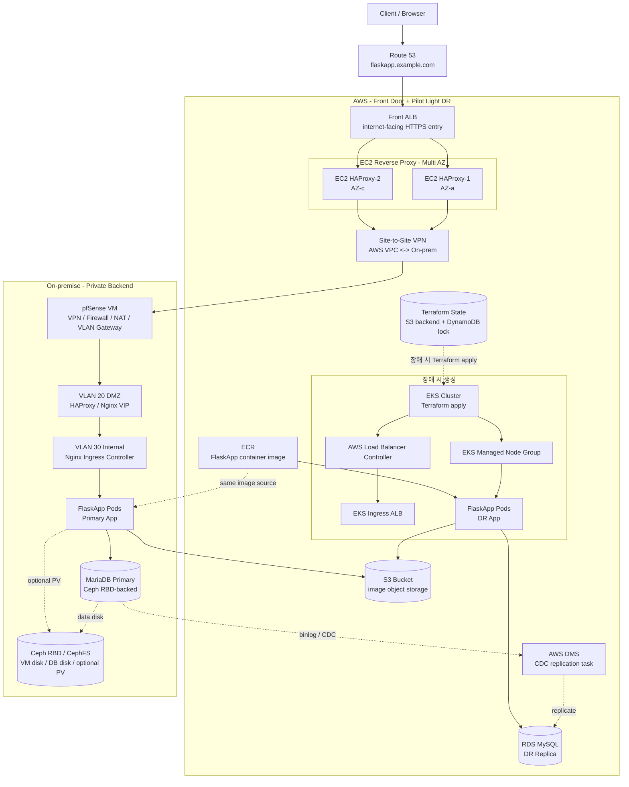
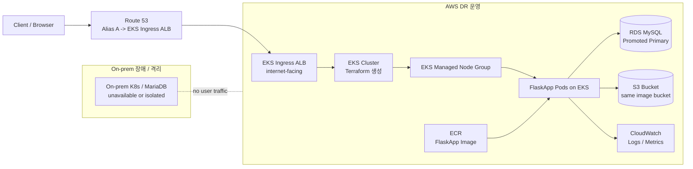
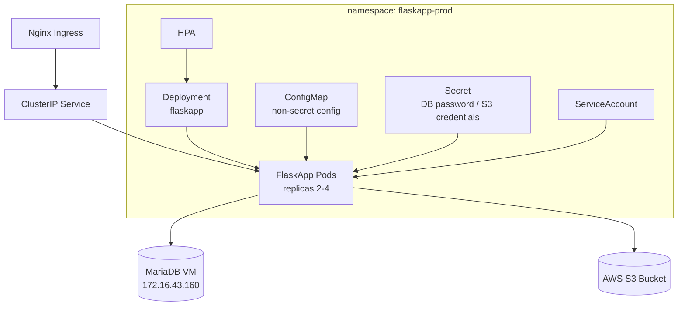
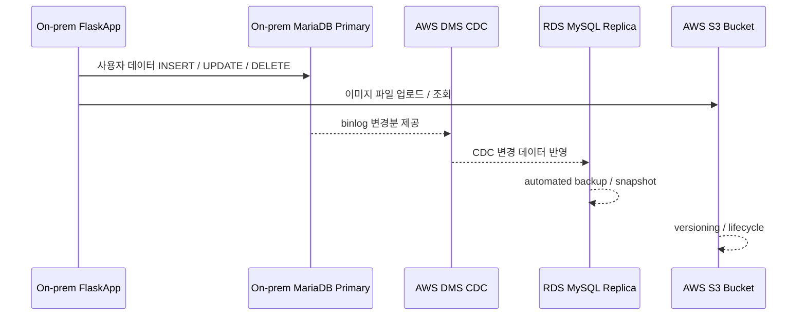
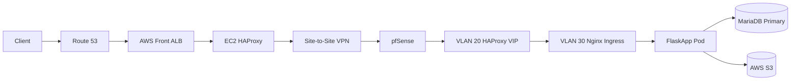
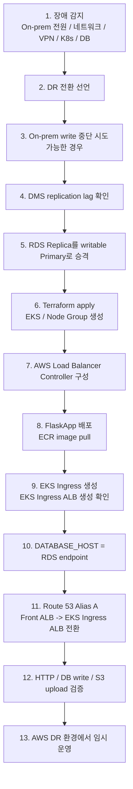
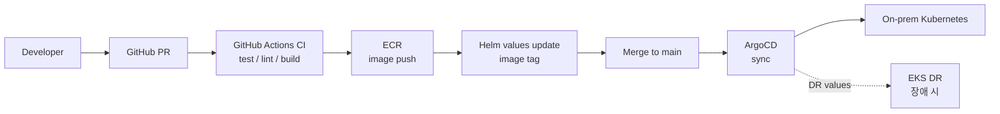
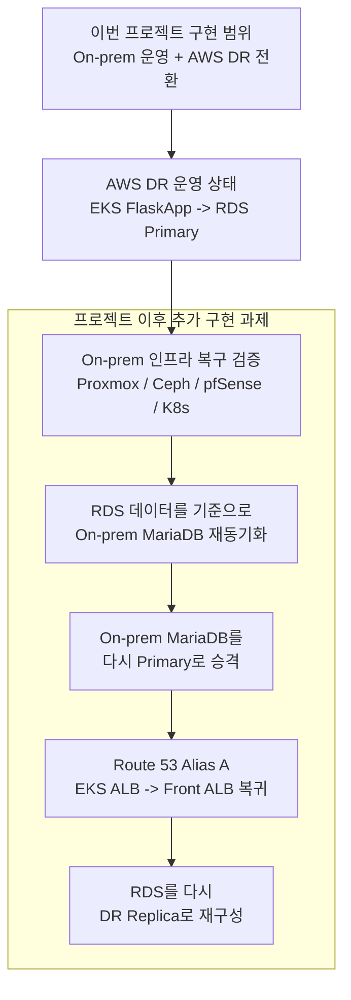

# 시스템 아키텍처 설계 최종본

## 1. 문서 목적

이 문서는 `blueprint` 디렉터리의 기존 설계 문서를 통합한 최종 시스템 아키텍처 설계서이다.

기존 문서의 주요 내용인 On-premise Proxmox/Kubernetes 구성, pfSense 기반 VLAN 보안, Ceph RBD 저장소, AWS Front Door, AWS DMS CDC 기반 DB 복제, S3 단일 이미지 저장소, ECR 이미지 저장소, Terraform 기반 EKS DR 전환 구조를 하나의 최종안으로 합친다.

최종 설계의 핵심은 다음과 같다.

- On-premise를 기본 운영 환경으로 사용한다.
- AWS를 외부 사용자 진입점으로 사용한다.
- Client가 On-premise로 직접 진입하지 않도록 한다.
- On-premise는 Site-to-Site VPN 뒤의 private backend로 구성한다.
- 정상 운영 시 AWS ALB와 EC2 HAProxy가 VPN을 통해 On-prem Kubernetes로 트래픽을 전달한다.
- On-premise 장애 발생 시 Terraform으로 EKS와 node group을 생성한다.
- DR 전환 후에는 EKS Ingress가 생성한 ALB로 Route 53 Alias A 레코드를 전환한다.
- 비용 절감을 위해 EKS와 node group은 상시 운영하지 않는다.
- On-prem MariaDB를 Primary DB로 운영하고, AWS RDS MySQL은 DR Replica로 유지한다.
- On-prem MariaDB 변경분은 AWS DMS CDC로 RDS MySQL에 복제한다.
- 장애 시 RDS Replica를 writable Primary로 승격한다.
- 이미지 파일은 On-prem과 AWS DR 모두 AWS S3 bucket을 사용한다.
- FlaskApp 컨테이너 이미지는 ECR에 저장하여 On-prem과 AWS 양쪽에서 동일하게 배포한다.
- On-prem 보안 경계는 pfSense 방화벽, VLAN 분리, VPN 라우팅 정책으로 구성한다.
- DR 전략은 Pilot Light DR로 명시한다.

## 2. 최종 설계 목표

| 목표                   | 최종 기준                                                                              |
| ---------------------- | -------------------------------------------------------------------------------------- |
| 기본 운영 위치         | On-premise Kubernetes                                                                  |
| 외부 사용자 진입점     | AWS Route 53 + AWS Front ALB                                                           |
| On-prem 공개 여부      | 인터넷 직접 공개하지 않음                                                              |
| On-prem 접근 경로      | AWS Front ALB -> EC2 HAProxy -> Site-to-Site VPN -> pfSense -> On-prem 내부 LB/Ingress |
| 정상 App 실행 환경     | On-prem Kubernetes                                                                     |
| DR App 실행 환경       | 장애 시 Terraform으로 생성하는 AWS EKS                                                 |
| 정상 DB                | On-prem MariaDB Primary                                                                |
| DR DB                  | AWS RDS MySQL Replica, 장애 시 Primary 승격                                            |
| DB 복제 방식           | AWS DMS CDC, On-prem MariaDB binlog 기반 단방향 복제                                   |
| 이미지 파일 저장소     | AWS S3 bucket 단일 사용                                                                |
| 컨테이너 이미지 저장소 | AWS ECR                                                                                |
| On-prem VM/DB 저장소   | Ceph RBD                                                                               |
| On-prem 공유 PV        | 필요 시 CephFS                                                                         |
| 보안 구조              | pfSense Firewall + VLAN + VPN + AWS Security Group                                     |
| DR 유형                | Pilot Light DR                                                                         |

## 3. 최종 아키텍처 개요



## 4. 정상 운영 아키텍처

정상 운영 시 Client는 On-premise로 직접 접근하지 않는다. 모든 외부 요청은 AWS Route 53과 AWS Front ALB를 먼저 통과한다. Front ALB는 EC2 HAProxy 2대를 target으로 사용하고, EC2 HAProxy는 Site-to-Site VPN을 통해 On-premise의 pfSense로 요청을 전달한다.

On-premise 내부에서는 pfSense가 VPN 트래픽을 VLAN 정책에 따라 VLAN 20 DMZ의 HAProxy/Nginx VIP로 전달한다. 이후 VLAN 30 Internal의 Kubernetes Nginx Ingress Controller를 거쳐 FlaskApp Pod로 요청이 들어간다.

```text
Client
-> Route 53 Alias A
-> AWS Front ALB
-> EC2 HAProxy 2대
-> Site-to-Site VPN
-> pfSense Gateway
-> VLAN 20 DMZ HAProxy/Nginx VIP
-> VLAN 30 Kubernetes Nginx Ingress
-> FlaskApp Pod
-> On-prem MariaDB Primary
-> AWS S3 Bucket
```

### 정상 운영 구성 기준

| 영역            | 구성                  | 설명                                                     |
| --------------- | --------------------- | -------------------------------------------------------- |
| DNS             | Route 53 Alias A      | `flaskapp.example.com`이 AWS Front ALB를 바라본다.       |
| TLS Entry       | AWS Front ALB         | 외부 HTTPS 진입점이다.                                   |
| Reverse Proxy   | EC2 HAProxy 2대       | ALB target으로 등록하며 VPN 너머 On-prem으로 전달한다.   |
| Private Link    | Site-to-Site VPN      | AWS VPC와 On-prem VLAN망을 사설 통신으로 연결한다.       |
| On-prem Gateway | pfSense VM            | VPN, 라우팅, NAT, 방화벽, VLAN Gateway 역할을 수행한다.  |
| On-prem DMZ     | VLAN 20 HAProxy/Nginx | AWS VPN 대역에서 들어온 요청만 받는 중계 구간이다.       |
| App Network     | VLAN 30 Kubernetes    | Kubernetes node, Ingress backend, MariaDB가 위치한다.    |
| App             | FlaskApp Pods         | On-prem Kubernetes에서 Primary App으로 운영한다.         |
| DB              | MariaDB Primary       | 별도 VM에서 운영하며 DB data disk는 Ceph RBD를 사용한다. |
| File            | S3 Bucket             | 이미지 파일 업로드/조회용 단일 Object Storage이다.       |

### AWS Front ALB를 사용하는 이유

본 설계에서 외부 사용자는 On-premise로 직접 진입하지 않고 AWS Front ALB로 먼저 진입한다. 이렇게 설계하는 이유는 On-premise를 인터넷에 직접 노출하지 않으면서도, 정상 운영과 DR 운영의 사용자 진입점을 AWS로 일원화하기 위해서이다.

On-premise를 외부에 직접 공개하면 pfSense, HAProxy, Ingress, Kubernetes 서비스 IP가 외부 공격면의 중심이 된다. 반면 AWS Front ALB를 앞단에 두면 외부 공개 지점은 AWS ALB 하나로 제한되고, On-premise는 VPN 뒤의 private backend로 유지된다. 즉, 사용자는 AWS까지만 접근하고 AWS 내부의 EC2 HAProxy만 VPN을 통해 On-premise로 들어갈 수 있다.

또한 DR 전환 시에도 이 구조가 유리하다. 정상 운영에서는 Route 53이 AWS Front ALB를 바라보고, Front ALB는 EC2 HAProxy를 통해 On-premise로 전달한다. 장애가 발생하면 Terraform으로 EKS를 생성한 뒤 Route 53 Alias A 대상만 EKS Ingress ALB로 바꾸면 된다. 사용자는 동일한 도메인을 계속 사용하고, 운영자는 On-prem 공개 IP에서 AWS 공개 IP로 전환하는 복잡한 절차 대신 AWS 내부의 ALB 대상 전환 구조를 사용할 수 있다.

정리하면 AWS Front ALB를 사용하는 이유는 다음과 같다.

| 이유                   | 설명                                                                                |
| ---------------------- | ----------------------------------------------------------------------------------- |
| On-prem 직접 노출 방지 | Client가 pfSense, HAProxy, Ingress로 직접 접근하지 않는다.                          |
| 보안 경계 단순화       | 외부 공개 지점은 AWS Front ALB로 제한하고, On-prem은 VPN 뒤 private backend로 둔다. |
| DR 전환 단순화         | 장애 시 Route 53 Alias A를 EKS Ingress ALB로 전환하면 된다.                         |
| 운영 경로 일관성       | 정상/DR 모두 사용자는 `flaskapp.example.com` 하나로 접근한다.                       |
| AWS 리소스 활용        | ALB health check, target 관리, ACM 인증서, Security Group을 사용할 수 있다.         |
| 비용 절충              | EKS는 평상시 운영하지 않고 Front ALB, EC2 HAProxy, VPN, RDS Replica만 유지한다.     |

## 5. DR 운영 아키텍처

On-premise 장애 발생 시에는 AWS에서 FlaskApp을 운영한다. 이때 EKS와 node group은 평상시에 띄워두지 않고, Terraform으로 장애 시 생성한다.

DR 전환 후에는 EKS Ingress 리소스를 통해 AWS Load Balancer Controller가 EKS Ingress ALB를 생성한다. Route 53 Alias A 레코드는 정상 운영용 Front ALB에서 DR 운영용 EKS Ingress ALB로 전환한다.



```text
Client
-> Route 53 Alias A
-> EKS Ingress ALB
-> FlaskApp Pod on EKS
-> RDS MySQL Primary
-> AWS S3 Bucket
```

### DR 전환 시 Route 53 기준

| 상태      | Route 53 Alias A 대상 | 설명                                       |
| --------- | --------------------- | ------------------------------------------ |
| 정상 운영 | AWS Front ALB         | Front ALB -> EC2 HAProxy -> VPN -> On-prem |
| DR 운영   | EKS Ingress ALB       | EKS Ingress ALB -> FlaskApp on EKS         |

중요한 제약은 Front ALB의 Target Group에 EKS Ingress ALB를 직접 target으로 넣지 않는다는 점이다. ALB Target Group은 다른 ALB를 일반 target으로 직접 등록하는 방식에 적합하지 않으므로, DR 시에는 Route 53 Alias A 대상 자체를 EKS Ingress ALB로 전환한다.

## 6. Pilot Light DR 전략

본 설계는 Pilot Light DR이다. AWS에 전체 App 실행 환경을 상시 운영하지 않고, 장애 복구에 필요한 핵심 데이터 계층과 진입점, 이미지 저장소, 인프라 코드만 상시 준비한다.

| 리소스           | 정상 시 상태        | DR 시 상태                           | 이유                         |
| ---------------- | ------------------- | ------------------------------------ | ---------------------------- |
| Route 53         | 상시 운영           | Alias 대상 전환                      | 서비스 도메인 유지           |
| Front ALB        | 상시 운영           | DR 전환 후 미사용 또는 대기          | 정상 운영 외부 진입점        |
| EC2 HAProxy      | 상시 운영           | DR 전환 후 미사용 또는 대기          | On-prem private backend 연결 |
| Site-to-Site VPN | 상시 운영           | 장애 원인에 따라 복구 대기           | AWS-On-prem 사설 연결        |
| S3 Bucket        | 상시 운영           | 그대로 사용                          | 이미지 파일 단일 저장소      |
| ECR Repository   | 상시 운영           | EKS에서 image pull                   | 동일 이미지 배포             |
| RDS MySQL        | Replica로 상시 운영 | Primary로 승격                       | DR DB                        |
| AWS DMS CDC      | 상시 운영           | 전환 전 lag 확인 후 중단 또는 재구성 | DB 변경분 복제               |
| Terraform State  | 상시 운영           | EKS 생성에 사용                      | DR 인프라 자동화             |
| EKS Cluster      | 미운영              | 장애 시 생성                         | 비용 절감                    |
| EKS Node Group   | 미운영              | 장애 시 생성                         | 비용 절감                    |
| EKS Ingress ALB  | 미운영              | Ingress 배포 시 생성                 | DR 외부 진입점               |
| FlaskApp on EKS  | 미운영              | 장애 시 배포                         | DR App                       |

### DR 방식 비교

| 방식             |      비용 |       RTO |            RPO | 본 프로젝트 적합도      |
| ---------------- | --------: | --------: | -------------: | ----------------------- |
| Backup & Restore |      낮음 |        김 |             큼 | 복구 시간이 길어 부적합 |
| Pilot Light      | 중간 이하 |      중간 | 작게 유지 가능 | 최종 채택               |
| Warm Standby     | 중간~높음 |      짧음 |           작음 | 비용 부담이 큼          |
| Active-Active    |      높음 | 매우 짧음 |           작음 | 프로젝트 범위 초과      |

Pilot Light DR은 비용을 줄이는 대신, 장애 시 EKS 생성 시간과 배포 시간이 RTO에 포함된다. 따라서 Terraform, Helm, ArgoCD 또는 배포 스크립트를 반복 검증해야 한다.

## 7. On-prem 물리 인프라 설계

On-premise는 배정받은 Client PC 5대를 Proxmox VE 클러스터로 구성한다. 각 노드는 1G 관리망과 10G Ceph 스토리지망을 분리해서 사용한다.

| 물리 노드 | 배정 Client | 1G 관리 IP     | 10G Ceph IP   | 주요 역할                              |
| --------- | ----------- | -------------- | ------------- | -------------------------------------- |
| `pve-1`   | `client-7`  | `172.16.30.11` | `10.10.10.39` | Proxmox node, pfSense VM, Bastion 우선 |
| `pve-2`   | `client-8`  | `172.16.30.12` | `10.10.10.40` | Kubernetes CP/Worker                   |
| `pve-3`   | `client-9`  | `172.16.30.13` | `10.10.10.41` | Kubernetes CP/Worker, ArgoCD           |
| `pve-4`   | `client-10` | `172.16.30.14` | `10.10.10.42` | Kubernetes CP, LB, Monitoring          |
| `pve-5`   | `client-11` | `172.16.30.15` | `10.10.10.43` | Worker, DB VM, LB                      |

### 물리/스토리지 네트워크 기준

| 구분        | 기준                                           |
| ----------- | ---------------------------------------------- |
| 물리 구조   | Spine-Leaf 구조를 권장                         |
| 1G 관리망   | `172.16.30.0/24`                               |
| 10G Ceph망  | `10.10.10.0/24` 후보                           |
| NIC 구성    | 각 PC 10G NIC 2개 LACP bonding 권장            |
| MTU         | Ceph 구간은 전 구간 지원 가능 시 MTU 9000 적용 |
| Ceph RBD    | VM disk, DB VM data disk                       |
| CephFS      | Kubernetes 공유 PV 필요 시만 사용              |
| 이미지 저장 | CephFS가 아니라 AWS S3 사용                    |

## 8. pfSense 및 VLAN 설계

별도 물리 방화벽 장비가 없으므로 `pve-1` 위의 pfSense VM이 라우터, 방화벽, NAT, VLAN Gateway, VPN 종단 역할을 담당한다.

### pfSense Gateway 계획

| 항목                    | IP            | 용도                        |
| ----------------------- | ------------- | --------------------------- |
| Upstream Router         | `172.16.30.1` | 외부망/WAN uplink           |
| Management Switch       | `172.16.30.2` | 1G 관리형 스위치 관리 IP    |
| pfSense WAN             | `172.16.30.3` | 상위 라우터 방향 인터페이스 |
| pfSense VLAN 10 Gateway | `172.16.41.1` | Public VLAN Gateway         |
| pfSense VLAN 20 Gateway | `172.16.42.1` | DMZ VLAN Gateway            |
| pfSense VLAN 30 Gateway | `172.16.43.1` | Internal VLAN Gateway       |
| pfSense VLAN 40 Gateway | `172.16.44.1` | Admin VLAN Gateway          |

### VLAN 역할

| VLAN             | CIDR             | 역할                                                   | 접근 기준                                                   |
| ---------------- | ---------------- | ------------------------------------------------------ | ----------------------------------------------------------- |
| VLAN 10 Public   | `172.16.41.0/24` | MetalLB LoadBalancer IP, Ingress 외부 서비스 후보      | 인터넷 직접 공개는 하지 않음. 필요 시 pfSense 정책으로 제한 |
| VLAN 20 DMZ      | `172.16.42.0/24` | HAProxy, Keepalived, reverse proxy                     | AWS VPN 대역에서 들어오는 트래픽만 허용                     |
| VLAN 30 Internal | `172.16.43.0/24` | Kubernetes node, Ingress backend, MariaDB, 내부 서비스 | DMZ/App/Admin에서 필요한 포트만 허용                        |
| VLAN 40 Admin    | `172.16.44.0/24` | Bastion, Monitoring, ArgoCD 관리 접근                  | 운영자 또는 관리 VPN 접근만 허용                            |

### On-prem 내부 권장 흐름

```text
AWS EC2 HAProxy
-> Site-to-Site VPN
-> pfSense
-> VLAN 20 DMZ HAProxy VIP
-> VLAN 30 Kubernetes Nginx Ingress
-> FlaskApp Pod
-> VLAN 30 MariaDB
```

### VLAN별 보안 정책

| 출발지                   | 목적지                   |           포트 | 정책               |
| ------------------------ | ------------------------ | -------------: | ------------------ |
| AWS EC2 HAProxy subnet   | VLAN 20 HAProxy VIP      |        80, 443 | 허용               |
| VLAN 20 HAProxy          | VLAN 30 Ingress          |        80, 443 | 허용               |
| VLAN 30 Worker nodes     | MariaDB VM               |           3306 | 허용               |
| AWS DMS endpoint         | MariaDB VM               |           3306 | VPN 경유 허용      |
| VLAN 30 Kubernetes nodes | AWS S3                   |            443 | Outbound 허용      |
| VLAN 40 Bastion          | Kubernetes nodes         |       22, 6443 | 운영자 관리용 허용 |
| VLAN 40 Monitoring       | Kubernetes nodes         | exporter ports | 모니터링용 허용    |
| 외부 인터넷              | On-prem VLAN 10/20/30/40 |           전체 | 직접 접근 차단     |
| On-prem 일반 VM          | VLAN 40 Admin            |           전체 | 기본 차단          |

## 9. IP 및 VM 배치 설계

### VM / Kubernetes 노드 계획

| VM             | 배치 권장 | IP              | vCPU / RAM / Disk       | 역할                        |
| -------------- | --------- | --------------- | ----------------------- | --------------------------- |
| `k8s-cp-1`     | `pve-2`   | `172.16.43.100` | 2 vCPU / 4GB / 40GB     | Kubernetes control plane    |
| `k8s-cp-2`     | `pve-3`   | `172.16.43.101` | 2 vCPU / 4GB / 40GB     | Kubernetes control plane    |
| `k8s-cp-3`     | `pve-4`   | `172.16.43.102` | 2 vCPU / 4GB / 40GB     | Kubernetes control plane    |
| `k8s-worker-1` | `pve-2`   | `172.16.43.110` | 4 vCPU / 8GB / 80GB     | App worker                  |
| `k8s-worker-2` | `pve-3`   | `172.16.43.111` | 4 vCPU / 8GB / 80GB     | App worker                  |
| `k8s-worker-3` | `pve-5`   | `172.16.43.112` | 4 vCPU / 8GB / 80GB     | App/Infra worker            |
| `lb-1`         | `pve-4`   | `172.16.42.100` | 2 vCPU / 2GB / 20GB     | HAProxy + Keepalived        |
| `lb-2`         | `pve-5`   | `172.16.42.101` | 2 vCPU / 2GB / 20GB     | HAProxy + Keepalived        |
| `bastion`      | `pve-1`   | `172.16.44.100` | 2 vCPU / 4GB / 30GB     | kubectl, ansible, terraform |
| `monitoring`   | `pve-4`   | `172.16.44.101` | 2 vCPU / 4GB / 40GB     | Prometheus, Grafana         |
| `argocd`       | `pve-3`   | `172.16.44.102` | 2 vCPU / 4GB / 40GB     | ArgoCD 관리 접근            |
| `mariadb-1`    | `pve-5`   | `172.16.43.160` | 4 vCPU / 8-12GB / 100GB | On-prem MariaDB Primary     |

`pve-1`은 pfSense 중심 노드이므로 Kubernetes control plane 배치는 피한다. Control Plane은 `pve-2`, `pve-3`, `pve-4`에 분산하고, DB VM은 `pve-5`에 우선 배치한다.

### VIP / MetalLB IP 계획

| 이름               | IP                            | 용도                           |
| ------------------ | ----------------------------- | ------------------------------ |
| `k8s-api-vip`      | `172.16.43.99`                | kubeadm control plane endpoint |
| `haproxy-vip`      | `172.16.42.99`                | DMZ HAProxy/Keepalived VIP     |
| `ingress-vip`      | `172.16.41.100`               | On-prem Ingress 대표 IP 후보   |
| `ingress-nginx-lb` | `172.16.41.110`               | FlaskApp Ingress LoadBalancer  |
| `argocd-lb`        | `172.16.41.111`               | ArgoCD 외부 접근 필요 시       |
| `grafana-lb`       | `172.16.41.112`               | Grafana 외부 접근 필요 시      |
| `reserved-lb`      | `172.16.41.113-172.16.41.130` | 추가 LoadBalancer Service      |

MetalLB는 VLAN 10 Public의 `172.16.41.110-172.16.41.130` 범위를 L2 mode로 시작한다. BGP mode는 장비 설정 난이도가 높으므로 프로젝트 범위에서는 L2 mode가 현실적이다.

## 10. Kubernetes 플랫폼 설계

On-prem Kubernetes는 kubeadm 기반 HA Control Plane으로 구성한다.

| 항목             | 기준                               |
| ---------------- | ---------------------------------- |
| 설치 방식        | kubeadm                            |
| Control Plane    | 3대                                |
| Worker           | 3대                                |
| API Endpoint     | `k8s-api-vip` `172.16.43.99`       |
| Pod CIDR         | `10.244.0.0/16`                    |
| Service CIDR     | `10.96.0.0/12`                     |
| Ingress          | Nginx Ingress Controller           |
| LoadBalancer     | MetalLB L2 mode                    |
| GitOps           | ArgoCD                             |
| Package          | Helm                               |
| Scaling          | HPA                                |
| Resource Control | requests/limits                    |
| Infra 분리       | taints/tolerations                 |
| Monitoring       | Prometheus, Grafana, node-exporter |

### Namespace 기준

| Namespace       | 용도                                          |
| --------------- | --------------------------------------------- |
| `flaskapp-prod` | FlaskApp 운영 배포                            |
| `db`            | DB demo, schema init Job, backup CronJob 후보 |
| `monitoring`    | Prometheus, Grafana, node-exporter            |
| `argocd`        | ArgoCD                                        |
| `test`          | BusyBox, 네트워크/DB/S3 테스트                |

### FlaskApp Kubernetes 구성



## 11. VM 템플릿 및 Ceph RBD 기준

Ubuntu 24.04 기반 Kubernetes-ready VM 템플릿을 Proxmox에 생성한다. 이 템플릿은 Kubernetes가 설치된 템플릿이 아니라, Kubernetes 노드로 사용할 OS 공통 준비가 완료된 템플릿이다.

| 항목                    | 기준                                     |
| ----------------------- | ---------------------------------------- |
| OS                      | Ubuntu 24.04                             |
| VM ID 예시              | `9000`                                   |
| Template name           | `ubuntu-2404-k8s-ready-template`         |
| Disk storage            | Ceph RBD                                 |
| CloudInit Drive         | Ceph RBD                                 |
| ISO storage             | Proxmox local storage, 설치 후 참조 제거 |
| Network                 | VLAN 30 Internal                         |
| Kubernetes 설치         | 템플릿에는 미포함                        |
| IP / hostname / SSH key | Terraform Cloud-Init에서 주입            |

### 템플릿에 포함할 항목

- `qemu-guest-agent`
- `cloud-init`
- `chrony`
- `containerd`
- 기본 운영 도구
- Kubernetes 네트워크용 커널 모듈 설정
- Kubernetes 네트워크용 sysctl 설정
- swap off
- containerd `SystemdCgroup = true`

### 템플릿에서 제외할 항목

- `kubeadm`
- `kubelet`
- `kubectl`
- `kubeadm init`
- `kubeadm join`
- CNI
- SSH public key
- 고정 IP
- hostname
- 노드별 인증서
- 애플리케이션 설정

템플릿 변환 전에는 `cloud-init clean`, machine-id 초기화, SSH host key 삭제, apt cache 정리를 수행한 뒤 종료하고 Proxmox에서 template으로 변환한다. Full Clone 대상 storage는 Ceph RBD로 지정한다.

## 12. Ceph 저장소 사용 기준

| 사용 대상          | 저장소   | 설명                                             |
| ------------------ | -------- | ------------------------------------------------ |
| VM disk            | Ceph RBD | Kubernetes node, LB, Bastion, Monitoring VM disk |
| DB data disk       | Ceph RBD | `mariadb-1` 데이터 디스크                        |
| Kubernetes 공유 PV | CephFS   | 공유 파일 시스템이 필요한 경우에만 사용          |
| 이미지 파일        | AWS S3   | FlaskApp 이미지 업로드/조회 저장소               |

Ceph RBD와 CephFS는 10G Ceph storage network를 사용한다. DB 접속 IP와 Kubernetes 서비스 IP는 VLAN 30 Internal에 위치하고, DB data disk I/O는 Ceph RBD를 통해 처리한다.

이미지 파일은 CephFS가 아니라 AWS S3 bucket에 저장한다. 따라서 On-prem Kubernetes와 AWS EKS는 동일한 S3 bucket을 바라보며, DR 전환 시 이미지 파일 저장소 전환이 필요 없다.

## 13. 데이터베이스 및 복제 설계

정상 운영 시 On-prem MariaDB가 Primary DB이다. AWS RDS MySQL은 DR Replica로 유지한다. On-prem MariaDB의 binlog 변경분은 AWS DMS CDC를 통해 RDS MySQL에 지속 반영한다.



### DB 상태별 역할

| 상태             | Primary DB                            | Replica / Standby              | App 연결                     |
| ---------------- | ------------------------------------- | ------------------------------ | ---------------------------- |
| 정상 운영        | On-prem MariaDB                       | AWS RDS MySQL                  | On-prem FlaskApp -> MariaDB  |
| 장애 선언        | On-prem write 중단 시도               | DMS lag 확인                   | App 트래픽 전환 준비         |
| DR 운영          | AWS RDS MySQL                         | On-prem DB 격리 또는 복구 대기 | EKS FlaskApp -> RDS          |
| 향후 복구 고도화 | On-prem MariaDB를 다시 Primary로 복구 | RDS를 다시 DR Replica로 재구성 | 프로젝트 이후 추가 구현 과제 |

### DMS CDC 기준

| 항목              | 기준                                                                  |
| ----------------- | --------------------------------------------------------------------- |
| Source            | On-prem MariaDB Primary                                               |
| Target            | AWS RDS MySQL                                                         |
| 복제 방식         | Full load 이후 CDC 또는 CDC 중심                                      |
| 네트워크          | Site-to-Site VPN 사설 경로                                            |
| Source 접속       | AWS DMS endpoint가 MariaDB `3306` 접근                                |
| RPO 지표          | DMS replication lag                                                   |
| 장애 전환 전 확인 | 마지막 CDC 반영 시점, replication lag, source DB write 중단 가능 여부 |

On-prem MariaDB와 AWS RDS 간 완전 동기식 복제는 본 프로젝트 범위에서 제외한다. 최종 목표는 AWS DMS CDC로 지연 시간을 최소화한 비동기 단방향 복제를 구성하는 것이다.

## 14. S3 및 ECR 설계

### S3 이미지 저장소

AWS S3 bucket은 정상 운영과 DR 운영에서 공통으로 사용하는 이미지 파일 저장소이다.

| 항목      | 기준                                              |
| --------- | ------------------------------------------------- |
| Bucket    | FlaskApp 이미지 파일 단일 bucket                  |
| 정상 운영 | On-prem FlaskApp이 S3로 업로드/조회               |
| DR 운영   | EKS FlaskApp이 같은 S3로 업로드/조회              |
| 접근 방식 | HTTPS 443                                         |
| 권장 설정 | versioning, lifecycle, least privilege IAM policy |
| 제외 사항 | On-prem S3 호환 스토리지 구축 제외                |

### ECR 컨테이너 이미지 저장소

FlaskApp 컨테이너 이미지는 ECR에 저장한다. On-prem Kubernetes와 AWS EKS 모두 같은 이미지 태그를 기준으로 배포할 수 있어야 한다.

| 항목      | 기준                                       |
| --------- | ------------------------------------------ |
| Registry  | AWS ECR                                    |
| Image     | FlaskApp Docker image                      |
| 정상 운영 | On-prem Kubernetes에서 ECR image pull      |
| DR 운영   | EKS에서 ECR image pull                     |
| 태그 전략 | Git SHA, release tag, stable tag 조합 권장 |
| 보안      | ECR pull 권한 최소화                       |

## 15. AWS DR 리소스 설계

### 상시 유지 리소스

| 리소스                  | 역할                                  |
| ----------------------- | ------------------------------------- |
| Route 53                | 서비스 도메인 및 Alias 전환           |
| ACM                     | ALB TLS 인증서                        |
| Front ALB               | 정상 운영 외부 진입점                 |
| EC2 HAProxy 2대         | On-prem private backend로 트래픽 전달 |
| Site-to-Site VPN        | AWS와 On-prem 사설 통신               |
| VPC/Subnet/Route Table  | AWS 네트워크 기반                     |
| Security Group          | AWS 리소스 접근 제어                  |
| S3 Bucket               | 이미지 Object Storage                 |
| ECR Repository          | FlaskApp Docker image 저장            |
| RDS MySQL Replica       | DR DB 대기                            |
| AWS DMS CDC             | On-prem DB 변경분 복제                |
| Terraform State Backend | S3 backend + DynamoDB lock            |
| CloudWatch              | 로그/메트릭 수집 기반                 |

### 장애 시 생성 리소스

| 리소스                              | 역할                       |
| ----------------------------------- | -------------------------- |
| EKS Cluster                         | DR Kubernetes 실행 환경    |
| EKS Managed Node Group              | DR App 실행 노드           |
| AWS Load Balancer Controller        | EKS Ingress ALB 생성       |
| EKS Ingress ALB                     | DR 운영 외부 진입점        |
| Kubernetes namespace                | `flaskapp-prod` 등         |
| Secret/ConfigMap                    | RDS/S3/ECR 등 DR 설정      |
| FlaskApp Deployment/Service/Ingress | DR App 배포                |
| HPA                                 | 필요 시 DR App autoscaling |

### Terraform 모듈 권장 구조

```text
terraform/
  envs/
    dr/
      main.tf
      variables.tf
      outputs.tf
      terraform.tfvars
  modules/
    network/
    security/
    route53/
    s3/
    ecr/
    rds/
    dms/
    vpn/
    front-alb/
    proxy-ec2/
    eks/
    alb-controller/
```

## 16. 보안 설계

최종 설계의 보안은 ALB의 HTTPS 종단, AWS Security Group, EC2 HAProxy 제한, Site-to-Site VPN, pfSense 방화벽 정책, VLAN 분리, Kubernetes Secret/RBAC를 조합해서 구성한다.

### 보안 경계

| 계층               | 보안 기준                                                  |
| ------------------ | ---------------------------------------------------------- |
| DNS                | Route 53에서 서비스 도메인 관리                            |
| AWS Front ALB      | HTTPS entry, public endpoint                               |
| AWS Security Group | ALB -> EC2 HAProxy, EC2 HAProxy -> VPN 경로 최소 허용      |
| EC2 HAProxy        | On-prem backend만 바라보는 reverse proxy                   |
| VPN                | AWS VPC와 On-prem pfSense 간 암호화된 사설 통신            |
| pfSense            | VLAN Gateway, Firewall, NAT, VPN 정책                      |
| VLAN 20 DMZ        | AWS VPN에서 들어온 reverse proxy 트래픽만 수용             |
| VLAN 30 Internal   | Kubernetes, DB 내부 서비스 격리                            |
| VLAN 40 Admin      | Bastion, ArgoCD, Monitoring 관리 접근 제한                 |
| Kubernetes         | Namespace, RBAC, ServiceAccount, NetworkPolicy 후보        |
| Secret             | DB password, S3 credential, Flask secret은 Git에 저장 금지 |
| DB                 | MariaDB/RDS public access 금지, 3306 최소 허용             |

## 17. 정상 운영 데이터 및 트래픽 흐름

### 사용자 요청 흐름



### 데이터 흐름

```text
사용자 요청 데이터
-> FlaskApp
-> On-prem MariaDB Primary
-> MariaDB binlog
-> AWS DMS CDC
-> AWS RDS MySQL Replica

이미지 파일
-> FlaskApp
-> AWS S3 Bucket
```

## 18. 장애 전환 절차



### 장애 전환 상세 Runbook

1. 모니터링에서 On-prem 장애를 확인한다.
2. 장애 범위를 구분한다: 전원, 네트워크, VPN, Kubernetes, Ingress, MariaDB, Ceph.
3. 운영자가 DR 전환을 선언한다.
4. 가능한 경우 On-prem App 또는 DB write를 중단한다.
5. DMS replication lag와 마지막 반영 시간을 확인한다.
6. RDS MySQL Replica를 writable Primary로 승격한다.
7. Terraform backend lock 상태를 확인한다.
8. `terraform plan`으로 EKS, node group, AWS Load Balancer Controller 관련 변경을 확인한다.
9. `terraform apply`로 EKS와 node group을 생성한다.
10. EKS kubeconfig를 갱신하고 `kubectl get nodes`를 확인한다.
11. EKS에 namespace, Secret, ConfigMap을 적용한다.
12. FlaskApp Helm chart 또는 manifest를 배포한다.
13. EKS Ingress를 생성하고 EKS Ingress ALB DNS name을 확인한다.
14. FlaskApp `DATABASE_HOST`를 RDS endpoint로 설정한다.
15. S3 bucket 설정은 정상 운영과 동일한 bucket을 사용한다.
16. Route 53 Alias A target을 Front ALB에서 EKS Ingress ALB로 전환한다.
17. HTTP 응답, 로그인/조회, DB write, S3 이미지 업로드를 검증한다.
18. CloudWatch, EKS pod log, RDS metric을 확인한다.
19. AWS DR 환경에서 임시 운영한다.
20. On-prem을 다시 Primary 운영 환경으로 되돌리는 절차는 프로젝트 이후 추가 구현 과제로 분리한다.

## 19. 운영 및 모니터링 설계

| 영역        | 지표 / 점검 항목                                       |
| ----------- | ------------------------------------------------------ |
| Route 53    | Alias 대상, TTL, health check 후보                     |
| Front ALB   | target health, 4xx/5xx, latency                        |
| EC2 HAProxy | backend health, connection, CPU, memory                |
| VPN         | tunnel up/down, packet loss, latency                   |
| pfSense     | firewall log, NAT/VPN status, VLAN routing             |
| Kubernetes  | node ready, pod ready, deployment rollout, HPA         |
| Ingress     | HTTP status, backend endpoint, TLS                     |
| MariaDB     | connection, replication source state, slow query, disk |
| DMS         | replication lag, task status, error log                |
| RDS         | replica lag, CPU, connection, storage, backup          |
| S3          | 4xx/5xx, object count, bucket policy, lifecycle        |
| ECR         | image tag, scan result 후보, pull 권한                 |
| Ceph        | OSD status, pool usage, RBD health, MTU/LACP           |
| Monitoring  | Prometheus, Grafana, CloudWatch                        |

### RPO / RTO 기준

| 항목      | 기준                                                                      |
| --------- | ------------------------------------------------------------------------- |
| RPO       | DMS CDC replication lag 기준으로 산정                                     |
| RTO       | 장애 선언 + RDS 승격 + Terraform EKS 생성 + App 배포 + Route 53 전환 시간 |
| DNS TTL   | 30-60초 권장                                                              |
| 주요 병목 | EKS 생성 시간, node group 준비 시간, 이미지 pull, Ingress ALB 생성 시간   |

### 장애 감지 기준

장애 감지는 단일 지표만으로 판단하지 않고, 사용자 진입점, AWS-On-prem 연결, On-prem Kubernetes, DB, 스토리지, 복제 상태를 함께 본다. 특히 DR 전환은 비용과 데이터 정합성에 영향을 주므로 자동 전환보다는 모니터링 알림을 기반으로 운영자가 전환을 선언하는 방식을 기본으로 한다.

| 감지 대상        | 장애 판단 기준                                      | 확인 도구 / 지표                              | 대응                                       |
| ---------------- | --------------------------------------------------- | --------------------------------------------- | ------------------------------------------ |
| AWS Front ALB    | EC2 HAProxy target unhealthy, 5xx 급증              | ALB target health, CloudWatch ALB metrics     | HAProxy 상태 및 VPN 경로 확인              |
| EC2 HAProxy      | backend health check 실패, On-prem VIP 연결 실패    | HAProxy stats, systemd, CloudWatch agent      | On-prem DMZ/VPN 장애 여부 확인             |
| Site-to-Site VPN | tunnel down, packet loss, latency 증가              | AWS VPN tunnel status, pfSense VPN status     | VPN 장애로 판단하고 On-prem 접근성 확인    |
| pfSense          | gateway down, firewall drop 증가, VLAN routing 실패 | pfSense dashboard, firewall log               | VLAN/방화벽 정책 및 gateway 상태 확인      |
| Kubernetes node  | node NotReady, control plane API 응답 실패          | Prometheus, `kubectl get nodes`               | K8s 장애 범위 확인                         |
| FlaskApp         | readiness/liveness probe 실패, pod crash loop       | Prometheus, ArgoCD health, `kubectl get pods` | 앱 배포/설정 문제인지 인프라 장애인지 구분 |
| Ingress          | HTTP 5xx, backend endpoint 없음                     | Nginx Ingress metrics, logs                   | Service/Endpoint/Pod 상태 확인             |
| MariaDB          | 3306 연결 실패, write 실패, disk full               | mysqld exporter, Grafana, DB log              | DB 장애 또는 스토리지 장애 판단            |
| Ceph             | OSD down, pool degraded, RBD I/O 지연               | Ceph dashboard, `ceph -s`                     | DB/VM disk 영향 확인                       |
| DMS CDC          | replication task failed, lag 증가                   | AWS DMS task status, CloudWatch               | RPO 영향 확인                              |
| RDS              | replica lag, storage, connection 문제               | CloudWatch RDS metrics                        | DR 전환 가능 상태 확인                     |
| S3               | upload/read 실패, 4xx/5xx 증가                      | S3 metrics, application log                   | 이미지 저장소 영향 확인                    |

### 장애 등급

| 등급        | 조건                                                                              | 조치                                        |
| ----------- | --------------------------------------------------------------------------------- | ------------------------------------------- |
| Warning     | 일부 pod 재시작, 일시적 latency 증가, DMS lag 증가                                | 원인 확인 및 모니터링 강화                  |
| Major       | On-prem App 접근 불안정, VPN 단일 터널 장애, DB 연결 간헐 실패                    | 담당자 확인, DR 전환 준비                   |
| Critical    | On-prem Kubernetes 또는 MariaDB 사용 불가, VPN 경로 전체 장애, 전원/스토리지 장애 | DR 전환 선언 검토                           |
| DR Declared | 운영자가 On-prem 정상 운영 불가로 판단                                            | RDS 승격, Terraform EKS 생성, Route 53 전환 |

### 알림 및 대시보드

| 도구              | 역할                                                                       |
| ----------------- | -------------------------------------------------------------------------- |
| Prometheus        | Kubernetes node, pod, ingress, MariaDB exporter, Ceph exporter metric 수집 |
| Grafana           | On-prem 운영 대시보드, DB/Pod/Node 상태 시각화                             |
| Alertmanager      | Critical 조건 발생 시 Slack/Email 등으로 알림 전송 후보                    |
| CloudWatch        | ALB, EC2 HAProxy, VPN, DMS, RDS, EKS DR 운영 지표 수집                     |
| ArgoCD            | Application sync 상태, health 상태, 배포 drift 확인                        |
| pfSense Dashboard | VPN tunnel, firewall log, VLAN gateway 상태 확인                           |

장애 감지 대시보드는 정상 운영 화면과 DR 전환 판단 화면을 분리한다. 정상 운영 화면은 On-prem Kubernetes, MariaDB, Ceph 상태를 중심으로 구성하고, DR 판단 화면은 VPN tunnel, DMS lag, RDS replica 상태, Front ALB target health를 중심으로 구성한다.

## 20. GitOps 및 배포 설계

### Repository 분리

| Repository | 목적                                                        |
| ---------- | ----------------------------------------------------------- |
| `flaskapp` | FlaskApp source, Dockerfile, requirements, app test         |
| `infra`    | Ansible, Kubernetes manifest, Helm chart, ArgoCD, Terraform |
| `docs`     | architecture, WBS, runbook, 회의록, 발표자료                |

### 배포 흐름

```text
개발자 코드 수정
-> GitHub PR
-> CI test / lint
-> Docker image build
-> ECR push
-> Helm values image tag 갱신 PR
-> ArgoCD sync
-> On-prem Kubernetes 배포

DR 전환 시
-> Terraform EKS 생성
-> EKS kubeconfig 설정
-> AWS용 Helm values 적용
-> ECR image pull
-> EKS Ingress ALB 생성
-> Route 53 Alias 전환
```

### ArgoCD 역할

ArgoCD는 Kubernetes 배포 상태를 Git repository의 선언적 상태와 맞추는 GitOps 도구로 사용한다. 운영자는 Kubernetes에 직접 manifest를 수정해서 반영하지 않고, Git에 변경사항을 merge한 뒤 ArgoCD가 해당 상태를 cluster에 동기화하도록 한다.

| 항목             | 기준                                                    |
| ---------------- | ------------------------------------------------------- |
| 배포 기준        | Git repository의 Helm chart / manifest                  |
| 동기화 대상      | On-prem Kubernetes, DR 전환 시 EKS                      |
| 운영 방식        | Pull 기반 GitOps                                        |
| 주요 Application | `flaskapp`, `monitoring`, `ingress`, `argocd-bootstrap` |
| 환경 분리        | `values-onprem.yaml`, `values-aws-dr.yaml`              |
| 상태 확인        | Synced / OutOfSync / Healthy / Degraded                 |
| 권한             | ArgoCD ServiceAccount와 RBAC 최소 권한                  |

### CI/CD 설계

CI/CD는 GitHub Actions를 기준으로 설계한다. CI는 코드 품질과 이미지 생성까지 담당하고, CD는 GitOps 방식으로 ArgoCD가 수행한다. 즉, GitHub Actions가 cluster에 직접 배포하는 구조가 아니라, 이미지와 Helm values를 준비하고 ArgoCD가 배포를 반영하는 구조이다.



| 단계               | 담당                          | 설명                                                  |
| ------------------ | ----------------------------- | ----------------------------------------------------- |
| PR 생성            | 개발자                        | FlaskApp 코드, Helm chart, Terraform 변경을 PR로 제출 |
| CI test            | GitHub Actions                | Python test, lint, Docker build 검증                  |
| Image build        | GitHub Actions                | FlaskApp Docker image 생성                            |
| ECR push           | GitHub Actions                | Git SHA 또는 release tag로 ECR에 push                 |
| Helm values update | GitHub Actions 또는 운영자 PR | 배포할 image tag를 values 파일에 반영                 |
| Review / Merge     | 팀원 리뷰                     | 최소 리뷰 후 main branch merge                        |
| ArgoCD sync        | ArgoCD                        | Git 상태를 Kubernetes에 반영                          |
| Health check       | ArgoCD / Prometheus           | App health, pod 상태, rollout 결과 확인               |

### 브랜치 및 이미지 태그 전략

| 항목           | 기준                                                       |
| -------------- | ---------------------------------------------------------- |
| 기본 브랜치    | `main`                                                     |
| 기능 브랜치    | `feature/*`, `fix/*`, `docs/*`                             |
| 이미지 태그    | Git SHA 기반 태그를 기본으로 사용                          |
| 운영 태그      | 필요 시 `stable`, `prod`, release tag 사용                 |
| On-prem values | `values-onprem.yaml`                                       |
| AWS DR values  | `values-aws-dr.yaml`                                       |
| Secret         | GitHub Actions secret, Kubernetes Secret, AWS IAM으로 관리 |

### On-prem / AWS DR 배포 분리

On-prem과 AWS DR은 같은 FlaskApp image와 같은 Helm chart를 사용하되, values 파일로 환경 차이를 분리한다.

| 항목         | On-prem 배포                     | AWS DR 배포                     |
| ------------ | -------------------------------- | ------------------------------- |
| Cluster      | kubeadm 기반 On-prem Kubernetes  | Terraform으로 생성한 EKS        |
| Image        | ECR 동일 image                   | ECR 동일 image                  |
| DB endpoint  | On-prem MariaDB                  | RDS Primary endpoint            |
| File storage | AWS S3 bucket                    | AWS S3 bucket                   |
| Ingress      | Nginx Ingress + MetalLB/DMZ 경로 | EKS Ingress ALB                 |
| Sync 방식    | ArgoCD Application               | ArgoCD 또는 수동 Helm sync 후보 |

### GitOps 운영 원칙

| 원칙             | 설명                                                                   |
| ---------------- | ---------------------------------------------------------------------- |
| Git이 기준 상태  | 실제 cluster 상태보다 Git의 manifest/Helm values를 기준으로 운영한다.  |
| 직접 수정 최소화 | 운영 중 `kubectl edit` 같은 직접 변경은 장애 대응을 제외하고 지양한다. |
| 변경 이력 추적   | 모든 배포 변경은 PR과 commit 이력으로 남긴다.                          |
| Secret 분리      | password, access key는 Git에 저장하지 않는다.                          |
| Rollback 가능성  | 이전 image tag 또는 Helm revision으로 되돌릴 수 있게 한다.             |
| 환경 분리        | On-prem과 AWS DR은 같은 chart를 쓰되 values로 분리한다.                |

### 환경별 설정 분리

| 설정            | On-prem                                | AWS DR                 |
| --------------- | -------------------------------------- | ---------------------- |
| `DATABASE_HOST` | `172.16.43.160` 또는 `db.onprem.local` | RDS endpoint           |
| `DATABASE_PORT` | `3306`                                 | `3306`                 |
| `PHOTOS_BUCKET` | 동일 S3 bucket                         | 동일 S3 bucket         |
| `AWS_REGION`    | S3/ECR region                          | S3/ECR/RDS/EKS region  |
| Image registry  | ECR                                    | ECR                    |
| Ingress host    | `flaskapp.example.com`                 | `flaskapp.example.com` |

## 21. 구축 전 확인 사항

- pfSense WAN `172.16.30.3`이 상위 라우터 `172.16.30.1`을 통해 인터넷으로 나갈 수 있어야 한다.
- Proxmox 관리 IP `172.16.30.11-172.16.30.15`는 물리 관리망에서 접근 가능해야 한다.
- VLAN 10/20/30/40 trunk가 Proxmox VLAN-aware bridge와 관리형 스위치에서 동일하게 설정되어야 한다.
- VLAN별 DHCP pool과 고정 IP 후보가 겹치지 않아야 한다.
- MetalLB pool `172.16.41.110-172.16.41.130`은 DHCP가 할당하지 않는 범위여야 한다.
- `10.10.10.0/24`는 Ceph storage backend로 유지하고 VM service IP와 섞지 않는다.
- Pod CIDR, Service CIDR은 On-prem LAN, AWS VPC, VPN 대역과 겹치면 안 된다.
- MTU 9000은 NIC, Proxmox bridge, switch port, Ceph 구간 전체가 동일하게 지원할 때만 적용한다.
- AWS DMS가 On-prem MariaDB에 접근하려면 VPN route와 pfSense 방화벽 정책이 명확해야 한다.
- On-prem Kubernetes node에서 AWS S3/ECR HTTPS outbound가 가능해야 한다.
- RDS는 public access를 비활성화한다.
- Secret, password, access key는 GitHub repository에 커밋하지 않는다.

## 22. 최종 데모 시나리오

1. Grafana에서 On-prem Kubernetes node와 pod 상태를 확인한다.
2. Route 53 도메인 `flaskapp.example.com`으로 접속한다.
3. 트래픽이 AWS Front ALB, EC2 HAProxy, VPN을 거쳐 On-prem FlaskApp으로 전달됨을 설명한다.
4. FlaskApp에서 데이터를 생성하고 On-prem MariaDB Primary 저장을 확인한다.
5. 이미지 파일 업로드가 AWS S3 bucket에 저장되는 것을 확인한다.
6. BusyBox Pod로 Service DNS, DB 3306, S3 HTTPS outbound를 테스트한다.
7. ArgoCD에서 FlaskApp/monitoring Application의 Synced 상태를 확인한다.
8. 장애 상황을 선언하고 On-prem 접속 차단 또는 장애 상태를 시뮬레이션한다.
9. DMS replication lag를 확인하고 RDS Replica를 Primary로 승격하는 절차를 설명한다.
10. Terraform으로 EKS와 node group을 생성한다.
11. EKS에 FlaskApp을 배포하고 RDS/S3 설정으로 실행한다.
12. EKS Ingress ALB 생성을 확인한다.
13. Route 53 Alias A를 Front ALB에서 EKS Ingress ALB로 전환한다.
14. 동일 도메인으로 AWS EKS FlaskApp 접속을 확인한다.
15. DR 운영 상태에서 DB write와 S3 이미지 업로드를 검증한다.
16. 발표에서 Pilot Light DR의 비용/RTO/RPO/한계를 설명한다.

## 23. 최종 구성 요약

```text
정상 운영:
Client
-> Route 53 Alias A
-> AWS Front ALB
-> EC2 HAProxy 2대
-> Site-to-Site VPN
-> pfSense Gateway
-> VLAN 20 DMZ HAProxy/Nginx
-> VLAN 30 Kubernetes Nginx Ingress
-> FlaskApp Pods
-> On-prem MariaDB Primary
-> AWS S3 Bucket

DB 복제:
On-prem MariaDB Primary
-> binlog
-> AWS DMS CDC
-> AWS RDS MySQL DR Replica

DR 운영:
Client
-> Route 53 Alias A
-> EKS Ingress ALB
-> FlaskApp Pods on EKS
-> RDS MySQL Promoted Primary
-> AWS S3 Bucket
```

## 24. 최종 결정 사항

| 항목               | 최종 결정                                               |
| ------------------ | ------------------------------------------------------- |
| 운영 기본 위치     | On-premise                                              |
| 사용자 진입점      | AWS                                                     |
| On-prem 직접 공개  | 하지 않음                                               |
| 정상 Front Door    | AWS Front ALB                                           |
| 정상 Backend 연결  | EC2 HAProxy -> VPN -> pfSense -> On-prem                |
| On-prem 보안       | pfSense + VLAN 10/20/30/40                              |
| DR 방식            | Pilot Light DR                                          |
| DR App             | 장애 시 Terraform으로 생성하는 EKS                      |
| DR DNS 전환        | Route 53 Alias A를 EKS Ingress ALB로 전환               |
| DB Primary         | On-prem MariaDB                                         |
| DB DR              | AWS RDS MySQL Replica                                   |
| DB 복제            | AWS DMS CDC                                             |
| 장애 시 DB         | RDS Replica를 writable Primary로 승격                   |
| 이미지 파일        | AWS S3 bucket                                           |
| 컨테이너 이미지    | AWS ECR                                                 |
| On-prem VM 저장소  | Ceph RBD                                                |
| Kubernetes 공유 PV | 필요 시 CephFS                                          |
| VM 템플릿          | Ubuntu 24.04 Kubernetes-ready, Kubernetes 자체는 미포함 |
| 자동화             | Terraform, Ansible, Helm, ArgoCD                        |

## 25. 향후 설계 및 추가 구현 과제

이번 프로젝트의 핵심 구현 범위는 On-prem 정상 운영, AWS Front ALB를 통한 On-prem private backend 접근, AWS DMS CDC 기반 RDS DR Replica 유지, 장애 시 Terraform 기반 EKS 생성, RDS Primary 승격, Route 53 Alias 전환까지이다.

On-prem 장애 이후 다시 On-prem MariaDB를 Primary DB로 되돌리는 복구 절차는 이번 구현 범위에 포함하지 않고, 프로젝트 종료 후 추가 설계 및 고도화 과제로 둔다. 이유는 DR 운영 중 AWS RDS가 writable Primary가 되면, 장애 시간 동안 RDS에 새 데이터가 기록되기 때문이다. 따라서 단순히 On-prem이 다시 살아났다고 트래픽을 되돌리면 데이터 불일치나 split-brain 문제가 생길 수 있다.

향후 과제의 목표는 AWS DR 운영 상태를 다시 정상 운영 상태로 되돌리는 것이다. 최종 상태는 On-prem MariaDB가 다시 Primary가 되고, AWS RDS MySQL은 다시 DR Replica 역할로 돌아가는 구조이다.



### 향후 추가 구현 항목

| 향후 과제                    | 설명                                                                                                   |
| ---------------------------- | ------------------------------------------------------------------------------------------------------ |
| On-prem 인프라 복구 검증     | Proxmox, Ceph, pfSense, VPN, Kubernetes, MariaDB가 정상 상태인지 확인하는 절차를 만든다.               |
| RDS -> On-prem DB 재동기화   | DR 운영 중 RDS에 기록된 데이터를 기준으로 On-prem MariaDB를 다시 맞추는 방법을 설계한다.               |
| On-prem MariaDB Primary 복구 | 재동기화된 On-prem MariaDB를 다시 Primary DB로 전환하는 절차를 만든다.                                 |
| Split-brain 방지             | RDS와 On-prem MariaDB가 동시에 write를 받지 않도록 write freeze 또는 maintenance window 기준을 정한다. |
| Route 53 복귀 절차           | EKS Ingress ALB에서 AWS Front ALB로 Alias A를 되돌리는 절차를 작성한다.                                |
| RDS Replica 재구성           | On-prem MariaDB가 다시 Primary가 된 후 RDS를 DR Replica로 되돌리는 절차를 만든다.                      |
| DMS CDC 재개                 | On-prem MariaDB Primary -> AWS RDS Replica 방향으로 DMS CDC를 다시 구성한다.                           |
| 복구 리허설                  | 실제 장애 복구 시나리오를 정기적으로 테스트하는 runbook을 만든다.                                      |

### 이번 프로젝트 범위와의 구분

| 항목               | 기준                                                                                                               |
| ------------------ | ------------------------------------------------------------------------------------------------------------------ |
| 이번 프로젝트 구현 | On-prem 정상 운영과 AWS DR 전환까지 구현한다.                                                                      |
| 이번 프로젝트 데모 | On-prem 장애 선언 후 EKS, RDS Primary, S3 기반으로 AWS에서 FlaskApp을 운영하는 흐름을 시연한다.                    |
| 프로젝트 이후 과제 | AWS DR 운영 상태에서 On-prem MariaDB를 다시 master로 복구하고, RDS를 다시 replica로 되돌리는 절차를 추가 설계한다. |
| 문서상 의미        | 당장 구현하는 항목이 아니라, 최종 설계의 확장 가능성과 운영상 다음 단계를 명시하는 항목이다.                       |
