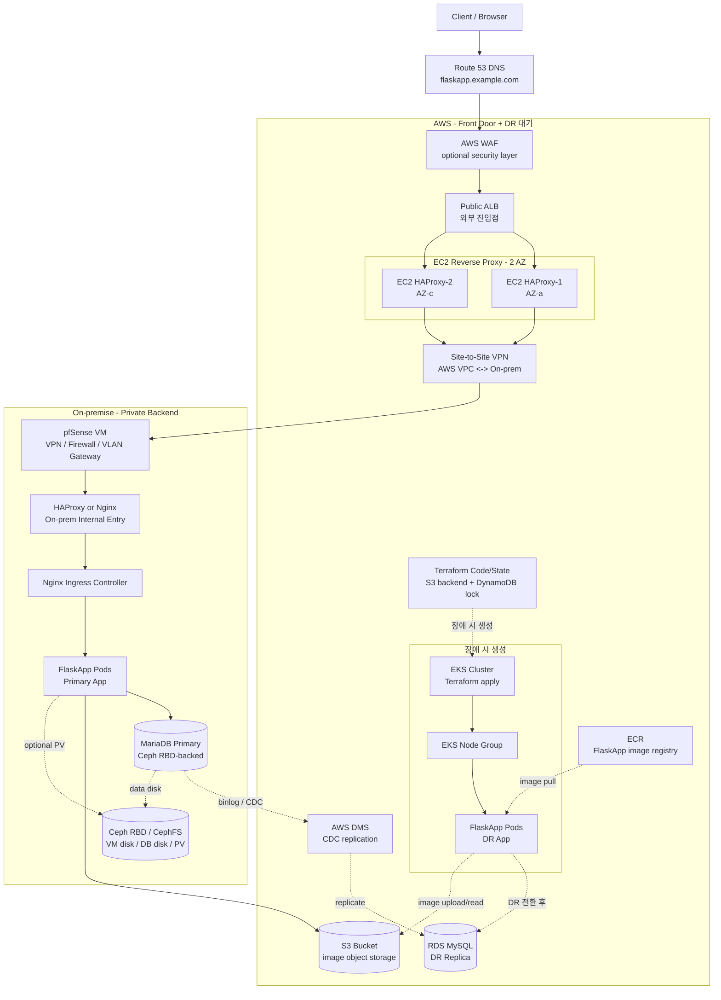
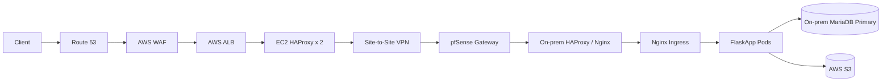
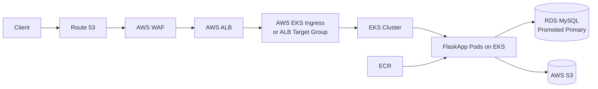
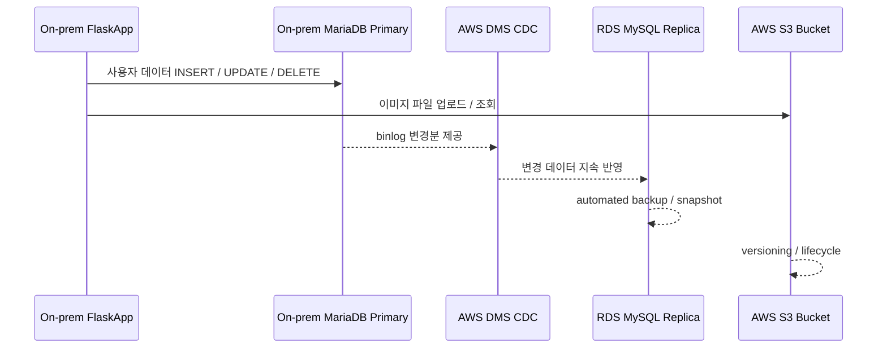
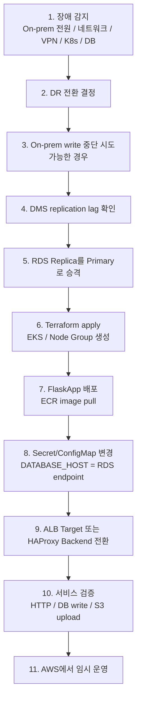

# AWS Front Door 기반 Hybrid Pilot Light DR 아키텍처

## 1. 설계 목표

- On-premise를 기본 운영 환경으로 사용한다.
- AWS를 외부 사용자 진입점으로 두고, On-premise는 VPN 뒤의 private backend로 구성한다.
- Client가 On-premise로 직접 진입하지 않도록 한다.
- 정상 운영 시 AWS ALB와 EC2 HAProxy가 VPN을 통해 On-prem Kubernetes로 트래픽을 전달한다.
- On-premise 장애 발생 시 Terraform으로 EKS를 생성하고, AWS에서 FlaskApp을 운영한다.
- 비용 절감을 위해 EKS와 node group은 상시 운영하지 않고 장애 시 생성한다.
- On-prem DB는 MariaDB Primary로 운영하고, AWS RDS MySQL은 DR Replica로 유지한다.
- 장애 시 RDS Replica를 writable Primary로 승격한다.
- 이미지 파일은 On-prem과 AWS 모두 AWS S3 bucket을 사용한다.
- FlaskApp 컨테이너 이미지는 ECR에 저장하여 On-prem/AWS 양쪽에서 동일하게 배포할 수 있게 한다.

## 2. 핵심 개념

| 용어 | 설명 | 본 설계에서의 역할 |
|---|---|---|
| ALB | Application Load Balancer | 외부 사용자가 접근하는 AWS 진입점 |
| WAF | Web Application Firewall | ALB 앞단에서 SQL Injection, XSS, 비정상 요청, IP 차단, rate limit 등을 처리 |
| EC2 HAProxy | AWS EC2 위에서 동작하는 reverse proxy | 정상 운영 시 ALB 요청을 VPN 너머 On-prem으로 전달 |
| VPN | Site-to-Site VPN 또는 Direct Connect | AWS VPC와 On-prem 네트워크를 private routing으로 연결 |
| ECR | Elastic Container Registry | FlaskApp Docker image를 저장하는 AWS container registry |
| EKS | Elastic Kubernetes Service | 장애 시 Terraform으로 생성하는 AWS DR Kubernetes 실행 환경 |
| RDS MySQL | AWS 관리형 MySQL | 평상시 DR Replica, 장애 시 Primary DB |
| DMS CDC | Database Migration Service Change Data Capture | On-prem MariaDB binlog 변경분을 RDS로 지속 복제 |
| S3 | Object Storage | 이미지 파일 업로드/조회용 단일 저장소 |

## 3. 전체 아키텍처



## 4. 정상 운영 흐름



### 정상 운영 설명

정상 운영 시 Client는 On-premise로 직접 접속하지 않는다. Route 53은 AWS ALB를 바라보고, ALB는 EC2 HAProxy 2대를 target으로 사용한다. EC2 HAProxy는 VPN을 통해 On-premise의 pfSense gateway로 트래픽을 전달하고, pfSense 이후 On-prem HAProxy 또는 Nginx Ingress를 거쳐 FlaskApp Pod로 요청이 전달된다.

DB write는 On-prem MariaDB Primary에 수행한다. On-prem MariaDB의 변경분은 AWS DMS CDC를 통해 RDS MySQL Replica로 복제한다. 이미지 파일은 On-prem App과 AWS DR App 모두 같은 S3 bucket을 사용한다.

## 5. DR 운영 흐름



### DR 운영 설명

On-premise 장애가 발생하면 AWS에 준비된 Terraform 코드로 EKS와 node group을 생성한다. ECR에 저장된 FlaskApp image를 EKS로 배포하고, 애플리케이션의 `DATABASE_HOST`를 RDS endpoint로 변경한다. 이후 ALB target 또는 EC2 HAProxy backend를 On-prem 경로에서 AWS EKS 경로로 전환한다.

이 구조에서는 DNS가 이미 AWS ALB를 바라보고 있으므로 DR 시 DNS 전환이 핵심 작업이 아니다. 핵심 작업은 ALB/proxy backend 전환, RDS 승격, EKS 생성 및 App 배포이다.

## 6. 데이터 흐름



### DB 기준

| 상태 | Primary DB | Replica / Standby |
|---|---|---|
| 정상 운영 | On-prem MariaDB | AWS RDS MySQL |
| DR 전환 후 | AWS RDS MySQL | On-prem DB는 격리 또는 복구 대기 |
| Failback | RDS 데이터를 기준으로 On-prem DB 재동기화 | 이후 On-prem을 다시 Primary로 전환 |

## 7. AWS 상시 준비 리소스

| 리소스 | 상시 유지 | 역할 |
|---|---|---|
| Route 53 | Yes | 서비스 도메인 |
| AWS WAF | Optional | 웹 공격 필터링 |
| ALB | Yes | 외부 사용자 진입점 |
| EC2 HAProxy 2대 | Yes | On-prem private backend로 트래픽 전달 |
| Site-to-Site VPN | Yes | AWS와 On-prem 사설 통신 |
| S3 bucket | Yes | 이미지 Object Storage |
| ECR repository | Yes | FlaskApp image 저장 |
| RDS MySQL Replica | Yes | DR DB 대기 |
| AWS DMS CDC task | Yes | On-prem DB 변경분 복제 |
| Terraform state backend | Yes | DR 인프라 코드/state 관리 |
| EKS cluster | No | 장애 시 Terraform으로 생성 |
| EKS node group | No | 장애 시 Terraform으로 생성 |

## 8. 장애 시 전환 절차



## 9. 비용 절충 포인트

이 설계는 Warm Standby보다 비용을 줄이고, 단순 Backup & Restore보다 빠르게 복구하기 위한 Pilot Light DR 구조이다.

| 방식 | 비용 | RTO | 설명 |
|---|---:|---:|---|
| Backup & Restore | 낮음 | 김 | 백업만 보관하고 장애 시 복구 |
| Pilot Light | 중간 이하 | 중간 | 핵심 데이터/진입점만 상시 유지, App은 장애 시 생성 |
| Warm Standby | 중간~높음 | 짧음 | 축소된 App 환경을 상시 운영 |
| Active-Active | 높음 | 매우 짧음 | On-prem/AWS 동시 서비스 |

본 설계는 ALB, EC2 HAProxy, VPN, RDS Replica, S3, ECR, DMS는 상시 유지하고, EKS와 node group은 장애 시 생성한다. 따라서 AWS 비용은 줄일 수 있지만, EKS 생성 시간만큼 RTO가 증가한다. Terraform/Helm 기반 자동화와 정기 DR 리허설이 필요하다.

## 10. 기존 설계 대비 변경 요약

| 항목 | 기존 설계 | 변경 설계 |
|---|---|---|
| 정상 사용자 진입점 | On-prem pfSense / HAProxy / Ingress | AWS ALB |
| On-prem 공개 여부 | 외부 직접 접근 가능 | VPN 뒤 private backend |
| AWS 역할 | DR 대기 및 장애 시 DNS 전환 대상 | 상시 Front Door + DR 대기 |
| 정상 트래픽 경로 | Client -> DNS -> On-prem | Client -> DNS -> ALB -> EC2 Proxy -> VPN -> On-prem |
| DR 트래픽 전환 | Route 53을 AWS ALB로 전환 | ALB target/proxy backend를 AWS App으로 전환 |
| 보안 계층 | pfSense 중심 | AWS WAF/ALB/SG + VPN + pfSense |
| EKS | 장애 시 Terraform 생성 | 동일 |
| RDS | DR Replica, 장애 시 Primary | 동일 |
| S3 | 이미지 파일 저장소 | 동일 |
| DMS CDC | On-prem DB -> RDS 복제 | 동일 |

## 11. 최종 권장 흐름

```text
정상 운영:
Client
-> Route 53
-> AWS WAF
-> AWS ALB
-> EC2 HAProxy 2대
-> Site-to-Site VPN
-> pfSense Gateway
-> On-prem HAProxy / Nginx
-> Kubernetes Ingress
-> FlaskApp
-> On-prem MariaDB
-> AWS S3

DR 운영:
Client
-> Route 53
-> AWS WAF
-> AWS ALB
-> EKS Ingress / Target Group
-> FlaskApp on EKS
-> RDS MySQL Primary
-> AWS S3
```

이 설계는 On-premise를 기본 운영 환경으로 유지하면서도 외부 진입점은 AWS에 두는 구조이다. On-premise를 직접 인터넷에 노출하지 않고, 장애 시에는 AWS에서 EKS와 RDS Primary로 서비스를 지속한다.
