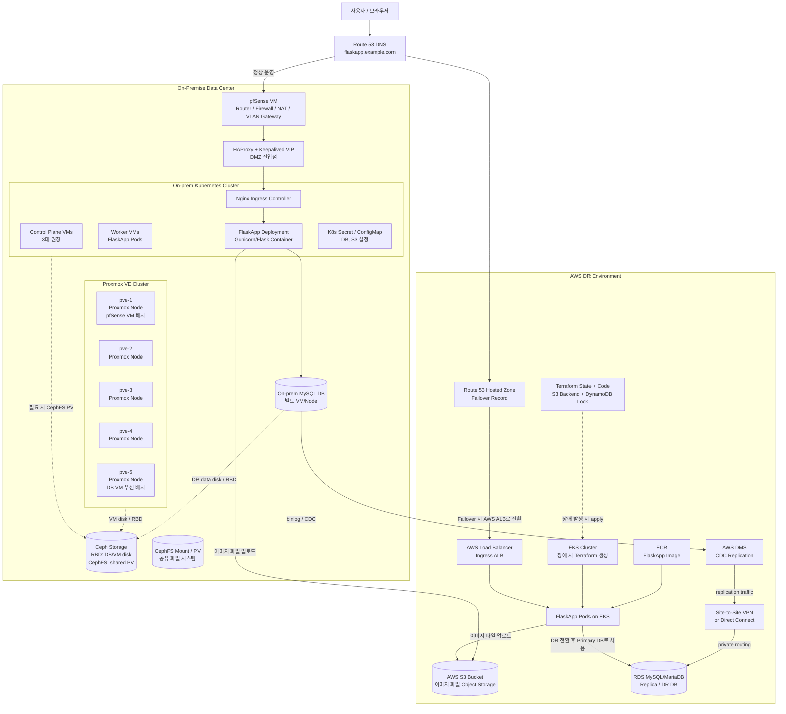
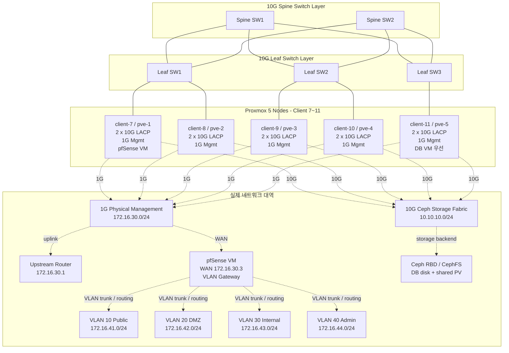
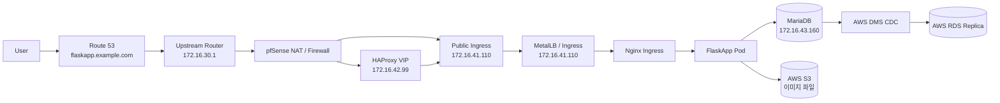
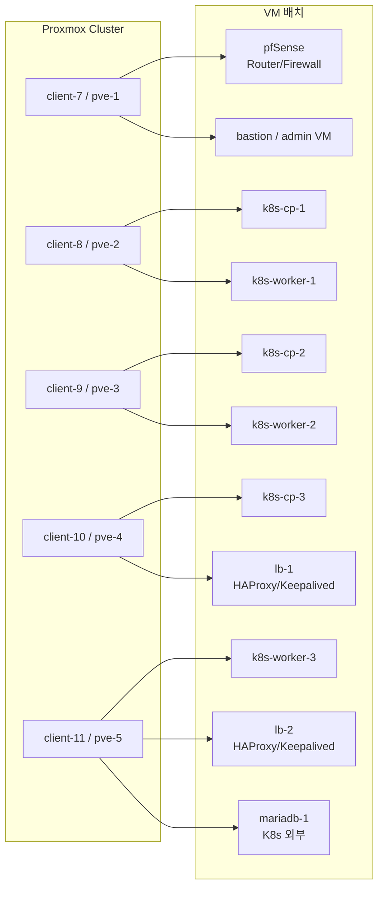
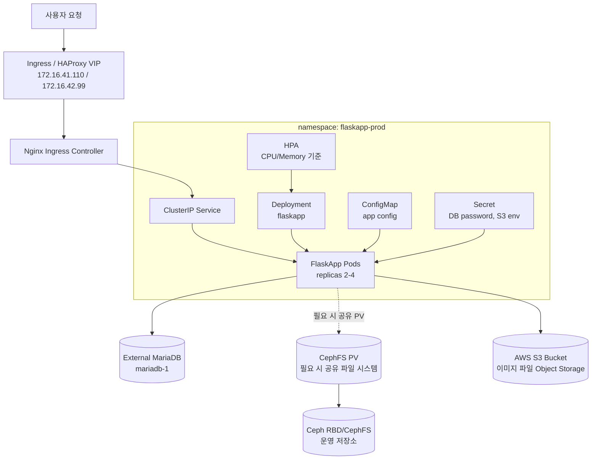
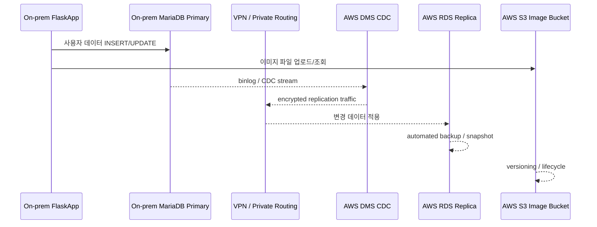
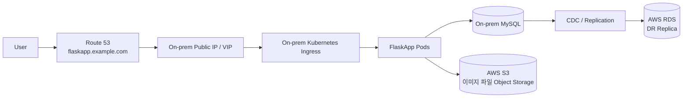
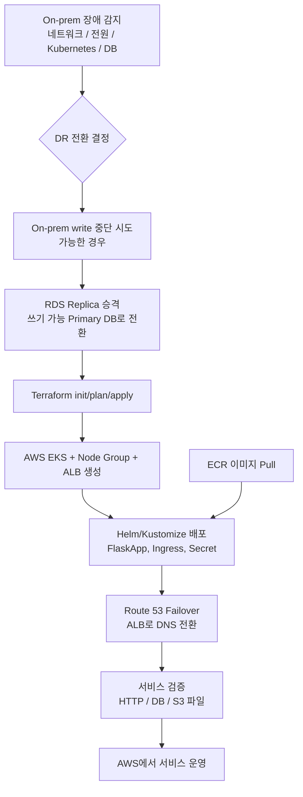
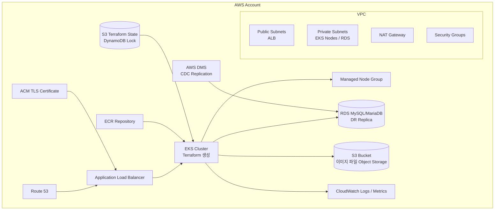
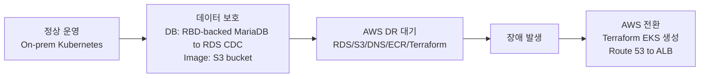

> 문서 상태: 주요 설계 본문이다. 다만 작성 이후 실제 구현이 일부 바뀐 항목이 있으므로 최신 실측 기준은 [current-architecture-summary.md](./current-architecture-summary.md)를 함께 확인한다.
>
> 최신 기준 주요 차이: FlaskApp/Grafana host는 `*.team.snow.internal`, 최종 On-prem 진입점은 HAProxy/Keepalived VIP `172.16.42.99` + ingress-nginx NodePort, MetalLB는 최종 진입점으로 사용하지 않는다.

# FlaskApp On-Premise + AWS DR Infrastructure Architecture

## 1. 설계 목표

- 배정받은 Client PC 5대는 Proxmox VE 클러스터로 구성되어 있으며, 이를 기본 가상화 인프라로 사용한다.
- Proxmox 위에 Kubernetes 클러스터를 구성하고 FlaskApp 웹 서비스를 컨테이너로 운영한다.
- DB는 Kubernetes 내부가 아닌 별도 노드/VM에서 MySQL로 운영한다.
- 기존 Ceph 네트워크 설계 기준인 Spine-Leaf, 1G/10G 물리 분리, LACP, MTU 9000을 반영한다.
- 별도 물리 방화벽 장비가 없으므로 `pve-1` 위의 pfSense VM이 라우터, 방화벽, NAT, VLAN gateway 역할을 담당한다.
- 1G 물리 관리망은 `172.16.30.0/24`, VM 서비스망은 pfSense VLAN 대역으로 분리한다.
- 10G NIC 기반 Ceph 네트워크를 구성하고, Ceph를 On-prem 기본 저장소로 사용한다.
- Ceph RBD는 DB VM의 블록 저장소와 VM disk 저장소로 사용한다.
- CephFS는 Kubernetes에서 공유 파일 시스템/PV가 필요할 경우 사용하는 On-prem 파일 저장소로 둔다.
- AWS에는 S3, RDS, Route 53, VPC, VPN, ECR 등을 상시 준비한다.
- AWS S3는 FlaskApp 이미지 파일 업로드용 Object Storage로 사용한다.
- On-prem DB와 AWS RDS는 Primary-Replica 구조로 설계하고, 실시간에 가까운 비동기 CDC 복제로 동기화한다.
- On-prem 장애 발생 시 Terraform으로 EKS를 생성하고, Route 53 DNS를 AWS ALB로 전환하여 서비스가 AWS에서 동작하게 한다.

> 참고: On-prem MySQL/MariaDB와 RDS 간 "완전 동기식" 복제는 일반적으로 어렵기 때문에, 설계상 목표는 지연 시간을 최소화한 AWS DMS CDC 기반 단방향 복제로 잡는다.

## 2. 전체 아키텍처



## 3. On-prem 물리/네트워크 구조



### 네트워크 권장값

| 구분         | 권장 설계                                                       |
| ------------ | --------------------------------------------------------------- |
| 물리 구조    | Spine-Leaf                                                      |
| NIC 구성     | 각 PC 10G NIC 2개 LACP bonding                                  |
| MTU          | 9000 jumbo frame, 전 구간 동일 적용                             |
| 트래픽 분리  | 1G 물리 관리망, pfSense VLAN 서비스망, 10G Ceph 스토리지망 분리 |
| Ceph Public  | Proxmox가 Ceph 스토리지에 접근하는 트래픽                       |
| Ceph Cluster | OSD replication, recovery, rebalance 전용                       |
| 관리망       | 1G NIC 별도 사용, Proxmox 물리 관리는 `172.16.30.0/24`          |
| 장애 대비    | Spine 2대, Leaf 다중 연결, LACP active-backup 또는 802.3ad      |

### On-prem 네트워크 상세 설계

현재 초기 환경 세팅은 완료된 상태이며, 배정받은 5대 PC의 Proxmox VE 클러스터링까지 구성되어 있다. 별도 물리 방화벽 장비는 없으므로 `pve-1` 위의 pfSense VM이 라우터, 방화벽, NAT, VLAN gateway 역할을 대신한다.

상위 라우터와 Proxmox 물리 관리망은 `172.16.30.0/24`를 사용한다. pfSense WAN은 이 관리망에 붙고, pfSense LAN/Trunk 쪽에서 VLAN 10/20/30/40을 나누어 VM 서비스망을 제공한다. Kubernetes node와 DB 서비스 IP는 `10.10.x.x`가 아니라 pfSense VLAN 대역에 둔다. `10.10.10.x`는 Proxmox host가 Ceph RBD에 접근하고, 필요 시 Kubernetes worker가 CephFS에 접근하는 10G storage network로 유지한다.

| 구분                    | CIDR                          | 물리 경로                          | 용도                                                             | 설계 이유                                            |
| ----------------------- | ----------------------------- | ---------------------------------- | ---------------------------------------------------------------- | ---------------------------------------------------- |
| Physical Management     | `172.16.30.0/24`              | 1G NIC / `vmbr0`                   | 상위 라우터, 관리형 스위치, pfSense WAN, Proxmox 관리 IP         | 물리 장비와 Proxmox 자체 관리망                      |
| Upstream Router         | `172.16.30.1`                 | 라우터 -> 1G 관리형 스위치         | 인터넷 NAT, 외부 uplink                                          | pfSense WAN의 상위 게이트웨이                        |
| pfSense WAN             | `172.16.30.3`                 | 1G 관리망                          | pfSense 외부 인터페이스                                          | 물리 방화벽 대신 라우팅/NAT/방화벽 수행              |
| VLAN 10 Public          | `172.16.41.0/24`              | pfSense VLAN gateway `172.16.41.1` | 외부 접근 서비스, Ingress, MetalLB                               | 사용자 진입점과 공개 서비스 IP                       |
| VLAN 20 DMZ             | `172.16.42.0/24`              | pfSense VLAN gateway `172.16.42.1` | HAProxy, Keepalived, reverse proxy                               | 외부와 내부 사이 중계 구간                           |
| VLAN 30 Internal        | `172.16.43.0/24`              | pfSense VLAN gateway `172.16.43.1` | Kubernetes node, MariaDB, 내부 서비스                            | 앱 실행 노드와 DB를 내부망에 격리                    |
| VLAN 40 Admin           | `172.16.44.0/24`              | pfSense VLAN gateway `172.16.44.1` | Bastion, monitoring, ArgoCD 관리 접근                            | 운영자 전용 관리 구간                                |
| Ceph Storage Fabric     | `10.10.10.0/24` 후보          | 10G NIC / `vmbr1`                  | Proxmox/Kubernetes -> Ceph RBD/CephFS, Ceph replication/recovery | DB disk, VM disk, 공유 PV를 제공하는 고속 스토리지망 |
| Kubernetes node block   | `172.16.43.100-172.16.43.159` | VLAN 30 Internal                   | Kubernetes control plane, worker                                 | 노드와 내부 서비스 통신 구간                         |
| DB block                | `172.16.43.160-172.16.43.169` | VLAN 30 Internal                   | MariaDB, backup, DMS/RDS replication path                        | DB 접근 대상을 내부망에 격리                         |
| MetalLB Pool            | `172.16.41.110-172.16.41.130` | VLAN 10 Public                     | LoadBalancer Service IP                                          | 외부 접근이 필요한 서비스 IP                         |
| Kubernetes Pod CIDR     | `10.244.0.0/16`               | CNI overlay                        | Pod 내부 네트워크                                                | LAN/VPN/AWS VPC와 중복 금지                          |
| Kubernetes Service CIDR | `10.96.0.0/12`                | Kubernetes virtual network         | ClusterIP Service                                                | LAN/VPN/AWS VPC와 중복 금지                          |

VLAN별 DHCP를 사용할 경우 고정 IP와 DHCP pool이 겹치지 않도록 pfSense에서 범위를 분리한다. 현재 설계에서는 VM/Kubernetes/서비스 IP를 각 VLAN별 고정 IP 후보로 관리하고, pfSense에서 VLAN 간 접근 정책을 제어한다.

#### 이 구조를 쓰는 이유

- 물리 방화벽 장비가 없으므로 `pve-1`의 pfSense VM이 라우터, 방화벽, NAT, VLAN gateway 역할을 담당한다.
- Proxmox 물리 관리는 `172.16.30.x`, VM 서비스망은 VLAN 10/20/30/40으로 분리해 관리면과 서비스면을 나눈다.
- Kubernetes node와 MariaDB는 내부망인 VLAN 30에 두고, 외부 진입점은 VLAN 10/20에 둔다.
- `10.10.10.0/24`는 Ceph storage backend로 유지한다. DB VM의 데이터 디스크와 VM disk는 Ceph RBD에 둔다.
- CephFS는 S3와 별개이며, Kubernetes에서 공유 파일 시스템/PV가 필요할 때만 사용한다.
- Kubernetes에서 CephFS를 PV로 직접 사용할 경우 worker VM에 10G Ceph storage network 접근 경로를 제공한다.
- MetalLB L2 mode는 `172.16.41.110-172.16.41.130` 공용망 pool에서 시작한다.
- 외부 사용자/관리자는 pfSense NAT/방화벽 정책을 거쳐 VLAN 10의 Ingress IP 또는 VLAN 20의 HAProxy VIP로 접근한다.
- AWS S3/RDS/DMS와 통신하는 트래픽은 pfSense NAT/VPN 정책을 통해 나가도록 설계한다.
- AWS S3는 FlaskApp 이미지 파일 업로드용 Object Storage로 사용하며, CephFS와 직접적인 복제 관계를 두지 않는다.

#### 물리 노드 IP 계획

| 물리 노드 | 배정 Client | 1G 관리 IP (`vmbr0`) | 10G Ceph IP (`vmbr1`) | 역할                          |
| --------- | ----------- | -------------------- | --------------------- | ----------------------------- |
| `pve-1`   | `client-7`  | `172.16.30.11`       | `10.10.10.39`         | Proxmox node, pfSense VM 배치 |
| `pve-2`   | `client-8`  | `172.16.30.12`       | `10.10.10.40`         | Proxmox node                  |
| `pve-3`   | `client-9`  | `172.16.30.13`       | `10.10.10.41`         | Proxmox node                  |
| `pve-4`   | `client-10` | `172.16.30.14`       | `10.10.10.42`         | Proxmox node, LB 우선 배치    |
| `pve-5`   | `client-11` | `172.16.30.15`       | `10.10.10.43`         | Proxmox node, DB 우선 배치    |

#### pfSense / VLAN Gateway 계획

| 항목                    | IP            | 용도                        |
| ----------------------- | ------------- | --------------------------- |
| Upstream Router         | `172.16.30.1` | 외부망/WAN uplink           |
| Management Switch       | `172.16.30.2` | 1G 관리형 스위치 관리 IP    |
| pfSense WAN             | `172.16.30.3` | 상위 라우터 방향 인터페이스 |
| pfSense VLAN 10 Gateway | `172.16.41.1` | 공용망 gateway              |
| pfSense VLAN 20 Gateway | `172.16.42.1` | DMZ gateway                 |
| pfSense VLAN 30 Gateway | `172.16.43.1` | 내부망 gateway              |
| pfSense VLAN 40 Gateway | `172.16.44.1` | 관리자망 gateway            |

#### VM / Kubernetes 노드 IP 계획

| VM             | 배치 권장 | IP              | vCPU / RAM / Disk       | 역할                                      |
| -------------- | --------- | --------------- | ----------------------- | ----------------------------------------- |
| `k8s-cp-1`     | `pve-2`   | `172.16.43.100` | 2 vCPU / 4GB / 40GB     | Kubernetes control plane, VLAN 30         |
| `k8s-cp-2`     | `pve-3`   | `172.16.43.101` | 2 vCPU / 4GB / 40GB     | Kubernetes control plane, VLAN 30         |
| `k8s-cp-3`     | `pve-4`   | `172.16.43.102` | 2 vCPU / 4GB / 40GB     | Kubernetes control plane, VLAN 30         |
| `k8s-worker-1` | `pve-2`   | `172.16.43.110` | 4 vCPU / 8GB / 80GB     | App worker, VLAN 30                       |
| `k8s-worker-2` | `pve-3`   | `172.16.43.111` | 4 vCPU / 8GB / 80GB     | App worker, VLAN 30                       |
| `k8s-worker-3` | `pve-5`   | `172.16.43.112` | 4 vCPU / 8GB / 80GB     | App/Infra worker, VLAN 30                 |
| `lb-1`         | `pve-4`   | `172.16.42.100` | 2 vCPU / 2GB / 20GB     | HAProxy + Keepalived, VLAN 20             |
| `lb-2`         | `pve-5`   | `172.16.42.101` | 2 vCPU / 2GB / 20GB     | HAProxy + Keepalived, VLAN 20             |
| `bastion`      | `pve-1`   | `172.16.44.100` | 2 vCPU / 4GB / 30GB     | kubectl, ansible, terraform 작업, VLAN 40 |
| `monitoring`   | `pve-4`   | `172.16.44.101` | 2 vCPU / 4GB / 40GB     | Prometheus, Grafana, VLAN 40              |
| `argocd`       | `pve-3`   | `172.16.44.102` | 2 vCPU / 4GB / 40GB     | ArgoCD 관리 접근, VLAN 40                 |
| `mariadb-1`    | `pve-5`   | `172.16.43.160` | 4 vCPU / 8-12GB / 100GB | On-prem Primary DB, VLAN 30               |

위 VM들은 기본적으로 pfSense가 라우팅하는 VLAN bridge에 연결한다. `pve-1`은 pfSense 중심 노드이므로 Kubernetes Control Plane 배치는 피하고, Control Plane은 `pve-2`~`pve-4`에 분산한다. DB VM의 데이터 디스크는 Proxmox에서 Ceph RBD 볼륨으로 할당한다. CephFS는 Kubernetes에서 공유 PV가 필요할 경우에만 마운트하며, 이미지 파일 업로드는 AWS S3 bucket을 사용한다.

#### VIP / MetalLB IP 계획

| 이름               | IP                            | 용도                                    |
| ------------------ | ----------------------------- | --------------------------------------- |
| `k8s-api-vip`      | `172.16.43.99`                | kubeadm control plane endpoint, VLAN 30 |
| `haproxy-vip`      | `172.16.42.99`                | DMZ 진입용 HAProxy/Keepalived VIP       |
| `ingress-vip`      | `172.16.41.100`               | 외부 서비스 진입점                      |
| `ingress-nginx-lb` | `172.16.41.110`               | FlaskApp Ingress                        |
| `argocd-lb`        | `172.16.41.111`               | ArgoCD 외부 접근 필요 시                |
| `grafana-lb`       | `172.16.41.112`               | Grafana 외부 접근 필요 시               |
| `reserved-lb`      | `172.16.41.113-172.16.41.130` | 추가 LoadBalancer Service               |

MetalLB는 VLAN 10 공용망의 `172.16.41.110-172.16.41.130` 범위를 L2 mode로 시작하는 것을 권장한다. BGP mode는 네트워크 장비 설정 난이도가 올라가므로 15일 프로젝트 범위에서는 L2 mode가 현실적이다.

#### DNS / hosts 이름 계획

| 이름                    | 대상            |
| ----------------------- | --------------- |
| `api.k8s.onprem.local`  | `172.16.43.99`  |
| `flaskapp.onprem.local` | `172.16.41.110` |
| `argocd.onprem.local`   | `172.16.41.111` |
| `grafana.onprem.local`  | `172.16.41.112` |
| `bastion.onprem.local`  | `172.16.44.100` |
| `db.onprem.local`       | `172.16.43.160` |

실제 외부 공개 도메인은 Route 53의 `flaskapp.example.com`을 사용하고, 정상 운영 시에는 상위 라우터와 pfSense NAT/방화벽 정책을 거쳐 VLAN 10의 `ingress-nginx-lb` 또는 VLAN 20의 `haproxy-vip`로 연결한다. DR 전환 시에는 같은 도메인을 AWS ALB로 전환한다.

#### 네트워크 흐름



#### 방화벽 / 보안 그룹 기준

| 출발지                        | 목적지                              |        포트 | 목적                        |
| ----------------------------- | ----------------------------------- | ----------: | --------------------------- |
| Admin PC / Bastion            | Proxmox nodes                       |    8006, 22 | Proxmox UI, SSH             |
| Bastion                       | Kubernetes nodes                    |    22, 6443 | SSH, kubectl                |
| `lb-1`, `lb-2`                | Control plane nodes                 |        6443 | Kubernetes API HA proxy     |
| Worker nodes                  | `mariadb-1`                         |        3306 | FlaskApp DB 연결            |
| `mariadb-1` 또는 DMS endpoint | AWS DMS/RDS 경로                    |        3306 | CDC replication             |
| Kubernetes nodes              | AWS S3                              |         443 | 이미지 파일 업로드          |
| Kubernetes workers            | CephFS                              |  CephFS/CSI | 필요 시 공유 PV 접근        |
| User                          | `ingress-nginx-lb` or `haproxy-vip` |     80, 443 | 웹 서비스 접근              |
| Admin                         | Bastion / 관리 VLAN                 | 80, 443, 22 | ArgoCD/Grafana/SSH 접근     |
| pfSense                       | VLAN 10/20/30/40                    | 정책별 허용 | VLAN 간 라우팅, NAT, 방화벽 |

#### 구축 전 확인 사항

- pfSense WAN `172.16.30.3`이 상위 라우터 `172.16.30.1`을 통해 인터넷으로 나갈 수 있어야 한다.
- Proxmox 관리 IP `172.16.30.11-172.16.30.15`는 물리 관리망에서 접근 가능해야 한다.
- VLAN 10/20/30/40 trunk가 Proxmox VLAN-aware bridge와 관리형 스위치에서 동일하게 설정되어야 한다.
- 각 VLAN의 DHCP pool과 고정 IP 후보가 겹치지 않도록 pfSense에서 범위를 분리한다.
- MetalLB pool은 VLAN 10의 `172.16.41.110-172.16.41.130`에서 DHCP server가 할당하지 않는 범위여야 한다.
- `10.10.10.0/24`은 Proxmox/Ceph storage backend로 사용하고, VM service IP와 섞지 않는다.
- Pod CIDR, Service CIDR은 On-prem LAN, AWS VPC, VPN 대역과 겹치면 안 된다.
- MTU 9000은 PC NIC, Proxmox bridge, switch port, Ceph 구간 전체가 동일하게 지원할 때만 적용한다.
- AWS DMS가 On-prem MariaDB에 접근하려면 VPN, NAT, pfSense 방화벽 정책 중 하나가 명확해야 한다.
- 이미지 파일은 AWS S3에 직접 업로드하므로 On-prem Kubernetes node에서 HTTPS outbound가 가능해야 한다.

## 4. Proxmox / Kubernetes 배치



### Kubernetes 내부 구성



### Ceph 저장소 사용 기준

| 구분                  | Ceph 방식 | 사용 대상                               | 설명                                                                                          |
| --------------------- | --------- | --------------------------------------- | --------------------------------------------------------------------------------------------- |
| DB 저장소             | RBD       | `mariadb-1` 데이터 디스크               | DB VM에는 Proxmox RBD disk를 붙이고, MariaDB data directory를 해당 디스크에 둔다.             |
| VM 디스크             | RBD       | Kubernetes node, LB, Bastion 등 VM disk | Proxmox storage backend로 RBD를 사용해 VM disk를 중앙 저장소에 둔다.                          |
| 공유 파일 시스템      | CephFS    | Kubernetes 공유 PV가 필요한 내부 파일   | S3 이미지 업로드와는 별개이며, 필요한 경우 CephFS CSI/PV 또는 worker mount 방식으로 제공한다. |
| 이미지 Object Storage | S3        | FlaskApp 이미지 파일                    | 애플리케이션에서 이미지 업로드/조회에 사용하는 Object Storage이다.                            |

Ceph RBD와 CephFS는 10G Ceph storage network를 사용한다. DB 접속 IP와 Kubernetes 서비스 IP는 VLAN 30 내부망에 두고, DB 데이터 디스크 I/O는 Ceph RBD를 통해 처리한다. 이미지 파일은 CephFS가 아니라 AWS S3 bucket에 저장한다.

## 5. DB 복제 및 DR 데이터 흐름



### DB 복제 선택지

| 방식                     | 설명                                   | 권장도                      |
| ------------------------ | -------------------------------------- | --------------------------- |
| AWS DMS CDC              | On-prem MySQL binlog를 RDS로 지속 복제 | 가장 운영이 쉬움            |
| MySQL native replication | RDS를 external replica처럼 구성        | 가능하지만 운영 난이도 높음 |
| 주기적 dump + restore    | 백업 중심 방식                         | DR RPO가 커져서 비권장      |

권장안은 AWS DMS CDC이다. 정상 운영 시 On-prem MariaDB/MySQL이 Primary이고 AWS RDS는 DR Replica 역할을 한다. 장애 전환 시 RDS를 쓰기 가능한 Primary DB로 승격하고, EKS의 `DATABASE_HOST`를 RDS endpoint로 설정한다.

## 6. 정상 운영 흐름



정상 상태에서는 모든 웹 트래픽이 On-prem Kubernetes로 들어온다. DB write는 On-prem MariaDB/MySQL Primary에 수행하고, DB VM의 데이터 디스크는 Ceph RBD에 둔다. 변경분은 AWS DMS CDC로 RDS Replica에 반영한다. 이미지 파일은 애플리케이션에서 AWS S3 bucket에 직접 업로드한다.

## 7. 장애 발생 시 DR 전환 흐름



### DR 전환 순서

1. On-prem 장애를 모니터링 시스템에서 감지한다.
2. 운영자가 DR 전환을 선언한다.
3. 가능한 경우 On-prem DB write를 중단하고 마지막 복제 지연 시간을 확인한다.
4. AWS RDS를 Primary로 승격한다.
5. 저장된 Terraform 코드로 EKS, node group, ALB ingress, IAM, security group을 생성한다.
6. ECR의 FlaskApp 이미지를 EKS에 배포한다.
7. Kubernetes Secret/ConfigMap의 `DATABASE_HOST`를 RDS endpoint로 설정하고, 이미지 bucket 설정은 기존 AWS S3 bucket을 그대로 사용한다.
8. Route 53 레코드를 On-prem VIP에서 AWS ALB로 전환한다.
9. 애플리케이션 헬스체크, DB 조회/쓰기, S3 파일 조회/업로드를 검증한다.

## 8. AWS DR 구성 요소



## 9. Terraform 모듈 분리 권장

```text
terraform/
  envs/
    dr/
      main.tf
      variables.tf
      outputs.tf
      terraform.tfvars
  modules/
    network/
    security/
    route53/
    s3/
    rds/
    dms/
    ecr/
    eks/
    alb-ingress/
```

### 상시 구성할 리소스

- VPC / subnet / routing / security group
- Site-to-Site VPN 또는 Direct Connect
- S3 bucket, versioning, lifecycle, 이미지 파일 prefix
- RDS MySQL, subnet group, parameter group
- AWS DMS replication instance/task 또는 MySQL replication 설정
- Route 53 hosted zone, health check, failover record
- ECR repository
- Terraform remote state backend

### 장애 시 생성할 리소스

- EKS cluster
- EKS managed node group
- AWS Load Balancer Controller
- Kubernetes namespace, Secret, ConfigMap
- FlaskApp Deployment / Service / Ingress
- HPA, CloudWatch Container Insights optional

## 10. 운영 체크포인트

| 영역       | 체크포인트                                                     |
| ---------- | -------------------------------------------------------------- |
| RPO        | DMS replication lag 또는 MySQL replica lag를 지속 모니터링     |
| RTO        | Terraform apply + image pull + DNS TTL 기준으로 산정           |
| DNS        | TTL 30-60초 권장, Route 53 health check 기반 failover 가능     |
| DB         | RDS 승격 절차와 split-brain 방지 절차 문서화                   |
| App        | 컨테이너 이미지를 항상 ECR에 push                              |
| Secret     | On-prem과 AWS의 Secret 값을 별도 관리                          |
| Ceph       | RBD pool, CephFS volume, CSI 연동 상태, 10G MTU/LACP 상태 점검 |
| S3         | 이미지 파일 bucket, versioning, lifecycle, access policy 적용  |
| Backup     | On-prem DB dump, RDS snapshot, Terraform state 백업            |
| Monitoring | Prometheus/Grafana, Alertmanager, CloudWatch 연동              |
| Security   | VPN 암호화, security group 최소 허용, DB public access 금지    |

## 11. 최종 구성 요약



이 설계는 On-prem을 기본 운영 환경으로 사용하고, AWS는 데이터와 DNS를 준비해 둔 DR 환경으로 유지한다. 정형 데이터는 Ceph RBD 기반 On-prem MariaDB/MySQL Primary에서 AWS RDS Replica로 CDC 복제하고, 이미지 파일은 AWS S3 bucket에 저장한다. CephFS는 S3와 별개의 On-prem 공유 파일 시스템/PV 용도로만 사용한다. 장애 시에는 RDS를 Primary로 승격하고 Terraform으로 EKS를 생성한 뒤 DNS를 ALB로 전환하여 FlaskApp을 AWS에서 계속 운영한다.
