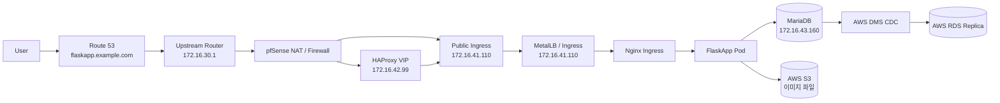

```mermaid
flowchart LR
    user[User] --> dns[Route 53<br/>flaskapp.example.com]
    dns --> upstream[Upstream Router<br/>172.16.30.1]
    upstream --> pfsense[pfSense NAT / Firewall]
    pfsense --> publicip[Public Ingress<br/>172.16.41.110]
    pfsense --> haproxy[HAProxy VIP<br/>172.16.42.99]
    haproxy --> publicip
    publicip --> ingressip[MetalLB / Ingress<br/>172.16.41.110]
    ingressip --> ingress[Nginx Ingress]
    ingress --> pod[FlaskApp Pod]
    pod --> db[(MariaDB<br/>172.16.43.160)]
    pod --> s3[(AWS S3<br/>이미지 파일)]
    db --> dms[AWS DMS CDC]
    dms --> rds[(AWS RDS Replica)]
```
