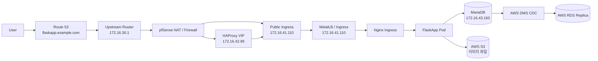

> 문서 상태: 구버전 네트워크 흐름도이다. 최신 기준은 HAProxy/Keepalived VIP `172.16.42.99` -> ingress-nginx NodePort `30080/30443`이며, MetalLB/`172.16.41.110` 직접 진입은 최종 구현 기준이 아니다.
>
> 최신 발표용 다이어그램은 [../presentation/onprem-system-architecture-mermaid.md](../presentation/onprem-system-architecture-mermaid.md)를 우선 사용한다.

