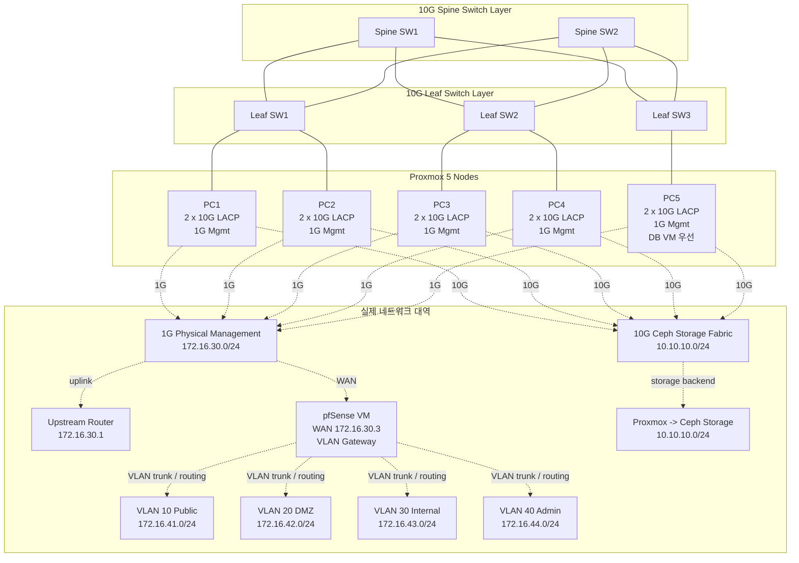

```mermaid
flowchart TB
    subgraph SPINE[10G Spine Switch Layer]
        sp1[Spine SW1]
        sp2[Spine SW2]
    end

    subgraph LEAF[10G Leaf Switch Layer]
        lf1[Leaf SW1]
        lf2[Leaf SW2]
        lf3[Leaf SW3]
    end

    subgraph HOSTS[Proxmox 5 Nodes]
        n1[PC1<br/>2 x 10G LACP<br/>1G Mgmt]
        n2[PC2<br/>2 x 10G LACP<br/>1G Mgmt]
        n3[PC3<br/>2 x 10G LACP<br/>1G Mgmt]
        n4[PC4<br/>2 x 10G LACP<br/>1G Mgmt]
        n5[PC5<br/>2 x 10G LACP<br/>1G Mgmt<br/>DB VM 우선]
    end

    subgraph NET[실제 네트워크 대역]
        nmgmt[1G Physical Management<br/>172.16.30.0/24]
        nrouter[Upstream Router<br/>172.16.30.1]
        npfsense[pfSense VM<br/>WAN 172.16.30.3<br/>VLAN Gateway]
        nvlan10[VLAN 10 Public<br/>172.16.41.0/24]
        nvlan20[VLAN 20 DMZ<br/>172.16.42.0/24]
        nvlan30[VLAN 30 Internal<br/>172.16.43.0/24]
        nvlan40[VLAN 40 Admin<br/>172.16.44.0/24]
        nceph[10G Ceph Storage Fabric<br/>10.10.10.0/24]
        nstore[Proxmox -> Ceph Storage<br/>10.10.10.0/24]
    end

    sp1 --- lf1
    sp1 --- lf2
    sp1 --- lf3
    sp2 --- lf1
    sp2 --- lf2
    sp2 --- lf3

    lf1 --- n1
    lf1 --- n2
    lf2 --- n3
    lf2 --- n4
    lf3 --- n5

    n1 -. 1G .-> nmgmt
    n2 -. 1G .-> nmgmt
    n3 -. 1G .-> nmgmt
    n4 -. 1G .-> nmgmt
    n5 -. 1G .-> nmgmt
    nmgmt -. uplink .-> nrouter
    nmgmt -. WAN .-> npfsense
    npfsense -. VLAN trunk / routing .-> nvlan10
    npfsense -. VLAN trunk / routing .-> nvlan20
    npfsense -. VLAN trunk / routing .-> nvlan30
    npfsense -. VLAN trunk / routing .-> nvlan40
    n1 -. 10G .-> nceph
    n2 -. 10G .-> nceph
    n3 -. 10G .-> nceph
    n4 -. 10G .-> nceph
    n5 -. 10G .-> nceph
    nceph -. storage backend .-> nstore
```
