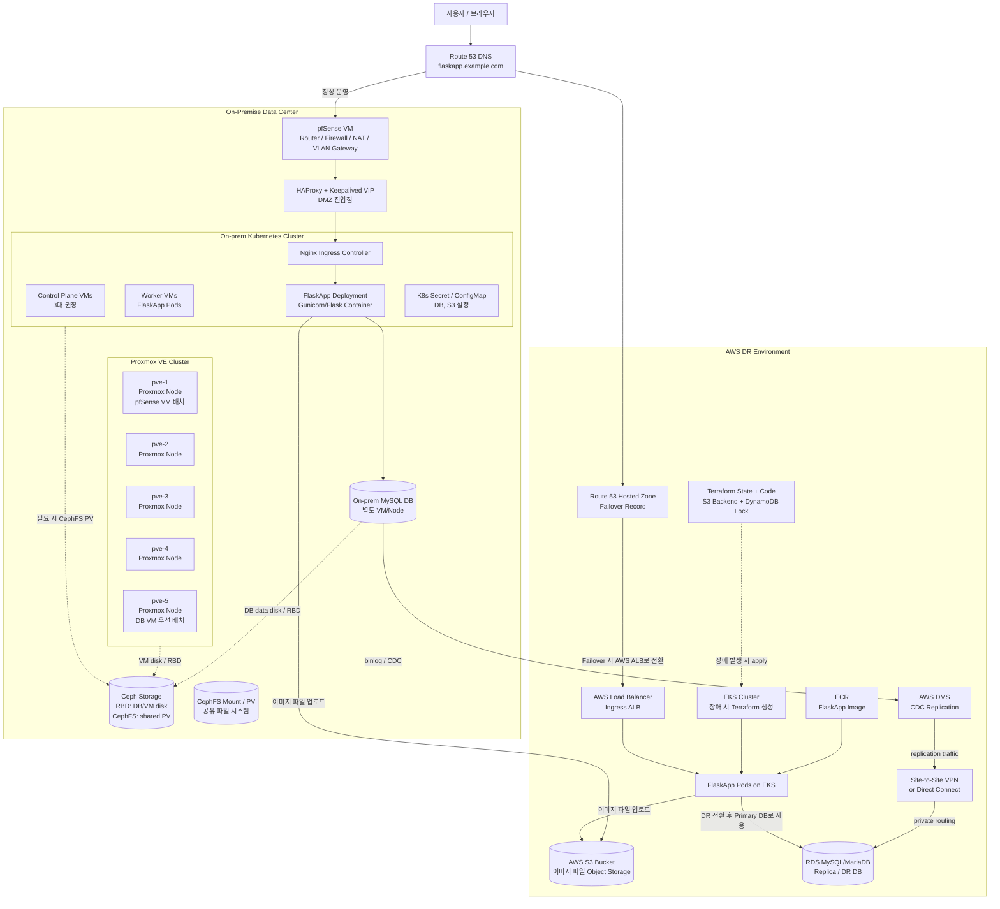

```mermaid
flowchart TB
    user[사용자 / 브라우저]
    dns[Route 53 DNS<br/>flaskapp.example.com]

    subgraph ONPREM[On-Premise Data Center]
        edge[pfSense VM<br/>Router / Firewall / NAT / VLAN Gateway]
        lb[HAProxy + Keepalived VIP<br/>DMZ 진입점]

        subgraph PVE[Proxmox VE Cluster]
            pve1[pve-1<br/>Proxmox Node<br/>pfSense VM 배치]
            pve2[pve-2<br/>Proxmox Node]
            pve3[pve-3<br/>Proxmox Node]
            pve4[pve-4<br/>Proxmox Node]
            pve5[pve-5<br/>Proxmox Node<br/>DB VM 우선 배치]
        end

        subgraph K8S[On-prem Kubernetes Cluster]
            cp[Control Plane VMs<br/>3대 권장]
            wk[Worker VMs<br/>FlaskApp Pods]
            ingress[Nginx Ingress Controller]
            app[FlaskApp Deployment<br/>Gunicorn/Flask Container]
            secret[K8s Secret / ConfigMap<br/>DB, S3 설정]
        end

        db[(On-prem MySQL DB<br/>별도 VM/Node)]
        ceph[(Ceph Storage<br/>RBD: DB/VM disk<br/>CephFS: shared PV)]
        cephfs[(CephFS Mount / PV<br/>공유 파일 시스템)]
    end

    subgraph AWS[AWS DR Environment]
        r53[Route 53 Hosted Zone<br/>Failover Record]
        vpn[Site-to-Site VPN<br/>or Direct Connect]
        s3[(AWS S3 Bucket<br/>이미지 파일 Object Storage)]
        ecr[ECR<br/>FlaskApp Image]
        dms[AWS DMS<br/>CDC Replication]
        rds[(RDS MySQL/MariaDB<br/>Replica / DR DB)]
        tf[Terraform State + Code<br/>S3 Backend + DynamoDB Lock]
        eks[EKS Cluster<br/>장애 시 Terraform 생성]
        alb[AWS Load Balancer<br/>Ingress ALB]
        cloudapp[FlaskApp Pods on EKS]
    end

    user --> dns
    dns -->|정상 운영| edge
    edge --> lb
    lb --> ingress
    ingress --> app
    app --> db
    app -->|이미지 파일 업로드| s3
    db -->|binlog / CDC| dms
    dms -->|replication traffic| vpn
    vpn -->|private routing| rds
    PVE -. VM disk / RBD .-> ceph
    db -. DB data disk / RBD .-> ceph
    K8S -. 필요 시 CephFS PV .-> ceph

    tf -. 장애 발생 시 apply .-> eks
    ecr --> cloudapp
    eks --> cloudapp
    cloudapp -->|DR 전환 후 Primary DB로 사용| rds
    cloudapp -->|이미지 파일 업로드| s3
    alb --> cloudapp
    r53 -->|Failover 시 AWS ALB로 전환| alb
    dns --> r53
```
