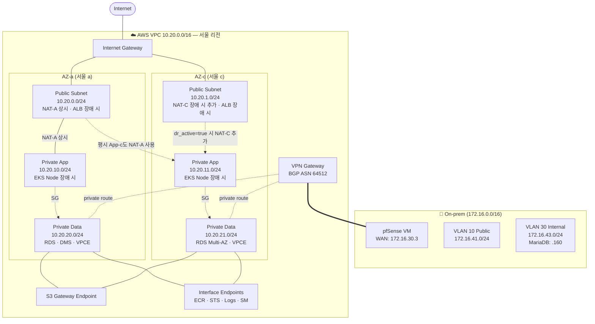
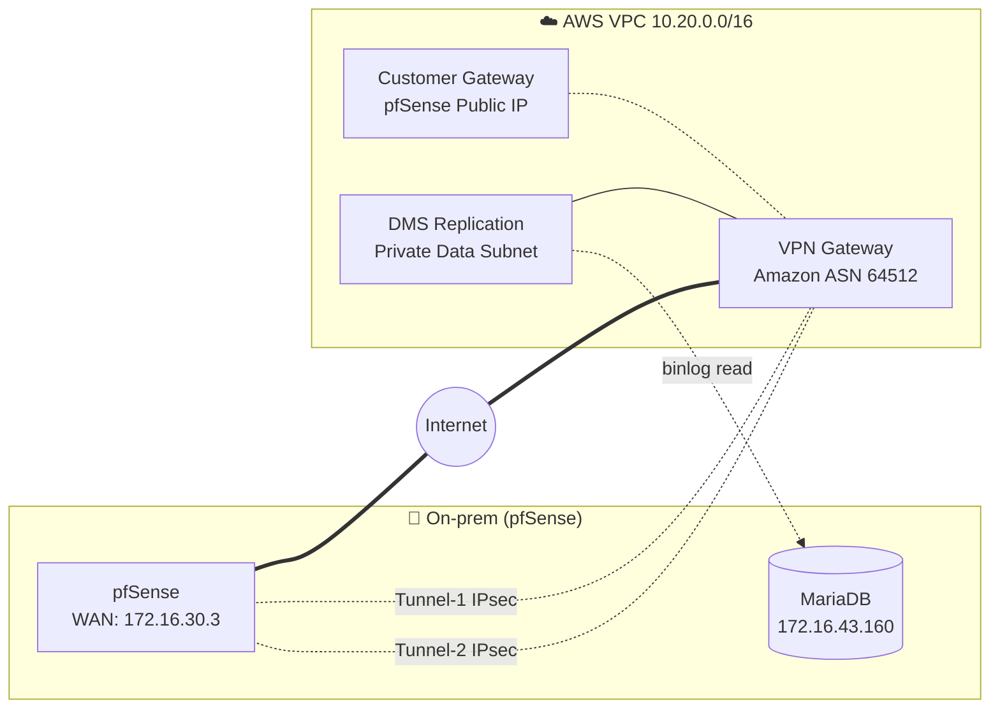
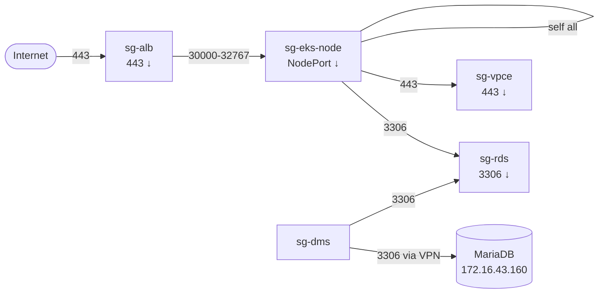
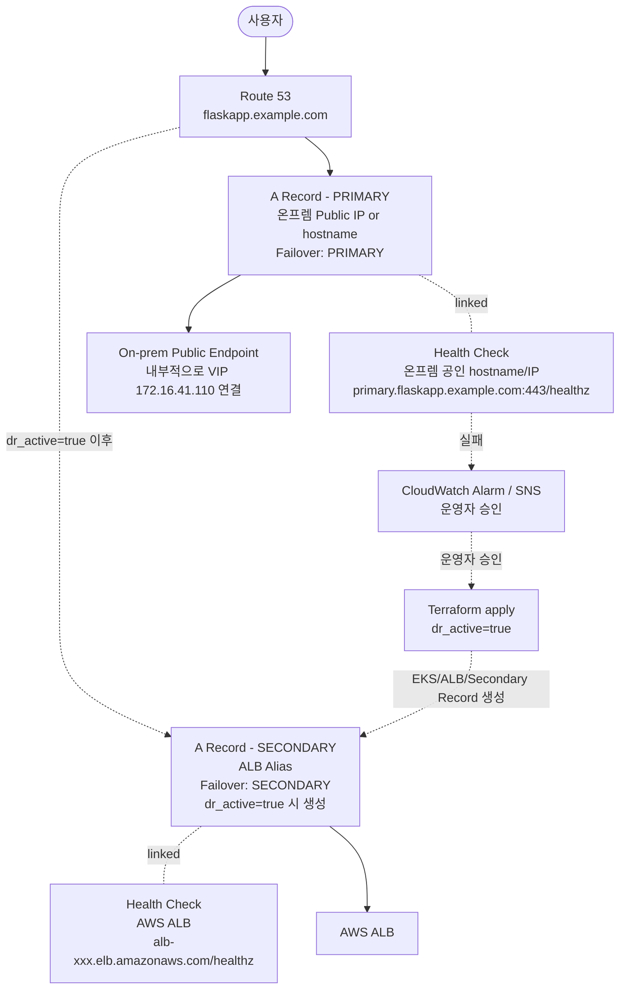

# 03-1. 네트워크 상세 구현 설계

> 수정 반영: 운용 리소스 구분, App RT 온프렘 라우트 제거, Route 53 Health Check 공인 endpoint 기준, Pilot Light 수동 활성화, NAT 1→2 확장 패턴.

> 이전 문서 `aws-dr-architecture.md`의 **3장 네트워크**를 더 깊이 다룹니다.

## 📌 한 줄 요약

> **AWS 안에 우리만의 사설 동네(VPC)를 만들고, 그 안에 6개의 구역(서브넷)을 두 군데 가용영역(AZ)에 나눠 짓습니다. 인터넷에서 들어오는 길, 내부끼리 통하는 길, 온프렘으로 가는 VPN 길을 깔고, 각 구역마다 "누가 들어올 수 있나" 방화벽 규칙을 세웁니다.**

## 목차

- [0. 이 문서 읽기 전에 알아둘 용어](#0-이-문서-읽기-전에-알아둘-용어)
- [1. 전체 그림 한눈에 보기](#1-전체-그림-한눈에-보기)
- [2. VPC와 서브넷 — 동네 설계도](#2-vpc와-서브넷--동네-설계도)
- [3. Route Table & NAT — 어디로 가는 길인가](#3-route-table--nat--어디로-가는-길인가)
- [4. Site-to-Site VPN — 온프렘과 AWS의 비밀 통로](#4-site-to-site-vpn--온프렘과-aws의-비밀-통로)
- [5. VPC Endpoints — NAT을 우회하는 지름길](#5-vpc-endpoints--nat을-우회하는-지름길)
- [6. Security Group — 컴포넌트별 방화벽](#6-security-group--컴포넌트별-방화벽)
- [7. Route 53 Failover — 장애 시 길 자동 전환](#7-route-53-failover--장애-시-길-자동-전환)
- [8. Terraform 모듈 구조](#8-terraform-모듈-구조)
- [9. 검증 체크리스트](#9-검증-체크리스트)

---

## 0. 이 문서 읽기 전에 알아둘 용어

| 용어 | 한 줄 설명 |
|---|---|
| **VPC** | AWS 안의 우리만 쓰는 사설 네트워크 (Virtual Private Cloud) |
| **CIDR** | IP 대역을 표현하는 방식 (`10.20.0.0/16` = 10.20.x.x 전체) |
| **서브넷 (Subnet)** | VPC를 더 작게 쪼갠 구역. 보통 역할별/AZ별로 나눔 |
| **AZ (Availability Zone)** | 같은 리전 안의 물리적으로 분리된 데이터센터. 한쪽이 죽어도 다른 쪽은 살아있음 |
| **IGW (Internet Gateway)** | VPC ↔ 인터넷을 잇는 출입문 |
| **NAT Gateway** | 사설 IP가 인터넷 나갈 때 거치는 중간 게이트웨이 |
| **Route Table** | "이 IP로 갈 땐 이쪽으로" 라는 길 안내 표 |
| **VGW / CGW** | VPN Gateway (AWS측) / Customer Gateway (온프렘측) |
| **BGP** | 라우터끼리 "내가 이 IP 대역 가지고 있어"를 자동으로 알리는 프로토콜 |
| **VPC Endpoint** | AWS 서비스에 인터넷 안 거치고 사설로 접근하는 통로 |
| **Security Group (SG)** | 인스턴스 단위 방화벽. "어떤 SG가 들어올 수 있나" 정의 |
| **Route 53** | AWS의 DNS 서비스 (도메인 → IP 안내) |
| **Health Check** | "이 주소 살아있나?" 주기적으로 확인하는 기능 |
| **TTL** | DNS 응답이 캐싱되는 시간. 짧을수록 변경 반영 빠름 |
| **ENI** | Elastic Network Interface, AWS 안의 가상 랜카드 |
| **PSK** | Pre-Shared Key, VPN 양쪽이 공유하는 비밀번호 |

---

## 1. 전체 그림 한눈에 보기

### 1.1 토폴로지



### 1.2 4가지 핵심 원칙 (왜 이렇게 설계하는가)

**1️⃣ 3계층으로 동네 분리하기**

아파트 단지를 떠올려 보세요:
- **Public**: 정문 (인터넷에서 보임 — ALB가 여기)
- **Private App**: 거주 동 (앱 컨테이너가 사는 곳)
- **Private Data**: 금고실 (DB, 절대 외부 노출 안 됨)

→ 침입자가 금고실까지 가려면 정문 → 거주 동 → 금고실을 모두 뚫어야 합니다.

**2️⃣ AZ 2개에 똑같이 복제하기**

한쪽 AZ(데이터센터)가 죽어도 다른 쪽으로 전환할 수 있도록, 모든 계층의 서브넷은 두 AZ에 동일하게 배치합니다. 단, **NAT Gateway는 비용 절감을 위해 평시 1개만 상시 운용하고, `dr_active=true` 장애 활성화 시 2개로 확장**합니다.

**3️⃣ 가능한 한 NAT 안 거치게 하기**

NAT는 비싸고 느립니다. AWS 서비스(S3, ECR 등)와 통신할 땐 **VPC Endpoint**라는 지름길로 사설 통신.

**4️⃣ 들어오는 문은 최소화**

- 평소엔 IGW로 들어오는 트래픽 **0** (ALB도 평시엔 없음)
- VPN은 **AWS Data Subnet의 DMS → 온프렘 MariaDB** 경로만 허용
- 장애 전환은 **Pilot Light DR** 방식으로, 운영자 승인 후 `dr_active=true`로 활성화

### 1.3 운용 모드별 리소스 구분

이 문서는 **Pilot Light DR** 기준입니다. 즉, 데이터 복제와 네트워크 기반은 평소에도 살아 있고, 실제 사용자 트래픽을 받을 EKS/ALB 계층은 장애 시 운영자 승인 후 켭니다.

#### 상시 운용 (`dr_active=false` 기본)

| 구분 | 리소스 | 설명 |
|---|---|---|
| 네트워크 기반 | VPC, Subnet, Route Table, Security Group | DR VPC의 뼈대. 항상 유지 |
| 온프렘 연결 | Site-to-Site VPN, VGW/CGW | DMS가 온프렘 MariaDB binlog를 읽기 위한 사설 경로 |
| 데이터 | RDS, DMS, S3 | On-prem → AWS 복제와 단일 Object Storage 유지 |
| 이미지/권한 | ECR, IAM, KMS, Secrets Manager | 장애 시 앱이 바로 기동할 수 있도록 상시 준비 |
| IaC 기반 | Terraform backend, DynamoDB lock | state/lock 저장소 |
| DNS/감지 | Route 53, Health Check/Alarm | 온프렘 장애 감지와 전환 준비 |
| 사설 AWS 접근 | VPC Endpoints | S3/ECR/STS/Logs/Secrets Manager 사설 접근 |
| 인터넷 아웃바운드 | NAT Gateway **1개** | 평시 최소 비용. 기본은 AZ-a NAT-A 1개 |

#### 장애 시 활성화 (`dr_active=true`)

| 구분 | 리소스 | 설명 |
|---|---|---|
| 컨테이너 실행 | EKS Cluster, Managed Node Group | FlaskApp 실행 환경 생성 |
| 외부 진입점 | ALB | Ingress가 생성하는 인터넷 공개 진입점 |
| 앱 배포 | FlaskApp Deployment, Service, Ingress | ECR 이미지를 Pull해서 DR 앱 기동 |
| 오토스케일링 | HPA | CPU/메모리 기준 Pod 확장 |
| NAT 확장 | NAT Gateway **1개 추가** | AZ-c NAT-C를 추가하여 장애 시 NAT 총 2개 구성 |

> 📌 **RTO 기대치**: 이 방식은 Warm Standby가 아니라 **Pilot Light DR**입니다. 따라서 장애 감지 후 바로 자동 전환되는 구조가 아니라, 운영자 승인 → `terraform apply -var="dr_active=true"` → EKS/ALB/앱 기동 → DNS 전환 순서로 진행됩니다. RTO는 수 초가 아니라 **수십 분 수준**으로 보는 것이 현실적입니다.

---

## 2. VPC와 서브넷 — 동네 설계도

### 2.1 IP 대역 (CIDR) 할당

VPC 전체는 `10.20.0.0/16` — 가능한 IP 65,534개.
이걸 6개 서브넷에 `/24` (각 251개씩)로 나눕니다.

| 구분 | CIDR | IP 범위 | 가용 IP | 무엇이 들어가나 |
|---|---|---|---|---|
| **VPC 전체** | `10.20.0.0/16` | `10.20.0.0` ~ `10.20.255.255` | 65,531 | 향후 확장 여유 |
| Public-a | `10.20.0.0/24` | `10.20.0.4` ~ `10.20.0.254` | 251 | NAT-A, ALB |
| Public-c | `10.20.1.0/24` | `10.20.1.4` ~ `10.20.1.254` | 251 | NAT-C, ALB |
| App-a | `10.20.10.0/24` | `10.20.10.4` ~ `10.20.10.254` | 251 | EKS Worker |
| App-c | `10.20.11.0/24` | `10.20.11.4` ~ `10.20.11.254` | 251 | EKS Worker |
| Data-a | `10.20.20.0/24` | `10.20.20.4` ~ `10.20.20.254` | 251 | RDS, DMS, VPCE |
| Data-c | `10.20.21.0/24` | `10.20.21.4` ~ `10.20.21.254` | 251 | RDS Standby, VPCE |

> ℹ️ **AWS는 각 서브넷의 처음 4개 IP(`.0`~`.3`)와 마지막 IP(`.255`)를 예약합니다.** 그래서 `/24` 라도 실사용 가능 IP는 251개.

### 2.2 IP 대역이 다른 곳과 겹치지 않는지 확인

VPN으로 온프렘과 연결할 거라, 두 쪽 IP가 겹치면 라우팅이 꼬입니다. 확인:

| 대역 | 어디서 쓰나 | 충돌? |
|---|---|---|
| `10.20.0.0/16` | **AWS VPC (이 설계)** | — |
| `172.16.30.0/24` | 온프렘 관리망 | ✅ 안전 |
| `172.16.41-44.0/24` | 온프렘 VLAN 10~40 | ✅ 안전 |
| `10.10.10.0/24` | 온프렘 Ceph storage | ✅ 안전 |
| `10.244.0.0/16` | K8s Pod CIDR | ✅ 안전 |
| `10.96.0.0/12` | K8s Service CIDR | ✅ 안전 |

### 2.3 Terraform 코드

```hcl
# modules/network/vpc.tf
resource "aws_vpc" "main" {
  cidr_block           = "10.20.0.0/16"
  enable_dns_support   = true
  enable_dns_hostnames = true   # ⚠️ VPC Endpoint Private DNS에 필수

  tags = {
    Name = "vpc-kosa-project-team3-snow"
  }
}

locals {
  azs = ["ap-northeast-2a", "ap-northeast-2c"]
  subnets = {
    public  = ["10.20.0.0/24",  "10.20.1.0/24"]
    app     = ["10.20.10.0/24", "10.20.11.0/24"]
    data    = ["10.20.20.0/24", "10.20.21.0/24"]
  }
}

resource "aws_subnet" "public" {
  count                   = 2
  vpc_id                  = aws_vpc.main.id
  cidr_block              = local.subnets.public[count.index]
  availability_zone       = local.azs[count.index]
  map_public_ip_on_launch = false  # ALB는 ENI에 EIP 별도 할당

  tags = {
    Name                       = "public-${local.azs[count.index]}"
    "kubernetes.io/role/elb"   = "1"   # ⭐ ALB Ingress가 자동 인식하는 태그
  }
}

resource "aws_subnet" "app" {
  count             = 2
  vpc_id            = aws_vpc.main.id
  cidr_block        = local.subnets.app[count.index]
  availability_zone = local.azs[count.index]

  tags = {
    Name                                = "app-${local.azs[count.index]}"
    "kubernetes.io/role/internal-elb"   = "1"
  }
}
```

> ⚠️ **태그가 핵심**: EKS는 서브넷 태그(`kubernetes.io/role/elb`, `internal-elb`)를 보고 ALB를 어디에 배치할지 자동 결정합니다. **이 태그가 누락되면 ALB Ingress Controller가 서브넷을 찾지 못해서 ALB가 안 생깁니다.** 빈번한 실수 포인트.

---

## 3. Route Table & NAT — 어디로 가는 길인가

### 3.1 Route Table = 길 안내 표

Route Table은 "어디로 가려면 어느 문으로 나가야 하는가"를 적어둔 표입니다. 이번 수정의 핵심은 **App Route Table에서 온프렘 라우트를 제거하고, 온프렘 DB 접근 경로를 Data Route Table로만 제한**하는 것입니다.

| Route Table | 누가 쓰나 | 어디로 가려면? |
|---|---|---|
| **rt-public** | Public-a, Public-c | `0.0.0.0/0` → IGW<br/>`10.20.0.0/16` → local |
| **rt-app-a** | App-a | `0.0.0.0/0` → **NAT-A**<br/>`10.20.0.0/16` → local<br/>**온프렘 `172.16.0.0/16` 라우트 없음** |
| **rt-app-c** | App-c | 평시 `0.0.0.0/0` → **NAT-A**<br/>DR 활성화 시 `0.0.0.0/0` → **NAT-C**<br/>`10.20.0.0/16` → local<br/>**온프렘 `172.16.0.0/16` 라우트 없음** |
| **rt-data-a** | Data-a | `172.16.43.160/32` → VGW propagation 또는 정적 VGW route<br/>`10.20.0.0/16` → local<br/>**`0.0.0.0/0` 없음** |
| **rt-data-c** | Data-c | Data-a와 동일 |

> ✅ **수정 판단**: 구현 가능하며, 보안상 더 좋습니다. DMS만 온프렘 DB에 접근하면 되므로 App Subnet에 `172.16.0.0/16 → VGW`를 둘 이유가 없습니다. App Subnet까지 온프렘 전체 대역을 열면 EKS Pod/Node가 온프렘 내부망으로 나갈 수 있는 길이 생겨 공격면이 넓어집니다.

> ⚠️ **BGP 주의**: `aws_vpn_gateway_route_propagation`은 pfSense가 BGP로 광고하는 prefix를 Route Table에 자동 반영합니다. 따라서 pfSense에서 `172.16.0.0/16` 전체를 광고하면 Data RT에도 전체 대역이 들어올 수 있습니다. 이 설계에서는 **pfSense가 `172.16.43.160/32`만 광고**하도록 제한합니다. 제어가 어렵다면 Data RT에는 propagation 대신 정적 route를 사용합니다.

### 3.2 4가지 핵심 의도

**1️⃣ App 서브넷은 인터넷 아웃바운드만 NAT으로**
→ EKS 노드가 ECR Pull, 외부 API 호출 등 필요한 아웃바운드를 수행합니다. 단, 온프렘으로 가는 VGW 라우트는 없습니다.

**2️⃣ Data 서브넷만 온프렘 DB로 연결**
→ DMS Replication Instance가 온프렘 MariaDB `172.16.43.160:3306`에 접근하는 경로만 허용합니다.

**3️⃣ Data 서브넷엔 `0.0.0.0/0` 라우트 없음**
→ RDS/DMS가 일반 인터넷으로 나가지 못하게 막습니다. AWS 서비스 접근은 VPC Endpoint를 사용합니다.

**4️⃣ NAT는 평시 1개, 장애 시 2개**
→ 비용 절감을 위해 NAT-A 1개만 상시 유지합니다. `dr_active=true`일 때 NAT-C를 추가해 AZ별 NAT 구조로 확장합니다.

### 3.3 NAT Gateway 수정 코드

기존 코드는 NAT Gateway를 항상 2개 만들었습니다. 수정 후에는 `dr_active=false`일 때 1개, `dr_active=true`일 때 2개가 됩니다.

```hcl
# modules/network/variables.tf
variable "dr_active" {
  type        = bool
  default     = false
  description = "true면 DR 활성화 모드. NAT Gateway를 2개로 확장"
}
```

```hcl
# modules/network/nat.tf
locals {
  # 평시: NAT-A 1개만 상시 운용
  # 장애 시: NAT-A + NAT-C 2개 운용
  nat_gateway_count = var.dr_active ? 2 : 1
}

resource "aws_eip" "nat" {
  count  = local.nat_gateway_count
  domain = "vpc"

  tags = {
    Name = "eip-nat-${local.azs[count.index]}"
  }
}

resource "aws_nat_gateway" "this" {
  count         = local.nat_gateway_count
  allocation_id = aws_eip.nat[count.index].id
  subnet_id     = aws_subnet.public[count.index].id

  tags = {
    Name = "nat-${local.azs[count.index]}"
    Mode = var.dr_active ? "dr-active" : "steady"
  }

  depends_on = [aws_internet_gateway.this]
}
```

### 3.4 Route Table 수정 코드

App Route Table에는 `172.16.0.0/16 → VGW`를 만들지 않습니다. Data Route Table에만 온프렘 DB 경로를 둡니다.

```hcl
# modules/network/route_table.tf
resource "aws_route_table" "public" {
  vpc_id = aws_vpc.main.id

  route {
    cidr_block = "0.0.0.0/0"
    gateway_id = aws_internet_gateway.this.id
  }

  tags = { Name = "rt-public" }
}

resource "aws_route_table" "app" {
  count  = 2
  vpc_id = aws_vpc.main.id

  tags = { Name = "rt-app-${local.azs[count.index]}" }
}

resource "aws_route" "app_default" {
  count                  = 2
  route_table_id         = aws_route_table.app[count.index].id
  destination_cidr_block = "0.0.0.0/0"

  # 평시에는 App-a/App-c가 모두 NAT-A 사용
  # DR 활성화 시에는 App-a → NAT-A, App-c → NAT-C
  nat_gateway_id = var.dr_active ? aws_nat_gateway.this[count.index].id : aws_nat_gateway.this[0].id
}

resource "aws_route_table" "data" {
  count  = 2
  vpc_id = aws_vpc.main.id

  tags = { Name = "rt-data-${local.azs[count.index]}" }
}

# 선택지 A: BGP propagation 사용 — pfSense가 172.16.43.160/32만 광고해야 함
resource "aws_vpn_gateway_route_propagation" "data" {
  count          = 2
  vpn_gateway_id = aws_vpn_gateway.this.id
  route_table_id = aws_route_table.data[count.index].id
}

# 선택지 B: 더 강하게 제한하고 싶으면 propagation 대신 정적 route 사용
# resource "aws_route" "data_onprem_db" {
#   count                  = 2
#   route_table_id         = aws_route_table.data[count.index].id
#   destination_cidr_block = "172.16.43.160/32"
#   gateway_id             = aws_vpn_gateway.this.id
# }
```

> 💡 **초보자 관점에서 추천**: 처음 구축은 **선택지 B(정적 route)** 가 더 이해하기 쉽고 안전합니다. BGP propagation은 편하지만, 온프렘에서 어떤 prefix를 광고하는지 잘못 설정하면 의도보다 넓은 대역이 열릴 수 있습니다.

### 3.5 NAT 개수 선택지 (비용 vs 안정성)

| 모드 | NAT 개수 | 라우팅 | 장점 | 단점 |
|---|---:|---|---|---|
| 평시 `dr_active=false` | 1개 | App-a/App-c → NAT-A | 비용 절감 | NAT-A/AZ-a 장애 시 App Subnet 인터넷 아웃바운드 영향 |
| 장애 `dr_active=true` | 2개 | App-a → NAT-A, App-c → NAT-C | AZ별 장애 격리 | 비용 증가 |
| NAT 0 + VPCE | 0개 | AWS 서비스는 VPCE만 | NAT 비용 없음 | 외부 API/ECR 일부 경로 문제 가능 |

> 📌 **이번 설계 결정**: NAT Gateway는 **1개 상시 운용**, DR 활성화 시 **1개 추가하여 총 2개**로 확장합니다. 이 변경은 Terraform 변수 `dr_active` 하나로 제어합니다.

---

## 4. Site-to-Site VPN — 온프렘과 AWS의 비밀 통로

### 4.1 왜 VPN이 필요한가?

DMS가 온프렘 MariaDB의 binlog를 읽어야 하는데, MariaDB IP는 사설망(`172.16.43.160`)에 있습니다. 두 가지 선택지:

- 🚫 **인터넷에 MariaDB 공개**: DB를 직접 외부에 노출 → 보안 사고 시한폭탄
- ✅ **VPN으로 사설 연결**: 두 네트워크를 암호화된 터널로 연결

### 4.2 토폴로지



### 4.3 설계값과 그 이유

| 항목 | 값 | 왜 이렇게? |
|---|---|---|
| **Tunnel 수** | 2개 (Active-Active) | AWS가 기본 2개를 제공. 한쪽 죽으면 자동으로 다른 쪽 사용 |
| **인증 방식** | PSK (Pre-Shared Key) | 양쪽이 공유하는 비밀번호. pfSense 기본 지원 |
| **암호화** | AES-256, SHA-256, DH Group 14 | 현대 IPsec 표준 |
| **라우팅** | **BGP 동적** | 정적이면 IP 바뀔 때마다 손으로 수정. BGP는 자동 |
| **AWS BGP ASN** | 64512 | private ASN 범위의 기본값 |
| **pfSense BGP ASN** | 65000 | private ASN, AWS와 다른 값이면 됨 |
| **MTU** | 1436 | 1500 - 64(IPsec 오버헤드) |

### 4.4 어느 방향으로 트래픽이 흐르는가

**중요**: VPN은 **AWS → 온프렘 방향**이 주력. 양방향이 아닙니다.

| 방향 | 무엇이 | 얼마나 자주? |
|---|---|---|
| AWS → 온프렘 | DMS가 MariaDB binlog 읽기 (3306/TCP) | 상시, 분당 수 MB |
| AWS → 온프렘 | 운영자가 Bastion 경유 SSH/kubectl | 가끔 (운영할 때만) |
| 온프렘 → AWS | DR 훈련 시 AWS 헬스체크 | 비정기 |

> 📌 **정상 운영 중 온프렘 앱 → S3는 VPN 안 거침**.
> 온프렘 K8s가 일반 인터넷 경유로 AWS S3 endpoint(HTTPS)에 직접 접근합니다.
> S3 트래픽까지 VPN으로 보내면 대역폭 낭비.

### 4.5 Terraform 코드

```hcl
# modules/network/vpn.tf
resource "aws_vpn_gateway" "this" {
  vpc_id          = aws_vpc.main.id
  amazon_side_asn = 64512
  tags = { Name = "vgw-kosa-project-team3-snow" }
}

resource "aws_customer_gateway" "pfsense" {
  bgp_asn    = 65000
  ip_address = var.pfsense_public_ip   # 온프렘 WAN의 공인 IP
  type       = "ipsec.1"
  tags = { Name = "cgw-pfsense-kosa-project-team3-snow" }
}

resource "aws_vpn_connection" "main" {
  vpn_gateway_id      = aws_vpn_gateway.this.id
  customer_gateway_id = aws_customer_gateway.pfsense.id
  type                = "ipsec.1"
  static_routes_only  = false   # BGP 동적 라우팅 사용

  tunnel1_phase1_encryption_algorithms = ["AES256"]
  tunnel1_phase1_integrity_algorithms  = ["SHA2-256"]
  tunnel1_phase1_dh_group_numbers      = [14]
  tunnel1_phase2_encryption_algorithms = ["AES256"]
  tunnel1_phase2_integrity_algorithms  = ["SHA2-256"]
  tunnel1_phase2_dh_group_numbers      = [14]

  tags = { Name = "vpn-kosa-project-team3-snow" }
}

# Data 서브넷의 Route Table에만 VGW propagation 허용
# App Route Table에는 절대 propagation을 연결하지 않음
resource "aws_vpn_gateway_route_propagation" "data" {
  count          = 2
  vpn_gateway_id = aws_vpn_gateway.this.id
  route_table_id = aws_route_table.data[count.index].id
}
```

### 4.6 pfSense 쪽 설정 (온프렘에서 해야 할 것)

- [ ] **WAN 공인 IP 고정** ⭐ (DHCP로 바뀌면 VPN 끊김)
- [ ] AWS가 다운로드해주는 config의 IPsec 파라미터를 그대로 입력
- [ ] BGP 데몬 설치 (FRR 또는 OpenBGPD 패키지)
- [ ] **광고할 prefix는 `172.16.43.160/32` 하나만** (전체 LAN 광고 X)
- [ ] 방화벽: IPsec 인터페이스에서 `10.20.20.0/23 → 172.16.43.160:3306` 허용

---

## 5. VPC Endpoints — NAT을 우회하는 지름길

### 5.1 왜 필요한가?

EKS 노드가 ECR에서 이미지를 pull한다고 합시다. 일반 경로:

```
EKS 노드 → NAT Gateway → IGW → 인터넷 → AWS ECR
```

문제:
- NAT 비용 (트래픽 GB당 과금)
- 한 번 인터넷으로 나갔다가 다시 AWS로 돌아옴 (비효율)
- 일반 인터넷 경유라 보안 리스크

**VPC Endpoint를 쓰면:**

```
EKS 노드 → VPC Endpoint (사설) → AWS ECR
```

NAT을 안 거치고, 인터넷도 안 거치고, AWS 내부 사설 회선으로 직행.

### 5.2 두 가지 타입

| 타입 | 동작 방식 | 비용 | 어떤 서비스용 |
|---|---|---|---|
| **Gateway** | Route Table에 자동 등록, 도착지가 S3/DDB면 자동 우회 | **무료** | S3, DynamoDB 두 개만 |
| **Interface** | 서브넷에 ENI(가상 랜카드) 생성, DNS를 가로채서 사설 IP로 응답 | 시간당 ~$0.01 × AZ × 개수 + 데이터 | 그 외 대부분 (ECR, STS, Logs 등) |

### 5.3 이 설계에서 쓰는 Endpoint 목록

| 서비스 | 타입 | 왜 쓰나? |
|---|---|---|
| **S3** | Gateway | `flaskapp-proddata-...`, `flaskapp-tfstate-...` 접근. NAT 트래픽 큰 폭 절감 |
| **DynamoDB** | Gateway | `terraform-state-lock` 접근. Terraform apply마다 호출됨 |
| **ECR API** | Interface | 이미지 메타데이터 조회 (`ecr.api`) |
| **ECR DKR** | Interface | 실제 이미지 레이어 다운로드 (`ecr.dkr`) |
| **STS** | Interface | IRSA가 임시 토큰 발급받을 때 |
| **CloudWatch Logs** | Interface | Fluent Bit이 로그 보낼 때. 로그 많으면 NAT 절감 큼 |
| **Secrets Manager** | Interface | External Secrets Operator가 DB 비번 가져올 때 |
| **EC2** (선택) | Interface | AWS Load Balancer Controller. 호출량 적으면 생략 가능 |

### 5.4 Gateway Endpoint 코드

```hcl
# modules/network/vpc_endpoints.tf
resource "aws_vpc_endpoint" "s3" {
  vpc_id            = aws_vpc.main.id
  service_name      = "com.amazonaws.${var.region}.s3"
  vpc_endpoint_type = "Gateway"
  route_table_ids   = concat(
    aws_route_table.app[*].id,
    aws_route_table.data[*].id,
  )

  tags = { Name = "vpce-s3-kosa-project-team3-snow" }
}

resource "aws_vpc_endpoint" "dynamodb" {
  vpc_id            = aws_vpc.main.id
  service_name      = "com.amazonaws.${var.region}.dynamodb"
  vpc_endpoint_type = "Gateway"
  route_table_ids   = aws_route_table.app[*].id

  tags = { Name = "vpce-ddb-kosa-project-team3-snow" }
}
```

### 5.5 Interface Endpoint 코드

```hcl
locals {
  interface_endpoints = [
    "ecr.api",
    "ecr.dkr",
    "sts",
    "logs",
    "secretsmanager",
  ]
}

resource "aws_security_group" "vpce" {
  name        = "sg-vpce-kosa-project-team3-snow"
  description = "Allow 443 from VPC CIDR to Interface Endpoints"
  vpc_id      = aws_vpc.main.id

  ingress {
    from_port   = 443
    to_port     = 443
    protocol    = "tcp"
    cidr_blocks = [aws_vpc.main.cidr_block]
  }
}

resource "aws_vpc_endpoint" "interface" {
  for_each = toset(local.interface_endpoints)

  vpc_id              = aws_vpc.main.id
  service_name        = "com.amazonaws.${var.region}.${each.key}"
  vpc_endpoint_type   = "Interface"
  subnet_ids          = aws_subnet.data[*].id
  security_group_ids  = [aws_security_group.vpce.id]
  private_dns_enabled = true   # ⭐ 핵심: 기본 hostname을 자동으로 가로챔

  tags = { Name = "vpce-${each.key}-kosa-project-team3-snow" }
}
```

### 5.6 Private DNS의 마법

`private_dns_enabled = true`를 켜두면:

- 앱이 `ecr.ap-northeast-2.amazonaws.com` 같은 보통의 AWS 주소를 부르면
- VPC 내부 DNS가 가로채서 → Endpoint ENI의 사설 IP로 응답
- **앱 코드를 1줄도 안 고치고** NAT/IGW 우회

> ⚠️ **`enable_dns_hostnames = true`가 VPC 자체에 켜져 있어야 동작합니다.** (앞서 VPC 코드에 포함됨)

---

## 6. Security Group — 컴포넌트별 방화벽

### 6.1 비유: 회사 보안 카드

Security Group은 회사 출입 카드와 비슷합니다:
- 사장님 카드(`sg-alb`)는 모든 곳 출입
- 개발자 카드(`sg-eks-node`)는 개발실(`sg-rds`) 출입 가능
- 외부인 카드(`0.0.0.0/0`)는 로비(`sg-alb`)까지만

각 컴포넌트마다 SG를 분리해서 "어떤 SG가 들어올 수 있는가"를 정의합니다.

### 6.2 전체 트래픽 흐름표

| # | 어디서 (출발지 SG) | 어디로 (목적지 SG) | 포트 | 무엇을? |
|---|---|---|---|---|
| 1 | `0.0.0.0/0` (전 세계) | `sg-alb` | 80, 443 | 사용자가 HTTPS로 접근 |
| 2a | `sg-alb` | `sg-eks-node` | **8000** (Pod containerPort) | ⭐ target-type=ip 모드 (권장) — ALB가 Pod IP로 직접 |
| 2b | `sg-alb` | `sg-eks-node` | 30000-32767 | target-type=instance 모드 — NodePort 경유 |
| 3 | `sg-eks-node` | `sg-eks-node` (자기 자신) | 모든 포트 | Pod ↔ Pod 통신 (CNI) |
| 4 | `sg-eks-node` | `sg-rds` | 3306 | 앱 → DB |
| 5 | `sg-eks-node` | `sg-vpce` | 443 | ECR, STS, Logs, SM Endpoint 호출 |
| 6 | `sg-eks-node` | `0.0.0.0/0` | 443 | 외부 API 호출 (NAT 경유) |
| 7 | `sg-dms` | `172.16.43.160/32` | 3306 | DMS → 온프렘 MariaDB (VPN) |
| 8 | `sg-dms` | `sg-rds` | 3306 | DMS → RDS |
| 9 | VPC CIDR | `sg-vpce` | 443 | VPC 내부 → Interface Endpoint |
| 10 | (SSM 전용) | `sg-eks-node` | — | SSM Session Manager로 노드 진입 (포트 불필요!) |

> 📌 **target-type=ip vs instance 차이**:
> 이 설계는 `target-type: ip`가 기본입니다. ALB가 kube-proxy를 우회하고 Pod IP에 직접 연결 → **실제 트래픽은 8000번 포트**.
> NodePort(30000-32767) 룰은 fallback 안전망입니다. AWS Load Balancer Controller에 `manage-backend-security-group-rules: true` 옵션을 주면 자동으로 적절한 룰을 추가해 줍니다.

### 6.3 다이어그램



### 6.4 SG 작성 4가지 원칙

**1️⃣ CIDR이 아니라 SG를 참조하라**

```hcl
# ❌ 나쁨 — 서브넷 확장하면 매번 수정 필요
cidr_blocks = ["10.20.10.0/24"]

# ✅ 좋음 — SG 참조면 자동 추적
source_security_group_id = aws_security_group.alb.id
```

**2️⃣ `0.0.0.0/0`은 두 곳에만**
- ALB 인바운드 (사용자가 들어오는 입구)
- App 노드 → NAT 아웃바운드 (외부 API 호출)
- 그 외는 항상 **SG-to-SG** 참조

**3️⃣ SSH 인바운드 금지** ⭐
- 22번 포트 인바운드 룰 절대 만들지 마세요
- 대신 **SSM Session Manager**로 접속 (포트 안 열어도 됨)
- 키 관리도 필요 없고 더 안전

**4️⃣ Egress는 좁히지 마라**
- AWS 기본은 `0.0.0.0/0 all allow` (모든 아웃바운드 허용)
- 좁히면 디버깅만 어려워지고 보안 효과는 미미
- 진짜 막아야 하면 NACL이나 다른 방식 고려

### 6.5 Terraform 코드

```hcl
# modules/security/sg.tf
resource "aws_security_group" "alb" {
  name        = "sg-alb-kosa-project-team3-snow"
  description = "ALB ingress from Internet"
  vpc_id      = var.vpc_id

  ingress {
    from_port   = 443
    to_port     = 443
    protocol    = "tcp"
    cidr_blocks = ["0.0.0.0/0"]
    description = "HTTPS"
  }

  ingress {
    from_port   = 80
    to_port     = 80
    protocol    = "tcp"
    cidr_blocks = ["0.0.0.0/0"]
    description = "HTTP redirect to HTTPS"
  }

  egress {
    from_port   = 0
    to_port     = 0
    protocol    = "-1"
    cidr_blocks = ["0.0.0.0/0"]
  }
}

resource "aws_security_group" "eks_node" {
  name        = "sg-eks-node-kosa-project-team3-snow"
  description = "EKS worker nodes"
  vpc_id      = var.vpc_id
}

# ALB → Pod 직접 (target-type=ip 모드)
resource "aws_security_group_rule" "node_from_alb_pod_port" {
  type                     = "ingress"
  from_port                = 8000
  to_port                  = 8000
  protocol                 = "tcp"
  source_security_group_id = aws_security_group.alb.id
  security_group_id        = aws_security_group.eks_node.id
  description              = "ALB to Pod containerPort (target-type ip)"
}

# ALB → NodePort (target-type=instance fallback)
resource "aws_security_group_rule" "node_from_alb_nodeport" {
  type                     = "ingress"
  from_port                = 30000
  to_port                  = 32767
  protocol                 = "tcp"
  source_security_group_id = aws_security_group.alb.id
  security_group_id        = aws_security_group.eks_node.id
  description              = "ALB to NodePort (target-type instance fallback)"
}

# Pod ↔ Pod 통신 (CNI)
resource "aws_security_group_rule" "node_self" {
  type                     = "ingress"
  from_port                = 0
  to_port                  = 0
  protocol                 = "-1"
  source_security_group_id = aws_security_group.eks_node.id
  security_group_id        = aws_security_group.eks_node.id
  description              = "Pod to Pod (CNI)"
}

# 앱 → RDS
resource "aws_security_group_rule" "rds_from_node" {
  type                     = "ingress"
  from_port                = 3306
  to_port                  = 3306
  protocol                 = "tcp"
  source_security_group_id = aws_security_group.eks_node.id
  security_group_id        = aws_security_group.rds.id
  description              = "App to RDS"
}
```

> 💡 **순환 참조 피하기**: SG A와 B가 서로 참조해야 할 때, inline `ingress`/`egress` 블록으로 쓰면 순환 에러가 납니다. 위 코드처럼 **별도의 `aws_security_group_rule` 리소스로 분리**하면 해결.

---

## 7. Route 53 Failover — 장애 감지와 DNS 전환

### 7.1 중요한 수정 사항

기존 문서의 `172.16.41.110:443/healthz` 직접 Health Check는 수정해야 합니다. `172.16.41.110`은 온프렘 내부 사설 IP이므로, Route 53의 public health checker가 인터넷에서 직접 접근할 수 없습니다.

따라서 Health Check 대상은 아래 둘 중 하나로 바꿉니다.

| 방식 | 사용 조건 | 권장도 |
|---|---|---|
| **공인 hostname/IP 직접 체크** | 온프렘 서비스가 공인 도메인 또는 공인 IP로 노출되어 있음 | ✅ 1차 권장 |
| **CloudWatch Alarm 기반 Health Check** | 온프렘이 사설 IP만 있고 외부에서 직접 체크 불가 | ✅ 대안 |

> ✅ **이번 문서의 기본안**: `var.onprem_public_hostname` 예: `primary.flaskapp.example.com` 또는 공인 LB 주소를 Health Check 대상으로 사용합니다. 사설 VIP `172.16.41.110`은 내부 구성 설명에는 남길 수 있지만, Route 53 public Health Check 대상으로 쓰면 안 됩니다.

### 7.2 Pilot Light DR에서의 동작 원리



원리를 한 문장으로:
> **Route 53 Health Check는 장애를 감지하고 알람을 보냅니다. 실제 DR 활성화는 운영자 승인 후 `dr_active=true`로 EKS, Node Group, ALB, Ingress, HPA를 생성하는 Pilot Light 방식입니다.**

### 7.3 설계값과 이유

| 항목 | 값 | 이유 |
|---|---|---|
| **Record Type** | A 또는 CNAME, ALB는 Alias A | ALB는 IP가 바뀔 수 있으니 Alias 권장 |
| **TTL** | **60초** | 권장 30~60초. 너무 길면 전환 지연 |
| **Health Check 대상** | `var.onprem_public_hostname` 또는 `var.onprem_public_ip` | Route 53 public checker가 접근 가능한 주소여야 함 |
| **Health Check 간격** | 30초 | 기본값. 10초는 비용 증가 |
| **실패 임계치** | 3회 연속 | 약 90초 내 감지 + false positive 방지 |
| **경로** | `/healthz` HTTPS | App 헬스 + DB/S3 최소 확인 |
| **Routing Policy** | Failover Active-Passive | Primary 장애 시 Secondary |
| **전환 방식** | 운영자 승인 후 `dr_active=true` | Pilot Light DR 정합성 유지 |
| **RTO** | 수십 분 가능 | EKS/노드/ALB/Pod 생성 시간이 포함됨 |

### 7.4 헬스체크 엔드포인트 만들기

Flask 앱의 `/healthz`는 이런 식으로 구현합니다.

```python
@app.route("/healthz")
def healthz():
    try:
        # DB ping
        db.session.execute("SELECT 1")
        # S3 head bucket
        s3.head_bucket(Bucket=PHOTOS_BUCKET)
        return {"status": "ok"}, 200
    except Exception as e:
        return {"status": "fail", "error": str(e)}, 503
```

> ⚠️ **헬스체크는 가볍게**: DB ping 한 번이면 충분합니다. 복잡한 쿼리를 넣으면 false negative로 의도치 않은 장애 알람이 발생할 수 있습니다.

### 7.5 Terraform 코드 — 공인 endpoint 직접 체크

```hcl
# modules/route53/variables.tf
variable "onprem_public_hostname" {
  type        = string
  description = "Route 53 Health Check가 접근 가능한 온프렘 공인 hostname. 예: primary.flaskapp.example.com"
}

variable "onprem_public_ip" {
  type        = string
  description = "Primary 레코드에 넣을 온프렘 공인 IP. 고정 공인 IP 사용 권장"
}

variable "dr_active" {
  type        = bool
  default     = false
  description = "true면 AWS ALB Secondary 레코드를 생성"
}
```

```hcl
# modules/route53/failover.tf
data "aws_route53_zone" "main" {
  name = var.domain_name
}

# Primary: 온프렘 공인 endpoint
resource "aws_route53_health_check" "onprem" {
  fqdn              = var.onprem_public_hostname
  port              = 443
  type              = "HTTPS"
  resource_path     = "/healthz"
  failure_threshold = 3
  request_interval  = 30

  tags = {
    Name = "hc-onprem-kosa-project-team3-snow"
  }
}

resource "aws_route53_record" "primary" {
  zone_id = data.aws_route53_zone.main.zone_id
  name    = "flaskapp"
  type    = "A"
  ttl     = 60
  records = [var.onprem_public_ip]

  set_identifier  = "primary-onprem"
  health_check_id = aws_route53_health_check.onprem.id

  failover_routing_policy {
    type = "PRIMARY"
  }
}

# Secondary: AWS ALB — dr_active=true일 때만 생성
resource "aws_route53_record" "secondary" {
  count   = var.dr_active ? 1 : 0
  zone_id = data.aws_route53_zone.main.zone_id
  name    = "flaskapp"
  type    = "A"

  alias {
    name                   = var.alb_dns_name
    zone_id                = var.alb_zone_id
    evaluate_target_health = true
  }

  set_identifier = "secondary-aws"

  failover_routing_policy {
    type = "SECONDARY"
  }
}
```

### 7.6 Terraform 코드 — 사설 IP만 있는 경우의 대안

온프렘 서비스가 공인 endpoint를 제공할 수 없다면, Route 53이 `172.16.41.110`을 직접 체크하는 대신 **CloudWatch Metric 기반 Health Check**를 사용합니다.

흐름은 아래와 같습니다.

1. 온프렘 또는 AWS 내부 모니터링 프로브가 VPN/내부망으로 `https://172.16.41.110/healthz` 체크
2. 체크 결과를 CloudWatch Custom Metric으로 push
3. CloudWatch Alarm 생성
4. Route 53 Health Check가 CloudWatch Alarm 데이터 스트림을 참조

```hcl
resource "aws_cloudwatch_metric_alarm" "onprem_private_health" {
  alarm_name          = "onprem-private-health-failed"
  namespace           = "FlaskApp/OnPrem"
  metric_name         = "HealthStatus"
  comparison_operator = "LessThanThreshold"
  evaluation_periods  = 3
  period              = 60
  statistic           = "Minimum"
  threshold           = 1
  treat_missing_data  = "breaching"
}

resource "aws_route53_health_check" "onprem_alarm" {
  type                            = "CLOUDWATCH_METRIC"
  cloudwatch_alarm_name           = aws_cloudwatch_metric_alarm.onprem_private_health.alarm_name
  cloudwatch_alarm_region         = "ap-northeast-2"
  insufficient_data_health_status = "Unhealthy"

  tags = {
    Name = "hc-onprem-private-via-cloudwatch"
  }
}
```

> 💡 초보자에게는 **공인 hostname/IP 방식**이 더 단순합니다. 단, 온프렘 방화벽에서 Route 53 Health Checker IP 대역을 허용해야 합니다. 사설 IP만 유지해야 하는 보안 요구가 강하면 CloudWatch Metric 방식으로 갑니다.

### 7.7 시나리오별 동작

| 상황 | 결과 |
|---|---|
| Primary 정상 + `dr_active=false` | 온프렘 Primary로 라우팅 |
| Primary 실패 + `dr_active=false` | Health Check 실패 알람 발생. AWS에는 아직 ALB가 없으므로 운영자 승인 필요 |
| 운영자 승인 후 `dr_active=true` | EKS, Node Group, ALB, Ingress, HPA, Secondary Record 생성 |
| Primary 실패 + Secondary 생성 완료 | DNS가 AWS ALB로 전환 |
| 온프렘 복구 | Failback 절차 후 `dr_active=false`로 비용 축소 |

> 📌 **운영 주의**: 이 설계는 완전 자동 Hot Standby가 아닙니다. Route 53 Health Check 실패가 곧바로 서비스 전환 완료를 의미하지 않습니다. **장애 감지 → 운영자 승인 → DR 활성화 → DNS 전환** 순서입니다.

---

## 8. Terraform 모듈 구조

### 8.1 디렉토리

```
terraform/modules/network/
├── README.md
├── versions.tf          # provider 버전 제약
├── variables.tf         # 입력 변수
├── outputs.tf           # vpc_id, subnet_ids, route_table_ids 등
├── vpc.tf               # VPC + IGW
├── subnet.tf            # 6개 서브넷
├── nat.tf               # 평시 NAT × 1, dr_active=true 시 NAT × 2
├── route_table.tf       # App RT는 NAT만, Data RT만 온프렘 DB/VGW 경로
├── vpn.tf               # VGW, CGW, VPN Connection
├── vpc_endpoints.tf     # Gateway × 2, Interface × 5
└── locals.tf            # AZ, CIDR 매핑
```

### 8.2 모듈 입출력

```hcl
# modules/network/variables.tf — 받는 값
variable "vpc_cidr" {
  type    = string
  default = "10.20.0.0/16"
}

variable "azs" {
  type    = list(string)
  default = ["ap-northeast-2a", "ap-northeast-2c"]
}

variable "pfsense_public_ip" {
  type        = string
  description = "온프렘 pfSense WAN의 공인 IP"
}

variable "onprem_db_ip" {
  type        = string
  default     = "172.16.43.160"
  description = "DMS Source MariaDB의 사설 IP (VPN 너머)"
}

variable "dr_active" {
  type        = bool
  default     = false
  description = "true면 EKS/ALB/NAT-C를 활성화하는 DR 모드"
}

# modules/network/outputs.tf — 내보내는 값
output "vpc_id"            { value = aws_vpc.main.id }
output "public_subnet_ids" { value = aws_subnet.public[*].id }
output "app_subnet_ids"    { value = aws_subnet.app[*].id }
output "data_subnet_ids"   { value = aws_subnet.data[*].id }
output "vgw_id"            { value = aws_vpn_gateway.this.id }
output "nat_gateway_ids"   { value = aws_nat_gateway.this[*].id }
```

### 8.3 envs/dr/main.tf에서 호출

```hcl
module "network" {
  source = "../../modules/network"

  vpc_cidr          = "10.20.0.0/16"
  azs               = ["ap-northeast-2a", "ap-northeast-2c"]
  pfsense_public_ip = var.pfsense_public_ip
  dr_active         = var.dr_active
}

module "security" {
  source   = "../../modules/security"
  vpc_id   = module.network.vpc_id
  vpc_cidr = "10.20.0.0/16"
}
```

---

## 9. 검증 체크리스트

각 단계 별로 "정말 이렇게 동작하나?" 확인할 명령어 모음.

### Phase 1: VPC/Subnet 검증

- [ ] `aws ec2 describe-vpcs`로 CIDR `10.20.0.0/16` 확인
- [ ] 6개 서브넷이 의도한 AZ에 분배됐는지 확인
- [ ] 서브넷 태그(`kubernetes.io/role/elb`) 누락 없음

### Phase 2: 라우팅 검증

- [ ] Public 서브넷 RT에 `0.0.0.0/0 → IGW` 존재
- [ ] App 서브넷 RT에 `0.0.0.0/0 → NAT` 존재
- [ ] App 서브넷 RT에 `172.16.0.0/16 → VGW`가 **없는지** 확인
- [ ] **Data 서브넷 RT에 `0.0.0.0/0` 없음** (인터넷 차단 확인) ⭐
- [ ] Data 서브넷 RT에만 `172.16.43.160/32 → VGW` 또는 VGW propagation 존재
- [ ] `dr_active=false`에서 NAT Gateway 1개, `dr_active=true`에서 NAT Gateway 2개 확인

### Phase 3: VPN 검증

- [ ] VPN Connection 상태가 `available`
- [ ] **양쪽 Tunnel 모두 `UP`** (한쪽만 UP은 redundancy 없음)
- [ ] BGP 세션 `Established`
- [ ] Data 서브넷에서 임시 EC2 띄워서 `nc -zv 172.16.43.160 3306` 성공

### Phase 4: VPC Endpoint 검증

- [ ] App 서브넷에서 `nslookup s3.ap-northeast-2.amazonaws.com` → VPC 내부 IP 반환
- [ ] App 서브넷에서 `nslookup api.ecr.ap-northeast-2.amazonaws.com` → ENI 사설 IP 반환
- [ ] VPC Flow Log에서 S3 트래픽이 NAT을 안 거치는지 확인
- [ ] `aws s3 cp` 정상 동작 (Endpoint Policy로 막혀있지 않은지)

### Phase 5: Security Group 검증

- [ ] App 노드 → RDS 3306 성공
- [ ] App 노드 → 외부 80/443 (NAT 경유) 성공
- [ ] **외부 → RDS 3306 차단** (`nc` 타임아웃되어야 정상)
- [ ] App 노드 SSH 22번 외부에서 차단 확인

### Phase 6: Route 53 Failover 검증

- [ ] Health Check 대상이 사설 IP(`172.16.x.x`)가 아니라 공인 hostname/IP인지 확인
- [ ] 온프렘 공인 `/healthz`가 Route 53 Health Checker에서 200 OK 받는지 확인
- [ ] 의도적으로 온프렘 endpoint 차단 → 90초 내 `Unhealthy` 및 SNS/CloudWatch 알람 발생
- [ ] 운영자 승인 후 `terraform apply -var="dr_active=true"` 실행 시 EKS/ALB/Secondary 레코드 생성
- [ ] Secondary 레코드 활성화 후 DNS resolution이 ALB로 전환
- [ ] TTL 60초가 클라이언트에서도 준수되는지 `dig +noall +answer`로 확인

---

📎 상위: [AWS Architecture](./aws-dr-architecture-v2.md#4-네트워크--aws-안에-어떻게-길을-내는가)
