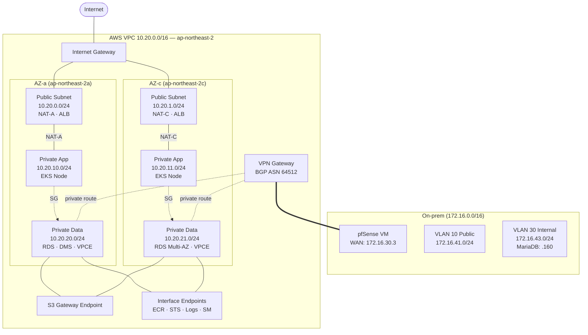
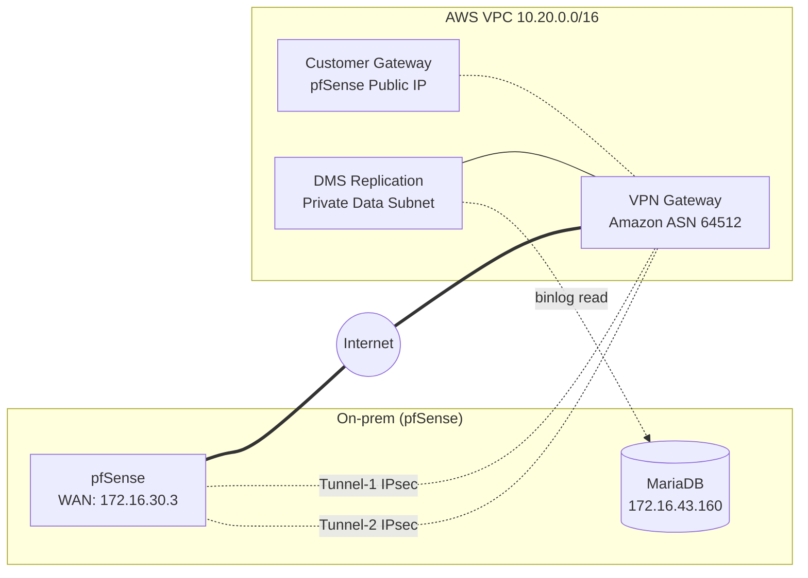
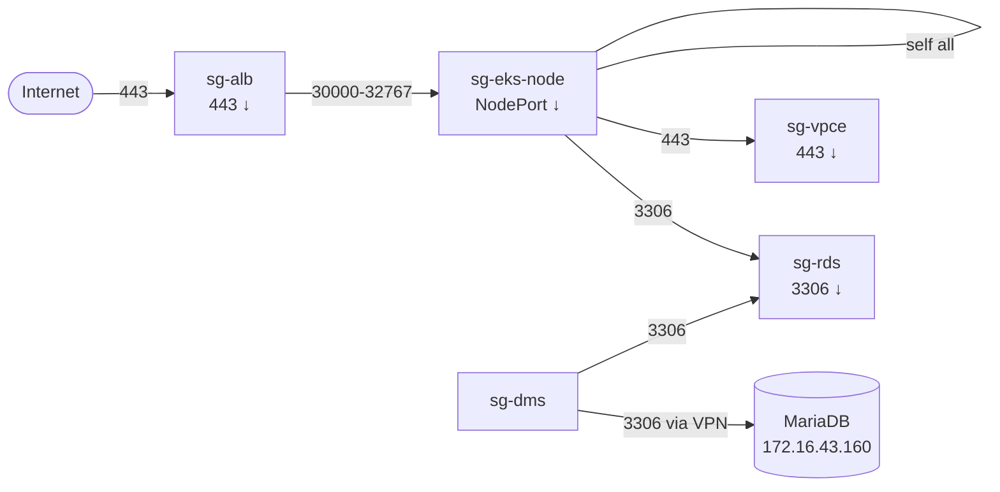
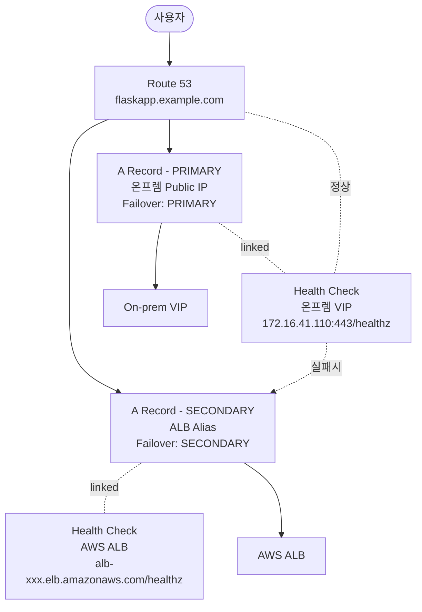

# 03-1. 네트워크 상세 구현 설계

> [03. 네트워크](./aws-dr-architecture.md#3-네트워크-vpc--subnet--sg--vpn)의 후속 문서. 각 구성 요소의 구체적인 설계값, 트래픽 매트릭스, Terraform 모듈 구조까지 다룬다.

## 목차

- [1. 전체 네트워크 토폴로지](#1-전체-네트워크-토폴로지)
- [2. VPC / Subnet 상세 설계](#2-vpc--subnet-상세-설계)
- [3. Route Table & NAT 구성](#3-route-table--nat-구성)
- [4. Site-to-Site VPN (IPsec)](#4-site-to-site-vpn-ipsec)
- [5. VPC Endpoints (사설 경로)](#5-vpc-endpoints-사설-경로)
- [6. Security Group 매트릭스](#6-security-group-매트릭스)
- [7. Route 53 Failover](#7-route-53-failover)
- [8. Terraform 모듈 구조](#8-terraform-모듈-구조)
- [9. 검증 체크리스트](#9-검증-체크리스트)

---

## 1. 전체 네트워크 토폴로지



**핵심 원칙**

1. **3-tier 계층**: Public(인터넷 노출) / Private App(EKS) / Private Data(RDS·DMS) 명확히 분리
2. **2-AZ 다중화**: 모든 계층을 AZ-a, AZ-c에 동일 배치 (NAT도 AZ별로)
3. **NAT-free 경로 최대화**: VPC Endpoint로 AWS 서비스 통신은 사설망 내부에서 처리
4. **Inbound 진입점 최소화**: 평시엔 IGW로 들어오는 트래픽 없음 (`dr_active=false`에선 ALB도 없음), VPN은 Outbound DMS만

---

## 2. VPC / Subnet 상세 설계

### 2.1 CIDR 할당

| 구분 | CIDR | IP 범위 | 가용 IP | 비고 |
|---|---|---|---|---|
| VPC | `10.20.0.0/16` | `10.20.0.0` ~ `10.20.255.255` | 65,531 | 향후 확장 여유 |
| Public-a | `10.20.0.0/24` | `10.20.0.4` ~ `10.20.0.254` | 251 | NAT-A, ALB |
| Public-c | `10.20.1.0/24` | `10.20.1.4` ~ `10.20.1.254` | 251 | NAT-C, ALB |
| App-a | `10.20.10.0/24` | `10.20.10.4` ~ `10.20.10.254` | 251 | EKS Worker |
| App-c | `10.20.11.0/24` | `10.20.11.4` ~ `10.20.11.254` | 251 | EKS Worker |
| Data-a | `10.20.20.0/24` | `10.20.20.4` ~ `10.20.20.254` | 251 | RDS, DMS, VPCE |
| Data-c | `10.20.21.0/24` | `10.20.21.4` ~ `10.20.21.254` | 251 | RDS Standby, VPCE |

> ℹ️ AWS는 각 서브넷의 처음 4개 IP(`.0~.3`)와 마지막 IP(`.255`)를 예약함. 실사용 가능 IP는 `/24` 기준 251개.

### 2.2 CIDR 충돌 검증

총괄 문서 "구축 전 확인 사항" 준수:

| 대역 | 사용처 | 충돌 여부 |
|---|---|---|
| `10.20.0.0/16` | **AWS VPC (이 설계)** | — |
| `172.16.30.0/24` | 온프렘 관리망 | ✅ 안전 |
| `172.16.41-44.0/24` | 온프렘 VLAN 10~40 | ✅ 안전 |
| `10.10.10.0/24` | 온프렘 Ceph storage | ✅ 안전 |
| `10.244.0.0/16` | K8s Pod CIDR | ✅ 안전 |
| `10.96.0.0/12` | K8s Service CIDR | ✅ 안전 |

### 2.3 Terraform 코드 발췌

```hcl
# modules/network/vpc.tf
resource "aws_vpc" "main" {
  cidr_block           = "10.20.0.0/16"
  enable_dns_support   = true
  enable_dns_hostnames = true   # VPC Endpoint Private DNS에 필수

  tags = {
    Name = "vpc-kosa-project-jh"
  }
}

locals {
  azs = ["ap-northeast-2a", "ap-northeast-2c"]
  subnets = {
    public  = ["10.20.0.0/24",  "10.20.1.0/24"]
    app     = ["10.20.10.0/24", "10.20.11.0/24"]
    data    = ["10.20.20.0/24", "10.20.21.0/24"]
  }
}

resource "aws_subnet" "public" {
  count                   = 2
  vpc_id                  = aws_vpc.main.id
  cidr_block              = local.subnets.public[count.index]
  availability_zone       = local.azs[count.index]
  map_public_ip_on_launch = false  # ALB는 ENI에 EIP 별도 할당

  tags = {
    Name                                        = "public-${local.azs[count.index]}"
    "kubernetes.io/role/elb"                    = "1"   # ALB Ingress 자동 인식
  }
}

resource "aws_subnet" "app" {
  count             = 2
  vpc_id            = aws_vpc.main.id
  cidr_block        = local.subnets.app[count.index]
  availability_zone = local.azs[count.index]

  tags = {
    Name                                        = "app-${local.azs[count.index]}"
    "kubernetes.io/role/internal-elb"           = "1"
  }
}
```

> ⚠️ EKS는 서브넷 태그(`kubernetes.io/role/elb`, `internal-elb`)로 ALB 배치 위치를 자동 인식한다. **누락 시 ALB Ingress Controller가 서브넷을 찾지 못함**.

---

## 3. Route Table & NAT 구성

### 3.1 Route Table 매트릭스

| Route Table | 연결 서브넷 | 라우트 |
|---|---|---|
| **rt-public** | Public-a, Public-c | `0.0.0.0/0` → IGW<br/>`10.20.0.0/16` → local |
| **rt-app-a** | App-a | `0.0.0.0/0` → NAT-A<br/>`172.16.0.0/16` → VGW (운영자 SSH)<br/>`10.20.0.0/16` → local |
| **rt-app-c** | App-c | `0.0.0.0/0` → NAT-C<br/>`172.16.0.0/16` → VGW<br/>`10.20.0.0/16` → local |
| **rt-data-a** | Data-a | `172.16.43.160/32` → VGW (DMS Source 전용)<br/>`10.20.0.0/16` → local<br/>(0.0.0.0/0 라우트 없음 — 인터넷 차단) |
| **rt-data-c** | Data-c | (동일) |

**핵심 의도**

- **App 서브넷은 0.0.0.0/0이 NAT으로** → ECR Pull(VPCE 없으면), 외부 API 호출 가능
- **Data 서브넷엔 0.0.0.0/0 라우트 자체가 없음** → RDS/DMS는 인터넷에 절대 노출 안 됨
- **AZ별 NAT 분리** → 한쪽 AZ NAT 장애가 다른 AZ에 영향 없음
- **VGW 라우트는 Data 서브넷에 `172.16.43.160/32`만** → 온프렘 전체 LAN을 열지 않고 MariaDB 호스트 1개만 허용

### 3.2 NAT Gateway

```hcl
resource "aws_eip" "nat" {
  count  = 2
  domain = "vpc"
  tags = { Name = "eip-nat-${local.azs[count.index]}" }
}

resource "aws_nat_gateway" "this" {
  count         = 2
  allocation_id = aws_eip.nat[count.index].id
  subnet_id     = aws_subnet.public[count.index].id

  tags = { Name = "nat-${local.azs[count.index]}" }

  depends_on = [aws_internet_gateway.this]
}
```

**비용 절감 옵션**

| 옵션 | 월 비용 | 트레이드오프 |
|---|---|---|
| NAT × 2 (권장) | ~$70 + 데이터 | AZ 장애 격리 |
| NAT × 1 | ~$35 + 데이터 | 단일 NAT 장애 시 전체 App AZ 영향 |
| NAT × 0 + VPCE 전부 | $0 (NAT) | ECR/외부 API 등 VPCE 미지원 트래픽 불가 |

> 💡 **현실적 선택**: 평시엔 App 노드가 0대이므로 NAT 사용량은 거의 없음. `dr_active=true` 일 때만 NAT 트래픽 발생. NAT × 1로 시작해도 무방.

---

## 4. Site-to-Site VPN (IPsec)

### 4.1 토폴로지



### 4.2 설계값

| 항목 | 값 | 이유 |
|---|---|---|
| Tunnel 수 | 2개 (Active-Active) | AWS 기본 제공, 한쪽 장애 시 자동 절체 |
| 인증 방식 | PSK (Pre-Shared Key) | 단순, pfSense 기본 지원 |
| 암호화 | AES-256, SHA-256, DH Group 14 | Phase 2 PFS 활성화 권장 |
| 라우팅 | **BGP 동적 라우팅** | 정적 대비 라우트 자동 갱신, 장애 전환 빠름 |
| AWS BGP ASN | 64512 (기본값) | private ASN 범위 |
| pfSense BGP ASN | 65000 (예시) | private ASN, 충돌 없는 값 |
| MTU | 1436 (IPsec 오버헤드 반영) | 1500 기본에서 IPsec 오버헤드 64바이트 차감 |

### 4.3 트래픽 방향

**중요**: VPN은 본 설계에서 **DMS → 온프렘 MariaDB read** 방향만 사용. 양방향은 트래픽이 거의 없음.

| 방향 | 트래픽 | 빈도 |
|---|---|---|
| AWS → 온프렘 | DMS가 MariaDB binlog 읽기 (3306/TCP) | 상시, 분당 수 MB |
| AWS → 온프렘 | 운영자 SSH/kubectl (Bastion 경유) | 운영 시점 |
| 온프렘 → AWS | (DR 훈련 시) AWS 리소스 헬스체크 | 비정기 |

> 📌 정상 운영 시 App → S3 트래픽은 **VPN을 거치지 않음**. 온프렘 K8s가 인터넷 경유로 직접 AWS S3 endpoint에 접근 (HTTPS).

### 4.4 Terraform 코드 발췌

```hcl
# modules/network/vpn.tf
resource "aws_vpn_gateway" "this" {
  vpc_id          = aws_vpc.main.id
  amazon_side_asn = 64512
  tags = { Name = "vgw-kosa-project-jh" }
}

resource "aws_customer_gateway" "pfsense" {
  bgp_asn    = 65000
  ip_address = var.pfsense_public_ip   # 온프렘 WAN의 공인 IP
  type       = "ipsec.1"
  tags = { Name = "cgw-pfsense-kosa-project-jh" }
}

resource "aws_vpn_connection" "main" {
  vpn_gateway_id      = aws_vpn_gateway.this.id
  customer_gateway_id = aws_customer_gateway.pfsense.id
  type                = "ipsec.1"
  static_routes_only  = false   # BGP 동적 라우팅 사용

  tunnel1_phase1_encryption_algorithms = ["AES256"]
  tunnel1_phase1_integrity_algorithms  = ["SHA2-256"]
  tunnel1_phase1_dh_group_numbers      = [14]
  tunnel1_phase2_encryption_algorithms = ["AES256"]
  tunnel1_phase2_integrity_algorithms  = ["SHA2-256"]
  tunnel1_phase2_dh_group_numbers      = [14]

  tags = { Name = "vpn-kosa-project-jh" }
}

# Data 서브넷의 Route Table만 VGW propagation 허용
resource "aws_vpn_gateway_route_propagation" "data" {
  count          = 2
  vpn_gateway_id = aws_vpn_gateway.this.id
  route_table_id = aws_route_table.data[count.index].id
}
```

### 4.5 pfSense 측 설정 체크리스트

- [ ] WAN 공인 IP 고정 (DHCP 변경 시 VPN 끊김)
- [ ] IPsec Phase 1/2 파라미터를 AWS 다운로드 config와 일치
- [ ] BGP 데몬(FRR 또는 OpenBGPD 패키지) 설치
- [ ] 광고할 prefix: `172.16.43.160/32`만 (전체 LAN 광고 X)
- [ ] 방화벽 룰: IPsec 인터페이스에서 `10.20.20.0/23 → 172.16.43.160:3306` 허용

---

## 5. VPC Endpoints (사설 경로)

### 5.1 두 가지 타입 비교

| 타입 | 동작 | 비용 | 적용 서비스 |
|---|---|---|---|
| **Gateway** | Route Table에 prefix list 자동 추가, 무료 | $0 + 데이터 무료 | S3, DynamoDB |
| **Interface** | 서브넷에 ENI 생성, Private DNS로 hostname 가로채기 | 시간당 ~$0.01 × AZ × 개수 + 데이터 처리 | 그 외 대부분 |

### 5.2 본 설계 적용 Endpoint

| 서비스 | 타입 | 적용 사유 | 비고 |
|---|---|---|---|
| **S3** | Gateway | `flaskapp-proddata-...`, `flaskapp-tfstate-...` 접근. NAT 절약 효과 큼 | Route Table에 prefix 자동 추가 |
| **DynamoDB** | Gateway | `terraform-state-lock` 접근 | Terraform apply 시마다 호출 |
| **ECR API** | Interface | EKS 노드의 이미지 메타데이터 조회 | `ecr.api` |
| **ECR DKR** | Interface | 실제 이미지 레이어 다운로드 | `ecr.dkr` |
| **STS** | Interface | IRSA 토큰 교환 | 모든 IRSA Pod가 호출 |
| **CloudWatch Logs** | Interface | Fluent Bit이 로그 전송 시 | 로그 볼륨 크면 NAT 비용 절감 큼 |
| **Secrets Manager** | Interface | External Secrets Operator | DB 자격증명 조회 |
| **EC2** | Interface (선택) | AWS Load Balancer Controller | API 호출량 적으면 생략 |

### 5.3 Gateway Endpoint 구성

```hcl
# modules/network/vpc_endpoints.tf
resource "aws_vpc_endpoint" "s3" {
  vpc_id            = aws_vpc.main.id
  service_name      = "com.amazonaws.${var.region}.s3"
  vpc_endpoint_type = "Gateway"
  route_table_ids   = concat(
    aws_route_table.app[*].id,
    aws_route_table.data[*].id,
  )

  tags = { Name = "vpce-s3-kosa-project-jh" }
}

resource "aws_vpc_endpoint" "dynamodb" {
  vpc_id            = aws_vpc.main.id
  service_name      = "com.amazonaws.${var.region}.dynamodb"
  vpc_endpoint_type = "Gateway"
  route_table_ids   = aws_route_table.app[*].id

  tags = { Name = "vpce-ddb-kosa-project-jh" }
}
```

### 5.4 Interface Endpoint 구성

```hcl
locals {
  interface_endpoints = [
    "ecr.api",
    "ecr.dkr",
    "sts",
    "logs",
    "secretsmanager",
  ]
}

resource "aws_security_group" "vpce" {
  name        = "sg-vpce-kosa-project-jh"
  description = "Allow 443 from VPC CIDR to Interface Endpoints"
  vpc_id      = aws_vpc.main.id

  ingress {
    from_port   = 443
    to_port     = 443
    protocol    = "tcp"
    cidr_blocks = [aws_vpc.main.cidr_block]
  }
}

resource "aws_vpc_endpoint" "interface" {
  for_each = toset(local.interface_endpoints)

  vpc_id              = aws_vpc.main.id
  service_name        = "com.amazonaws.${var.region}.${each.key}"
  vpc_endpoint_type   = "Interface"
  subnet_ids          = aws_subnet.data[*].id
  security_group_ids  = [aws_security_group.vpce.id]
  private_dns_enabled = true   # 핵심: 기본 hostname을 자동으로 가로챔

  tags = { Name = "vpce-${each.key}-kosa-project-jh" }
}
```

### 5.5 Private DNS의 동작

`private_dns_enabled = true`가 설정되면:

- `ecr.ap-northeast-2.amazonaws.com` 호출 시 → VPC 내부 DNS가 Endpoint ENI의 사설 IP로 응답
- App 코드/SDK는 평소 사용하던 endpoint hostname을 **그대로 사용** (코드 수정 불필요)
- NAT/IGW를 거치지 않고 ENI로 직행

> ⚠️ **`enable_dns_hostnames = true`가 VPC에 켜져 있어야 동작**. (위 VPC 코드에 포함됨)

---

## 6. Security Group 매트릭스

### 6.1 전체 트래픽 흐름표

| # | 출발지 SG | 목적지 SG | 포트 | 프로토콜 | 목적 |
|---|---|---|---|---|---|
| 1 | `0.0.0.0/0` | `sg-alb` | 80, 443 | TCP | 사용자 HTTPS 접근 |
| 2 | `sg-alb` | `sg-eks-node` | 30000-32767 | TCP | ALB → NodePort 헬스체크 + 트래픽 |
| 3 | `sg-eks-node` | `sg-eks-node` | All | All | Pod 간 통신 (CNI) |
| 4 | `sg-eks-node` | `sg-rds` | 3306 | TCP | App → RDS |
| 5 | `sg-eks-node` | `sg-vpce` | 443 | TCP | ECR, STS, Logs, SM Endpoint |
| 6 | `sg-eks-node` | `0.0.0.0/0` | 443 | TCP | 외부 API 호출 (NAT 경유) |
| 7 | `sg-dms` | `172.16.43.160/32` | 3306 | TCP | DMS → 온프렘 MariaDB (VPN) |
| 8 | `sg-dms` | `sg-rds` | 3306 | TCP | DMS → RDS |
| 9 | VPC CIDR | `sg-vpce` | 443 | TCP | VPC 내부 → Interface Endpoint |
| 10 | (SSM 전용) | `sg-eks-node` | — | — | SSM Session Manager로 노드 진입 (포트 불필요) |

### 6.2 다이어그램



### 6.3 SG 작성 원칙

1. **CIDR이 아니라 SG 참조**: `cidr_blocks = ["10.20.10.0/24"]` 대신 `source_security_group_id = sg-alb`. 서브넷 확장 시 룰 수정 불필요.
2. **0.0.0.0/0은 ALB 인바운드와 NAT 향 아웃바운드에만**: 그 외 SG는 항상 SG-to-SG.
3. **SSH 인바운드 금지**: SSM Session Manager로만 노드 접근. `sg-eks-node`에 22번 포트 인바운드 룰 없음.
4. **Egress는 좁히지 않음**: AWS 기본은 `0.0.0.0/0 all allow`. App 노드는 NAT/VPCE로 외부 호출이 필요하므로 좁히지 말 것 (좁히면 디버깅만 어려워짐).

### 6.4 Terraform 코드 발췌

```hcl
# modules/security/sg.tf
resource "aws_security_group" "alb" {
  name        = "sg-alb-kosa-project-jh"
  description = "ALB ingress from Internet"
  vpc_id      = var.vpc_id

  ingress {
    from_port   = 443
    to_port     = 443
    protocol    = "tcp"
    cidr_blocks = ["0.0.0.0/0"]
    description = "HTTPS"
  }

  ingress {
    from_port   = 80
    to_port     = 80
    protocol    = "tcp"
    cidr_blocks = ["0.0.0.0/0"]
    description = "HTTP redirect to HTTPS"
  }

  egress {
    from_port   = 0
    to_port     = 0
    protocol    = "-1"
    cidr_blocks = ["0.0.0.0/0"]
  }
}

resource "aws_security_group" "eks_node" {
  name        = "sg-eks-node-kosa-project-jh"
  description = "EKS worker nodes"
  vpc_id      = var.vpc_id
}

resource "aws_security_group_rule" "node_from_alb" {
  type                     = "ingress"
  from_port                = 30000
  to_port                  = 32767
  protocol                 = "tcp"
  source_security_group_id = aws_security_group.alb.id
  security_group_id        = aws_security_group.eks_node.id
  description              = "ALB to NodePort"
}

resource "aws_security_group_rule" "node_self" {
  type                     = "ingress"
  from_port                = 0
  to_port                  = 0
  protocol                 = "-1"
  source_security_group_id = aws_security_group.eks_node.id
  security_group_id        = aws_security_group.eks_node.id
  description              = "Pod to Pod (CNI)"
}

resource "aws_security_group_rule" "rds_from_node" {
  type                     = "ingress"
  from_port                = 3306
  to_port                  = 3306
  protocol                 = "tcp"
  source_security_group_id = aws_security_group.eks_node.id
  security_group_id        = aws_security_group.rds.id
  description              = "App to RDS"
}
```

> 💡 **순환 참조 회피**: SG 룰을 별도의 `aws_security_group_rule` 리소스로 분리하면 SG A↔B 상호 참조 가능. inline `ingress`/`egress`로 쓰면 순환 에러 발생.

---

## 7. Route 53 Failover

### 7.1 동작 원리



### 7.2 설계값

| 항목 | 값 | 이유 |
|---|---|---|
| Record Type | A (Alias for ALB) | ALB는 IP가 바뀔 수 있으므로 Alias 사용 |
| **TTL** | **60초** | 총괄 문서 권장값. 30~60초 범위 |
| Health Check Interval | 30초 | 기본값 (10초로 줄이면 비용 3배) |
| Health Check Threshold | 3회 연속 실패 | 90초 내 감지 (false positive 방지) |
| Health Check 경로 | `/healthz` (HTTPS) | App 자체 헬스 + DB 연결 확인하는 엔드포인트 권장 |
| Routing Policy | Failover (Active-Passive) | Primary 실패 시에만 Secondary로 |
| Evaluate Target Health | true | ALB 자체 헬스도 체크 (이중 안전장치) |

### 7.3 Health Check 엔드포인트 권장 구현

```python
# Flask app의 /healthz 엔드포인트 (예시)
@app.route("/healthz")
def healthz():
    try:
        # DB ping
        db.session.execute("SELECT 1")
        # S3 head bucket
        s3.head_bucket(Bucket=PHOTOS_BUCKET)
        return {"status": "ok"}, 200
    except Exception as e:
        return {"status": "fail", "error": str(e)}, 503
```

> ⚠️ **너무 무거운 헬스체크 금지**: DB 한 번 ping이면 충분. 복잡한 쿼리를 넣으면 Route53 false negative로 의도치 않은 Failover 발생.

### 7.4 Terraform 코드 발췌

```hcl
# modules/route53/failover.tf
data "aws_route53_zone" "main" {
  name = var.domain_name   # 예: example.com
}

# Primary: 온프렘 VIP
resource "aws_route53_health_check" "onprem" {
  fqdn              = var.onprem_public_hostname   # 예: onprem.flaskapp.example.com
  port              = 443
  type              = "HTTPS"
  resource_path     = "/healthz"
  failure_threshold = 3
  request_interval  = 30

  tags = { Name = "hc-onprem-kosa-project-jh" }
}

resource "aws_route53_record" "primary" {
  zone_id = data.aws_route53_zone.main.zone_id
  name    = "flaskapp"
  type    = "A"
  ttl     = 60
  records = [var.onprem_public_ip]

  set_identifier  = "primary-onprem"
  health_check_id = aws_route53_health_check.onprem.id

  failover_routing_policy {
    type = "PRIMARY"
  }
}

# Secondary: AWS ALB (dr_active=true일 때만 생성)
resource "aws_route53_record" "secondary" {
  count   = var.dr_active ? 1 : 0
  zone_id = data.aws_route53_zone.main.zone_id
  name    = "flaskapp"
  type    = "A"

  alias {
    name                   = var.alb_dns_name
    zone_id                = var.alb_zone_id
    evaluate_target_health = true
  }

  set_identifier = "secondary-aws"
  failover_routing_policy {
    type = "SECONDARY"
  }
}
```

### 7.5 Failover 시나리오별 동작

| 시나리오 | 결과 |
|---|---|
| Primary HC 정상 + Secondary 존재 | → Primary로 라우팅 |
| Primary HC 3회 연속 실패 | → Secondary로 자동 전환 (TTL 60초 내) |
| Primary HC 정상 + Secondary 없음 (`dr_active=false`) | → Primary만 응답 |
| Primary HC 실패 + Secondary 없음 | → Primary 응답 (Failover 대상 없음) — **위험 상황** |

> 📌 **운영 주의**: `dr_active=false`로 Secondary 레코드 자체가 없는 상태에선 Failover가 동작하지 않음. 평시에도 Secondary 레코드 골격은 유지(트래픽 0)하고, EKS만 생성하는 방식으로 변경할지 검토 필요.

---

## 8. Terraform 모듈 구조

### 8.1 디렉토리

```
terraform/modules/network/
├── README.md
├── versions.tf          # provider 버전 제약
├── variables.tf         # 입력 변수
├── outputs.tf           # vpc_id, subnet_ids, route_table_ids 등
├── vpc.tf               # VPC + IGW
├── subnet.tf            # 6개 서브넷
├── nat.tf               # EIP × 2, NAT × 2
├── route_table.tf       # 5개 RT + association
├── vpn.tf               # VGW, CGW, VPN Connection
├── vpc_endpoints.tf     # Gateway × 2, Interface × 5
└── locals.tf            # AZ, CIDR 매핑
```

### 8.2 모듈 인터페이스

```hcl
# modules/network/variables.tf
variable "vpc_cidr" {
  type    = string
  default = "10.20.0.0/16"
}

variable "azs" {
  type    = list(string)
  default = ["ap-northeast-2a", "ap-northeast-2c"]
}

variable "pfsense_public_ip" {
  type        = string
  description = "온프렘 pfSense WAN의 공인 IP"
}

variable "onprem_db_ip" {
  type        = string
  default     = "172.16.43.160"
  description = "DMS Source MariaDB의 사설 IP (VPN 너머)"
}

variable "enable_nat" {
  type    = number
  default = 2
  description = "NAT Gateway 개수 (0, 1, 2). 비용 최적화용"
}

# modules/network/outputs.tf
output "vpc_id"           { value = aws_vpc.main.id }
output "public_subnet_ids" { value = aws_subnet.public[*].id }
output "app_subnet_ids"    { value = aws_subnet.app[*].id }
output "data_subnet_ids"   { value = aws_subnet.data[*].id }
output "vgw_id"            { value = aws_vpn_gateway.this.id }
output "nat_gateway_ids"   { value = aws_nat_gateway.this[*].id }
```

### 8.3 envs/dr/main.tf에서 호출

```hcl
module "network" {
  source = "../../modules/network"

  vpc_cidr          = "10.20.0.0/16"
  azs               = ["ap-northeast-2a", "ap-northeast-2c"]
  pfsense_public_ip = var.pfsense_public_ip
  enable_nat        = 2
}

module "security" {
  source = "../../modules/security"
  vpc_id = module.network.vpc_id
  vpc_cidr = "10.20.0.0/16"
}
```

---

## 9. 검증 체크리스트

### Phase 1: VPC/Subnet 검증

- [ ] `aws ec2 describe-vpcs` 로 CIDR `10.20.0.0/16` 확인
- [ ] 6개 서브넷이 의도한 AZ에 분배됐는지 확인
- [ ] 서브넷 태그(`kubernetes.io/role/elb`) 누락 없음

### Phase 2: 라우팅 검증

- [ ] Public 서브넷 RT에 `0.0.0.0/0 → IGW` 존재
- [ ] App 서브넷 RT에 `0.0.0.0/0 → NAT` 존재
- [ ] Data 서브넷 RT에 `0.0.0.0/0` **없음** (인터넷 차단 확인)
- [ ] Data 서브넷 RT에 `172.16.43.160/32 → VGW` 존재

### Phase 3: VPN 검증

- [ ] VPN Connection 상태 `available`
- [ ] 양쪽 Tunnel 모두 `UP` (한쪽만 UP은 redundancy 없음)
- [ ] BGP 세션 `Established`
- [ ] Data 서브넷에서 `nc -zv 172.16.43.160 3306` 성공 (EC2 임시 인스턴스로 테스트)

### Phase 4: VPC Endpoint 검증

- [ ] App 서브넷에서 `nslookup s3.ap-northeast-2.amazonaws.com` → VPC 내부 IP 반환
- [ ] App 서브넷에서 `nslookup api.ecr.ap-northeast-2.amazonaws.com` → ENI 사설 IP 반환
- [ ] VPC Flow Log에서 S3 트래픽이 NAT을 거치지 않는지 확인
- [ ] `aws s3 cp` 가 정상 동작 (Endpoint Policy로 막혀있지 않은지)

### Phase 5: Security Group 검증

- [ ] App 노드 → RDS 3306 성공
- [ ] App 노드 → 외부 80/443 (NAT 경유) 성공
- [ ] 외부 → RDS 3306 차단 (`nc` 타임아웃)
- [ ] App 노드 SSH 22번 외부에서 차단 확인

### Phase 6: Route 53 Failover 검증

- [ ] Health Check가 `/healthz` 정상 응답 시 `Healthy`
- [ ] 의도적으로 온프렘 VIP 차단 → 90초 내 `Unhealthy` 전환
- [ ] (DR 훈련 시) Secondary 레코드 활성화 후 DNS resolution이 ALB로 전환
- [ ] TTL 60초가 클라이언트 측에서도 준수되는지 (`dig +noall +answer`)

---

📎 상위: [03. 네트워크](./03-network.md) | 인덱스: [README](../../README.md)
