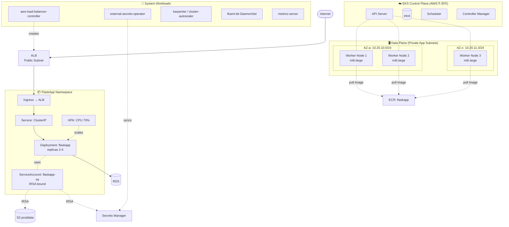
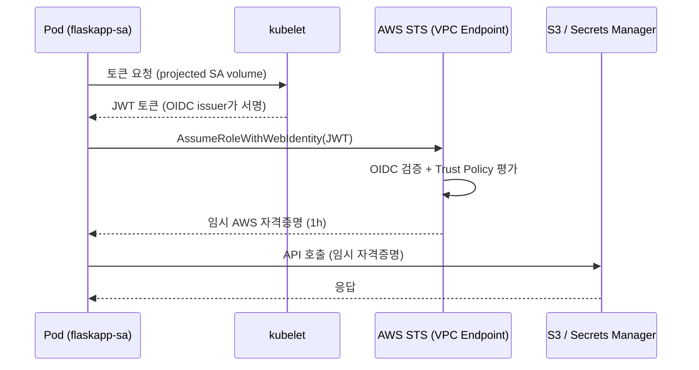
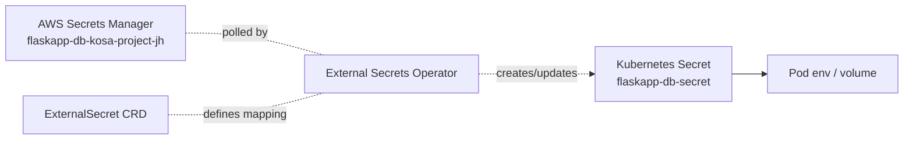
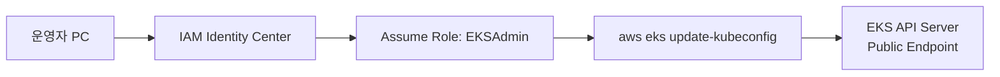

# 04-1. EKS 상세 구현 설계

> 이전 문서 `aws-dr-architecture.md`의 **4장 EKS 상세**를 더 깊이 다룹니다.

## 📌 한 줄 요약

> **AWS가 관리해주는 Kubernetes(EKS)를 만들고, 평소엔 노드 0대로 비워두다가 장애 시 3대로 띄웁니다. Pod에는 IRSA로 안전하게 AWS 권한을 주고, ALB가 자동으로 트래픽을 받게 합니다. 모든 게 Terraform과 Helm 한 번에 올라옵니다.**

## 목차

- [0. 이 문서 읽기 전에 알아둘 용어](#0-이-문서-읽기-전에-알아둘-용어)
- [1. 클러스터 전체 그림](#1-클러스터-전체-그림)
- [2. EKS Cluster 구성](#2-eks-cluster-구성)
- [3. Node Group — Pilot Light 핵심](#3-node-group--pilot-light-핵심)
- [4. Add-on 스택 — 클러스터의 부품들](#4-add-on-스택--클러스터의-부품들)
- [5. IRSA — Pod에게 AWS 권한을 안전하게 주기](#5-irsa--pod에게-aws-권한을-안전하게-주기)
- [6. Ingress (ALB Load Balancer Controller)](#6-ingress-alb-load-balancer-controller)
- [7. External Secrets Operator — Secret 자동 동기화](#7-external-secrets-operator--secret-자동-동기화)
- [8. 워크로드 배포 (FlaskApp)](#8-워크로드-배포-flaskapp)
- [9. 오토스케일링 (HPA / Karpenter)](#9-오토스케일링-hpa--karpenter)
- [10. 클러스터 접근 & 보안](#10-클러스터-접근--보안)
- [11. Terraform 모듈 구조](#11-terraform-모듈-구조)
- [12. 검증 체크리스트](#12-검증-체크리스트)

---

## 0. 이 문서 읽기 전에 알아둘 용어

### 0.1 Kubernetes 기본 용어

| 용어 | 한 줄 설명 |
|---|---|
| **Kubernetes (K8s)** | 컨테이너를 여러 서버에 묶어서 운영해주는 시스템 |
| **Pod** | K8s의 최소 실행 단위. 컨테이너 1개 이상이 같이 도는 묶음 |
| **Deployment** | "이 이미지로 Pod 몇 개 띄워줘"라는 선언 |
| **Service** | Pod 여러 개를 묶어서 하나의 가상 IP로 제공 |
| **Ingress** | 외부 트래픽을 클러스터 안 Service로 연결해주는 규칙 |
| **Namespace** | 클러스터 안의 가상 구역 (회사 안 부서처럼) |
| **ServiceAccount (SA)** | Pod가 가지고 다니는 신분증 |
| **ConfigMap / Secret** | 설정값 / 비밀값 저장소 |
| **Node** | Pod가 실제로 도는 서버 (EC2 인스턴스) |
| **Control Plane** | K8s의 두뇌 (API Server, etcd 등) |

### 0.2 EKS / AWS 관련 용어

| 용어 | 한 줄 설명 |
|---|---|
| **EKS** | AWS가 관리해주는 K8s. Control Plane을 AWS가 책임짐 |
| **Managed Node Group** | EKS가 패치/업데이트 자동 관리해주는 노드 그룹 |
| **OIDC Provider** | IRSA의 기반이 되는 인증 발급기 |
| **IRSA** | IAM Roles for Service Accounts. Pod의 SA에 IAM Role 묶기 |
| **CNI** | Pod에 IP 주소를 할당해주는 네트워크 플러그인 |
| **CoreDNS** | 클러스터 안 DNS 서버 |
| **kube-proxy** | Service의 IP를 진짜 Pod로 연결해주는 컴포넌트 |
| **EBS CSI Driver** | Pod가 EBS 디스크를 동적으로 받을 수 있게 해주는 드라이버 |
| **HPA** | Pod 개수를 자동으로 늘렸다 줄였다 |
| **Karpenter** | 노드 개수를 자동으로 늘렸다 줄였다 (Cluster Autoscaler 대안) |
| **ALB Controller** | Ingress 리소스를 보고 ALB를 자동 생성 |
| **External Secrets** | AWS Secrets Manager → K8s Secret 자동 동기화 |
| **SSM Session Manager** | SSH 없이 노드에 안전하게 접속하는 방법 |
| **IMDSv2** | EC2 메타데이터 서비스 v2. 보안 강화 버전 |

---

## 1. 클러스터 전체 그림

### 1.1 토폴로지



### 1.2 5가지 핵심 원칙

**1️⃣ Control Plane은 AWS가 관리**
- API Server, etcd 같은 두뇌 부분은 AWS가 알아서 패치/백업
- 우리는 노드(Worker)만 신경 쓰면 됨
- 비유: "주방장은 EKS가 고용한 사람, 우린 식자재(Pod)만 준비"

**2️⃣ Worker는 무조건 Private Subnet**
- 인터넷에 직접 노출 금지
- 외부 접근은 ALB(Public)를 거치도록

**3️⃣ Pilot Light 토글**
- `dr_active=false` → 클러스터 자체가 안 만들어짐 → **비용 $0**
- `dr_active=true` → Terraform이 클러스터 + 노드 + 모든 컴포넌트 한 번에 생성

**4️⃣ IRSA로 권한 격리**
- Node IAM Role엔 "노드 운영용 최소 권한"만
- 앱이 쓸 권한은 **Pod별 IRSA**로 분리
- 비유: 회사 사원증(Node Role) vs 부서별 출입 카드(Pod IRSA)

**5️⃣ Multi-AZ 강제**
- Worker가 한 AZ에만 몰리면 AZ 장애 시 전부 죽음
- AZ-a, AZ-c에 균등 분산

---

## 2. EKS Cluster 구성

### 2.1 기본 설계값

| 항목 | 값 | 이유 |
|---|---|---|
| 클러스터명 | `eks-flaskapp-kosa-project-jh` | 명명 규칙 준수 |
| EKS 버전 | **1.30** | 2026년 5월 기준 안정. 매년 1회 마이너 업그레이드 |
| Region | `ap-northeast-2` | 서울 |
| Subnet | App × 2 + Public × 2 | Control Plane ENI는 양쪽 다 사용 |
| Endpoint Public | **활성 + IP allowlist** | 운영자 kubectl 접근용 |
| Endpoint Private | **활성** | 노드 → API 통신은 사설망 |
| KMS Encryption | `alias/flaskapp-secrets-...` | K8s Secret이 etcd에 암호화 저장 |
| IP Family | IPv4 | IPv6는 운영 복잡도 증가 |
| Service IPv4 CIDR | `172.20.0.0/16` (기본) | VPC `10.20.0.0/16`과 충돌 없음 확인 |

> 💡 **Public + Private Endpoint 둘 다 켜는 이유**:
> - **Private**: 노드 ↔ API 통신은 사설망 사용 (보안 + 성능)
> - **Public + IP allowlist**: 운영자가 kubectl 쓸 때만 회사 IP에서 허용

### 2.2 Control Plane 로깅 5종

장애 디버깅과 보안 감사의 출발점. 모두 켜서 CloudWatch Logs로 전송:

| 로그 타입 | 무엇을 기록? |
|---|---|
| `api` | kubectl 명령, API 호출 |
| `audit` | 누가 무엇을 했는지 (보안 감사 필수) |
| `authenticator` | IAM ↔ K8s 인증 매핑 |
| `controllerManager` | Deployment/ReplicaSet 등 컨트롤러 동작 |
| `scheduler` | Pod가 어떤 노드에 갔는지 결정 로그 |

> ⚠️ **비용 주의**: CloudWatch Logs 비용을 유발 (월 ~$5~$20). **보존기간을 30일로 제한**하면 비용 통제 가능.

### 2.3 Terraform 코드

```hcl
# modules/eks/cluster.tf
resource "aws_eks_cluster" "this" {
  count    = var.dr_active ? 1 : 0
  name     = "eks-flaskapp-kosa-project-jh"
  version  = "1.30"
  role_arn = aws_iam_role.cluster.arn

  vpc_config {
    subnet_ids              = concat(var.app_subnet_ids, var.public_subnet_ids)
    endpoint_private_access = true
    endpoint_public_access  = true
    public_access_cidrs     = var.admin_allowed_cidrs  # 운영자 사무실 IP 등
    security_group_ids      = [aws_security_group.cluster.id]
  }

  encryption_config {
    provider {
      key_arn = var.kms_secrets_arn
    }
    resources = ["secrets"]
  }

  enabled_cluster_log_types = [
    "api", "audit", "authenticator",
    "controllerManager", "scheduler",
  ]

  tags = { Name = "eks-flaskapp-kosa-project-jh" }

  depends_on = [
    aws_iam_role_policy_attachment.cluster_policy,
    aws_cloudwatch_log_group.cluster,
  ]
}

resource "aws_cloudwatch_log_group" "cluster" {
  count             = var.dr_active ? 1 : 0
  name              = "/aws/eks/eks-flaskapp-kosa-project-jh/cluster"
  retention_in_days = 30
  kms_key_id        = var.kms_logs_arn
}
```

> 💡 **Log Group을 미리 만드는 이유**:
> EKS가 자동 생성하면 **보존기간이 무한대(영구)**로 잡힙니다 → 비용 폭탄.
> Terraform으로 30일 설정한 Log Group을 먼저 만들어두면 EKS가 그걸 재사용.

### 2.4 OIDC Provider — IRSA의 기반

IRSA를 쓰려면 **OIDC Provider**가 IAM에 등록되어 있어야 합니다. EKS 만든다고 자동으로 안 생기므로 명시적으로:

```hcl
data "tls_certificate" "eks" {
  count = var.dr_active ? 1 : 0
  url   = aws_eks_cluster.this[0].identity[0].oidc[0].issuer
}

resource "aws_iam_openid_connect_provider" "eks" {
  count           = var.dr_active ? 1 : 0
  client_id_list  = ["sts.amazonaws.com"]
  thumbprint_list = [data.tls_certificate.eks[0].certificates[0].sha1_fingerprint]
  url             = aws_eks_cluster.this[0].identity[0].oidc[0].issuer
}
```

> ⭐ **이거 없으면 IRSA 절대 동작 안 함**. 빈번한 함정 포인트.

---

## 3. Node Group — Pilot Light 핵심

### 3.1 핵심 트릭 — 평소엔 0대

| 항목 | 값 | 이유 |
|---|---|---|
| 이름 | `ng-flaskapp-primary` | |
| AMI Type | `AL2023_x86_64_STANDARD` | Amazon Linux 2023, EKS 1.30 권장 |
| Capacity Type | `ON_DEMAND` (기본) | Spot 혼합은 §3.4 참조 |
| Instance Type | `m6i.large` (2 vCPU / 8 GiB) | 온프렘 워커와 비슷한 메모리 |
| Disk Size | **50 GiB gp3** | EKS 기본 20GB는 이미지 캐시에 부족 |
| Subnet | App Subnet × 2 | Private Subnet 강제 |
| **min_size** | **0** | ⭐ Pilot Light 핵심: 평시 0 |
| **desired_size** | **0 (dr_active 시 3)** | |
| **max_size** | **10** | HPA가 노드까지 늘릴 여지 |
| Update Config | `max_unavailable = 33%` | 롤링 업데이트 시 한 번에 1/3까지 |
| Labels | `workload=flaskapp` | Pod의 nodeSelector용 |

> 🔑 **Pilot Light의 마법**:
> `min_size = 0, desired_size = 0` → 평시엔 EC2 비용 $0
> Terraform 변수 `dr_active = true` → `desired_size = 3` → 3대 부팅 (몇 분 내)

### 3.2 Launch Template — 노드 OS 설정

노드를 만들 때 적용할 부팅 설정:

```hcl
resource "aws_launch_template" "node" {
  name_prefix = "eks-node-flaskapp-"

  block_device_mappings {
    device_name = "/dev/xvda"
    ebs {
      volume_size = 50
      volume_type = "gp3"
      encrypted   = true
      kms_key_id  = var.kms_ebs_arn
    }
  }

  metadata_options {
    http_tokens                 = "required"   # ⭐ IMDSv2 강제
    http_put_response_hop_limit = 2            # Pod에서 IMDS 호출 허용
    http_endpoint               = "enabled"
  }

  tag_specifications {
    resource_type = "instance"
    tags = {
      Name                                                 = "eks-node-flaskapp"
      "kubernetes.io/cluster/eks-flaskapp-kosa-project-jh" = "owned"
    }
  }
}
```

> ⚠️ **IMDSv2 강제는 필수**:
> IMDSv1은 SSRF(서버사이드 요청 위조) 공격에 노출됩니다. 공격자가 Pod 안에서 EC2 메타데이터를 훔쳐서 노드의 IAM 권한을 탈취할 수 있어요. **`http_tokens = "required"` 절대 잊지 마세요.**

### 3.3 Node Group Terraform 코드

```hcl
# modules/eks/nodegroup.tf
resource "aws_eks_node_group" "primary" {
  count           = var.dr_active ? 1 : 0
  cluster_name    = aws_eks_cluster.this[0].name
  node_group_name = "ng-flaskapp-primary"
  node_role_arn   = aws_iam_role.node.arn
  subnet_ids      = var.app_subnet_ids

  scaling_config {
    desired_size = var.node_desired_size   # 변수로 토글 (예: 3)
    min_size     = 0
    max_size     = 10
  }

  update_config {
    max_unavailable_percentage = 33
  }

  launch_template {
    id      = aws_launch_template.node.id
    version = aws_launch_template.node.latest_version
  }

  labels = {
    workload = "flaskapp"
  }

  # 노드 교체 시 desired_size 변경은 무시 (HPA/Karpenter가 관리)
  lifecycle {
    ignore_changes = [scaling_config[0].desired_size]
  }

  depends_on = [
    aws_iam_role_policy_attachment.node_worker,
    aws_iam_role_policy_attachment.node_cni,
    aws_iam_role_policy_attachment.node_ecr,
  ]
}
```

> 💡 **`ignore_changes = [scaling_config[0].desired_size]`가 중요**:
> HPA/Karpenter가 노드 개수를 동적으로 조정하는데, Terraform이 매번 "원래 3대였잖아!"라고 되돌리면 충돌. **운영 중 변경은 무시하라**고 알려주는 설정.

### 3.4 Spot + On-Demand 혼합

비용 줄이려면 Spot 인스턴스 섞을 수 있지만, DR엔 부적합:

| 전략 | 비용 절감 | 위험 |
|---|---|---|
| All On-Demand (권장) | 0% (기준) | 없음 |
| 70/30 혼합 | ~50% | Spot 중단 시 일시 가용성 저하 |
| All Spot | ~70% | DR 환경에 부적합 (예측 불가) |

> 💡 **DR엔 On-Demand 강력 권장**.
> 진짜 장애 났는데 "AWS에 Spot 인스턴스가 없어요" 하면 DR이 무의미. Spot은 평시 개발/스테이징용으로.

### 3.5 노드 부팅 시간 줄이기 (RTO 단축)

| 최적화 | 효과 | 방법 |
|---|---|---|
| **사전 AMI 빌드** | 30~60초 단축 | EKS Optimized AMI + 자주 쓰는 패키지/이미지 사전 cache |
| **VPC Endpoint** | ECR Pull 빠름 | (이미 적용, §03-1 참조) |
| **Capacity Reservation** | 인스턴스 부족 회피 | ODCR 1~2대 잡아둠 (월 $50 추가) |
| **Karpenter** | NodeGroup보다 빠른 프로비저닝 | §9 참조 |

---

## 4. Add-on 스택 — 클러스터의 부품들

### 4.1 EKS 관리형 Add-on (필수 4종)

EKS가 직접 버전 관리해주는 Add-on. 거의 모든 클러스터에 필수:

| Add-on | 역할 | 비유 |
|---|---|---|
| **VPC CNI** | Pod에 IP 할당 (Secondary IP 방식) | 클러스터의 "랜카드 매니저" |
| **CoreDNS** | 클러스터 내부 DNS | 클러스터의 "전화번호부" |
| **kube-proxy** | Service iptables 룰 | 클러스터의 "교환원" |
| **EBS CSI Driver** | EBS PV 동적 프로비저닝 | 클러스터의 "디스크 자판기" |

Terraform 예시 (VPC CNI):

```hcl
resource "aws_eks_addon" "vpc_cni" {
  count                       = var.dr_active ? 1 : 0
  cluster_name                = aws_eks_cluster.this[0].name
  addon_name                  = "vpc-cni"
  addon_version               = "v1.18.0-eksbuild.1"   # EKS 1.30 호환
  resolve_conflicts_on_create = "OVERWRITE"
  resolve_conflicts_on_update = "OVERWRITE"

  # VPC CNI 자체에도 IRSA 부여 (Secondary IP 할당 권한)
  service_account_role_arn = aws_iam_role.vpc_cni.arn
}
```

### 4.2 Helm으로 설치하는 Add-on

EKS가 안 주는, 추가로 설치해야 하는 컴포넌트들:

| Add-on | 무엇을 하나? |
|---|---|
| `aws-load-balancer-controller` | Ingress → ALB 자동 생성 (§6) |
| `external-secrets-operator` | Secrets Manager → K8s Secret 동기화 (§7) |
| `karpenter` 또는 `cluster-autoscaler` | 노드 자동 확장 (§9) |
| `metrics-server` | HPA가 쓸 메트릭 수집 (필수 의존성) |
| `fluent-bit` | Pod 로그 → CloudWatch Logs (DaemonSet) |

### 4.3 VPC CNI 튜닝 (선택)

기본 VPC CNI는 노드당 사용 가능 IP가 제한됨 (`m6i.large`는 ENI 3개 × IP 9개 = **27개**).

| 옵션 | 효과 | 언제 쓰나? |
|---|---|---|
| **Prefix Delegation** | 노드당 IP 9 → **432개** 확장 | Pod 밀도가 높을 때 |
| **Custom Networking** | Pod를 다른 서브넷 CIDR로 분리 | App 서브넷 IP 고갈 시 |
| **WARM_ENI_TARGET** | 노드에 사전에 ENI 부착 | Pod 부팅 속도 향상 |

> 💡 **FlaskApp 규모(Pod 수십 개)면 기본 설정으로 충분**. 100개 이상이면 Prefix Delegation 검토.

---

## 5. IRSA — Pod에게 AWS 권한을 안전하게 주기

### 5.1 IRSA가 푸는 문제

**문제**: Pod가 S3에 파일을 올리고 싶음. AWS 권한이 필요.

**나쁜 방법들:**
- 🚫 액세스 키를 Pod 환경변수에 박기 → 노출 위험, 회전 어려움
- 🚫 Node Role에 모든 권한 주기 → 같은 노드의 다른 Pod도 다 쓸 수 있음 (권한 누수)

**좋은 방법 — IRSA:**
- ✅ Pod의 ServiceAccount에 IAM Role을 묶음
- ✅ AWS SDK가 자동으로 OIDC 토큰 → STS AssumeRole → 임시 자격증명 (1시간 유효)
- ✅ Pod마다 다른 권한 가능

### 5.2 동작 시퀀스



핵심 메커니즘 한 줄: **Pod의 SA에 IAM Role을 annotation으로 묶고, AWS SDK가 자동으로 OIDC 토큰 ↔ STS AssumeRole을 처리**.

### 5.3 Role 목록

| Role | 어느 SA에 묶나? | 주요 권한 |
|---|---|---|
| `eks-irsa-flaskapp` | `flaskapp/flaskapp-sa` | S3 R/W, KMS Decrypt, Secrets Read |
| `eks-irsa-albc` | `kube-system/aws-load-balancer-controller` | ELB/EC2/ACM 일부 |
| `eks-irsa-eso` | `external-secrets/external-secrets` | Secrets Manager Read, KMS Decrypt |
| `eks-irsa-karpenter` | `karpenter/karpenter` | EC2 RunInstances/Terminate, IAM PassRole |
| `eks-irsa-vpc-cni` | `kube-system/aws-node` | EC2 Secondary IP 할당 |
| `eks-irsa-cluster-autoscaler` | `kube-system/cluster-autoscaler` | ASG DescribeAutoScalingGroups/SetDesiredCapacity |

### 5.4 Trust Policy 템플릿

```json
{
  "Version": "2012-10-17",
  "Statement": [{
    "Effect": "Allow",
    "Principal": {
      "Federated": "arn:aws:iam::<ACCOUNT_ID>:oidc-provider/<OIDC_ISSUER_HOST>"
    },
    "Action": "sts:AssumeRoleWithWebIdentity",
    "Condition": {
      "StringEquals": {
        "<OIDC_ISSUER_HOST>:sub": "system:serviceaccount:flaskapp:flaskapp-sa",
        "<OIDC_ISSUER_HOST>:aud": "sts.amazonaws.com"
      }
    }
  }]
}
```

> ⚠️ **빈번한 함정**:
> `sub` 조건이 잘못 적히면 **다른 네임스페이스의 Pod가 토큰 탈취 → 권한 도용** 가능. 반드시 정확한 `namespace/sa` 페어로 제한.

### 5.5 `flaskapp-sa`의 Permission Policy

```json
{
  "Version": "2012-10-17",
  "Statement": [
    {
      "Sid": "S3DataAccess",
      "Effect": "Allow",
      "Action": [
        "s3:GetObject",
        "s3:PutObject",
        "s3:DeleteObject",
        "s3:GetObjectVersion"
      ],
      "Resource": "arn:aws:s3:::flaskapp-proddata-kosa-project-jh-lai9z/*"
    },
    {
      "Sid": "S3DataList",
      "Effect": "Allow",
      "Action": "s3:ListBucket",
      "Resource": "arn:aws:s3:::flaskapp-proddata-kosa-project-jh-lai9z",
      "Condition": {
        "StringLike": {
          "s3:prefix": ["uploads/*", "static/*"]
        }
      }
    },
    {
      "Sid": "KMSDecryptS3",
      "Effect": "Allow",
      "Action": ["kms:Decrypt", "kms:GenerateDataKey"],
      "Resource": "<KMS_S3_KEY_ARN>",
      "Condition": {
        "StringEquals": {
          "kms:ViaService": "s3.ap-northeast-2.amazonaws.com"
        }
      }
    },
    {
      "Sid": "SecretsReadOnly",
      "Effect": "Allow",
      "Action": [
        "secretsmanager:GetSecretValue",
        "secretsmanager:DescribeSecret"
      ],
      "Resource": "arn:aws:secretsmanager:ap-northeast-2:<ACCOUNT_ID>:secret:flaskapp-*"
    }
  ]
}
```

### 5.6 Terraform 코드

```hcl
# modules/eks/irsa.tf
data "aws_iam_policy_document" "flaskapp_trust" {
  statement {
    actions = ["sts:AssumeRoleWithWebIdentity"]

    principals {
      type        = "Federated"
      identifiers = [aws_iam_openid_connect_provider.eks[0].arn]
    }

    condition {
      test     = "StringEquals"
      variable = "${replace(aws_iam_openid_connect_provider.eks[0].url, "https://", "")}:sub"
      values   = ["system:serviceaccount:flaskapp:flaskapp-sa"]
    }

    condition {
      test     = "StringEquals"
      variable = "${replace(aws_iam_openid_connect_provider.eks[0].url, "https://", "")}:aud"
      values   = ["sts.amazonaws.com"]
    }
  }
}

resource "aws_iam_role" "flaskapp_pod" {
  count              = var.dr_active ? 1 : 0
  name               = "eks-irsa-flaskapp-kosa-project-jh"
  assume_role_policy = data.aws_iam_policy_document.flaskapp_trust.json
}

resource "aws_iam_role_policy" "flaskapp_pod" {
  count  = var.dr_active ? 1 : 0
  name   = "flaskapp-permissions"
  role   = aws_iam_role.flaskapp_pod[0].id
  policy = data.aws_iam_policy_document.flaskapp_permissions.json
}
```

### 5.7 K8s 측 바인딩 — annotation 하나면 끝

```yaml
apiVersion: v1
kind: ServiceAccount
metadata:
  name: flaskapp-sa
  namespace: flaskapp
  annotations:
    eks.amazonaws.com/role-arn: arn:aws:iam::<ACCOUNT_ID>:role/eks-irsa-flaskapp-kosa-project-jh
```

Pod에서 `serviceAccountName: flaskapp-sa`로 지정하면 끝.

---

## 6. Ingress (ALB Load Balancer Controller)

### 6.1 ALB Controller는 무엇을?

K8s에 `Ingress` 리소스를 만들면, Controller가 그걸 보고 **AWS ALB를 자동 생성/업데이트**.

```
사용자 → ALB (자동 생성) → Pod (IP 직접 등록)
```

Helm으로 설치:

```bash
helm repo add eks https://aws.github.io/eks-charts
helm upgrade --install aws-load-balancer-controller eks/aws-load-balancer-controller \
  -n kube-system \
  --set clusterName=eks-flaskapp-kosa-project-jh \
  --set serviceAccount.create=false \
  --set serviceAccount.name=aws-load-balancer-controller \
  --set region=ap-northeast-2 \
  --set vpcId=<VPC_ID>
```

> 📌 `serviceAccount.create=false`로 두고 **Terraform이 미리 만든 SA(IRSA 바인딩 완료)를 사용**. 안 그러면 ALB 생성 시 권한 없음 에러.

### 6.2 Ingress 매니페스트 — 주석으로 ALB 설정

```yaml
apiVersion: networking.k8s.io/v1
kind: Ingress
metadata:
  name: flaskapp-ingress
  namespace: flaskapp
  annotations:
    # 기본 설정
    kubernetes.io/ingress.class: alb
    alb.ingress.kubernetes.io/scheme: internet-facing
    alb.ingress.kubernetes.io/target-type: ip               # ⭐ IP 모드 권장
    alb.ingress.kubernetes.io/listen-ports: '[{"HTTP":80},{"HTTPS":443}]'
    alb.ingress.kubernetes.io/ssl-redirect: '443'
    alb.ingress.kubernetes.io/certificate-arn: <ACM_CERT_ARN>

    # 헬스체크
    alb.ingress.kubernetes.io/healthcheck-protocol: HTTP
    alb.ingress.kubernetes.io/healthcheck-path: /healthz
    alb.ingress.kubernetes.io/healthcheck-interval-seconds: '15'
    alb.ingress.kubernetes.io/healthcheck-timeout-seconds: '5'
    alb.ingress.kubernetes.io/healthy-threshold-count: '2'
    alb.ingress.kubernetes.io/unhealthy-threshold-count: '3'

    # 로그 (S3로 저장)
    alb.ingress.kubernetes.io/load-balancer-attributes: |
      access_logs.s3.enabled=true,
      access_logs.s3.bucket=flaskapp-proddata-kosa-project-jh-lai9z,
      access_logs.s3.prefix=alb-access-logs,
      idle_timeout.timeout_seconds=60

    # SG (명시 지정 모드)
    alb.ingress.kubernetes.io/security-groups: <SG_ALB_ID>
    alb.ingress.kubernetes.io/manage-backend-security-group-rules: 'true'

    # WAF (선택)
    alb.ingress.kubernetes.io/wafv2-acl-arn: <WAFV2_ARN>

    # 태그
    alb.ingress.kubernetes.io/tags: Environment=dr,Project=kosa-project-jh
spec:
  rules:
    - host: flaskapp.example.com
      http:
        paths:
          - path: /
            pathType: Prefix
            backend:
              service:
                name: flaskapp-svc
                port:
                  number: 80
```

### 6.3 `target-type: ip` vs `instance` 차이

| 모드 | 트래픽 경로 | 장점 | 단점 |
|---|---|---|---|
| **`ip` (권장)** | ALB → Pod IP 직접 | kube-proxy 우회, 지연↓, NodePort 불필요 | VPC CNI 필수 (EKS는 기본) |
| `instance` | ALB → NodePort → kube-proxy → Pod | 단순 | 추가 홉, NodePort 노출 |

> 💡 EKS는 VPC CNI를 기본 사용하므로 **`ip` 모드 권장**. 이 설계가 그것.

### 6.4 ACM 인증서

HTTPS 쓰려면 ACM 인증서 필요. DNS 검증 방식으로 자동:

```hcl
# modules/route53/acm.tf
resource "aws_acm_certificate" "flaskapp" {
  domain_name       = "flaskapp.example.com"
  validation_method = "DNS"

  lifecycle {
    create_before_destroy = true
  }
}

resource "aws_route53_record" "cert_validation" {
  for_each = {
    for dvo in aws_acm_certificate.flaskapp.domain_validation_options : dvo.domain_name => {
      name   = dvo.resource_record_name
      record = dvo.resource_record_value
      type   = dvo.resource_record_type
    }
  }

  zone_id = data.aws_route53_zone.main.zone_id
  name    = each.value.name
  type    = each.value.type
  records = [each.value.record]
  ttl     = 60
}

resource "aws_acm_certificate_validation" "flaskapp" {
  certificate_arn         = aws_acm_certificate.flaskapp.arn
  validation_record_fqdns = [for record in aws_route53_record.cert_validation : record.fqdn]
}
```

> 💡 **상시 발급 권장**:
> ACM은 **무료**. Failover 시점에 새로 발급하면 DNS 검증에 시간 걸려 **RTO 증가**. 평소부터 발급해두세요.

---

## 7. External Secrets Operator — Secret 자동 동기화

### 7.1 ESO가 푸는 문제

**문제**: DB 비밀번호를 어디에 저장할까?

| 방법 | 문제 |
|---|---|
| 🚫 K8s Secret에 평문 박기 | 비번 회전 시마다 수동 업데이트 |
| 🚫 Pod 환경변수에 박기 | 코드 PR에 비번이... |
| ✅ AWS Secrets Manager에 두고 ESO가 동기화 | 자동 회전 + 코드엔 없음 |

### 7.2 동작 원리



ESO가 주기적으로 Secrets Manager를 폴링 → K8s Secret으로 변환 → Pod가 사용.

### 7.3 SecretStore + ExternalSecret 매니페스트

```yaml
---
apiVersion: external-secrets.io/v1beta1
kind: SecretStore
metadata:
  name: aws-secrets-manager
  namespace: flaskapp
spec:
  provider:
    aws:
      service: SecretsManager
      region: ap-northeast-2
      auth:
        jwt:
          serviceAccountRef:
            name: flaskapp-sa   # IRSA로 Secrets Manager Read 권한 보유
---
apiVersion: external-secrets.io/v1beta1
kind: ExternalSecret
metadata:
  name: flaskapp-db
  namespace: flaskapp
spec:
  refreshInterval: 1h   # 1시간마다 폴링
  secretStoreRef:
    name: aws-secrets-manager
    kind: SecretStore
  target:
    name: flaskapp-db-secret   # 생성될 K8s Secret 이름
    creationPolicy: Owner
  data:
    - secretKey: DATABASE_URL
      remoteRef:
        key: flaskapp-db-kosa-project-jh
        property: connection_string
    - secretKey: DATABASE_PASSWORD
      remoteRef:
        key: flaskapp-db-kosa-project-jh
        property: password
```

### 7.4 자동 회전 시 Pod 재시작 — Reloader

비밀번호가 자동 회전되면:
1. ESO가 1시간 내 감지 → K8s Secret 업데이트
2. **그런데 Pod는 자동으로 새 값을 못 받음** (env로 마운트했을 때)
3. → `stakater/reloader`를 설치하면 Secret 변경 시 Pod 자동 재시작

```yaml
metadata:
  annotations:
    secret.reloader.stakater.com/reload: "flaskapp-db-secret"
```

> ⚠️ **자주 빠지는 함정**:
> "비번 회전됐는데 왜 Pod가 옛날 값 쓰지?" → Reloader 없이는 Pod 재시작해야 새 env 읽음.

---

## 8. 워크로드 배포 (FlaskApp)

### 8.1 Deployment + Service + PDB 매니페스트

```yaml
apiVersion: apps/v1
kind: Deployment
metadata:
  name: flaskapp
  namespace: flaskapp
  annotations:
    secret.reloader.stakater.com/reload: "flaskapp-db-secret"
spec:
  replicas: 2
  strategy:
    type: RollingUpdate
    rollingUpdate:
      maxSurge: 1
      maxUnavailable: 0
  selector:
    matchLabels: { app: flaskapp }
  template:
    metadata:
      labels: { app: flaskapp }
    spec:
      serviceAccountName: flaskapp-sa
      nodeSelector:
        workload: flaskapp
      topologySpreadConstraints:
        - maxSkew: 1
          topologyKey: topology.kubernetes.io/zone
          whenUnsatisfiable: ScheduleAnyway
          labelSelector:
            matchLabels: { app: flaskapp }
      containers:
        - name: flaskapp
          image: <ACCOUNT>.dkr.ecr.ap-northeast-2.amazonaws.com/flaskapp:<SHA>
          imagePullPolicy: IfNotPresent
          ports:
            - containerPort: 8000
          env:
            - name: PHOTOS_BUCKET
              value: flaskapp-proddata-kosa-project-jh-lai9z
            - name: AWS_REGION
              value: ap-northeast-2
          envFrom:
            - secretRef:
                name: flaskapp-db-secret   # ESO가 동기화한 Secret
          resources:
            requests: { cpu: 200m, memory: 256Mi }
            limits:   { cpu: 1000m, memory: 1Gi }
          livenessProbe:
            httpGet: { path: /healthz, port: 8000 }
            initialDelaySeconds: 30
            periodSeconds: 30
            failureThreshold: 3
          readinessProbe:
            httpGet: { path: /healthz, port: 8000 }
            initialDelaySeconds: 5
            periodSeconds: 10
            failureThreshold: 2
          securityContext:
            runAsNonRoot: true
            runAsUser: 1000
            allowPrivilegeEscalation: false
            readOnlyRootFilesystem: true
            capabilities:
              drop: ["ALL"]
---
apiVersion: v1
kind: Service
metadata:
  name: flaskapp-svc
  namespace: flaskapp
spec:
  type: ClusterIP
  selector: { app: flaskapp }
  ports:
    - port: 80
      targetPort: 8000
---
apiVersion: policy/v1
kind: PodDisruptionBudget
metadata:
  name: flaskapp-pdb
  namespace: flaskapp
spec:
  minAvailable: 1
  selector:
    matchLabels: { app: flaskapp }
```

### 8.2 핵심 설계 포인트

| 필드 | 값 | 왜 이렇게? |
|---|---|---|
| `replicas: 2` | 최소 2개 | AZ 분산 + PDB 동작 보장 |
| `topologySpreadConstraints` | zone 기준 spread | AZ 한쪽 다운 시 살아있는 Pod 보장 |
| `maxUnavailable: 0` | 롤링 중에도 가용성 유지 | 0대 되는 순간 없게 |
| `readOnlyRootFilesystem: true` | 루트 FS 읽기 전용 | 컨테이너 탈취 시 영향 최소화 |
| `runAsNonRoot: true` | UID 1000 | 권한 상승 방지 |
| `resources.requests` 명시 | CPU 200m / Mem 256Mi | **HPA가 동작하려면 requests 필수** |

### 8.3 Liveness vs Readiness — 헷갈리는 두 Probe

| Probe | 실패 시 동작 | `/healthz`에 뭘 체크? |
|---|---|---|
| **Liveness** | **Pod 재시작** | App 프로세스 살아있나만 (가벼움) |
| **Readiness** | Service에서 제외 (트래픽 차단) | DB 연결, S3 reachable 등 외부 의존성 |

> ⚠️ **흔한 함정**:
> Liveness에 무거운 체크(DB ping 등)를 넣으면 → DB 일시 장애 시 → Pod가 "죽었다" 판정 → 재시작 → 또 DB 못 붙음 → 재시작... **무한 재시작 루프**.
> **Liveness는 가볍게, Readiness는 엄격하게**.

---

## 9. 오토스케일링 (HPA / Karpenter)

### 9.1 두 단계 스케일링

```
Pod 부하 증가 → HPA가 replicas 증가 → 노드 자원 부족 → Karpenter가 새 노드 추가
```

- **HPA**: Pod 개수를 조절 (위층)
- **Karpenter / Cluster Autoscaler**: 노드 개수를 조절 (아래층)

### 9.2 HPA 매니페스트

```yaml
apiVersion: autoscaling/v2
kind: HorizontalPodAutoscaler
metadata:
  name: flaskapp-hpa
  namespace: flaskapp
spec:
  scaleTargetRef:
    apiVersion: apps/v1
    kind: Deployment
    name: flaskapp
  minReplicas: 2
  maxReplicas: 10
  metrics:
    - type: Resource
      resource:
        name: cpu
        target:
          type: Utilization
          averageUtilization: 70
    - type: Resource
      resource:
        name: memory
        target:
          type: Utilization
          averageUtilization: 80
  behavior:
    scaleDown:
      stabilizationWindowSeconds: 300   # 5분간 안정 후 축소
      policies:
        - type: Percent
          value: 50
          periodSeconds: 60
    scaleUp:
      stabilizationWindowSeconds: 0     # 즉시 확장
      policies:
        - type: Percent
          value: 100
          periodSeconds: 30
```

> 💡 **scaleUp은 즉시, scaleDown은 5분 대기**:
> 부하 갑자기 늘어나면 빠르게 늘리고, 줄어도 천천히 줄여서 진동(flapping) 방지.

### 9.3 노드 오토스케일러 — Cluster Autoscaler vs Karpenter

| 항목 | Cluster Autoscaler | Karpenter |
|---|---|---|
| 노드 프로비저닝 속도 | ~3분 (ASG 경유) | **~30~60초 (직접 RunInstances)** |
| 인스턴스 타입 선택 | ASG 별 고정 | 동적 선택 (cost 최적화) |
| 설정 복잡도 | 낮음 | 중간 (Provisioner CRD) |
| Spot 활용 | 가능하나 별도 ASG 필요 | 기본 지원, 자동 fallback |
| EKS 통합 | 검증된 안정성 | 최근 표준화 진행 중 |

> 💡 **Pilot Light DR엔 Karpenter가 적합**:
> 장애 시점에 빠른 노드 확보가 RTO에 직결됨. 30~60초 vs 3분 차이는 큼.

### 9.4 Karpenter NodePool 예시

```yaml
apiVersion: karpenter.sh/v1beta1
kind: NodePool
metadata:
  name: flaskapp-pool
spec:
  template:
    metadata:
      labels: { workload: flaskapp }
    spec:
      requirements:
        - key: kubernetes.io/arch
          operator: In
          values: ["amd64"]
        - key: karpenter.k8s.aws/instance-category
          operator: In
          values: ["m", "c"]
        - key: karpenter.k8s.aws/instance-generation
          operator: Gt
          values: ["5"]
        - key: karpenter.sh/capacity-type
          operator: In
          values: ["on-demand"]   # DR이므로 Spot 제외
      nodeClassRef:
        apiVersion: karpenter.k8s.aws/v1beta1
        kind: EC2NodeClass
        name: default
  limits:
    cpu: 100
    memory: 200Gi
  disruption:
    consolidationPolicy: WhenUnderutilized
    consolidateAfter: 30s
    expireAfter: 720h   # 30일마다 노드 재생성 (보안 패치)
```

---

## 10. 클러스터 접근 & 보안

### 10.1 kubectl 접근 흐름



실제 명령어:

```bash
# IAM Identity Center 로그인 후
aws sso login --profile flaskapp-dr-admin
aws eks update-kubeconfig \
  --region ap-northeast-2 \
  --name eks-flaskapp-kosa-project-jh \
  --profile flaskapp-dr-admin

kubectl get nodes
```

### 10.2 RBAC — IAM Role을 K8s Group에 매핑

IAM 사용자를 K8s 권한과 연결:

```yaml
# aws-auth ConfigMap (또는 EKS Access Entry)
apiVersion: v1
kind: ConfigMap
metadata:
  name: aws-auth
  namespace: kube-system
data:
  mapRoles: |
    - rolearn: arn:aws:iam::<ACCOUNT>:role/EKSAdmin
      username: eks-admin
      groups: [system:masters]
    - rolearn: arn:aws:iam::<ACCOUNT>:role/EKSReadOnly
      username: eks-readonly
      groups: [view-group]
    - rolearn: arn:aws:iam::<ACCOUNT>:role/EKSNodeRole
      username: system:node:{{EC2PrivateDNSName}}
      groups: [system:bootstrappers, system:nodes]
```

> 💡 **EKS 1.30+ 권장 방식은 Access Entry API** (aws-auth ConfigMap 대체).
> Terraform `aws_eks_access_entry` 리소스로 관리.

### 10.3 노드 직접 접속 — SSH 금지, SSM만

22번 포트 절대 안 엽니다. **SSM Session Manager**로:

```bash
INSTANCE_ID=$(kubectl get node <node-name> -o jsonpath='{.spec.providerID}' | awk -F/ '{print $NF}')
aws ssm start-session --target $INSTANCE_ID
```

필요 조건:
- Node IAM Role에 `AmazonSSMManagedInstanceCore` 정책 부착
- SSM VPC Endpoint(`ssm`, `ssmmessages`, `ec2messages`) 추가 (또는 NAT 경유)

> 💡 **SSM 장점**: SSH 키 관리 X, 22번 포트 X, 모든 세션이 CloudTrail에 기록됨.

### 10.4 Network Policy — Pod 간 통신 제어

같은 클러스터 내 Pod끼리도 마음대로 통신 못 하게:

```yaml
apiVersion: networking.k8s.io/v1
kind: NetworkPolicy
metadata:
  name: flaskapp-deny-all-ingress
  namespace: flaskapp
spec:
  podSelector: {}
  policyTypes: [Ingress]
  ingress:
    - from:
        - namespaceSelector:
            matchLabels: { name: kube-system }   # ALB Controller, monitoring 등 허용
        - podSelector:
            matchLabels: { app: flaskapp }       # 같은 app 내부 통신
```

> ⚠️ **CNI 의존성**:
> NetworkPolicy는 CNI가 지원해야 동작. **AWS VPC CNI 1.14+** 또는 **Calico Add-on** 필요.

---

## 11. Terraform 모듈 구조

### 11.1 디렉토리

```
terraform/modules/eks/
├── README.md
├── versions.tf
├── variables.tf
├── outputs.tf
├── cluster.tf           # aws_eks_cluster, log group, KMS 연결
├── oidc.tf              # OIDC Provider (IRSA의 기반)
├── nodegroup.tf         # Managed Node Group
├── launch_template.tf   # 노드 OS-level 설정 (IMDSv2, EBS 등)
├── iam_cluster.tf       # Cluster Role
├── iam_node.tf          # Node Role
├── irsa.tf              # IRSA Role들 (flaskapp-sa, ALB Controller, ESO, Karpenter)
├── addons.tf            # vpc-cni, coredns, kube-proxy, ebs-csi
├── access_entry.tf      # IAM ↔ K8s RBAC
└── locals.tf

terraform/modules/k8s-bootstrap/   # Helm 설치 모듈
├── albc.tf
├── external_secrets.tf
├── karpenter.tf
├── metrics_server.tf
└── fluent_bit.tf
```

### 11.2 모듈 입출력

```hcl
# modules/eks/variables.tf
variable "dr_active" {
  type    = bool
  default = false
}

variable "cluster_name" {
  type    = string
  default = "eks-flaskapp-kosa-project-jh"
}

variable "cluster_version" {
  type    = string
  default = "1.30"
}

variable "app_subnet_ids" {
  type = list(string)
}

variable "public_subnet_ids" {
  type = list(string)
}

variable "node_desired_size" {
  type    = number
  default = 3
}

variable "kms_secrets_arn" {
  type = string
}

variable "kms_ebs_arn" {
  type = string
}

variable "admin_allowed_cidrs" {
  type        = list(string)
  description = "EKS Public Endpoint 접근 허용 CIDR (운영자 사무실 IP 등)"
}

# outputs.tf — try()로 dr_active=false 시 빈 문자열 반환
output "cluster_name"      { value = try(aws_eks_cluster.this[0].name, "") }
output "cluster_endpoint"  { value = try(aws_eks_cluster.this[0].endpoint, "") }
output "cluster_ca"        { value = try(aws_eks_cluster.this[0].certificate_authority[0].data, "") }
output "oidc_provider_arn" { value = try(aws_iam_openid_connect_provider.eks[0].arn, "") }
output "oidc_provider_url" { value = try(aws_iam_openid_connect_provider.eks[0].url, "") }
output "irsa_flaskapp_arn" { value = try(aws_iam_role.flaskapp_pod[0].arn, "") }
```

> 💡 **`try()`를 쓰는 이유**:
> `count = 0`이면 인덱스 `[0]` 접근 시 에러. `try()`로 감싸면 안전하게 빈 문자열 반환.

### 11.3 envs/dr/main.tf 호출

```hcl
module "eks" {
  source = "../../modules/eks"

  dr_active           = var.dr_active
  app_subnet_ids      = module.network.app_subnet_ids
  public_subnet_ids   = module.network.public_subnet_ids
  kms_secrets_arn     = module.kms.secrets_arn
  kms_ebs_arn         = module.kms.ebs_arn
  admin_allowed_cidrs = var.admin_allowed_cidrs
  node_desired_size   = 3
}

# dr_active=true일 때만 Helm 모듈 실행
module "k8s_bootstrap" {
  source = "../../modules/k8s-bootstrap"
  count  = var.dr_active ? 1 : 0

  cluster_name      = module.eks.cluster_name
  cluster_endpoint  = module.eks.cluster_endpoint
  oidc_provider_arn = module.eks.oidc_provider_arn
}
```

---

## 12. 검증 체크리스트

### Phase 1: 클러스터 준비

- [ ] `aws eks describe-cluster --name eks-flaskapp-kosa-project-jh` → status `ACTIVE`
- [ ] `kubectl get nodes` → 노드 3개가 `Ready`
- [ ] 노드가 양쪽 AZ에 분산됐는지 (`kubectl get nodes -L topology.kubernetes.io/zone`)
- [ ] Control Plane 로그가 CloudWatch에 흐름

### Phase 2: Add-on

- [ ] `kubectl get pods -n kube-system` → coredns, kube-proxy, aws-node 모두 Running
- [ ] EBS CSI Driver Pod 정상
- [ ] `kubectl top nodes` 동작 (metrics-server 정상)

### Phase 3: IRSA

- [ ] OIDC Provider가 IAM에 생성됨 (`aws iam list-open-id-connect-providers`)
- [ ] Test Pod로 AssumeRole 동작 확인:
  ```bash
  kubectl run -it --rm aws-cli --image=amazon/aws-cli --serviceaccount=flaskapp-sa -- sts get-caller-identity
  # Arn에 "assumed-role/eks-irsa-flaskapp-..."이 보여야 OK
  ```
- [ ] `aws s3 ls s3://flaskapp-proddata-...` 가 Pod에서 성공

### Phase 4: Ingress & ALB

- [ ] `kubectl get ingress -n flaskapp` → ADDRESS 컬럼에 ALB DNS 표시
- [ ] ALB Target Group의 모든 타겟이 `Healthy`
- [ ] HTTPS로 `flaskapp.example.com` 접근 시 200 응답
- [ ] HTTP → HTTPS 자동 리다이렉트

### Phase 5: 오토스케일링

- [ ] `kubectl get hpa -n flaskapp` → 메트릭 수집 정상 (`<unknown>` 아님)
- [ ] 부하 테스트 (`hey -z 60s -c 50 https://flaskapp.example.com`) → Pod 수 증가
- [ ] Pod 증가 후 노드 자원 부족 시 Karpenter가 새 노드 추가
- [ ] 부하 종료 후 Pod·노드 자동 축소

### Phase 6: 보안

- [ ] 모든 노드의 IMDSv2 강제 확인
- [ ] Network Policy 적용 후 의도치 않은 통신 차단
- [ ] SSM Session Manager로 노드 접속 성공
- [ ] SSH 22번 포트가 외부에서 차단됨
- [ ] `kubectl auth can-i` 로 RBAC 권한 검증

### Phase 7: Failover 통합 검증

- [ ] `dr_active=true` apply → 10~15분 내 클러스터 + 노드 + App 정상
- [ ] Route 53 Failover 후 ALB가 트래픽 수신
- [ ] `dr_active=false` 복원 → 모든 컴퓨트 자원 제거 (S3/RDS는 유지)

---

📎 상위: [04. EKS 상세](./04-eks.md) | 인덱스: [README](../../README.md)
