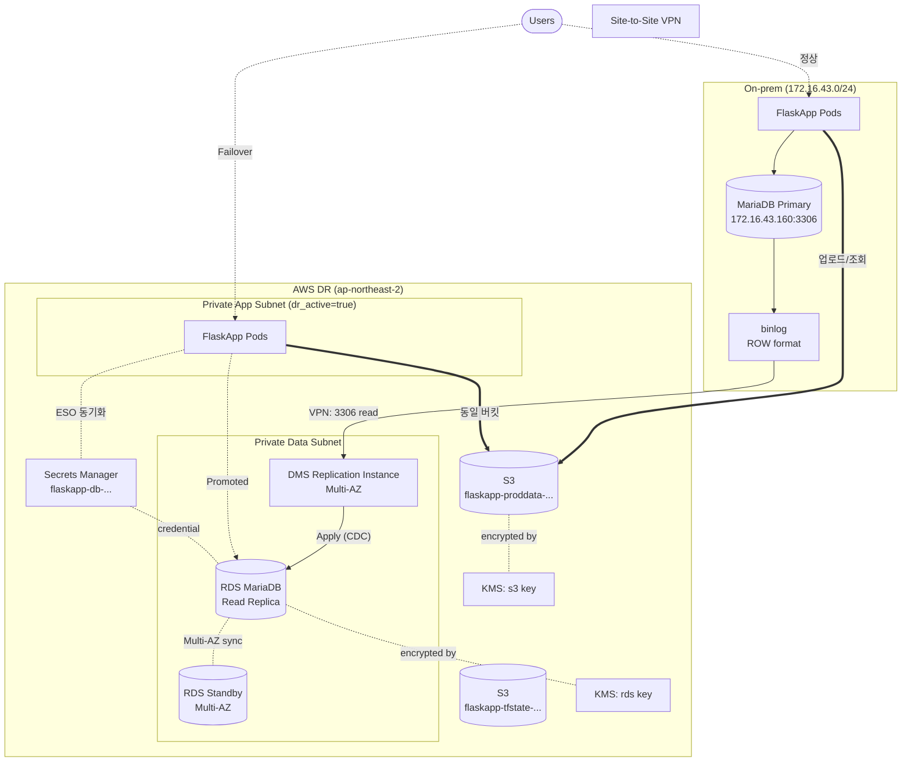

# 05-1. 데이터 상세 구현 설계

> [05. 데이터](./aws-dr-architecture.md#5-데이터-rds--dms--s3)의 후속 문서. RDS, DMS, S3의 구체적인 설계값, Parameter Group, Bucket Policy, DMS Task JSON, Failover/Failback 명령까지 다룬다.

## 목차

- [1. 데이터 흐름 전체 토폴로지](#1-데이터-흐름-전체-토폴로지)
- [2. RDS 인스턴스 설계](#2-rds-인스턴스-설계)
- [3. RDS Parameter Group / Option Group](#3-rds-parameter-group--option-group)
- [4. RDS 백업·스냅샷·암호화](#4-rds-백업스냅샷암호화)
- [5. DMS Replication Instance](#5-dms-replication-instance)
- [6. DMS Endpoints (Source / Target)](#6-dms-endpoints-source--target)
- [7. DMS Task (Full Load + CDC)](#7-dms-task-full-load--cdc)
- [8. S3 — `proddata` 버킷 상세](#8-s3--proddata-버킷-상세)
- [9. S3 — `tfstate` 버킷 상세](#9-s3--tfstate-버킷-상세)
- [10. Failover & Failback 명령 매트릭스](#10-failover--failback-명령-매트릭스)
- [11. Terraform 모듈 구조](#11-terraform-모듈-구조)
- [12. 검증 체크리스트](#12-검증-체크리스트)

---

## 1. 데이터 흐름 전체 토폴로지



**핵심 원칙**

1. **단방향 복제만**: On-prem → AWS (DMS CDC). 양방향은 split-brain 위험으로 금지.
2. **단일 버킷**: `flaskapp-proddata-...`는 양쪽에서 공유. 환경별 분리 X.
3. **암호화 기본값**: RDS·S3·DMS·Secrets 모두 KMS CMK 사용. AWS 관리 키 아님.
4. **인터넷 노출 0**: RDS Public Access는 영구 비활성. 접근은 SG로만 통제.
5. **DR 시 전환 포인트는 3곳**: ① RDS Promote ② App env(`DATABASE_HOST`) ③ Route 53.

---

## 2. RDS 인스턴스 설계

### 2.1 기본 설계값

| 항목 | 값 | 비고 |
|---|---|---|
| DB Identifier | `rds-flaskapp-kosa-project-jh` | |
| Engine | **MariaDB 10.11** (또는 MySQL 8.0) | **온프렘 버전과 정확히 일치 필수** |
| Instance Class | `db.t3.medium` (2 vCPU / 4 GiB) | 평시 부하 거의 없음. Failover 시 확장 가능 |
| Storage Type | `gp3` | gp2 대비 비용 ↓, IOPS 분리 |
| Allocated Storage | 100 GiB | |
| Max Allocated Storage | 500 GiB | Storage Autoscaling 활성 |
| Storage Encryption | **활성 (KMS CMK)** | 한 번 만들면 변경 불가 |
| Multi-AZ | **활성** | Failover 후 Primary가 되므로 가용성 필요 |
| Subnet Group | Private Data Subnet × 2 (AZ-a, AZ-c) | |
| **Publicly Accessible** | **false (영구)** | 인터넷 노출 금지 |
| Deletion Protection | **true** | 실수 삭제 방지 |
| Performance Insights | 활성 (7일 보존, 무료 티어) | 쿼리 단위 진단 |
| Enhanced Monitoring | 60초 간격 | OS 레벨 메트릭 |

### 2.2 Read Replica vs 별도 인스턴스

본 설계는 **Cross-Region/Cross-Network Read Replica는 사용하지 않음**. 이유:

- On-prem MariaDB는 AWS에서 직접 Replica로 등록 불가 (DMS 경유 필수)
- AWS 내 RDS Replica는 **DMS Target과 별개**로, RDS Replica를 하나 더 두면 비용만 증가
- 따라서 `rds-flaskapp-kosa-project-jh`는 **단일 RDS 인스턴스(Multi-AZ)** 로, DMS Target 역할만 수행

> 📌 명칭상 "Read Replica"라고 부르지만, 실제로는 **DMS가 데이터를 흘려넣는 일반 RDS 인스턴스**. Failover 시점에 "Promote"라는 표현을 쓰지만 AWS Console의 "Promote Read Replica" 기능과는 다름. 실제 절차는 §10 참조.

### 2.3 Terraform 코드

```hcl
# modules/rds/main.tf
resource "aws_db_subnet_group" "main" {
  name       = "rds-flaskapp-kosa-project-jh"
  subnet_ids = var.data_subnet_ids

  tags = { Name = "rds-flaskapp-subnet-group" }
}

resource "aws_db_instance" "flaskapp" {
  identifier     = "rds-flaskapp-kosa-project-jh"
  engine         = "mariadb"
  engine_version = "10.11.6"   # 온프렘과 일치
  instance_class = "db.t3.medium"

  allocated_storage     = 100
  max_allocated_storage = 500
  storage_type          = "gp3"
  storage_encrypted     = true
  kms_key_id            = var.kms_rds_arn

  db_name  = "flaskapp"
  username = "admin"
  # 비밀번호는 Secrets Manager가 관리
  manage_master_user_password = true
  master_user_secret_kms_key_id = var.kms_secrets_arn

  db_subnet_group_name   = aws_db_subnet_group.main.name
  vpc_security_group_ids = [var.rds_sg_id]
  publicly_accessible    = false
  multi_az               = true

  parameter_group_name = aws_db_parameter_group.flaskapp.name

  backup_retention_period = 7
  backup_window           = "16:00-17:00"     # UTC (KST 새벽 1~2시)
  maintenance_window      = "sun:17:00-sun:18:00"
  copy_tags_to_snapshot   = true

  deletion_protection      = true
  skip_final_snapshot      = false
  final_snapshot_identifier = "rds-flaskapp-final-${formatdate("YYYYMMDDhhmm", timestamp())}"

  performance_insights_enabled          = true
  performance_insights_retention_period = 7
  performance_insights_kms_key_id       = var.kms_rds_arn

  enabled_cloudwatch_logs_exports = ["error", "slowquery", "audit"]

  monitoring_interval = 60
  monitoring_role_arn = aws_iam_role.rds_monitoring.arn

  apply_immediately = false   # 운영 중에는 false, 명시적 변경만 즉시 적용

  tags = { Name = "rds-flaskapp-kosa-project-jh" }
}
```

> 💡 **`manage_master_user_password = true`** 옵션을 쓰면 RDS가 자동으로 Secrets Manager에 비밀번호를 만들고 자동 회전까지 처리. 7일/30일/90일 주기 선택 가능.

---

## 3. RDS Parameter Group / Option Group

### 3.1 DMS CDC를 위한 필수 파라미터

DMS가 CDC(Change Data Capture)로 동작하려면 **소스(On-prem MariaDB)** 에 아래 설정이 필요하다. **타깃(RDS)** 에도 동일 설정 권장.

| 파라미터 | 값 | 이유 |
|---|---|---|
| `binlog_format` | `ROW` | DMS는 STATEMENT 형식 지원 안 함 |
| `binlog_row_image` | `FULL` | 부분 row 이미지면 PK 외 컬럼 추적 불가 |
| `binlog_checksum` | `NONE` | DMS가 checksum 미지원 (MariaDB 기본 `CRC32`) |
| `expire_logs_days` | `7` 이상 | binlog 보존. DMS 일시 중단 시 따라잡을 시간 확보 |
| `log_bin` | `ON` | binlog 자체 활성화 |
| `server_id` | 고유값 (1~4294967295) | 양쪽 다 다른 값 |
| `gtid_strict_mode` | `OFF` | DMS 호환 |
| `read_only` | `OFF` (Failover 후 ON→OFF) | 평시엔 OFF, DR 후엔 운영 정책에 따라 |

### 3.2 Custom Parameter Group

```hcl
resource "aws_db_parameter_group" "flaskapp" {
  name        = "pg-mariadb-flaskapp-kosa-project-jh"
  family      = "mariadb10.11"
  description = "FlaskApp DR용 — DMS CDC 호환 + 성능 튜닝"

  # DMS CDC 필수
  parameter {
    name  = "binlog_format"
    value = "ROW"
  }
  parameter {
    name  = "binlog_row_image"
    value = "FULL"
  }
  parameter {
    name         = "binlog_checksum"
    value        = "NONE"
    apply_method = "pending-reboot"
  }

  # 성능 튜닝
  parameter {
    name  = "max_connections"
    value = "200"
  }
  parameter {
    name         = "innodb_buffer_pool_size"
    value        = "{DBInstanceClassMemory*3/4}"   # 가용 메모리의 75%
    apply_method = "pending-reboot"
  }
  parameter {
    name  = "slow_query_log"
    value = "1"
  }
  parameter {
    name  = "long_query_time"
    value = "2"   # 2초 이상 쿼리 기록
  }

  # 시간대
  parameter {
    name  = "time_zone"
    value = "Asia/Seoul"
  }

  # Character Set
  parameter {
    name  = "character_set_server"
    value = "utf8mb4"
  }
  parameter {
    name  = "collation_server"
    value = "utf8mb4_unicode_ci"
  }

  tags = { Name = "pg-mariadb-flaskapp-kosa-project-jh" }
}
```

### 3.3 On-prem MariaDB 측 설정 체크리스트

총괄 문서의 On-prem MariaDB(`172.16.43.160`)에 동일 설정이 필요. **이게 빠지면 DMS Task가 시작조차 안 됨**.

```ini
# /etc/mysql/mariadb.conf.d/50-server.cnf
[mysqld]
server_id              = 1
log_bin                = /var/log/mysql/mariadb-bin
binlog_format          = ROW
binlog_row_image       = FULL
binlog_checksum        = NONE
expire_logs_days       = 7
gtid_strict_mode       = OFF
```

DMS 전용 복제 유저도 생성:

```sql
CREATE USER 'dms_user'@'%' IDENTIFIED BY '<강력한_비밀번호>';
GRANT REPLICATION CLIENT, REPLICATION SLAVE ON *.* TO 'dms_user'@'%';
GRANT SELECT ON flaskapp.* TO 'dms_user'@'%';
FLUSH PRIVILEGES;
```

> ⚠️ DMS 유저에게 `RELOAD`, `SUPER` 권한은 주지 말 것 (DMS 공식 가이드). 보안 사고 시 영향 범위가 커짐.

---

## 4. RDS 백업·스냅샷·암호화

### 4.1 백업 정책

| 항목 | 값 | 비고 |
|---|---|---|
| 자동 백업 보존 | 7일 | 비용/복구 가능성 균형 |
| 백업 윈도우 | `16:00-17:00 UTC` (KST 새벽 1~2시) | 트래픽 최저 시간대 |
| 스냅샷 복사 | Cross-Region 비활성 (선택 사항) | 리전 장애 대비 필요 시 활성 |
| Point-in-Time Recovery | 자동 활성 (자동 백업 기간 내) | 1초 단위 복구 가능 |
| 수동 스냅샷 | 월 1회 (Lambda 자동화 권장) | 자동 백업 만료 후에도 보존 |

### 4.2 KMS 키 정책 (RDS 전용)

```json
{
  "Version": "2012-10-17",
  "Id": "kms-flaskapp-rds-key-policy",
  "Statement": [
    {
      "Sid": "Account Root Admin",
      "Effect": "Allow",
      "Principal": { "AWS": "arn:aws:iam::<ACCOUNT_ID>:root" },
      "Action": "kms:*",
      "Resource": "*"
    },
    {
      "Sid": "Allow RDS to use the key",
      "Effect": "Allow",
      "Principal": { "Service": "rds.amazonaws.com" },
      "Action": [
        "kms:Encrypt", "kms:Decrypt", "kms:ReEncrypt*",
        "kms:GenerateDataKey*", "kms:DescribeKey", "kms:CreateGrant"
      ],
      "Resource": "*"
    },
    {
      "Sid": "Allow Performance Insights",
      "Effect": "Allow",
      "Principal": { "Service": "rds.amazonaws.com" },
      "Action": ["kms:Decrypt", "kms:GenerateDataKey"],
      "Resource": "*",
      "Condition": {
        "StringEquals": { "kms:ViaService": "rds.ap-northeast-2.amazonaws.com" }
      }
    }
  ]
}
```

### 4.3 수동 스냅샷 자동화 (Lambda + EventBridge)

```hcl
# modules/rds/snapshot_lambda.tf
resource "aws_cloudwatch_event_rule" "monthly_snapshot" {
  name                = "rds-monthly-snapshot-flaskapp"
  schedule_expression = "cron(0 15 1 * ? *)"   # 매월 1일 UTC 15:00 (KST 24:00)
}

resource "aws_cloudwatch_event_target" "snapshot_lambda" {
  rule = aws_cloudwatch_event_rule.monthly_snapshot.name
  arn  = aws_lambda_function.snapshot.arn
}
```

Lambda 함수는 boto3로 `create_db_snapshot` 호출 + 6개월 지난 스냅샷 자동 삭제 로직 포함.

---

## 5. DMS Replication Instance

### 5.1 설계값

| 항목 | 값 | 이유 |
|---|---|---|
| Identifier | `dms-flaskapp-kosa-project-jh` | |
| Engine Version | 최신 안정 버전 (3.5.x) | DMS는 마이너 업그레이드 자동 가능 |
| Instance Class | `dms.t3.medium` (2 vCPU / 4 GiB) | 시작값. Lag 발생 시 `dms.c5.large`로 |
| Allocated Storage | 50 GiB | binlog 임시 저장 공간 |
| **Multi-AZ** | **활성** | Replica 인스턴스 장애 시 RPO 망가짐 |
| Subnet Group | Private Data Subnet × 2 | |
| Publicly Accessible | false | |
| KMS Key | `alias/flaskapp-rds-kosa-project-jh` (또는 별도) | 내부 캐시 암호화 |

### 5.2 인스턴스 사이징 가이드

| 워크로드 | 권장 인스턴스 | 예상 처리량 |
|---|---|---|
| 소규모 (< 100 tx/s) | `dms.t3.medium` | ~10 MB/s |
| 중규모 (100~1000 tx/s) | `dms.c5.large` | ~50 MB/s |
| 대규모 (> 1000 tx/s) | `dms.c5.xlarge` | ~200 MB/s |

> 💡 처음엔 `dms.t3.medium`으로 시작하고, `CDCLatencyTarget` 메트릭이 5분 이상으로 치솟으면 한 단계 업.

### 5.3 Terraform 코드

```hcl
# modules/dms/instance.tf
resource "aws_dms_replication_subnet_group" "main" {
  replication_subnet_group_id          = "dms-subnet-flaskapp"
  replication_subnet_group_description = "DMS subnet group for FlaskApp DR"
  subnet_ids                           = var.data_subnet_ids

  tags = { Name = "dms-subnet-flaskapp" }
}

resource "aws_dms_replication_instance" "main" {
  replication_instance_id      = "dms-flaskapp-kosa-project-jh"
  replication_instance_class   = "dms.t3.medium"
  allocated_storage            = 50
  engine_version               = "3.5.2"
  multi_az                     = true
  publicly_accessible          = false
  auto_minor_version_upgrade   = true
  apply_immediately            = false

  replication_subnet_group_id = aws_dms_replication_subnet_group.main.id
  vpc_security_group_ids      = [var.dms_sg_id]
  kms_key_arn                 = var.kms_rds_arn

  preferred_maintenance_window = "sun:18:00-sun:19:00"

  tags = { Name = "dms-flaskapp-kosa-project-jh" }
}
```

---

## 6. DMS Endpoints (Source / Target)

### 6.1 Source Endpoint (On-prem MariaDB)

| 항목 | 값 |
|---|---|
| Endpoint ID | `dms-src-onprem-mariadb` |
| Endpoint Type | `source` |
| Engine | `mariadb` |
| Server Name | `172.16.43.160` (VPN 너머 사설 IP) |
| Port | `3306` |
| Username | `dms_user` (§3.3에서 생성) |
| Password | Secrets Manager 참조 |
| Database Name | `flaskapp` |
| Extra Connection Attrs | `initstmt=SET FOREIGN_KEY_CHECKS=0;` |

### 6.2 Target Endpoint (RDS)

| 항목 | 값 |
|---|---|
| Endpoint ID | `dms-tgt-rds-mariadb` |
| Endpoint Type | `target` |
| Engine | `mariadb` |
| Server Name | RDS endpoint (`rds-flaskapp-...rds.amazonaws.com`) |
| Port | `3306` |
| Username | `admin` (RDS Master) |
| Password | Secrets Manager 참조 (RDS가 자동 관리하는 secret) |
| Extra Connection Attrs | `initstmt=SET FOREIGN_KEY_CHECKS=0;parallelLoadThreads=4;` |

### 6.3 Terraform 코드

```hcl
# modules/dms/endpoints.tf
data "aws_secretsmanager_secret_version" "onprem_db" {
  secret_id = "dms-source-onprem-credentials"
}

resource "aws_dms_endpoint" "source" {
  endpoint_id   = "dms-src-onprem-mariadb"
  endpoint_type = "source"
  engine_name   = "mariadb"

  server_name = var.onprem_db_ip   # 172.16.43.160
  port        = 3306
  username    = jsondecode(data.aws_secretsmanager_secret_version.onprem_db.secret_string)["username"]
  password    = jsondecode(data.aws_secretsmanager_secret_version.onprem_db.secret_string)["password"]
  database_name = "flaskapp"

  ssl_mode = "none"   # VPN 사설망이므로 SSL 생략. 인터넷이면 require로

  extra_connection_attributes = "initstmt=SET FOREIGN_KEY_CHECKS=0;"

  tags = { Name = "dms-src-onprem-mariadb" }
}

resource "aws_dms_endpoint" "target" {
  endpoint_id   = "dms-tgt-rds-mariadb"
  endpoint_type = "target"
  engine_name   = "mariadb"

  server_name   = aws_db_instance.flaskapp.address
  port          = 3306
  username      = jsondecode(data.aws_secretsmanager_secret_version.rds_master.secret_string)["username"]
  password      = jsondecode(data.aws_secretsmanager_secret_version.rds_master.secret_string)["password"]
  database_name = "flaskapp"

  extra_connection_attributes = "initstmt=SET FOREIGN_KEY_CHECKS=0;parallelLoadThreads=4;"

  tags = { Name = "dms-tgt-rds-mariadb" }
}
```

### 6.4 Endpoint 연결 테스트

```bash
aws dms test-connection \
  --replication-instance-arn <REPL_INSTANCE_ARN> \
  --endpoint-arn <SOURCE_ENDPOINT_ARN>

# 응답에서 status: "successful" 확인
aws dms describe-connections \
  --filters Name=endpoint-arn,Values=<SOURCE_ENDPOINT_ARN>
```

**연결 실패 흔한 원인**:
1. VPN Tunnel Down — Route 53/CloudWatch로 확인
2. SG 룰 누락 — `dms-sg` 아웃바운드에 `172.16.43.160:3306` 허용 됐는지
3. On-prem 방화벽(pfSense) 인바운드 룰 누락
4. MariaDB 사용자 권한 부족 — `REPLICATION SLAVE` 누락

---

## 7. DMS Task (Full Load + CDC)

### 7.1 Task 기본 설계

| 항목 | 값 |
|---|---|
| Task Identifier | `dms-task-flaskapp` |
| Migration Type | `full-load-and-cdc` |
| Target Table Prep Mode | `DO_NOTHING` (기존 RDS 테이블 유지) 또는 `DROP_AND_CREATE` (초기 적재 시) |
| LOB 처리 모드 | `LIMITED` (32KB 이내) 또는 `FULL` (메모리 부담 ↑) |
| CDC Start Position | `start_from_now` (초기 적재 후 즉시 CDC 시작) |

### 7.2 Table Mappings (어떤 테이블을 복제할지)

```json
{
  "rules": [
    {
      "rule-type": "selection",
      "rule-id": "1",
      "rule-name": "include-flaskapp-schema",
      "object-locator": {
        "schema-name": "flaskapp",
        "table-name": "%"
      },
      "rule-action": "include"
    },
    {
      "rule-type": "selection",
      "rule-id": "2",
      "rule-name": "exclude-temp-tables",
      "object-locator": {
        "schema-name": "flaskapp",
        "table-name": "tmp_%"
      },
      "rule-action": "exclude"
    },
    {
      "rule-type": "transformation",
      "rule-id": "3",
      "rule-name": "convert-table-name-to-lower",
      "rule-target": "table",
      "object-locator": {
        "schema-name": "flaskapp",
        "table-name": "%"
      },
      "rule-action": "convert-lowercase"
    }
  ]
}
```

### 7.3 Task Settings (튜닝 핵심)

```json
{
  "TargetMetadata": {
    "TargetSchema": "",
    "SupportLobs": true,
    "LimitedSizeLobMode": true,
    "LobMaxSize": 32,
    "ParallelLoadThreads": 4,
    "ParallelLoadBufferSize": 100
  },
  "FullLoadSettings": {
    "TargetTablePrepMode": "DO_NOTHING",
    "CreatePkAfterFullLoad": false,
    "StopTaskCachedChangesApplied": false,
    "StopTaskCachedChangesNotApplied": false,
    "MaxFullLoadSubTasks": 8,
    "TransactionConsistencyTimeout": 600,
    "CommitRate": 10000
  },
  "Logging": {
    "EnableLogging": true,
    "LogComponents": [
      { "Id": "SOURCE_CAPTURE",  "Severity": "LOGGER_SEVERITY_DEFAULT" },
      { "Id": "SOURCE_UNLOAD",   "Severity": "LOGGER_SEVERITY_DEFAULT" },
      { "Id": "TARGET_APPLY",    "Severity": "LOGGER_SEVERITY_DEFAULT" },
      { "Id": "TARGET_LOAD",     "Severity": "LOGGER_SEVERITY_DEFAULT" }
    ],
    "CloudWatchLogGroup": "dms-task-flaskapp",
    "CloudWatchLogStream": null
  },
  "ControlTablesSettings": {
    "ControlSchema": "dms_control",
    "HistoryTimeslotInMinutes": 5,
    "HistoryTableEnabled": true,
    "SuspendedTablesTableEnabled": true,
    "StatusTableEnabled": true
  },
  "ValidationSettings": {
    "EnableValidation": true,
    "ValidationMode": "ROW_LEVEL",
    "ThreadCount": 5,
    "PartitionSize": 10000,
    "FailureMaxCount": 10000,
    "RecordFailureDelayInMinutes": 5,
    "RecordFailureDelayLimitInMinutes": 30
  },
  "ChangeProcessingDdlHandlingPolicy": {
    "HandleSourceTableDropped": true,
    "HandleSourceTableTruncated": true,
    "HandleSourceTableAltered": true
  },
  "ErrorBehavior": {
    "DataErrorPolicy": "LOG_ERROR",
    "DataTruncationErrorPolicy": "LOG_ERROR",
    "DataErrorEscalationPolicy": "SUSPEND_TABLE",
    "DataErrorEscalationCount": 50,
    "TableErrorPolicy": "SUSPEND_TABLE",
    "TableErrorEscalationPolicy": "STOP_TASK",
    "TableErrorEscalationCount": 50,
    "RecoverableErrorCount": -1,
    "RecoverableErrorInterval": 5,
    "RecoverableErrorThrottling": true,
    "RecoverableErrorThrottlingMax": 1800,
    "ApplyErrorDeletePolicy": "IGNORE_RECORD",
    "ApplyErrorInsertPolicy": "LOG_ERROR",
    "ApplyErrorUpdatePolicy": "LOG_ERROR"
  }
}
```

### 7.4 핵심 설정 의미

| 설정 | 효과 |
|---|---|
| `ValidationMode: ROW_LEVEL` | DMS가 자체적으로 행 단위 일치 검증. RPO 신뢰성 ↑ |
| `HandleSourceTableAltered: true` | On-prem에서 `ALTER TABLE` 시 DMS가 RDS에도 자동 적용 (제한적) |
| `DataErrorEscalationPolicy: SUSPEND_TABLE` | 오류 50개 누적 시 해당 테이블만 일시 중지 (전체 Task는 계속) |
| `LimitedSizeLobMode + LobMaxSize: 32` | LOB 컬럼이 32KB 초과면 truncate. `FULL` 모드는 메모리 폭주 위험 |
| `ParallelLoadThreads: 4` | Full Load 시 4개 테이블 동시 적재 |

### 7.5 Terraform 코드

```hcl
# modules/dms/task.tf
resource "aws_dms_replication_task" "main" {
  replication_task_id      = "dms-task-flaskapp"
  migration_type           = "full-load-and-cdc"
  replication_instance_arn = aws_dms_replication_instance.main.replication_instance_arn
  source_endpoint_arn      = aws_dms_endpoint.source.endpoint_arn
  target_endpoint_arn      = aws_dms_endpoint.target.endpoint_arn

  table_mappings    = file("${path.module}/table_mappings.json")
  replication_task_settings = file("${path.module}/task_settings.json")

  start_replication_task = true

  tags = { Name = "dms-task-flaskapp" }

  lifecycle {
    ignore_changes = [start_replication_task]   # 수동 시작/중지 허용
  }
}
```

### 7.6 핵심 CloudWatch 메트릭

| 메트릭 | 임계치 | 의미 |
|---|---|---|
| `CDCLatencySource` | < 5분 | 소스에서 binlog 읽는 지연 |
| `CDCLatencyTarget` | < 5분 | 타깃에 적용하는 지연 (RPO 직결) |
| `CDCThroughputRowsTarget` | 모니터링 | 초당 처리 행 수 |
| `FullLoadThroughputRowsTarget` | Full Load 진행률 | 초기 적재 진행 |
| `CPUUtilization` | < 80% | 80% 초과 시 인스턴스 업그레이드 |
| `FreeableMemory` | > 500 MB | 메모리 부족 시 LOB 처리 문제 |

> ⚠️ **`CDCLatencyTarget`이 5분 초과 = RPO 5분 초과**. P1 알람 필수.

---

## 8. S3 — `proddata` 버킷 상세

### 8.1 버킷 설정 요약

| 항목 | 값 |
|---|---|
| 버킷명 | `flaskapp-proddata-kosa-project-jh-lai9z` |
| 리전 | `ap-northeast-2` |
| Object Ownership | `BucketOwnerEnforced` (ACL 비활성) |
| Block Public Access | **4개 모두 활성** |
| Versioning | 활성 |
| Default Encryption | SSE-KMS (CMK) |
| Bucket Key | 활성 (KMS 비용 절감) |
| Replication | 비활성 (필요 시 Cross-Region 검토) |
| Object Lock | 비활성 (보존 요구사항 없음) |

### 8.2 디렉토리 구조 (규약)

```
flaskapp-proddata-kosa-project-jh-lai9z/
├── uploads/              # 사용자 업로드 (사진/문서)
│   ├── 2026/05/...
│   └── ...
├── static/               # 정적 자산 (CSS/JS/이미지)
├── backups/              # DB 덤프 등 백업
│   └── db/YYYY-MM-DD.sql.gz
├── alb-access-logs/      # ALB Access Log
└── vpc-flow-logs/        # VPC Flow Log
```

### 8.3 라이프사이클 규칙

```hcl
resource "aws_s3_bucket_lifecycle_configuration" "proddata" {
  bucket = aws_s3_bucket.proddata.id

  rule {
    id     = "uploads-tiering"
    status = "Enabled"
    filter { prefix = "uploads/" }

    transition {
      days          = 30
      storage_class = "STANDARD_IA"
    }
    transition {
      days          = 90
      storage_class = "GLACIER_IR"
    }
    transition {
      days          = 365
      storage_class = "DEEP_ARCHIVE"
    }
  }

  rule {
    id     = "logs-expire"
    status = "Enabled"
    filter { prefix = "alb-access-logs/" }

    expiration { days = 90 }
  }

  rule {
    id     = "old-versions-expire"
    status = "Enabled"
    filter {}

    noncurrent_version_expiration { noncurrent_days = 30 }
  }

  rule {
    id     = "incomplete-multipart"
    status = "Enabled"
    filter {}

    abort_incomplete_multipart_upload { days_after_initiation = 7 }
  }
}
```

### 8.4 Bucket Policy (양쪽 환경 접근 + ALB Logs)

```json
{
  "Version": "2012-10-17",
  "Statement": [
    {
      "Sid": "DenyInsecureTransport",
      "Effect": "Deny",
      "Principal": "*",
      "Action": "s3:*",
      "Resource": [
        "arn:aws:s3:::flaskapp-proddata-kosa-project-jh-lai9z",
        "arn:aws:s3:::flaskapp-proddata-kosa-project-jh-lai9z/*"
      ],
      "Condition": {
        "Bool": { "aws:SecureTransport": "false" }
      }
    },
    {
      "Sid": "OnPremIAMUserAccess",
      "Effect": "Allow",
      "Principal": {
        "AWS": "arn:aws:iam::<ACCOUNT_ID>:user/flaskapp-onprem-app"
      },
      "Action": [
        "s3:GetObject", "s3:PutObject", "s3:DeleteObject", "s3:ListBucket"
      ],
      "Resource": [
        "arn:aws:s3:::flaskapp-proddata-kosa-project-jh-lai9z",
        "arn:aws:s3:::flaskapp-proddata-kosa-project-jh-lai9z/uploads/*",
        "arn:aws:s3:::flaskapp-proddata-kosa-project-jh-lai9z/static/*"
      ]
    },
    {
      "Sid": "EKSIRSAAccess",
      "Effect": "Allow",
      "Principal": {
        "AWS": "arn:aws:iam::<ACCOUNT_ID>:role/eks-irsa-flaskapp-kosa-project-jh"
      },
      "Action": [
        "s3:GetObject", "s3:PutObject", "s3:DeleteObject", "s3:ListBucket"
      ],
      "Resource": [
        "arn:aws:s3:::flaskapp-proddata-kosa-project-jh-lai9z",
        "arn:aws:s3:::flaskapp-proddata-kosa-project-jh-lai9z/uploads/*",
        "arn:aws:s3:::flaskapp-proddata-kosa-project-jh-lai9z/static/*"
      ]
    },
    {
      "Sid": "ALBAccessLogs",
      "Effect": "Allow",
      "Principal": {
        "Service": "logdelivery.elasticloadbalancing.amazonaws.com"
      },
      "Action": "s3:PutObject",
      "Resource": "arn:aws:s3:::flaskapp-proddata-kosa-project-jh-lai9z/alb-access-logs/*"
    }
  ]
}
```

> ⚠️ **`DenyInsecureTransport` Deny 룰은 가장 위에**. 잘못 설정하면 운영자조차 접근 못 함 — 콘솔에서 HTTPS로만 접근하는지 확인.

### 8.5 온프렘에서의 접근 (IAM User vs IRSA)

- **온프렘 K8s Pod** → 별도 IAM User(`flaskapp-onprem-app`)의 Access Key를 K8s Secret으로 마운트
- **AWS EKS Pod** → IRSA(`eks-irsa-flaskapp-...`)로 자동 자격증명

| 환경 | 자격증명 방식 | 회전 주기 |
|---|---|---|
| 온프렘 | IAM User Access Key (장기) | 90일 수동 회전 |
| AWS | IRSA (1시간 임시) | 자동 |

> 💡 IAM User Access Key는 장기 키이므로 보안 취약점. 가능하면 IAM Roles Anywhere(2022~)로 전환 검토 — 온프렘에서도 임시 자격증명 사용 가능.

---

## 9. S3 — `tfstate` 버킷 상세

### 9.1 버킷 설정 요약

| 항목 | 값 |
|---|---|
| 버킷명 | `flaskapp-tfstate-kosa-project-jh-a3asx` |
| **Versioning** | **반드시 활성 (state 손상 시 복구 유일 수단)** |
| Block Public Access | 4개 모두 활성 |
| Default Encryption | SSE-KMS |
| MFA Delete | 활성 권장 (실수 삭제 방지) |
| Lifecycle | Non-current version 90일 후 삭제 |

### 9.2 Bucket Policy (TerraformDeployRole만 허용)

```json
{
  "Version": "2012-10-17",
  "Statement": [
    {
      "Sid": "DenyAllExceptTerraformRole",
      "Effect": "Deny",
      "NotPrincipal": {
        "AWS": [
          "arn:aws:iam::<ACCOUNT_ID>:role/TerraformDeployRole",
          "arn:aws:iam::<ACCOUNT_ID>:root"
        ]
      },
      "Action": "s3:*",
      "Resource": [
        "arn:aws:s3:::flaskapp-tfstate-kosa-project-jh-a3asx",
        "arn:aws:s3:::flaskapp-tfstate-kosa-project-jh-a3asx/*"
      ]
    },
    {
      "Sid": "DenyInsecureTransport",
      "Effect": "Deny",
      "Principal": "*",
      "Action": "s3:*",
      "Resource": [
        "arn:aws:s3:::flaskapp-tfstate-kosa-project-jh-a3asx",
        "arn:aws:s3:::flaskapp-tfstate-kosa-project-jh-a3asx/*"
      ],
      "Condition": {
        "Bool": { "aws:SecureTransport": "false" }
      }
    }
  ]
}
```

### 9.3 DynamoDB Lock 테이블

| 항목 | 값 |
|---|---|
| 테이블명 | `terraform-state-lock` |
| Partition Key | `LockID` (String) |
| Billing Mode | On-demand (호출 적음) |
| 암호화 | KMS CMK (선택) |

```hcl
resource "aws_dynamodb_table" "tf_lock" {
  name         = "terraform-state-lock"
  billing_mode = "PAY_PER_REQUEST"
  hash_key     = "LockID"

  attribute {
    name = "LockID"
    type = "S"
  }

  server_side_encryption {
    enabled     = true
    kms_key_arn = var.kms_secrets_arn
  }

  tags = { Name = "terraform-state-lock" }
}
```

### 9.4 State 복구 시나리오

State 파일이 손상되거나 누군가 실수로 덮어쓴 경우:

```bash
# 1. 이전 버전 목록 조회
aws s3api list-object-versions \
  --bucket flaskapp-tfstate-kosa-project-jh-a3asx \
  --prefix envs/dr/terraform.tfstate

# 2. 특정 버전 복구
aws s3api copy-object \
  --bucket flaskapp-tfstate-kosa-project-jh-a3asx \
  --copy-source 'flaskapp-tfstate-kosa-project-jh-a3asx/envs/dr/terraform.tfstate?versionId=<VERSION_ID>' \
  --key envs/dr/terraform.tfstate

# 3. terraform plan으로 검증
terraform plan
```

---

## 10. Failover & Failback 명령 매트릭스

### 10.1 Failover (On-prem → AWS)

총괄 문서 §7의 9단계와 1:1 매칭. 각 단계의 **구체 명령**.

#### Step 1~3: 감지 & 선언

```bash
# Health Check 상태 확인
aws route53 get-health-check-status --health-check-id <HC_ID>

# DMS lag 확인
aws cloudwatch get-metric-statistics \
  --namespace AWS/DMS \
  --metric-name CDCLatencyTarget \
  --dimensions Name=ReplicationInstanceIdentifier,Value=dms-flaskapp-kosa-project-jh Name=ReplicationTaskIdentifier,Value=dms-task-flaskapp \
  --start-time $(date -u -d '10 min ago' +%FT%T) \
  --end-time $(date -u +%FT%T) \
  --period 60 --statistics Maximum
```

#### Step 4: RDS Promote (실제 동작)

본 설계의 RDS는 **DMS Target이지 Replica가 아님**. 따라서 "Promote" 절차는:

```bash
# 4-1. DMS Task 정지 (양쪽 동기화 멈춤)
aws dms stop-replication-task \
  --replication-task-arn <TASK_ARN>

# 4-2. DMS Task가 STOPPED 상태일 때까지 대기
aws dms describe-replication-tasks \
  --filters Name=replication-task-arn,Values=<TASK_ARN> \
  --query 'ReplicationTasks[0].Status'

# 4-3. RDS는 이미 쓰기 가능 상태. 추가 명령 불필요.
#      대신 외부에서 의도치 않은 쓰기 방지를 위해
#      RDS Parameter Group에서 read_only를 잠시 ON했다가 OFF로 전환하는 운영 정책 가능.

# 4-4. RDS endpoint 확인
aws rds describe-db-instances \
  --db-instance-identifier rds-flaskapp-kosa-project-jh \
  --query 'DBInstances[0].Endpoint.Address'
```

> 📌 만약 진짜 Read Replica(`aws_db_instance` with `replicate_source_db`)를 사용했다면 `aws rds promote-read-replica` 명령이 필요. 본 설계는 DMS Target이므로 해당 명령 **불필요**.

#### Step 5~8: 인프라 활성화

```bash
# 5. Terraform으로 EKS/노드/ALB 생성
cd terraform/envs/dr
terraform apply -var="dr_active=true" -auto-approve

# 6. App 배포 (ArgoCD가 자동 처리하거나)
kubectl apply -k k8s/overlays/dr/

# 7. 환경변수 확인
kubectl get secret flaskapp-db-secret -n flaskapp -o jsonpath='{.data.DATABASE_URL}' | base64 -d
# → rds-flaskapp-... 포함되어 있어야 함

# 8. Route 53 Failover 확인 (자동이지만 강제 전환 시)
dig +short flaskapp.example.com
# → ALB IP가 응답해야 함
```

#### Step 9: 검증

```bash
# HTTPS 헬스체크
curl -sf https://flaskapp.example.com/healthz || echo "FAIL"

# DB 쓰기 테스트
curl -X POST https://flaskapp.example.com/api/test-record -d '{"test":"failover"}'

# S3 쓰기 테스트
curl -X POST -F "file=@test.jpg" https://flaskapp.example.com/api/upload
aws s3 ls s3://flaskapp-proddata-kosa-project-jh-lai9z/uploads/ | tail -1
```

### 10.2 Failback (AWS → On-prem)

가장 어려운 절차. **데이터 정합성이 최우선**.

```bash
# 1. AWS 쪽 RDS를 read-only로 전환 (쓰기 차단)
aws rds modify-db-parameter-group \
  --db-parameter-group-name pg-mariadb-flaskapp-kosa-project-jh \
  --parameters "ParameterName=read_only,ParameterValue=1,ApplyMethod=immediate"

# 2. AWS App을 일시 점검 모드로 (운영 정책에 따라)

# 3. AWS RDS → On-prem MariaDB 역방향 동기화
#    옵션 A: mysqldump 후 On-prem 적재 (다운타임 발생)
#    옵션 B: 임시 DMS Task를 역방향으로 생성 (RDS → On-prem)

# 옵션 A 예시:
mysqldump -h <RDS_ENDPOINT> -u admin -p flaskapp \
  --single-transaction --master-data=2 --gtid \
  > flaskapp-failback-$(date +%Y%m%d).sql

# On-prem에서 적재:
mysql -h 172.16.43.160 -u admin -p flaskapp < flaskapp-failback-$(date +%Y%m%d).sql

# 4. On-prem 검증 (행 수, 최근 트랜잭션 확인)
mysql -h 172.16.43.160 -u admin -p -e "SELECT COUNT(*) FROM flaskapp.users;"
mysql -h <RDS_ENDPOINT> -u admin -p -e "SELECT COUNT(*) FROM flaskapp.users;"

# 5. Route 53을 다시 Primary(On-prem)로 (Health Check 정상 회복 시 자동)

# 6. Terraform으로 EKS 제거 (비용 절감)
cd terraform/envs/dr
terraform apply -var="dr_active=false" -auto-approve

# 7. 원래 방향의 DMS Task 재시작 (On-prem → AWS)
aws dms start-replication-task \
  --replication-task-arn <TASK_ARN> \
  --start-replication-task-type resume-processing
```

### 10.3 Split-brain 방지 체크

| 시나리오 | 위험 | 대응 |
|---|---|---|
| On-prem 회복 후 양쪽이 동시에 쓰기 | 데이터 충돌 | Failback 전 **AWS RDS를 read_only**로 |
| Failover 직후 On-prem이 일시 회복 | 일부 트래픽이 다시 On-prem으로 | Route 53 TTL 60초 + 운영자가 수동으로 On-prem 차단 |
| DMS Task가 자동 재시작되어 역방향 데이터 덮어씀 | 신규 데이터 손실 | DMS Task `lifecycle.ignore_changes` + 수동 재시작 원칙 |

> ⚠️ **Failback은 자동화하지 말 것**. 매뉴얼 절차 + 운영자 판단이 안전.

---

## 11. Terraform 모듈 구조

### 11.1 디렉토리

```
terraform/modules/
├── rds/
│   ├── README.md
│   ├── versions.tf
│   ├── variables.tf
│   ├── outputs.tf
│   ├── main.tf              # aws_db_instance
│   ├── subnet_group.tf
│   ├── parameter_group.tf
│   ├── iam_monitoring.tf    # Enhanced Monitoring Role
│   └── snapshot_lambda.tf   # 월 스냅샷 자동화 (선택)
│
├── dms/
│   ├── README.md
│   ├── versions.tf
│   ├── variables.tf
│   ├── outputs.tf
│   ├── instance.tf          # replication instance + subnet group
│   ├── endpoints.tf         # source + target
│   ├── task.tf              # replication task
│   ├── table_mappings.json
│   └── task_settings.json
│
└── s3/
    ├── README.md
    ├── versions.tf
    ├── variables.tf
    ├── outputs.tf
    ├── proddata.tf          # 기존 import + 정책 보강
    ├── tfstate.tf           # 기존 import + 정책 보강
    ├── lifecycle.tf
    └── policy.tf
```

### 11.2 모듈 인터페이스

```hcl
# modules/rds/variables.tf
variable "data_subnet_ids" {
  type = list(string)
}

variable "rds_sg_id" {
  type = string
}

variable "kms_rds_arn" {
  type = string
}

variable "kms_secrets_arn" {
  type = string
}

variable "engine_version" {
  type    = string
  default = "10.11.6"
}

variable "instance_class" {
  type    = string
  default = "db.t3.medium"
}

# outputs.tf
output "endpoint"           { value = aws_db_instance.flaskapp.endpoint }
output "address"            { value = aws_db_instance.flaskapp.address }
output "port"               { value = aws_db_instance.flaskapp.port }
output "master_secret_arn"  { value = aws_db_instance.flaskapp.master_user_secret[0].secret_arn }
output "parameter_group"    { value = aws_db_parameter_group.flaskapp.name }
```

### 11.3 envs/dr/main.tf 호출

```hcl
module "rds" {
  source = "../../modules/rds"

  data_subnet_ids = module.network.data_subnet_ids
  rds_sg_id       = module.security.rds_sg_id
  kms_rds_arn     = module.kms.rds_arn
  kms_secrets_arn = module.kms.secrets_arn
}

module "dms" {
  source = "../../modules/dms"

  data_subnet_ids   = module.network.data_subnet_ids
  dms_sg_id         = module.security.dms_sg_id
  kms_rds_arn       = module.kms.rds_arn
  onprem_db_ip      = "172.16.43.160"
  rds_endpoint      = module.rds.address
  rds_master_secret_arn = module.rds.master_secret_arn
}

module "s3" {
  source = "../../modules/s3"

  proddata_bucket_name = "flaskapp-proddata-kosa-project-jh-lai9z"
  tfstate_bucket_name  = "flaskapp-tfstate-kosa-project-jh-a3asx"
  kms_s3_arn           = module.kms.s3_arn
  onprem_iam_user_arn  = var.onprem_iam_user_arn
  irsa_role_arn        = try(module.eks.irsa_flaskapp_arn, "")
}
```

### 11.4 기존 리소스 import

```bash
# S3 버킷
terraform import module.s3.aws_s3_bucket.proddata flaskapp-proddata-kosa-project-jh-lai9z
terraform import module.s3.aws_s3_bucket.tfstate  flaskapp-tfstate-kosa-project-jh-a3asx

# DynamoDB
terraform import aws_dynamodb_table.tf_lock terraform-state-lock

# ECR (별도 모듈)
terraform import module.ecr.aws_ecr_repository.flaskapp flaskapp
```

---

## 12. 검증 체크리스트

### Phase 1: RDS 기본 동작

- [ ] `aws rds describe-db-instances --db-instance-identifier rds-flaskapp-kosa-project-jh` → Status `available`
- [ ] Multi-AZ가 `true`로 표시
- [ ] Publicly Accessible이 `false`
- [ ] Storage Encrypted가 `true` (KMS Key ARN이 올바른지)
- [ ] Deletion Protection이 `true`
- [ ] Parameter Group이 custom으로 적용됨 (`InSync` 상태)

### Phase 2: RDS 연결 & 권한

- [ ] EKS Pod에서 `mysql -h <RDS_ENDPOINT> -u admin -p` 성공
- [ ] DMS SG에서 RDS:3306 접근 가능
- [ ] 외부 인터넷에서 RDS:3306 접근 차단 (`nc -zv <RDS_ENDPOINT> 3306` 타임아웃)
- [ ] Secrets Manager의 비밀번호로 로그인 가능

### Phase 3: DMS 인스턴스 & Endpoint

- [ ] Replication Instance Status `available`
- [ ] Multi-AZ 활성 확인
- [ ] `aws dms test-connection`이 Source/Target 모두 `successful`
- [ ] CloudWatch Log Group `dms-task-flaskapp`이 생성됨

### Phase 4: DMS Task 동작

- [ ] Task Status가 Full Load 단계에서 `running` → `load-complete` 진행
- [ ] CDC 단계 진입 후 `CDCLatencyTarget < 5분` 유지
- [ ] On-prem에서 테스트 INSERT 후 30초 내 RDS에 반영
- [ ] Validation Mode 활성 시 `ValidationFailedCount == 0`
- [ ] Table Mappings 룰대로 `tmp_%` 테이블은 복제 제외 확인

### Phase 5: S3 — proddata

- [ ] 4개 Block Public Access 모두 활성
- [ ] Versioning Enabled
- [ ] Default Encryption SSE-KMS
- [ ] HTTP로 접근 시 차단 (`curl http://bucket.s3.amazonaws.com` → 403)
- [ ] 온프렘 IAM User로 PUT/GET 성공
- [ ] EKS IRSA로 PUT/GET 성공
- [ ] 라이프사이클 룰이 정상 동작 (`aws s3api get-bucket-lifecycle-configuration`)

### Phase 6: S3 — tfstate

- [ ] Versioning Enabled (state 손상 시 복구 가능)
- [ ] Bucket Policy로 TerraformDeployRole 외 모두 차단됨
- [ ] DynamoDB Lock 테이블 정상 동작 (`terraform plan` 시 lock 획득 후 해제 확인)
- [ ] State 파일이 KMS로 암호화됨

### Phase 7: Failover 시뮬레이션

- [ ] DMS Task 중지 → 즉시 lag 증가 확인 (의도된 동작)
- [ ] Task 재시작 → 누락 데이터 자동 catchup
- [ ] 가짜 Failover 시나리오로 RTO/RPO 측정
- [ ] Failback 절차에서 split-brain 발생 안 함 확인

---
