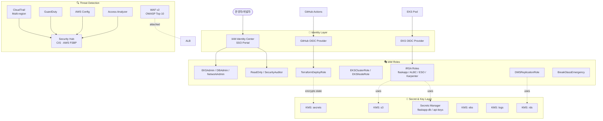
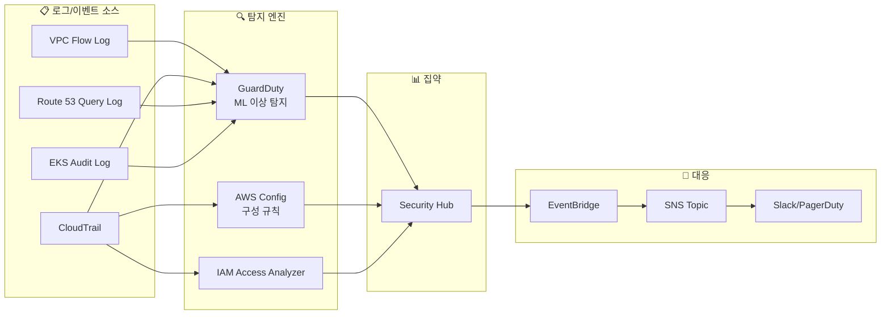

# 06-1. 보안 / IAM 상세 구현 설계

> 이전 문서 `aws-dr-architecture.md`의 **6장 보안/IAM**을 더 깊이 다룹니다.

## 📌 한 줄 요약

> **사용자는 SSO로만 접속하고 IAM User는 안 만듭니다. CI/CD는 OIDC로 임시 자격증명을 받고, Pod는 IRSA로 권한을 받습니다. 비밀번호는 Secrets Manager가 자동 회전하고, 모든 데이터는 KMS 키로 암호화되고, 4-Layer 위협 탐지(CloudTrail/GuardDuty/Config/Security Hub)가 24/7 감시합니다.**

## 목차

- [0. 이 문서 읽기 전에 알아둘 용어](#0-이-문서-읽기-전에-알아둘-용어)
- [1. 보안 아키텍처 전체 그림](#1-보안-아키텍처-전체-그림)
- [2. IAM 계층 구조](#2-iam-계층-구조)
- [3. IAM Identity Center — 사용자 접근](#3-iam-identity-center--사용자-접근)
- [4. Service Role 카탈로그](#4-service-role-카탈로그)
- [5. CI/CD Role (GitHub OIDC)](#5-cicd-role-github-oidc)
- [6. KMS Key 설계 & Key Policy](#6-kms-key-설계--key-policy)
- [7. Secrets Manager 운영](#7-secrets-manager-운영)
- [8. 위협 탐지 — 4-Layer 방어](#8-위협-탐지--4-layer-방어)
- [9. WAF & Shield — L7 공격 방어](#9-waf--shield--l7-공격-방어)
- [10. 감사 로그 & 컴플라이언스](#10-감사-로그--컴플라이언스)
- [11. Terraform 모듈 구조](#11-terraform-모듈-구조)
- [12. 검증 체크리스트](#12-검증-체크리스트)

---

## 0. 이 문서 읽기 전에 알아둘 용어

### 0.1 IAM 관련

| 용어 | 한 줄 설명 |
|---|---|
| **IAM User** | AWS의 사용자 계정. 장기 비밀번호/액세스 키 보유. **이 설계에선 사용 금지** |
| **IAM Role** | "임시로 빌려쓰는 신분증". 사용자나 서비스가 잠깐 Assume해서 사용 |
| **IAM Identity Center (IDC)** | AWS의 SSO. 회사 계정 하나로 여러 AWS 계정 접속 |
| **Permission Set** | IDC에서 "이런 권한 묶음으로 들어와"라고 정의한 역할 |
| **Trust Policy** | "누가 이 Role을 빌려쓸 수 있나" 규칙 |
| **Permission Policy** | "이 Role이 무엇을 할 수 있나" 규칙 |
| **Permission Boundary** | Role의 권한 **상한선**. 실수로 과한 정책 붙여도 못 넘김 |
| **AssumeRole** | Role을 빌려서 임시 자격증명을 받는 동작 |
| **OIDC** | OpenID Connect. 외부 시스템(GitHub, EKS Pod 등)이 AWS 자격증명을 받는 표준 |
| **IRSA** | IAM Roles for Service Accounts. EKS Pod에 IAM Role 묶기 |
| **MFA** | 다단계 인증 (비밀번호 + 휴대폰 OTP 등) |

### 0.2 암호화/비밀 관리

| 용어 | 한 줄 설명 |
|---|---|
| **KMS** | AWS의 암호화 키 관리 서비스 |
| **CMK** (Customer Managed Key) | 우리가 직접 정책을 통제하는 KMS 키 |
| **Key Policy** | 특정 KMS 키에 대한 접근 규칙 |
| **kms:ViaService** | "이 KMS 키는 특정 AWS 서비스 통해서만 쓸 수 있다" 조건 |
| **Secrets Manager** | AWS의 비밀 저장소. 자동 회전 지원 |
| **Resource Policy** | 리소스 자체에 붙는 정책 (Bucket Policy, Secret Policy 등) |

### 0.3 위협 탐지/감사

| 용어 | 한 줄 설명 |
|---|---|
| **CloudTrail** | 모든 AWS API 호출을 기록하는 감사 로그 |
| **GuardDuty** | 머신러닝으로 이상 행위를 탐지하는 서비스 |
| **AWS Config** | 리소스 구성 변경을 추적, 규칙 위반 평가 |
| **Security Hub** | GuardDuty/Config/IA 결과를 한 화면에 모음 |
| **IAM Access Analyzer** | 외부에 의도치 않게 공유된 리소스 자동 탐지 |
| **WAF** | Web Application Firewall. 7계층 (HTTP) 방어 |
| **Shield** | AWS의 DDoS 방어 (Standard 무료, Advanced 유료) |
| **CIS Benchmark** | 산업 표준 보안 점검 항목 모음 |

---

## 1. 보안 아키텍처 전체 그림

### 1.1 토폴로지



### 1.2 6가지 핵심 원칙

**1️⃣ 사용자는 IAM User 절대 금지**
- IAM Identity Center(SSO)로 임시 자격증명만 사용
- 비유: "출입증을 매번 빌려서 4시간만 쓰고 반납"

**2️⃣ CI/CD는 OIDC Federation**
- GitHub Actions에 장기 Access Key 절대 저장 금지
- OIDC로 임시 토큰만 발급

**3️⃣ Pod는 IRSA**
- Node Role엔 EKS 기본 권한만
- 앱 권한은 Pod별 IRSA로 격리

**4️⃣ KMS 키 5종 분리**
- 한 키 털리면 다 털리는 사태 방지
- 용도별: rds / s3 / secrets / ebs / logs

**5️⃣ 모든 비밀은 Secrets Manager**
- K8s Secret에 base64로 박지 마세요 (base64는 암호화가 아님!)
- ESO로 동기화

**6️⃣ 4-Layer 위협 탐지**
- CloudTrail(로깅) + GuardDuty(이상 탐지) + Config(구성 평가) + Security Hub(집약)

---

## 2. IAM 계층 구조

### 2.1 전체 구조

```
AWS Organization (또는 단일 계정)
├── Management Account
│   ├── IAM Identity Center (SSO)
│   └── CloudTrail / Config
│
└── Workload Account (kosa-project-jh)
    ├── Permission Sets (IDC)         ← 사람용
    │   ├── EKSAdmin
    │   ├── DBAdmin
    │   ├── NetworkAdmin
    │   ├── DevOps
    │   ├── ReadOnly
    │   └── SecurityAuditor
    │
    ├── Service Roles                 ← AWS 서비스용
    │   ├── TerraformDeployRole       (GitHub OIDC)
    │   ├── GitHubActionsECRPush      (GitHub OIDC)
    │   ├── EKSClusterRole            (eks.amazonaws.com)
    │   ├── EKSNodeRole               (ec2.amazonaws.com)
    │   ├── DMSReplicationRole        (dms.amazonaws.com)
    │   ├── RDSMonitoringRole
    │   └── VPCFlowLogsRole
    │
    ├── IRSA Roles                    ← Pod용 (EKS OIDC)
    │   ├── eks-irsa-flaskapp
    │   ├── eks-irsa-albc
    │   ├── eks-irsa-eso
    │   ├── eks-irsa-karpenter
    │   ├── eks-irsa-cluster-autoscaler
    │   └── eks-irsa-vpc-cni
    │
    └── Emergency Role                ← 비상시
        └── BreakGlassEmergency (1h, MFA + 알람)
```

### 2.2 Permission Boundary — 권한의 최대 한계선

**문제**: 운영자가 실수로 Role에 `AdministratorAccess` 같은 강한 정책을 붙이면?

**해결**: **Permission Boundary**는 "이 선 넘으면 안 돼"라는 천장. 정책을 추가해도 boundary를 초과하는 권한은 사용 불가.

비유: 회사 출입증에 "내 마음대로 들어가도 4층까지만" 적힌 도장. 그 위에 다른 도장이 더 찍혀도 4층이 한계.

```json
{
  "Version": "2012-10-17",
  "Statement": [
    {
      "Sid": "AllowedServices",
      "Effect": "Allow",
      "Action": [
        "ec2:*", "eks:*", "rds:*", "dms:*", "s3:*",
        "iam:GetRole", "iam:PassRole", "iam:ListRoles",
        "kms:*", "secretsmanager:*",
        "logs:*", "cloudwatch:*",
        "route53:*", "acm:*",
        "ecr:*", "dynamodb:*",
        "sts:AssumeRole", "sts:GetCallerIdentity"
      ],
      "Resource": "*"
    },
    {
      "Sid": "DenyDangerousActions",
      "Effect": "Deny",
      "Action": [
        "iam:CreateUser", "iam:CreateAccessKey",
        "organizations:LeaveOrganization",
        "account:CloseAccount"
      ],
      "Resource": "*"
    },
    {
      "Sid": "DenyOutsideRegion",
      "Effect": "Deny",
      "NotAction": [
        "iam:*", "s3:*", "cloudfront:*",
        "route53:*", "support:*", "sts:*"
      ],
      "Resource": "*",
      "Condition": {
        "StringNotEquals": {
          "aws:RequestedRegion": ["ap-northeast-2"]
        }
      }
    }
  ]
}
```

핵심 3가지:
- ✅ **AllowedServices**: 우리가 쓰는 서비스만 허용
- 🚫 **DenyDangerousActions**: IAM User 생성, 계정 폐쇄 등 위험 액션 차단
- 🚫 **DenyOutsideRegion**: 서울 리전 외 다른 리전에 리소스 만들기 차단 (실수 방지)

> 💡 **`aws:RequestedRegion` 조건의 위력**:
> "어? 왜 도쿄 리전에 RDS가 떠 있지?" 같은 실수 자동 차단.
> 글로벌 서비스(IAM, S3, CloudFront, Route53, STS)는 예외로 빼둡니다.

### 2.3 모든 신규 Role에 Boundary 강제

```hcl
# modules/iam/boundary.tf
resource "aws_iam_policy" "permission_boundary" {
  name        = "kosa-project-jh-boundary"
  description = "최대 권한 한계 정의"
  policy      = file("${path.module}/policies/boundary.json")
}

# 모든 Role 리소스에서:
resource "aws_iam_role" "example" {
  name                 = "example-role"
  assume_role_policy   = data.aws_iam_policy_document.trust.json
  permissions_boundary = aws_iam_policy.permission_boundary.arn   # ← 강제
}
```

---

## 3. IAM Identity Center — 사용자 접근

### 3.1 구성

| 항목 | 값 | 비고 |
|---|---|---|
| Identity Source | External IdP (Google Workspace/Okta) 또는 IDC 내장 | 가능하면 회사 IdP 연동 |
| Session Duration | 4시간 | 짧을수록 안전, 길수록 편함 |
| **MFA** | **필수** (모든 Permission Set) | TOTP 또는 WebAuthn |
| Console Access | `https://kosa-project-jh.awsapps.com/start` | 사용자별 portal URL |
| CLI Access | `aws sso login --profile xxx` | 임시 자격증명 |

### 3.2 Permission Set 카탈로그

| Permission Set | 누구를 위해? | 관리 정책 | Boundary |
|---|---|---|---|
| `EKSAdmin` | EKS 운영자 | `AdministratorAccess` | ✅ |
| `DBAdmin` | DB 담당자 | RDS/DMS/Secrets 전용 | ✅ |
| `NetworkAdmin` | 네트워크 담당자 | VPC/Route53 전용 | ✅ |
| `DevOps` | CI/CD 관리자 | ReadOnly + ECR/Secrets | ✅ |
| `ReadOnly` | 관전용 | `ReadOnlyAccess` | — |
| `SecurityAuditor` | 보안 감사자 | `SecurityAudit`, `ViewOnlyAccess` | — |
| `BreakGlass` | **🚨 비상시** | `AdministratorAccess` (no boundary) | ❌ (의도적) |

### 3.3 BreakGlass — 비상 대응 계정

**상황**: 운영 중 모든 권한이 잠겨버려서 아무도 못 들어갈 때.

**비유**: 화재 시 깨고 들어가는 비상 유리장 안의 마스터 키. 평소엔 절대 안 쓰고, 쓰면 즉시 알람.

```hcl
# modules/iam/breakglass.tf
resource "aws_iam_role" "breakglass" {
  name                 = "BreakGlassEmergency"
  max_session_duration = 3600   # 1시간만

  assume_role_policy = jsonencode({
    Version = "2012-10-17"
    Statement = [{
      Effect    = "Allow"
      Principal = { AWS = "arn:aws:iam::<ACCOUNT_ID>:root" }
      Action    = "sts:AssumeRole"
      Condition = {
        Bool = { "aws:MultiFactorAuthPresent" = "true" }   # MFA 필수
      }
    }]
  })

  tags = {
    AlarmOnUse = "true"
    Owner      = "security-team"
  }
}

resource "aws_iam_role_policy_attachment" "breakglass_admin" {
  role       = aws_iam_role.breakglass.name
  policy_arn = "arn:aws:iam::aws:policy/AdministratorAccess"
}
```

**사용 시 즉시 알람** (observability 모듈에 분리):

```hcl
# modules/observability/breakglass.tf
resource "aws_cloudwatch_event_rule" "breakglass_used" {
  count = var.breakglass_role_arn == null ? 0 : 1

  name = "breakglass-role-used"
  event_pattern = jsonencode({
    source        = ["aws.sts"]
    "detail-type" = ["AWS API Call via CloudTrail"]
    detail = {
      eventName         = ["AssumeRole"]
      requestParameters = { roleArn = [var.breakglass_role_arn] }
    }
  })
}

resource "aws_cloudwatch_event_target" "breakglass_sns" {
  count = var.breakglass_role_arn == null ? 0 : 1

  rule = aws_cloudwatch_event_rule.breakglass_used[0].name
  arn  = aws_sns_topic.security.arn
}
```

> 💡 **모듈 분리 이유 (순환 의존성)**:
> 알람을 iam 모듈에 두면 `iam → observability → eks → iam` 순환 의존 발생.
> eks가 iam의 Role을 쓰고, observability가 eks의 cluster_name을 씁니다.

> ⚠️ **운영 규칙**:
> - 알람이 동작하려면 **CloudTrail이 활성화** 되어 있어야 함 (STS 이벤트가 CloudTrail에서 발행됨)
> - BreakGlass 사용 **즉시 사후 보고서 작성**
> - **분기당 1회 미만**으로 유지. 2회 이상 사용되면 일반 권한 설계를 재검토해야 합니다

### 3.4 CLI 사용 예시

```bash
# 첫 로그인 (브라우저 인증)
aws configure sso --profile flaskapp-dr-admin
# SSO start URL: https://kosa-project-jh.awsapps.com/start
# SSO Region: ap-northeast-2
# Account ID: <ACCOUNT_ID>
# Permission Set: EKSAdmin
# Default region: ap-northeast-2

# 일상 사용
aws sso login --profile flaskapp-dr-admin
aws --profile flaskapp-dr-admin eks update-kubeconfig \
  --region ap-northeast-2 \
  --name eks-flaskapp-kosa-project-jh

# 4시간 후 토큰 만료 → 재로그인
```

---

## 4. Service Role 카탈로그

AWS 서비스들이 사용하는 Role 모음.

### 4.1 전체 Role 목록

| Role 이름 | 누구를 신뢰? | 주요 정책 | 사용처 |
|---|---|---|---|
| `EKSClusterRole` | `eks.amazonaws.com` | `AmazonEKSClusterPolicy` | EKS Control Plane이 ENI/SG 관리 |
| `EKSNodeRole` | `ec2.amazonaws.com` | EKS Worker + CNI + ECR ReadOnly + SSM | Worker 노드 기본 권한 |
| `DMSReplicationRole` | `dms.amazonaws.com` | `AmazonDMSVPCManagementRole` | VPC ENI 관리 |
| `DMSCloudWatchLogsRole` | `dms.amazonaws.com` | `AmazonDMSCloudWatchLogsRole` | DMS 로그 출력 |
| `RDSMonitoringRole` | `monitoring.rds.amazonaws.com` | `AmazonRDSEnhancedMonitoringRole` | Enhanced Monitoring |
| `VPCFlowLogsRole` | `vpc-flow-logs.amazonaws.com` | 인라인 (CW Logs 쓰기) | Flow Log → CW Logs |
| `LambdaSnapshotRole` | `lambda.amazonaws.com` | 인라인 (RDS Snapshot) | 월 스냅샷 자동화 |
| `ConfigRecorderRole` | `config.amazonaws.com` | `AWSConfigRole` | Config 리소스 평가 |

### 4.2 EKSNodeRole — 가장 자주 디버깅하는 Role

```hcl
resource "aws_iam_role" "eks_node" {
  name                 = "EKSNodeRole-kosa-project-jh"
  permissions_boundary = aws_iam_policy.permission_boundary.arn

  assume_role_policy = jsonencode({
    Version = "2012-10-17"
    Statement = [{
      Effect    = "Allow"
      Principal = { Service = "ec2.amazonaws.com" }
      Action    = "sts:AssumeRole"
    }]
  })
}

resource "aws_iam_role_policy_attachment" "node_worker" {
  role       = aws_iam_role.eks_node.name
  policy_arn = "arn:aws:iam::aws:policy/AmazonEKSWorkerNodePolicy"
}

resource "aws_iam_role_policy_attachment" "node_cni" {
  role       = aws_iam_role.eks_node.name
  policy_arn = "arn:aws:iam::aws:policy/AmazonEKS_CNI_Policy"
}

resource "aws_iam_role_policy_attachment" "node_ecr" {
  role       = aws_iam_role.eks_node.name
  policy_arn = "arn:aws:iam::aws:policy/AmazonEC2ContainerRegistryReadOnly"
}

resource "aws_iam_role_policy_attachment" "node_ssm" {
  role       = aws_iam_role.eks_node.name
  policy_arn = "arn:aws:iam::aws:policy/AmazonSSMManagedInstanceCore"
}

resource "aws_iam_instance_profile" "eks_node" {
  name = "EKSNodeProfile-kosa-project-jh"
  role = aws_iam_role.eks_node.name
}
```

> ⚠️ **빈번한 함정**:
> EKSNodeRole에 **앱 권한(S3 R/W 등)을 추가하지 마세요**.
> 그 노드의 **모든 Pod**가 그 권한을 공유하게 됩니다 (권한 누수).
> 앱 권한은 반드시 IRSA로.

### 4.3 IRSA Role 권한 정책

각 IRSA의 Trust Policy 패턴은 04-1 §5.3에서 다뤘으니, 여기선 **권한 정책**만:

#### `eks-irsa-albc` (ALB Controller)

공식 정책 JSON 사용. 핵심: `ec2:Describe*`, `elasticloadbalancing:*`, `acm:*`, `iam:CreateServiceLinkedRole`, `wafv2:*`

```bash
curl -O https://raw.githubusercontent.com/kubernetes-sigs/aws-load-balancer-controller/v2.7.0/docs/install/iam_policy.json
aws iam create-policy --policy-name ALBControllerPolicy --policy-document file://iam_policy.json
```

#### `eks-irsa-eso` (External Secrets Operator)

```json
{
  "Version": "2012-10-17",
  "Statement": [
    {
      "Effect": "Allow",
      "Action": [
        "secretsmanager:GetSecretValue",
        "secretsmanager:DescribeSecret",
        "secretsmanager:ListSecrets"
      ],
      "Resource": "arn:aws:secretsmanager:ap-northeast-2:<ACCOUNT_ID>:secret:flaskapp-*"
    },
    {
      "Effect": "Allow",
      "Action": ["kms:Decrypt"],
      "Resource": "<KMS_SECRETS_KEY_ARN>",
      "Condition": {
        "StringEquals": { "kms:ViaService": "secretsmanager.ap-northeast-2.amazonaws.com" }
      }
    }
  ]
}
```

#### `eks-irsa-karpenter`

핵심 권한: `ec2:RunInstances`, `ec2:CreateTags`, `ec2:TerminateInstances`, `iam:PassRole`, `ssm:GetParameter`, `pricing:GetProducts`

#### `eks-irsa-vpc-cni`

```json
{
  "Version": "2012-10-17",
  "Statement": [{
    "Effect": "Allow",
    "Action": [
      "ec2:AssignPrivateIpAddresses",
      "ec2:AttachNetworkInterface",
      "ec2:CreateNetworkInterface",
      "ec2:DeleteNetworkInterface",
      "ec2:DescribeInstances",
      "ec2:DescribeNetworkInterfaces",
      "ec2:DescribeTags",
      "ec2:ModifyNetworkInterfaceAttribute",
      "ec2:UnassignPrivateIpAddresses"
    ],
    "Resource": "*"
  }]
}
```

---

## 5. CI/CD Role (GitHub OIDC)

### 5.1 왜 OIDC인가?

**나쁜 방법 (옛날 방식)**:
- 🚫 GitHub Secrets에 AWS Access Key 저장
- 🚫 키가 유출되면 영구 사용 가능
- 🚫 회전 어려움

**좋은 방법 (OIDC Federation)**:
- ✅ GitHub Actions가 OIDC 토큰을 받음 (Job마다 새로 발급)
- ✅ AWS가 토큰 검증 후 임시 자격증명 발급 (1시간 유효)
- ✅ 장기 키 절대 노출 안 됨

### 5.2 GitHub OIDC Provider 등록

```hcl
resource "aws_iam_openid_connect_provider" "github" {
  url             = "https://token.actions.githubusercontent.com"
  client_id_list  = ["sts.amazonaws.com"]
  thumbprint_list = ["6938fd4d98bab03faadb97b34396831e3780aea1"]   # GitHub 공인 thumbprint
}
```

### 5.3 TerraformDeployRole Trust Policy

⭐ **가장 흔한 보안 사고**: `sub` 조건이 너무 느슨해서 다른 레포에서 이 Role을 Assume 가능. **반드시 레포 + 브랜치/환경까지 제한**:

```json
{
  "Version": "2012-10-17",
  "Statement": [{
    "Effect": "Allow",
    "Principal": {
      "Federated": "arn:aws:iam::<ACCOUNT_ID>:oidc-provider/token.actions.githubusercontent.com"
    },
    "Action": "sts:AssumeRoleWithWebIdentity",
    "Condition": {
      "StringEquals": {
        "token.actions.githubusercontent.com:aud": "sts.amazonaws.com"
      },
      "StringLike": {
        "token.actions.githubusercontent.com:sub": [
          "repo:kosa-project/flaskapp-infra:ref:refs/heads/main",
          "repo:kosa-project/flaskapp-infra:environment:production",
          "repo:kosa-project/flaskapp-infra:pull_request"
        ]
      }
    }
  }]
}
```

| Condition 패턴 | 의미 |
|---|---|
| `:ref:refs/heads/main` | `main` 브랜치 push 시 |
| `:environment:production` | GitHub Environment를 `production`으로 지정한 job |
| `:pull_request` | PR에서 동작 (terraform plan용) |
| `:ref:refs/tags/v*` | 태그 push (릴리즈) |

> ⚠️ **와일드카드 함정**:
> `repo:*` 같은 패턴은 **모든 레포 허용** → 누구나 fork 받아서 사용 가능.
> 반드시 `repo:owner/repo:...` 까지 명시.

### 5.4 ECR Push 전용 Role — 권한 분리

Infra 변경과 이미지 push는 권한이 달라야 함:

```hcl
resource "aws_iam_role" "github_ecr_push" {
  name                 = "GitHubActionsECRPushRole"
  permissions_boundary = aws_iam_policy.permission_boundary.arn

  assume_role_policy = jsonencode({
    Version = "2012-10-17"
    Statement = [{
      Effect    = "Allow"
      Principal = { Federated = aws_iam_openid_connect_provider.github.arn }
      Action    = "sts:AssumeRoleWithWebIdentity"
      Condition = {
        StringEquals = {
          "token.actions.githubusercontent.com:aud" = "sts.amazonaws.com"
        }
        StringLike = {
          "token.actions.githubusercontent.com:sub" = "repo:kosa-project/flaskapp:ref:refs/heads/*"
        }
      }
    }]
  })
}

resource "aws_iam_role_policy" "github_ecr_push" {
  role = aws_iam_role.github_ecr_push.name
  policy = jsonencode({
    Version = "2012-10-17"
    Statement = [
      {
        Effect   = "Allow"
        Action   = ["ecr:GetAuthorizationToken"]
        Resource = "*"
      },
      {
        Effect = "Allow"
        Action = [
          "ecr:BatchCheckLayerAvailability",
          "ecr:GetDownloadUrlForLayer",
          "ecr:BatchGetImage",
          "ecr:InitiateLayerUpload",
          "ecr:UploadLayerPart",
          "ecr:CompleteLayerUpload",
          "ecr:PutImage"
        ]
        Resource = "arn:aws:ecr:ap-northeast-2:${data.aws_caller_identity.current.account_id}:repository/flaskapp"
      }
    ]
  })
}
```

### 5.5 GitHub Actions Workflow 패턴

```yaml
name: terraform-apply
on:
  push:
    branches: [main]

permissions:
  id-token: write   # ⭐ OIDC 필수
  contents: read

jobs:
  apply:
    runs-on: ubuntu-latest
    environment: production   # Trust Policy의 :environment:production 일치
    steps:
      - uses: actions/checkout@v4

      - uses: aws-actions/configure-aws-credentials@v4
        with:
          role-to-assume: arn:aws:iam::<ACCOUNT_ID>:role/TerraformDeployRole
          role-session-name: github-actions-${{ github.run_id }}
          aws-region: ap-northeast-2

      - uses: hashicorp/setup-terraform@v3
      - run: terraform init
      - run: terraform plan -out=tfplan
      - run: terraform apply -auto-approve tfplan
```

> 💡 **추적 가능성 팁**:
> `role-session-name`에 `github.run_id`를 넣으면, CloudTrail에서 "어떤 GitHub Actions run이 어떤 변경을 했는지" 추적 가능.

---

## 6. KMS Key 설계 & Key Policy

### 6.1 왜 키를 5개로 나누나?

**한 키로 다 암호화하면?**
- 🚫 키 정책 한 줄 잘못 건드리면 모든 데이터 영향
- 🚫 누가 무엇을 복호화했는지 감사 추적 어려움
- 🚫 한 키 손상되면 다 손상

**용도별 분리하면**:
- ✅ **감사 추적**: 어떤 데이터에 누가 접근했는지 키 단위로 분리
- ✅ **Blast radius 축소**: 한 키 손상돼도 영향 범위 한정
- ✅ **권한 격리**: Role마다 필요한 키에만 접근

### 6.2 키 카탈로그 (5종)

| Alias | 용도 | 회전 | 주 사용자 |
|---|---|---|---|
| `alias/flaskapp-rds-kosa-project-jh` | RDS 스토리지, Performance Insights | 자동 | RDS Service |
| `alias/flaskapp-s3-kosa-project-jh` | S3 객체 (`proddata`, `tfstate`) | 자동 | S3 Service, IRSA |
| `alias/flaskapp-secrets-kosa-project-jh` | Secrets Manager, EKS Secret | 자동 | Secrets Manager, EKS |
| `alias/flaskapp-ebs-kosa-project-jh` | EBS 볼륨 (EKS Worker) | 자동 | EBS Service |
| `alias/flaskapp-logs-kosa-project-jh` | CloudWatch Logs, CloudTrail | 자동 | Logs, CloudTrail |

### 6.3 KMS Key 생성

```hcl
resource "aws_kms_key" "rds" {
  description             = "RDS storage encryption for flaskapp"
  deletion_window_in_days = 30                # ⭐ 즉시 삭제 불가
  enable_key_rotation     = true              # ⭐ 자동 회전
  multi_region            = false
  policy                  = data.aws_iam_policy_document.kms_rds.json

  tags = { Name = "flaskapp-rds-kosa-project-jh" }
}

resource "aws_kms_alias" "rds" {
  name          = "alias/flaskapp-rds-kosa-project-jh"
  target_key_id = aws_kms_key.rds.id
}
```

### 6.4 RDS Key Policy 전체

```json
{
  "Version": "2012-10-17",
  "Id": "key-rds-flaskapp",
  "Statement": [
    {
      "Sid": "AllowRootAccountManagement",
      "Effect": "Allow",
      "Principal": { "AWS": "arn:aws:iam::<ACCOUNT_ID>:root" },
      "Action": "kms:*",
      "Resource": "*"
    },
    {
      "Sid": "AllowRDSService",
      "Effect": "Allow",
      "Principal": { "Service": "rds.amazonaws.com" },
      "Action": [
        "kms:Encrypt", "kms:Decrypt", "kms:ReEncrypt*",
        "kms:GenerateDataKey*", "kms:DescribeKey", "kms:CreateGrant"
      ],
      "Resource": "*",
      "Condition": {
        "StringEquals": {
          "kms:ViaService": "rds.ap-northeast-2.amazonaws.com",
          "kms:CallerAccount": "<ACCOUNT_ID>"
        }
      }
    },
    {
      "Sid": "AllowSecretsManagerForDBCredentials",
      "Effect": "Allow",
      "Principal": { "Service": "secretsmanager.amazonaws.com" },
      "Action": ["kms:Decrypt", "kms:GenerateDataKey"],
      "Resource": "*"
    },
    {
      "Sid": "DenyDeleteByEveryoneExceptAdmin",
      "Effect": "Deny",
      "NotPrincipal": {
        "AWS": [
          "arn:aws:iam::<ACCOUNT_ID>:root",
          "arn:aws:iam::<ACCOUNT_ID>:role/aws-reserved/sso.amazonaws.com/ap-northeast-2/AWSReservedSSO_EKSAdmin_*"
        ]
      },
      "Action": [
        "kms:DeleteAlias", "kms:DisableKey", "kms:ScheduleKeyDeletion"
      ],
      "Resource": "*"
    }
  ]
}
```

### 6.5 `kms:ViaService` 조건 — 핵심 안전장치

```json
"Condition": {
  "StringEquals": {
    "kms:ViaService": "rds.ap-northeast-2.amazonaws.com"
  }
}
```

이 조건이 없으면 어떻게 되나?
- 🚫 IAM Role을 가진 사용자가 **직접 KMS API**로 모든 암호화 데이터를 복호화 가능
- 🚫 RDS 데이터를 RDS 서비스 밖에서 KMS만 호출해서 빼갈 수 있음

이 조건이 있으면:
- ✅ "이 키는 RDS 서비스를 통해서만 쓸 수 있다"
- ✅ 직접 KMS API 호출은 불가

### 6.6 본 설계의 ViaService 화이트리스트

| Key | ViaService 허용 |
|---|---|
| `rds` | `rds.<region>.amazonaws.com`, `secretsmanager.<region>.amazonaws.com` |
| `s3` | `s3.<region>.amazonaws.com`, `cloudtrail.<region>.amazonaws.com` |
| `secrets` | `secretsmanager.<region>.amazonaws.com` |
| `ebs` | `ec2.<region>.amazonaws.com`, `ebs.<region>.amazonaws.com` |
| `logs` | `logs.<region>.amazonaws.com`, `cloudtrail.<region>.amazonaws.com` |

각 statement에 `kms:CallerAccount = <ACCOUNT_ID>`도 함께 걸어 cross-account 우회를 차단.

### 6.7 키 삭제 안전장치 — 3중 방어

KMS 키 한 번 삭제 = **모든 암호화 데이터 영구 손실** (복구 절대 불가).

| 방어 1 | 방어 2 | 방어 3 |
|---|---|---|
| `deletion_window_in_days = 30` | Key Policy의 `DenyDeleteByEveryoneExceptAdmin` | CloudWatch Alarm |
| 즉시 삭제 불가, 30일 대기 | admin만 삭제 가능 | `ScheduleKeyDeletion` 호출 시 즉시 알람 |

```hcl
resource "aws_cloudwatch_event_rule" "kms_deletion" {
  name = "kms-key-deletion-scheduled"
  event_pattern = jsonencode({
    source        = ["aws.kms"]
    "detail-type" = ["AWS API Call via CloudTrail"]
    detail = {
      eventSource = ["kms.amazonaws.com"]
      eventName   = ["ScheduleKeyDeletion", "DisableKey"]
    }
  })
}
```

---

## 7. Secrets Manager 운영

### 7.1 비밀 카탈로그

| Secret Name | 내용 | 회전 | 사용처 |
|---|---|---|---|
| `flaskapp-db-kosa-project-jh` | RDS Master 자격증명 | **자동 (30일)** | RDS, ESO → flaskapp |
| `dms-source-onprem-credentials` | 온프렘 MariaDB DMS 사용자 | 수동 (90일) | DMS Source |
| `flaskapp-api-keys-kosa-project-jh` | 외부 API 키 | 수동 | ESO → flaskapp |
| `flaskapp-jwt-signing-key` | JWT 서명 키 | 수동 (180일) | ESO → flaskapp |
| `flaskapp-oauth-client-secrets` | OAuth Client Secret | 수동 | ESO → flaskapp |

### 7.2 RDS 자동 회전 (가장 쉬운 방법)

```hcl
resource "aws_db_instance" "flaskapp" {
  # ... 다른 설정 ...
  manage_master_user_password   = true                    # ⭐ 핵심
  master_user_secret_kms_key_id = var.kms_secrets_arn
}
```

이 설정 하나로:
- ✅ Secrets Manager에 `rds!db-XXXX` 형식 secret 자동 생성
- ✅ 7/30/90일 중 선택 가능한 회전 주기
- ✅ **회전 중에도 RDS 다운타임 0**

### 7.3 수동 회전 Lambda (커스텀 비밀)

API 키, JWT 키 등은 Lambda로 회전 로직 구현:

```python
import boto3, json, secrets

def lambda_handler(event, context):
    """Secrets Manager Rotation Lambda - 4단계 라이프사이클"""
    arn = event['SecretId']
    token = event['ClientRequestToken']
    step = event['Step']

    client = boto3.client('secretsmanager')

    if step == "createSecret":
        # 1단계: 새 비밀 생성
        new_password = secrets.token_urlsafe(32)
        client.put_secret_value(
            SecretId=arn,
            ClientRequestToken=token,
            SecretString=json.dumps({"password": new_password}),
            VersionStages=['AWSPENDING']
        )

    elif step == "setSecret":
        # 2단계: 외부 시스템에 새 비밀 설정
        pending = client.get_secret_value(SecretId=arn, VersionId=token)
        update_external_system(json.loads(pending['SecretString']))

    elif step == "testSecret":
        # 3단계: 새 비밀로 동작 검증
        pending = client.get_secret_value(SecretId=arn, VersionId=token)
        test_authentication(json.loads(pending['SecretString']))

    elif step == "finishSecret":
        # 4단계: 새 비밀을 현재 버전으로 승격
        client.update_secret_version_stage(
            SecretId=arn,
            VersionStage='AWSCURRENT',
            MoveToVersionId=token
        )
```

> 💡 **4단계 라이프사이클의 묘미**:
> 새 비밀을 만들고(create) → 외부에 적용하고(set) → 동작 확인하고(test) → 그제서야 현재 비밀로 교체(finish).
> 어느 단계에서 실패해도 기존 비밀은 멀쩡.

### 7.4 Secret Resource Policy — Secret 자체에도 정책

```hcl
resource "aws_secretsmanager_secret_policy" "flaskapp_db" {
  secret_arn = aws_secretsmanager_secret.flaskapp_db.arn

  policy = jsonencode({
    Version = "2012-10-17"
    Statement = [
      {
        Sid    = "AllowESOAndIRSAOnly"
        Effect = "Allow"
        Principal = {
          AWS = [
            aws_iam_role.eso_irsa.arn,
            aws_iam_role.flaskapp_pod.arn
          ]
        }
        Action = [
          "secretsmanager:GetSecretValue",
          "secretsmanager:DescribeSecret"
        ]
        Resource = "*"
      },
      {
        Sid       = "DenyAllExceptAllowedRoles"
        Effect    = "Deny"
        Principal = "*"
        Action    = "secretsmanager:GetSecretValue"
        Resource  = "*"
        Condition = {
          StringNotEquals = {
            "aws:PrincipalArn" = [
              aws_iam_role.eso_irsa.arn,
              aws_iam_role.flaskapp_pod.arn,
              "arn:aws:iam::${data.aws_caller_identity.current.account_id}:root"
            ]
          }
        }
      }
    ]
  })
}
```

해석: **ESO와 flaskapp Pod의 IRSA만 읽을 수 있음**. 그 외는 모두 Deny.

### 7.5 K8s Secret과의 동기화 (ESO)

⭐ **가장 흔한 보안 실수**:

```bash
# 누구나 이 명령어로 평문 비밀 조회 가능!
kubectl get secret -o yaml
echo "<base64_value>" | base64 -d
```

K8s Secret의 `base64`는 **암호화가 아니라 단순 인코딩**입니다. 누구나 디코딩 가능.

**올바른 방법**:
- ✅ 원본은 **Secrets Manager**에만
- ✅ ESO가 1시간마다 K8s Secret으로 사본 동기화
- ✅ 자동 회전 후 Pod 재시작은 `stakater/reloader` 사용

---

## 8. 위협 탐지 — 4-Layer 방어

### 8.1 4-Layer 통합



각 계층의 역할:
- **Layer 1 (수집)**: CloudTrail이 모든 API 호출, VPC Flow Log가 모든 네트워크 트래픽 기록
- **Layer 2 (탐지)**: GuardDuty가 ML로 이상 탐지, Config가 규칙 위반 평가, IA가 외부 공유 탐지
- **Layer 3 (집약)**: Security Hub가 모든 finding을 한 화면에
- **Layer 4 (대응)**: EventBridge → SNS → Slack/PagerDuty

### 8.2 GuardDuty 활성화

GuardDuty는 **머신러닝 기반 이상 탐지**. 활성화만 해두면 자동 동작:

```hcl
resource "aws_guardduty_detector" "main" {
  enable                       = true
  finding_publishing_frequency = "FIFTEEN_MINUTES"

  datasources {
    s3_logs { enable = true }
    kubernetes {
      audit_logs { enable = true }
    }
    malware_protection {
      scan_ec2_instance_with_findings {
        ebs_volumes { enable = true }
      }
    }
  }

  tags = { Name = "guardduty-kosa-project-jh" }
}

# High Severity Finding 즉시 알람
resource "aws_cloudwatch_event_rule" "guardduty_findings" {
  name = "guardduty-high-severity-findings"
  event_pattern = jsonencode({
    source        = ["aws.guardduty"]
    "detail-type" = ["GuardDuty Finding"]
    detail = {
      severity = [{ numeric = [">=", 7.0] }]   # 7점 이상만 알람
    }
  })
}
```

### 8.3 주요 GuardDuty Finding 유형

실제 운영 중 마주칠 수 있는 알람들:

| Finding 유형 | 심각도 | 의미 | 대응 |
|---|---|---|---|
| `UnauthorizedAccess:IAMUser/ConsoleLoginSuccess.B` | High | 비정상 위치에서 로그인 | 위치 확인 → 의심 시 자격증명 무효화 |
| `CryptoCurrency:EC2/BitcoinTool.B!DNS` | High | 노드가 채굴 풀과 통신 | 노드 격리, 멀웨어 스캔 |
| `Recon:EC2/PortProbeUnprotectedPort` | Medium | 누가 포트 스캔 중 | SG 룰 점검 |
| `Backdoor:EC2/C&CActivity.B` | **Critical** | C&C 서버와 통신 | **즉시 노드 종료, 포렌식** |
| `Kubernetes:UnauthorizedAPICall` | Medium~High | K8s API 무단 호출 | EKS Audit Log 분석 |
| `Policy:S3/AccountBlockPublicAccessDisabled` | High | S3 Public Access Block 해제됨 | 즉시 복원 |

### 8.4 AWS Config — 구성 규칙 평가

GuardDuty가 "행동" 감시라면, Config는 "상태" 감시:

```hcl
resource "aws_config_configuration_recorder" "main" {
  name     = "config-recorder-kosa-project-jh"
  role_arn = aws_iam_role.config.arn

  recording_group {
    all_supported                 = true
    include_global_resource_types = true
  }
}

# 핵심 관리형 룰들
resource "aws_config_config_rule" "rds_public_access" {
  name = "rds-instance-public-access-check"
  source {
    owner             = "AWS"
    source_identifier = "RDS_INSTANCE_PUBLIC_ACCESS_CHECK"
  }
}

resource "aws_config_config_rule" "s3_public_access" {
  name = "s3-bucket-public-access-prohibited"
  source {
    owner             = "AWS"
    source_identifier = "S3_BUCKET_PUBLIC_ACCESS_PROHIBITED"
  }
}

resource "aws_config_config_rule" "encrypted_volumes" {
  name = "encrypted-volumes"
  source {
    owner             = "AWS"
    source_identifier = "ENCRYPTED_VOLUMES"
  }
}

resource "aws_config_config_rule" "root_mfa" {
  name = "root-account-mfa-enabled"
  source {
    owner             = "AWS"
    source_identifier = "ROOT_ACCOUNT_MFA_ENABLED"
  }
}
```

> 💡 **Config 룰 효과**:
> "RDS가 public으로 바뀌었네?" → 즉시 Non-compliant 표시 → Security Hub에 전달.

### 8.5 Security Hub — 모든 finding 한 화면에

```hcl
resource "aws_securityhub_account" "main" {
  enable_default_standards  = true
  control_finding_generator = "SECURITY_CONTROL"
}

resource "aws_securityhub_standards_subscription" "cis" {
  standards_arn = "arn:aws:securityhub:::ruleset/cis-aws-foundations-benchmark/v/1.4.0"
  depends_on    = [aws_securityhub_account.main]
}

resource "aws_securityhub_standards_subscription" "aws_fsbp" {
  standards_arn = "arn:aws:securityhub:ap-northeast-2::standards/aws-foundational-security-best-practices/v/1.0.0"
  depends_on    = [aws_securityhub_account.main]
}
```

구독한 표준:
- **CIS AWS Foundations Benchmark**: 업계 표준 보안 점검 항목
- **AWS Foundational Security Best Practices (FSBP)**: AWS 권장 보안 모범 사례

### 8.6 IAM Access Analyzer — 외부 공유 탐지

```hcl
resource "aws_accessanalyzer_analyzer" "main" {
  analyzer_name = "access-analyzer-kosa-project-jh"
  type          = "ACCOUNT"
}
```

자동으로 탐지하는 것들:
- S3 버킷이 외부 계정에 공유됨
- IAM Role이 외부 Principal에게 Assume 가능
- KMS 키가 외부에서 사용 가능
- Secrets Manager Secret이 외부에 공유됨

> 💡 **실수 자동 발견기**: 운영자가 실수로 S3 버킷을 외부 공개하면 즉시 알려줍니다.

---

## 9. WAF & Shield — L7 공격 방어

### 9.1 WAF는 무엇을 막나?

SG/NACL은 4계층(IP/포트) 방어. WAF는 **7계층(HTTP)** 방어:
- **SQL Injection** (`OR '1'='1'` 같은 공격)
- **XSS** (스크립트 삽입)
- **OWASP Top 10** 공격 패턴
- **봇/스크래퍼** 차단
- **Rate Limit** (DDoS 완화)

### 9.2 WAF v2 Web ACL 구성

ALB 앞단에 부착:

```hcl
resource "aws_wafv2_web_acl" "main" {
  name        = "waf-flaskapp-kosa-project-jh"
  description = "ALB WAF for FlaskApp"
  scope       = "REGIONAL"

  default_action { allow {} }

  # Rule 1: AWS Managed - Common (OWASP Top 10 일부)
  rule {
    name     = "AWS-AWSManagedRulesCommonRuleSet"
    priority = 1
    override_action { none {} }
    statement {
      managed_rule_group_statement {
        name        = "AWSManagedRulesCommonRuleSet"
        vendor_name = "AWS"
      }
    }
    visibility_config {
      cloudwatch_metrics_enabled = true
      metric_name                = "CommonRuleSet"
      sampled_requests_enabled   = true
    }
  }

  # Rule 2: Known Bad Inputs
  rule {
    name     = "AWS-AWSManagedRulesKnownBadInputsRuleSet"
    priority = 2
    override_action { none {} }
    statement {
      managed_rule_group_statement {
        name        = "AWSManagedRulesKnownBadInputsRuleSet"
        vendor_name = "AWS"
      }
    }
    visibility_config {
      cloudwatch_metrics_enabled = true
      metric_name                = "KnownBadInputs"
      sampled_requests_enabled   = true
    }
  }

  # Rule 3: SQL Injection
  rule {
    name     = "AWS-AWSManagedRulesSQLiRuleSet"
    priority = 3
    override_action { none {} }
    statement {
      managed_rule_group_statement {
        name        = "AWSManagedRulesSQLiRuleSet"
        vendor_name = "AWS"
      }
    }
    visibility_config {
      cloudwatch_metrics_enabled = true
      metric_name                = "SQLi"
      sampled_requests_enabled   = true
    }
  }

  # Rule 4: IP Rate Limit
  rule {
    name     = "RateLimitPerIP"
    priority = 4
    action { block {} }
    statement {
      rate_based_statement {
        limit              = 2000   # 5분당 2000 요청
        aggregate_key_type = "IP"
      }
    }
    visibility_config {
      cloudwatch_metrics_enabled = true
      metric_name                = "RateLimit"
      sampled_requests_enabled   = true
    }
  }

  # Rule 5: Geo Block (선택)
  rule {
    name     = "AllowOnlyAllowedCountries"
    priority = 5
    action { block {} }
    statement {
      not_statement {
        statement {
          geo_match_statement {
            country_codes = ["KR", "US", "JP"]
          }
        }
      }
    }
    visibility_config {
      cloudwatch_metrics_enabled = true
      metric_name                = "GeoBlock"
      sampled_requests_enabled   = true
    }
  }

  visibility_config {
    cloudwatch_metrics_enabled = true
    metric_name                = "waf-flaskapp"
    sampled_requests_enabled   = true
  }
}

resource "aws_wafv2_web_acl_association" "alb" {
  resource_arn = var.alb_arn
  web_acl_arn  = aws_wafv2_web_acl.main.arn
}
```

### 9.3 WAF 적용 전략 — Count → Block

⚠️ **처음부터 Block 모드 켜지 마세요**. 정상 트래픽이 차단되어 서비스 장애가 납니다.

| 단계 | 액션 | 기간 | 의미 |
|---|---|---|---|
| **1. Count 모드** | `count {}` | 1~2주 | 룰이 차단했을 트래픽 통계만 수집 |
| **2. False Positive 검토** | — | 며칠 | 정상 트래픽 차단 여부 확인 |
| **3. Block 모드 전환** | `block {}` | 운영 | 실제 차단 |

> ⚠️ **흔한 사례**:
> SQL Injection 룰이 정상 쿼리 파라미터를 SQL로 오인해서 차단.
> 검색창에 작은따옴표 들어간 검색어 → 차단 → 사용자 불만 폭주.

### 9.4 Shield Standard vs Advanced

| 항목 | Standard | Advanced |
|---|---|---|
| 비용 | **무료** (자동 적용) | $3,000/월 + 데이터 |
| DDoS 방어 | L3/L4 (네트워크) | + L7 + DRT (DDoS Response Team) |
| 비용 보호 | ✗ | ✓ (DDoS 트래픽 비용 보전) |
| 대시보드 | 제한적 | 상세 |

> 💡 **일반 서비스는 Standard로 충분**.
> 정부/금융/공격 이력 있는 서비스만 Advanced 검토.

---

## 10. 감사 로그 & 컴플라이언스

### 10.1 CloudTrail 다중 트레일

CloudTrail은 두 종류로 나눠서 운영:

```hcl
# 1. Management Events Trail (모든 API 호출)
resource "aws_cloudtrail" "management" {
  name                          = "trail-management-kosa-project-jh"
  s3_bucket_name                = aws_s3_bucket.cloudtrail_logs.id
  s3_key_prefix                 = "management"
  include_global_service_events = true
  is_multi_region_trail         = true
  enable_log_file_validation    = true
  kms_key_id                    = aws_kms_key.logs.arn

  cloud_watch_logs_group_arn = "${aws_cloudwatch_log_group.cloudtrail.arn}:*"
  cloud_watch_logs_role_arn  = aws_iam_role.cloudtrail_to_cw.arn

  event_selector {
    read_write_type           = "All"
    include_management_events = true
  }
}

# 2. Data Events Trail (S3 객체, Lambda 호출 등)
resource "aws_cloudtrail" "data" {
  name           = "trail-data-kosa-project-jh"
  s3_bucket_name = aws_s3_bucket.cloudtrail_logs.id
  s3_key_prefix  = "data"

  event_selector {
    read_write_type           = "All"
    include_management_events = false

    data_resource {
      type = "AWS::S3::Object"
      values = [
        "${aws_s3_bucket.proddata.arn}/",
        "${aws_s3_bucket.tfstate.arn}/"
      ]
    }
  }
}
```

> 💡 **두 trail로 나누는 이유**:
> Management Events는 적고 중요 (모든 API 호출)
> Data Events는 매우 많음 (S3 객체 접근 하나하나) → 별도 trail로 비용 통제

### 10.2 CloudTrail 보존 정책

| 로그 유형 | 보존 기간 | 저장소 |
|---|---|---|
| Management Events | **7년** | S3 (Glacier 이동) |
| Data Events | 1년 | S3 |
| VPC Flow Logs | 30일 (CW Logs) + 1년 (S3) | 양쪽 |
| EKS Audit Logs | 30일 | CloudWatch Logs |
| WAF Logs | 90일 | S3 |

### 10.3 로그 무결성 보장

CloudTrail의 `enable_log_file_validation = true`로 로그 변조 검증 가능:

```bash
aws cloudtrail validate-logs \
  --trail-arn arn:aws:cloudtrail:ap-northeast-2:<ACCOUNT_ID>:trail/trail-management-kosa-project-jh \
  --start-time 2026-05-01T00:00:00Z \
  --end-time 2026-05-11T00:00:00Z
```

각 로그 파일에 디지털 서명이 붙어 있어서, 누가 변조하면 즉시 검출됩니다.

### 10.4 분기별 컴플라이언스 보고

| 항목 | 데이터 소스 |
|---|---|
| 미준수 CIS 룰 목록 | Security Hub |
| IAM User 생성 이력 | CloudTrail |
| 권한 변경 이력 (Policy attach/detach) | CloudTrail |
| MFA 미설정 사용자 | IAM Credential Report |
| 90일 이상 미사용 Access Key | IAM Access Advisor |
| 외부 공유된 리소스 | IAM Access Analyzer |

### 10.5 월간 보안 체크 명령어

```bash
# IAM Credential Report 생성
aws iam generate-credential-report
aws iam get-credential-report --query 'Content' --output text | base64 -d > credentials.csv

# 90일 이상 미사용 키 추출
aws iam list-users --query 'Users[*].UserName' --output text | tr '\t' '\n' | while read user; do
  aws iam list-access-keys --user-name "$user"
done

# 의심스러운 로그인 시도 (최근 7일)
aws logs filter-log-events \
  --log-group-name CloudTrail/management \
  --filter-pattern '{ $.eventName = ConsoleLogin && $.responseElements.ConsoleLogin = Failure }' \
  --start-time $(date -d '7 days ago' +%s)000
```

---

## 11. Terraform 모듈 구조

### 11.1 디렉토리

```
terraform/modules/
├── iam/
│   ├── README.md
│   ├── versions.tf
│   ├── variables.tf
│   ├── outputs.tf
│   ├── boundary.tf              # Permission Boundary
│   ├── identity_center.tf       # SSO Permission Sets
│   ├── github_oidc.tf           # GitHub OIDC Provider
│   ├── terraform_role.tf        # TerraformDeployRole
│   ├── ecr_push_role.tf         # GitHubActionsECRPushRole
│   ├── breakglass.tf            # 비상 대응 Role
│   ├── service_roles.tf         # EKS Cluster/Node, DMS, RDS Monitoring 등
│   └── policies/
│       ├── boundary.json
│       ├── eso_permissions.json
│       └── albc_permissions.json
│
├── kms/
│   ├── keys.tf                  # 5종 키 생성
│   ├── aliases.tf
│   ├── policies/
│   │   ├── rds.json
│   │   ├── s3.json
│   │   ├── secrets.json
│   │   ├── ebs.json
│   │   └── logs.json
│   └── alarms.tf                # 키 삭제 시도 알람
│
├── secrets/
│   ├── flaskapp_db.tf           # RDS 자동 관리 secret 참조
│   ├── api_keys.tf              # 외부 API 비밀
│   ├── rotation_lambda.tf       # 커스텀 회전 Lambda
│   └── policies.tf              # Resource Policy
│
└── security/
    ├── guardduty.tf
    ├── security_hub.tf
    ├── config.tf
    ├── access_analyzer.tf
    ├── cloudtrail.tf
    ├── waf.tf
    └── sns_alerts.tf
```

### 11.2 모듈 입출력

```hcl
# modules/iam/variables.tf
variable "github_org" {
  type    = string
  default = "kosa-project"
}

variable "github_repos" {
  type = object({
    infra = string
    app   = string
  })
  default = {
    infra = "flaskapp-infra"
    app   = "flaskapp"
  }
}

variable "admin_email" {
  type        = string
  description = "BreakGlass 사용 시 알림받을 이메일"
}

# modules/iam/outputs.tf
output "permission_boundary_arn"  { value = aws_iam_policy.permission_boundary.arn }
output "terraform_role_arn"       { value = aws_iam_role.terraform_deploy.arn }
output "ecr_push_role_arn"        { value = aws_iam_role.github_ecr_push.arn }
output "eks_cluster_role_arn"     { value = aws_iam_role.eks_cluster.arn }
output "eks_node_role_arn"        { value = aws_iam_role.eks_node.arn }
output "github_oidc_provider_arn" { value = aws_iam_openid_connect_provider.github.arn }

# modules/kms/outputs.tf
output "rds_arn"     { value = aws_kms_key.rds.arn }
output "s3_arn"      { value = aws_kms_key.s3.arn }
output "secrets_arn" { value = aws_kms_key.secrets.arn }
output "ebs_arn"     { value = aws_kms_key.ebs.arn }
output "logs_arn"    { value = aws_kms_key.logs.arn }
```

### 11.3 의존성 순서 (envs/dr/main.tf)

⭐ 모듈 호출 순서가 중요합니다. **IAM이 가장 먼저**:

```hcl
# 1. IAM이 가장 먼저 — 다른 모든 모듈이 Role을 참조
module "iam" {
  source      = "../../modules/iam"
  admin_email = var.admin_email
}

# 2. KMS — 데이터 모듈들이 키를 참조
module "kms" {
  source         = "../../modules/kms"
  admin_role_arn = module.iam.eks_cluster_role_arn
}

# 3. Secrets — KMS 키 필요
module "secrets" {
  source            = "../../modules/secrets"
  kms_secrets_arn   = module.kms.secrets_arn
  irsa_flaskapp_arn = try(module.eks.irsa_flaskapp_arn, null)
  irsa_eso_arn      = try(module.eks.irsa_eso_arn, null)
}

# 4. Security 서비스 (병렬 가능)
module "security" {
  source       = "../../modules/security"
  kms_logs_arn = module.kms.logs_arn
  admin_email  = var.admin_email
  alb_arn      = try(module.alb_ingress.alb_arn, null)
}
```

---

## 12. 검증 체크리스트

### Phase 1: IAM 기본 설정

- [ ] IAM Identity Center 활성화
- [ ] 모든 Permission Set에 MFA 강제
- [ ] Permission Boundary가 모든 신규 Role에 적용됨
- [ ] **IAM User가 0개** (서비스 계정 제외)
- [ ] Root 계정에 MFA 활성, Access Key 없음

### Phase 2: OIDC & CI/CD

- [ ] GitHub OIDC Provider 등록됨
- [ ] `TerraformDeployRole` Trust Policy가 **특정 레포/브랜치 제한**
- [ ] `GitHubActionsECRPushRole` Trust Policy 검증
- [ ] EKS OIDC Provider 등록됨
- [ ] 모든 IRSA Role의 Trust 조건이 **정확한 ns/sa 페어로 제한**

### Phase 3: KMS

- [ ] 5종 키(`rds`, `s3`, `secrets`, `ebs`, `logs`) 모두 생성
- [ ] 모든 키에 자동 회전 활성
- [ ] `deletion_window_in_days >= 30`
- [ ] Key Policy에 `kms:ViaService` 조건 포함
- [ ] 키 삭제 시도 알람 동작 (테스트로 `DisableKey` 호출 후 알람 수신)

### Phase 4: Secrets Manager

- [ ] RDS Master Secret이 자동 회전 모드로 동작
- [ ] 모든 Secret이 KMS CMK로 암호화됨
- [ ] Resource Policy로 ESO/IRSA 외 접근 차단
- [ ] ESO가 1시간마다 K8s Secret 갱신
- [ ] **`kubectl get secret -o yaml`로 평문 비밀이 노출되지 않음**

### Phase 5: GuardDuty & Security Hub

- [ ] GuardDuty Detector `enabled`
- [ ] S3, EKS, Malware Protection 데이터소스 모두 활성
- [ ] Security Hub 활성, CIS + AWS FSBP 표준 구독
- [ ] Config Recorder 동작 (`recording: true`)
- [ ] High Severity Finding이 SNS로 전달됨

### Phase 6: CloudTrail & 감사

- [ ] Management Events Trail이 Multi-region 활성
- [ ] Log File Validation 활성
- [ ] CloudTrail Logs가 KMS로 암호화됨
- [ ] S3 Data Events가 `proddata`, `tfstate` 버킷에 활성
- [ ] CloudTrail → CloudWatch Logs 통합 동작

### Phase 7: WAF

- [ ] Web ACL이 ALB에 연결됨
- [ ] 최소 4개 룰 적용 (Common, KnownBadInputs, SQLi, RateLimit)
- [ ] **Count 모드에서 1주일 운영 후 False Positive 확인**
- [ ] CloudWatch 메트릭에서 차단 통계 확인
- [ ] WAF 로그가 S3에 저장됨

### Phase 8: IAM Access Analyzer

- [ ] Analyzer 활성
- [ ] Findings 0건 (외부 공유 리소스 없음)
- [ ] Public S3 버킷 0건

### Phase 9: 정기 점검 (월간)

- [ ] IAM Credential Report 생성 및 검토
- [ ] 90일 이상 미사용 Access Key 0건
- [ ] MFA 미설정 사용자 0건
- [ ] Security Hub 점수 **80점 이상**
- [ ] BreakGlass 사용 사후 보고서 (사용 시)
- [ ] CIS Benchmark 통과율 80% 이상

---

📎 상위: [06. 보안 / IAM](./06-security-iam.md) | 인덱스: [README](../../README.md)
