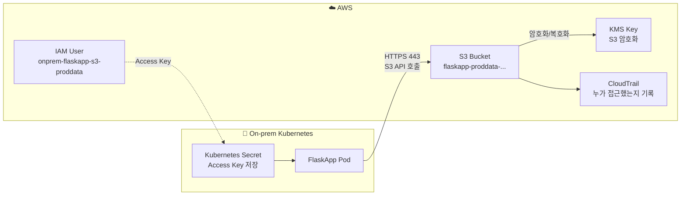

# 06-2. 온프레미스에서 S3 접근하기

> 이 문서는 `06-1. 보안 / IAM 상세 구현 설계`의 보충 문서입니다.  
> 기존 문서에서 빠져 있던 **온프레미스 FlaskApp이 AWS S3 버킷에 접근하는 방법**을 쉽게 정리합니다.
>
> 수정 반영(v2): 06-1의 “IAM User 사용 금지” 원칙과 충돌하지 않도록, 온프렘 S3 접근용 IAM User를 **통제된 예외**로 명시합니다. 또한 Access Key는 물론 IAM User 자체도 일반 TerraformDeployRole이 만들지 않고, 보안 관리자/SSO 관리자 권한으로 1회 생성하는 방식으로 정리합니다.

---

## v2 수정 요약

- 06-1의 IAM User 금지 원칙과 충돌하지 않도록, 온프렘 S3 접근 IAM User를 **통제된 예외**로 명시
- IAM User와 IAM Policy/Access Key는 일반 TerraformDeployRole이 만들지 않고 보안 관리자/SSO 관리자가 승인 후 수동 생성
- Terraform은 `onprem_iam_user_arn`을 변수로 받아 S3 Bucket Policy와 KMS Key Policy에서만 참조
- S3 접근 범위를 `uploads/*`, `static/*`로 고정
- EKS IRSA도 같은 prefix 기준으로 권한 축소하도록 기준 추가
- S3 Default Encryption과 Bucket Policy의 역할을 분리해서 설명

---

## 📌 한 줄 요약

> 온프레미스 앱이 AWS S3에 사진/파일을 올리려면 AWS가 알아볼 수 있는 **전용 출입증**이 필요합니다.  
> 이 문서에서는 그 출입증 역할을 하는 **IAM User + Access Key**를 만들고, 필요한 S3 경로에만 접근하도록 제한합니다.

---

## 목차

- [0. 이 문서가 필요한 이유](#0-이-문서가-필요한-이유)
- [1. 먼저 이해해야 할 용어](#1-먼저-이해해야-할-용어)
- [2. 최종 결론](#2-최종-결론)
- [3. 전체 흐름 그림](#3-전체-흐름-그림)
- [4. 왜 AWS EKS는 IRSA, 온프렘은 IAM User인가](#4-왜-aws-eks는-irsa-온프렘은-iam-user인가)
- [5. 우리가 만들 것들](#5-우리가-만들-것들)
- [6. 1단계 — IAM User 만들기](#6-1단계--iam-user-만들기)
- [7. 2단계 — IAM Policy 붙이기](#7-2단계--iam-policy-붙이기)
- [8. 3단계 — S3 Bucket Policy로 한 번 더 막기](#8-3단계--s3-bucket-policy로-한-번-더-막기)
- [9. 4단계 — KMS 키 사용 권한 열어주기](#9-4단계--kms-키-사용-권한-열어주기)
- [10. 5단계 — Access Key 만들기](#10-5단계--access-key-만들기)
- [11. 6단계 — 온프렘 Kubernetes에 넣기](#11-6단계--온프렘-kubernetes에-넣기)
- [12. 앱 설정 예시](#12-앱-설정-예시)
- [13. 네트워크에서 열려 있어야 하는 것](#13-네트워크에서-열려-있어야-하는-것)
- [14. Access Key 회전 방법](#14-access-key-회전-방법)
- [15. 장애 상황별 원인 찾기](#15-장애-상황별-원인-찾기)
- [16. 절대 하면 안 되는 것](#16-절대-하면-안-되는-것)
- [17. 나중에 개선할 방향](#17-나중에-개선할-방향)
- [18. 최종 체크리스트](#18-최종-체크리스트)

---

## 0. 이 문서가 필요한 이유

기존 DR 설계에서는 파일 저장소를 이렇게 설계했습니다.

```text
 온프레미스 FlaskApp  ─┐
                       ├─> 같은 S3 버킷 사용
   AWS EKS FlaskApp   ─┘
```

사용하는 S3 버킷은 다음입니다.

```text
flaskapp-proddata-kosa-project-team3-snow-lai9z
```

이 버킷은 사용자 업로드 사진, 첨부파일, 정적 파일 등을 저장하는 공간입니다.

AWS EKS에서 실행되는 앱은 **IRSA**라는 방식으로 S3 권한을 받을 수 있습니다.  
하지만 온프레미스 Kubernetes에서 실행되는 앱은 AWS 밖에 있으므로, IRSA를 바로 쓰기 어렵습니다.

그래서 온프레미스 앱에는 별도의 AWS 접근 정보가 필요합니다.

이 문서의 목적은 다음 질문에 답하는 것입니다.

> “온프레미스 앱이 S3에 접근하려면 IAM 계정을 어떻게 만들고, 어디에 저장하고, 어떻게 관리해야 하나?”

---

## 1. 먼저 이해해야 할 용어

### 1.1 S3

AWS의 파일 저장소입니다.

비유하면 **인터넷에 있는 파일 창고**입니다.

예시:

```text
flaskapp-proddata-kosa-project-team3-snow-lai9z/uploads/2026/05/photo.jpg
```

여기서 구조는 이렇게 볼 수 있습니다.

| 부분 | 의미 |
|---|---|
| `flaskapp-proddata-kosa-project-team3-snow-lai9z` | S3 버킷 이름 |
| `uploads/` | 폴더처럼 쓰는 prefix |
| `2026/05/photo.jpg` | 실제 파일 key |

S3에는 진짜 폴더 개념은 없지만, `/`를 넣어서 폴더처럼 관리합니다.

---

### 1.2 IAM User

AWS 안에서 사용하는 사용자 계정입니다.

하지만 여기서 만드는 IAM User는 사람이 로그인하는 계정이 아닙니다.

이 문서에서는 다음처럼 사용합니다.

```text
온프레미스 FlaskApp 전용 기계 계정
```

즉, 사람이 콘솔에 로그인하려고 만드는 계정이 아니라, 앱이 S3에 접근하기 위해 사용하는 계정입니다.

---

### 1.3 Access Key

IAM User가 AWS API를 호출할 때 쓰는 키입니다.

보통 두 개가 한 세트입니다.

```text
AWS_ACCESS_KEY_ID
AWS_SECRET_ACCESS_KEY
```

비유하면 다음과 같습니다.

| 항목 | 비유 |
|---|---|
| `AWS_ACCESS_KEY_ID` | 출입증 번호 |
| `AWS_SECRET_ACCESS_KEY` | 출입증 비밀번호 |

둘 중 하나라도 노출되면 위험합니다.  
특히 `AWS_SECRET_ACCESS_KEY`는 절대 Git, Slack, 문서, 터미널 로그에 남기면 안 됩니다.

---

### 1.4 IAM Policy

IAM User가 무엇을 할 수 있는지 정하는 규칙입니다.

예를 들어 다음처럼 정합니다.

```text
이 IAM User는 proddata 버킷의 uploads/ 아래에는 파일을 올릴 수 있다.
하지만 다른 버킷에는 접근할 수 없다.
```

---

### 1.5 Bucket Policy

S3 버킷 자체에 붙는 규칙입니다.

IAM Policy가 “이 사용자는 무엇을 할 수 있나?”라면, Bucket Policy는 “이 버킷은 누구를 받아줄 것인가?”입니다.

둘 다 통과해야 접근이 됩니다.

```text
IAM Policy 허용 + Bucket Policy 허용 = 접근 가능
IAM Policy 허용 + Bucket Policy 차단 = 접근 실패
IAM Policy 차단 + Bucket Policy 허용 = 접근 실패
```

---

### 1.6 KMS

S3 파일을 암호화할 때 쓰는 AWS 키 관리 서비스입니다.

이 설계에서는 S3 객체를 그냥 저장하지 않고, KMS 키로 암호화해서 저장합니다.

따라서 앱이 S3에 파일을 올리고 내려받으려면 S3 권한뿐 아니라 KMS 권한도 필요합니다.

---

### 1.7 Kubernetes Secret

Kubernetes 안에서 비밀번호, 토큰, Access Key 같은 값을 저장하는 리소스입니다.

다만 Kubernetes Secret은 기본적으로 **base64 인코딩**일 뿐입니다.  
base64는 암호화가 아닙니다.

그래서 운영에서는 가능하면 다음 중 하나를 쓰는 것이 좋습니다.

| 방식 | 설명 |
|---|---|
| SOPS | Git에는 암호화된 Secret만 저장 |
| Sealed Secrets | 클러스터에서만 복호화 가능한 Secret |
| Vault | 사내 비밀 저장소에서 동적으로 주입 |
| plain Kubernetes Secret | 임시 또는 실습용으로만 사용 |

---

## 2. 최종 결론

온프레미스 앱의 S3 접근은 우선 다음 방식으로 구현합니다.

| 항목 | 값 |
|---|---|
| 접근 방식 | IAM User + Access Key |
| IAM User 이름 | `onprem-flaskapp-s3-proddata` |
| AWS 콘솔 로그인 | 만들지 않음 |
| 접근 버킷 | `flaskapp-proddata-kosa-project-team3-snow-lai9z` |
| 접근 경로 | `uploads/*`, `static/*` 중심 |
| 통신 방식 | HTTPS 443, 일반 인터넷 outbound |
| 암호화 | S3 Default Encryption = SSE-KMS |
| Access Key 개수 | 평소 1개만 Active |
| 회전 주기 | 90일 이내 |
| Terraform 처리 | IAM User/Access Key 생성 금지, ARN만 변수로 전달 |
| 장기 개선 | IAM Roles Anywhere로 전환 |

핵심 원칙은 이것입니다.

> “온프렘 앱 전용 IAM User를 통제된 예외로 만들되, 사람용 계정처럼 쓰지 않고 필요한 S3 prefix만 허용한다.”

### 2.1 기존 06-1 보안 원칙과의 관계

06-1 문서의 기본 원칙은 **IAM User 사용 금지**입니다. 이 원칙은 사람, CI/CD, AWS 내부 워크로드에 적용합니다.

다만 온프레미스 Kubernetes는 AWS 밖에 있기 때문에 EKS의 IRSA를 바로 사용할 수 없습니다. 그래서 이 문서의 IAM User는 다음 조건을 만족하는 **통제된 예외**로 둡니다.

| 구분 | 적용 기준 |
|---|---|
| 사람 로그인 | 금지. Console password 생성 안 함 |
| CI/CD 사용 | 금지. GitHub Actions는 OIDC Role 사용 |
| AWS EKS Pod | 금지. EKS는 IRSA 사용 |
| 온프렘 FlaskApp S3 접근 | 예외적으로 허용 |
| 권한 범위 | `uploads/*`, `static/*`만 허용 |
| Access Key | 1개만 Active, 90일 이내 회전 |
| 생성 주체 | 일반 TerraformDeployRole이 아니라 보안 관리자/SSO 관리자 |

> 📌 정리하면, “IAM User를 새 표준으로 채택한다”가 아니라 “온프렘 앱이 S3에 접근하기 위한 최소한의 예외를 문서화한다”가 이 문서의 목적입니다.

---

## 3. 전체 흐름 그림



흐름을 말로 풀면 다음과 같습니다.

1. AWS에서 온프렘 앱 전용 IAM User를 만든다.
2. 그 IAM User에 S3 접근 권한을 붙인다.
3. Access Key를 만든다.
4. Access Key를 온프렘 Kubernetes Secret에 저장한다.
5. FlaskApp Pod가 그 Secret을 환경변수로 읽는다.
6. FlaskApp이 S3에 파일을 업로드하거나 다운로드한다.
7. S3 접근 기록은 CloudTrail에 남긴다.

---

## 4. 왜 AWS EKS는 IRSA, 온프렘은 IAM User인가

### 4.1 AWS EKS의 경우

AWS EKS 안에서 실행되는 Pod는 IRSA를 사용할 수 있습니다.

IRSA는 쉽게 말하면 다음 구조입니다.

```text
Pod가 AWS에게 “나는 flaskapp-sa야”라고 증명
→ AWS가 짧은 시간만 유효한 임시 권한 발급
→ Pod가 그 권한으로 S3 접근
```

장점은 Access Key를 직접 저장하지 않아도 된다는 것입니다.

---

### 4.2 온프레미스 Kubernetes의 경우

온프레미스 Kubernetes는 AWS 밖에 있습니다.

그래서 EKS의 IRSA를 바로 사용할 수 없습니다.

물론 나중에는 IAM Roles Anywhere라는 방식으로 온프렘에서도 임시 자격증명을 받을 수 있습니다.  
하지만 처음 구현하기에는 인증서, CA, credential helper 등 준비할 것이 더 많습니다.

그래서 1차 구현은 다음처럼 갑니다.

```text
쉬운 1차 구현: IAM User + Access Key
장기 개선안: IAM Roles Anywhere
```

---

## 5. 우리가 만들 것들

전체적으로 만드는 것은 5가지입니다. 단, **무엇을 Terraform으로 만들지**를 분명히 나눕니다.

| 순서 | 만들 것 | 역할 | 생성/관리 주체 |
|---:|---|---|---|
| 1 | IAM User | 온프렘 앱 전용 AWS 계정 | 보안 관리자/SSO 관리자 수동 생성 |
| 2 | IAM Policy 또는 Inline Policy | 이 계정이 S3에서 할 수 있는 일 정의 | 보안 관리자/SSO 관리자 수동 부여 |
| 3 | S3 Bucket Policy | 버킷 자체에서 접근 조건 제한 | Terraform 가능 |
| 4 | KMS Key Policy | 암호화된 S3 객체를 읽고 쓰게 허용 | Terraform 가능 |
| 5 | Kubernetes Secret | 온프렘 앱에 Access Key 전달 | 온프렘 운영 절차 |

중요한 점은 **IAM User와 Access Key를 일반 TerraformDeployRole로 만들지 않는 것**입니다.

이유는 두 가지입니다.

1. 06-1의 Permission Boundary는 `iam:CreateUser`, `iam:CreateAccessKey`를 위험 작업으로 차단합니다.
2. Access Key를 Terraform으로 만들면 Secret Access Key가 Terraform state에 남을 수 있습니다.

따라서 권장 방식은 다음입니다.

```text
보안 관리자/SSO 관리자: IAM User 생성, IAM Policy 부여, Access Key 생성
Terraform: S3 Bucket Policy, KMS Key Policy에 onprem_iam_user_arn만 참조
온프렘 운영자: Access Key를 Kubernetes Secret 또는 Secret Store에 저장
```

Terraform 코드에는 다음처럼 ARN만 변수로 넘깁니다.

```hcl
variable "onprem_iam_user_arn" {
  type        = string
  description = "온프렘 FlaskApp S3 접근용 IAM User ARN"
}
```

---

## 6. 1단계 — IAM User 만들기

### 6.1 이름

```text
onprem-flaskapp-s3-proddata
```

### 6.2 중요한 설정

| 설정 | 값 |
|---|---|
| Console password | 만들지 않음 |
| Access Key | 나중에 1개 생성 |
| 권한 | 처음에는 아무 권한 없음 |
| 용도 | 온프렘 FlaskApp S3 접근 전용 |

### 6.3 AWS CLI 예시

아래 작업은 일반 TerraformDeployRole이 아니라, IAM User 예외 생성을 승인받은 보안 관리자 또는 SSO 관리자 권한으로 수행합니다.

```bash
aws iam create-user \
  --user-name onprem-flaskapp-s3-proddata \
  --tags \
    Key=Project,Value=flaskapp \
    Key=Environment,Value=prod \
    Key=Owner,Value=platform \
    Key=Purpose,Value=onprem-s3-access
```

여기서 중요한 점은 콘솔 로그인 프로필을 만들지 않는 것입니다.

다음 명령은 실행하지 않습니다.

```bash
# 실행하지 말 것
aws iam create-login-profile
```

---

## 7. 2단계 — IAM Policy 붙이기

이 단계도 일반 TerraformDeployRole로 처리하지 않습니다. 06-1의 Permission Boundary와 충돌하지 않게, 보안 관리자/SSO 관리자가 수동으로 정책을 생성하고 IAM User에 연결합니다.

> 실무에서는 아래 JSON을 `onprem-flaskapp-s3-proddata-policy.json` 같은 파일로 저장해 리뷰받고, 승인 후 연결합니다.

### 7.1 권한을 너무 크게 주면 안 됨

절대 이렇게 주면 안 됩니다.

```json
{
  "Effect": "Allow",
  "Action": "s3:*",
  "Resource": "*"
}
```

이렇게 주면 모든 S3 버킷에 대해 거의 모든 작업이 가능해집니다.

우리는 온프렘 FlaskApp이 필요한 경로만 허용합니다.

---

### 7.2 허용할 경로

| S3 경로 | 용도 | 허용 여부 |
|---|---|---|
| `uploads/*` | 사용자 업로드 파일 | 허용 |
| `static/*` | 정적 파일 | 허용 |
| `backups/*` | 백업 파일 | 기본 차단 |
| `alb-access-logs/*` | ALB 로그 | 차단 |
| `vpc-flow-logs/*` | VPC 로그 | 차단 |

---

### 7.3 IAM Policy 예시

아래 JSON에서 `<ACCOUNT_ID>`와 `<KMS_S3_KEY_ARN>`은 실제 값으로 바꿔야 합니다.

```json
{
  "Version": "2012-10-17",
  "Statement": [
    {
      "Sid": "AllowIdentityCheck",
      "Effect": "Allow",
      "Action": "sts:GetCallerIdentity",
      "Resource": "*"
    },
    {
      "Sid": "AllowListUploadsAndStaticOnly",
      "Effect": "Allow",
      "Action": "s3:ListBucket",
      "Resource": "arn:aws:s3:::flaskapp-proddata-kosa-project-team3-snow-lai9z",
      "Condition": {
        "StringLike": {
          "s3:prefix": [
            "uploads/*",
            "static/*"
          ]
        }
      }
    },
    {
      "Sid": "AllowReadWriteUploadsAndStaticOnly",
      "Effect": "Allow",
      "Action": [
        "s3:GetObject",
        "s3:PutObject",
        "s3:DeleteObject"
      ],
      "Resource": [
        "arn:aws:s3:::flaskapp-proddata-kosa-project-team3-snow-lai9z/uploads/*",
        "arn:aws:s3:::flaskapp-proddata-kosa-project-team3-snow-lai9z/static/*"
      ]
    },
    {
      "Sid": "AllowKmsForS3Only",
      "Effect": "Allow",
      "Action": [
        "kms:Encrypt",
        "kms:Decrypt",
        "kms:GenerateDataKey",
        "kms:DescribeKey"
      ],
      "Resource": "<KMS_S3_KEY_ARN>",
      "Condition": {
        "StringEquals": {
          "kms:ViaService": "s3.ap-northeast-2.amazonaws.com",
          "kms:CallerAccount": "<ACCOUNT_ID>"
        }
      }
    }
  ]
}
```

### 7.4 정책 생성 및 연결 예시

정책 파일을 저장했다면 보안 관리자 권한으로 다음처럼 생성하고 붙입니다.

```bash
aws iam create-policy \
  --policy-name onprem-flaskapp-s3-proddata-policy \
  --policy-document file://onprem-flaskapp-s3-proddata-policy.json

aws iam attach-user-policy \
  --user-name onprem-flaskapp-s3-proddata \
  --policy-arn arn:aws:iam::<ACCOUNT_ID>:policy/onprem-flaskapp-s3-proddata-policy
```

정책을 Terraform으로 만들지 않는 이유는, 현재 06-1의 Terraform 권한 경계가 IAM User 생성과 장기 Access Key 생성을 막는 방향이기 때문입니다. 이 예외 계정은 별도 승인 절차로 관리하는 편이 문서 간 정합성이 좋습니다.

### 7.5 Delete 권한은 꼭 필요한지 확인

`s3:DeleteObject`는 파일 삭제 권한입니다.

앱에서 사용자 파일 삭제 기능이 필요하면 있어야 합니다.  
하지만 삭제 기능이 필요 없다면 빼는 것이 더 안전합니다.

삭제 권한을 줄 경우 S3 Versioning을 반드시 켜두는 것을 권장합니다.

---

## 8. 3단계 — S3 Bucket Policy로 한 번 더 막기

IAM Policy만 있어도 동작은 합니다.

하지만 Bucket Policy를 같이 쓰면 더 안전합니다.

Bucket Policy에서는 보통 다음을 강제합니다.

| 조건 | 의미 |
|---|---|
| HTTPS만 허용 | HTTP로 접근하면 차단 |
| 특정 IAM User만 허용 | 온프렘 앱 전용 계정만 허용 |
| 필요한 prefix만 허용 | `uploads/*`, `static/*` 중심으로 제한 |
| 선택: KMS 암호화 헤더 강제 | 앱이 명시적으로 SSE-KMS 헤더를 보내도록 강제 |
| 선택: 온프렘 고정 IP만 허용 | 키가 유출되어도 다른 곳에서 사용하기 어렵게 함 |

> 📌 S3 버킷의 기본 암호화는 05-1의 `proddata` 버킷 설정처럼 SSE-KMS로 둡니다. Bucket Policy는 기본적으로 HTTPS, Principal, prefix를 제한하고, 필요하면 별도 Deny 정책으로 KMS 암호화 헤더까지 강제합니다.

---

### 8.1 HTTPS가 아니면 차단

```json
{
  "Sid": "DenyInsecureTransport",
  "Effect": "Deny",
  "Principal": "*",
  "Action": "s3:*",
  "Resource": [
    "arn:aws:s3:::flaskapp-proddata-kosa-project-team3-snow-lai9z",
    "arn:aws:s3:::flaskapp-proddata-kosa-project-team3-snow-lai9z/*"
  ],
  "Condition": {
    "Bool": {
      "aws:SecureTransport": "false"
    }
  }
}
```

이 정책은 `http://` 접근을 막고 `https://` 접근만 허용합니다.

---

### 8.2 온프렘 IAM User만 특정 prefix 접근 허용

```json
{
  "Sid": "AllowOnPremFlaskAppAccess",
  "Effect": "Allow",
  "Principal": {
    "AWS": "arn:aws:iam::<ACCOUNT_ID>:user/onprem-flaskapp-s3-proddata"
  },
  "Action": [
    "s3:GetObject",
    "s3:PutObject",
    "s3:DeleteObject"
  ],
  "Resource": [
    "arn:aws:s3:::flaskapp-proddata-kosa-project-team3-snow-lai9z/uploads/*",
    "arn:aws:s3:::flaskapp-proddata-kosa-project-team3-snow-lai9z/static/*"
  ]
}
```

---

### 8.3 선택 — KMS 암호화 헤더가 없으면 업로드 차단

S3 Default Encryption만으로도 객체는 SSE-KMS로 암호화됩니다.

다만 앱이 업로드할 때도 명시적으로 KMS 암호화 헤더를 보내도록 강제하고 싶다면 아래 Deny 정책을 추가할 수 있습니다.

```json
{
  "Sid": "DenyPutObjectWithoutKmsEncryption",
  "Effect": "Deny",
  "Principal": "*",
  "Action": "s3:PutObject",
  "Resource": [
    "arn:aws:s3:::flaskapp-proddata-kosa-project-team3-snow-lai9z/uploads/*",
    "arn:aws:s3:::flaskapp-proddata-kosa-project-team3-snow-lai9z/static/*"
  ],
  "Condition": {
    "StringNotEquals": {
      "s3:x-amz-server-side-encryption": "aws:kms"
    }
  }
}
```

특정 KMS 키까지 강제하고 싶으면 아래 조건도 추가합니다.

```json
"StringNotEquals": {
  "s3:x-amz-server-side-encryption-aws-kms-key-id": "<KMS_S3_KEY_ARN>"
}
```

이 정책을 추가하면 앱 코드에서 `ServerSideEncryption=aws:kms`, `SSEKMSKeyId=<KMS_S3_KEY_ARN>`을 반드시 넣어야 합니다.

---

### 8.4 온프렘 NAT Public IP 제한은 선택

온프렘에서 인터넷으로 나갈 때 Public IP가 고정되어 있다면 아래 조건을 추가할 수 있습니다.

```json
"Condition": {
  "IpAddress": {
    "aws:SourceIp": [
      "<ONPREM_NAT_PUBLIC_IP>/32"
    ]
  }
}
```

단, 이 조건은 조심해야 합니다.

실제 S3에 보이는 IP와 다르게 넣으면 앱 업로드가 전부 실패합니다.

적용 순서는 다음을 권장합니다.

1. 먼저 IP 제한 없이 S3 접근을 성공시킨다.
2. CloudTrail에서 실제 source IP를 확인한다.
3. 그 IP가 고정인지 확인한다.
4. Bucket Policy에 `aws:SourceIp` 조건을 추가한다.
5. 업로드/다운로드를 다시 테스트한다.

---

## 9. 4단계 — KMS 키 사용 권한 열어주기

S3 버킷이 SSE-KMS로 암호화되어 있으면 S3 권한만으로는 부족할 수 있습니다.

앱이 파일을 업로드할 때는 KMS로 데이터 키를 만들어야 하고, 다운로드할 때는 KMS로 복호화해야 합니다.

그래서 KMS Key Policy에도 온프렘 IAM User를 허용해야 합니다.

```json
{
  "Sid": "AllowOnPremFlaskAppUserUseKeyViaS3",
  "Effect": "Allow",
  "Principal": {
    "AWS": "arn:aws:iam::<ACCOUNT_ID>:user/onprem-flaskapp-s3-proddata"
  },
  "Action": [
    "kms:Encrypt",
    "kms:Decrypt",
    "kms:GenerateDataKey",
    "kms:DescribeKey"
  ],
  "Resource": "*",
  "Condition": {
    "StringEquals": {
      "kms:ViaService": "s3.ap-northeast-2.amazonaws.com",
      "kms:CallerAccount": "<ACCOUNT_ID>"
    }
  }
}
```

여기서 `kms:ViaService` 조건이 중요합니다.

이 조건은 다음 의미입니다.

```text
이 KMS 키는 S3를 통해서 사용할 때만 허용한다.
```

즉, IAM User가 KMS 키를 아무 데서나 마음대로 쓰는 것을 줄여줍니다.

---

## 10. 5단계 — Access Key 만들기

### 10.1 Access Key는 Terraform으로 만들지 않기

Access Key는 Terraform으로 만들지 않습니다.

이유는 Secret Access Key가 Terraform state 파일에 남을 수 있기 때문입니다. 또한 06-1의 보안 원칙상 장기 키 생성은 일반 TerraformDeployRole의 작업 범위에서 제외합니다.

권장 방식은 다음입니다.

```text
IAM User와 IAM Policy: 보안 관리자/SSO 관리자가 승인 후 수동 생성
S3 Bucket Policy와 KMS Key Policy: Terraform에서 onprem_iam_user_arn만 참조
Access Key: 운영자가 CLI로 생성
생성 직후 온프렘 Secret Store에 저장
로컬 파일은 즉시 삭제
```

---

### 10.2 Access Key 생성

```bash
aws iam create-access-key \
  --user-name onprem-flaskapp-s3-proddata \
  --output json > /tmp/onprem-flaskapp-s3-access-key.json
```

출력 파일에는 다음 값이 들어 있습니다.

```json
{
  "AccessKey": {
    "AccessKeyId": "AKIA...",
    "SecretAccessKey": "...",
    "Status": "Active"
  }
}
```

`SecretAccessKey`는 이때 한 번만 확인할 수 있습니다.  
나중에 다시 조회할 수 없습니다.

---

### 10.3 만든 키가 맞는지 확인

```bash
export AWS_ACCESS_KEY_ID="<AccessKeyId>"
export AWS_SECRET_ACCESS_KEY="<SecretAccessKey>"
export AWS_DEFAULT_REGION="ap-northeast-2"

aws sts get-caller-identity
```

기대 결과는 다음과 비슷합니다.

```json
{
  "Account": "<ACCOUNT_ID>",
  "Arn": "arn:aws:iam::<ACCOUNT_ID>:user/onprem-flaskapp-s3-proddata"
}
```

확인이 끝나면 임시 파일을 삭제합니다.

```bash
shred -u /tmp/onprem-flaskapp-s3-access-key.json 2>/dev/null || rm -f /tmp/onprem-flaskapp-s3-access-key.json
```

---

## 11. 6단계 — 온프렘 Kubernetes에 넣기

### 11.1 가장 쉬운 방식

초기 테스트에서는 Kubernetes Secret으로 넣을 수 있습니다.

```bash
kubectl create namespace flaskapp --dry-run=client -o yaml | kubectl apply -f -

kubectl create secret generic flaskapp-s3-credentials \
  -n flaskapp \
  --from-literal=AWS_ACCESS_KEY_ID='<AccessKeyId>' \
  --from-literal=AWS_SECRET_ACCESS_KEY='<SecretAccessKey>' \
  --from-literal=AWS_DEFAULT_REGION='ap-northeast-2' \
  --from-literal=AWS_REGION='ap-northeast-2' \
  --from-literal=S3_BUCKET='flaskapp-proddata-kosa-project-team3-snow-lai9z' \
  --from-literal=S3_PREFIX_UPLOADS='uploads/' \
  --from-literal=S3_PREFIX_STATIC='static/' \
  --dry-run=client -o yaml | kubectl apply -f -
```

이 방식은 쉽지만, 운영에서는 Secret을 평문 YAML로 Git에 올리면 안 됩니다. 가능하면 SOPS, Sealed Secrets, Vault 같은 방식을 사용하고, Git에는 암호화된 형태만 남깁니다.

---

### 11.2 Deployment에 Secret 연결

```yaml
apiVersion: apps/v1
kind: Deployment
metadata:
  name: flaskapp
  namespace: flaskapp
spec:
  template:
    spec:
      containers:
        - name: flaskapp
          image: <image>
          envFrom:
            - secretRef:
                name: flaskapp-s3-credentials
          env:
            - name: AWS_EC2_METADATA_DISABLED
              value: "true"
            - name: S3_SSE_ALGORITHM
              value: "aws:kms"
            - name: S3_KMS_KEY_ID
              value: "<KMS_S3_KEY_ARN>"
```

`AWS_EC2_METADATA_DISABLED=true`를 넣는 이유는 온프렘 환경에서 AWS SDK가 EC2 메타데이터 서버를 찾느라 지연되는 것을 줄이기 위해서입니다.

---

### 11.3 Pod 재시작

Secret을 바꿔도 이미 떠 있는 Pod의 환경변수는 자동으로 바뀌지 않습니다.

따라서 Secret을 바꾼 뒤에는 Deployment를 재시작합니다.

```bash
kubectl rollout restart deployment/flaskapp -n flaskapp
kubectl rollout status deployment/flaskapp -n flaskapp
```

---

## 12. 앱 설정 예시

### 12.1 환경변수

앱은 다음 환경변수를 사용합니다.

```text
AWS_ACCESS_KEY_ID
AWS_SECRET_ACCESS_KEY
AWS_REGION=ap-northeast-2
S3_BUCKET=flaskapp-proddata-kosa-project-team3-snow-lai9z
S3_PREFIX_UPLOADS=uploads/
S3_PREFIX_STATIC=static/
S3_KMS_KEY_ID=<KMS_S3_KEY_ARN>
```

---

### 12.2 Python boto3 업로드 예시

```python
import os
import uuid
import boto3

s3 = boto3.client("s3", region_name=os.environ.get("AWS_REGION", "ap-northeast-2"))

bucket = os.environ["S3_BUCKET"]
kms_key_id = os.environ["S3_KMS_KEY_ID"]


def upload_file(local_path: str, content_type: str) -> str:
    object_key = f"uploads/{uuid.uuid4()}.jpg"

    s3.upload_file(
        local_path,
        bucket,
        object_key,
        ExtraArgs={
            "ContentType": content_type,
            "ServerSideEncryption": "aws:kms",
            "SSEKMSKeyId": kms_key_id,
        },
    )

    return object_key
```

---

### 12.3 파일 key 만들 때 주의

사용자가 보낸 파일명을 그대로 S3 key로 쓰지 않는 것이 좋습니다.

나쁜 예시:

```text
uploads/../../secret.txt
uploads/사용자가_입력한_파일명.exe
```

좋은 예시:

```text
uploads/2026/05/14/550e8400-e29b-41d4-a716-446655440000.jpg
```

권장 원칙은 다음입니다.

- 파일명은 UUID로 새로 만든다.
- 허용 확장자만 받는다.
- MIME type을 검사한다.
- S3 key가 반드시 `uploads/`로 시작하는지 확인한다.
- `../` 같은 문자열은 차단한다.

### 12.4 AWS EKS IRSA 권한도 같은 기준으로 맞추기

이 문서는 온프렘 IAM User를 다루지만, 정합성을 위해 AWS EKS의 `flaskapp-sa` IRSA 권한도 같은 prefix 기준으로 맞추는 것을 권장합니다.

기준은 다음과 같습니다.

```json
"Resource": [
  "arn:aws:s3:::flaskapp-proddata-kosa-project-team3-snow-lai9z/uploads/*",
  "arn:aws:s3:::flaskapp-proddata-kosa-project-team3-snow-lai9z/static/*"
]
```

즉, 온프렘 IAM User와 EKS IRSA 모두 앱이 실제로 쓰는 `uploads/*`, `static/*`만 접근하게 맞춥니다. `backups/*`, `alb-access-logs/*`, `vpc-flow-logs/*`는 앱 권한에서 제외합니다.

---

## 13. 네트워크에서 열려 있어야 하는 것

온프렘에서 S3를 사용할 때 AWS가 온프렘으로 들어오는 inbound는 필요 없습니다.

필요한 것은 온프렘에서 AWS로 나가는 outbound입니다.

| 방향 | 포트 | 대상 | 이유 |
|---|---:|---|---|
| On-prem → S3 | TCP 443 | `s3.ap-northeast-2.amazonaws.com` | S3 API 호출 |
| On-prem → S3 bucket endpoint | TCP 443 | `*.s3.ap-northeast-2.amazonaws.com` | 버킷 접근 |
| On-prem → DNS | UDP/TCP 53 | 사내 DNS | S3 주소 해석 |
| On-prem → NTP | UDP 123 | 사내 NTP 또는 외부 NTP | 시간 동기화 |

시간 동기화가 중요한 이유는 AWS API 서명이 시간에 민감하기 때문입니다.

서버 시간이 너무 틀어져 있으면 다음과 같은 오류가 날 수 있습니다.

```text
SignatureDoesNotMatch
RequestTimeTooSkewed
```

---

## 14. Access Key 회전 방법

Access Key는 오래 쓰면 위험합니다.

권장 주기는 90일 이내입니다.

IAM User는 Access Key를 최대 2개까지 가질 수 있습니다.  
이 특징을 이용하면 무중단 회전이 가능합니다.

---

### 14.1 현재 키 확인

```bash
aws iam list-access-keys \
  --user-name onprem-flaskapp-s3-proddata
```

---

### 14.2 새 키 생성

```bash
aws iam create-access-key \
  --user-name onprem-flaskapp-s3-proddata \
  --output json > /tmp/new-onprem-s3-key.json
```

이 순간에는 기존 키와 새 키가 둘 다 Active일 수 있습니다.

---

### 14.3 Kubernetes Secret 교체

```bash
NEW_ACCESS_KEY_ID=$(jq -r '.AccessKey.AccessKeyId' /tmp/new-onprem-s3-key.json)
NEW_SECRET_ACCESS_KEY=$(jq -r '.AccessKey.SecretAccessKey' /tmp/new-onprem-s3-key.json)

kubectl create secret generic flaskapp-s3-credentials \
  -n flaskapp \
  --from-literal=AWS_ACCESS_KEY_ID="$NEW_ACCESS_KEY_ID" \
  --from-literal=AWS_SECRET_ACCESS_KEY="$NEW_SECRET_ACCESS_KEY" \
  --from-literal=AWS_DEFAULT_REGION='ap-northeast-2' \
  --from-literal=AWS_REGION='ap-northeast-2' \
  --from-literal=S3_BUCKET='flaskapp-proddata-kosa-project-team3-snow-lai9z' \
  --from-literal=S3_PREFIX_UPLOADS='uploads/' \
  --from-literal=S3_PREFIX_STATIC='static/' \
  --dry-run=client -o yaml | kubectl apply -f -
```

---

### 14.4 앱 재시작

```bash
kubectl rollout restart deployment/flaskapp -n flaskapp
kubectl rollout status deployment/flaskapp -n flaskapp
```

---

### 14.5 새 키로 S3 접근 테스트

```bash
kubectl exec -n flaskapp deploy/flaskapp -- \
  python - <<'PY'
import os, time, boto3
bucket = os.environ['S3_BUCKET']
key = f"uploads/_health/s3-key-rotation-{int(time.time())}.txt"
s3 = boto3.client('s3', region_name=os.environ.get('AWS_REGION', 'ap-northeast-2'))
s3.put_object(Bucket=bucket, Key=key, Body=b'ok')
print(s3.get_object(Bucket=bucket, Key=key)['Body'].read().decode())
s3.delete_object(Bucket=bucket, Key=key)
PY
```

기대 결과:

```text
ok
```

---

### 14.6 기존 키 비활성화

```bash
aws iam update-access-key \
  --user-name onprem-flaskapp-s3-proddata \
  --access-key-id <OLD_ACCESS_KEY_ID> \
  --status Inactive
```

비활성화 후 앱이 정상 동작하는지 다시 확인합니다.

---

### 14.7 기존 키 삭제

문제가 없으면 기존 키를 삭제합니다.

```bash
aws iam delete-access-key \
  --user-name onprem-flaskapp-s3-proddata \
  --access-key-id <OLD_ACCESS_KEY_ID>
```

임시 파일도 삭제합니다.

```bash
shred -u /tmp/new-onprem-s3-key.json 2>/dev/null || rm -f /tmp/new-onprem-s3-key.json
```

---

## 15. 장애 상황별 원인 찾기

### 15.1 `AccessDenied`

가장 흔한 오류입니다.

확인 순서:

1. IAM Policy에 해당 S3 action이 있는가?
2. Resource ARN이 정확한가?
3. Bucket Policy에서 막고 있지 않은가?
4. KMS 권한이 빠져 있지 않은가?
5. 접근하려는 key가 `uploads/` 또는 `static/` 아래인가?

---

### 15.2 `SignatureDoesNotMatch`

가능한 원인:

- Access Key ID와 Secret Access Key가 서로 다른 세트임
- Secret Access Key를 잘못 복사함
- 서버 시간이 크게 틀어짐
- region 설정이 잘못됨

확인:

```bash
date
aws sts get-caller-identity
```

---

### 15.3 `KMS AccessDeniedException`

S3 접근은 되었지만 KMS 암호화/복호화에서 막힌 상황입니다.

확인할 것:

- IAM Policy에 `kms:Decrypt`, `kms:GenerateDataKey`가 있는가?
- KMS Key Policy에 IAM User가 허용되어 있는가?
- `kms:ViaService`가 `s3.ap-northeast-2.amazonaws.com`으로 맞는가?
- 앱에서 올바른 KMS Key ARN을 쓰는가?

---

### 15.4 `NoSuchBucket`

버킷 이름이 틀렸을 가능성이 큽니다.

확인:

```bash
echo $S3_BUCKET
```

정상 값:

```text
flaskapp-proddata-kosa-project-team3-snow-lai9z
```

---

### 15.5 업로드가 느림

확인할 것:

- 온프렘 인터넷 회선 상태
- DNS 지연
- 프록시 또는 방화벽 검사 장비
- 대용량 파일 multipart upload 설정
- S3 리전이 `ap-northeast-2`로 맞는지

---

## 16. 절대 하면 안 되는 것

아래는 운영에서 피해야 합니다.

| 금지 사항 | 이유 |
|---|---|
| Access Key를 Git에 커밋 | 유출 사고로 이어짐 |
| Slack/카톡/문서에 Secret Key 공유 | 회수 불가능하게 퍼질 수 있음 |
| IAM User에 `AdministratorAccess` 부여 | S3뿐 아니라 AWS 전체가 위험해짐 |
| `s3:*` + `Resource:*` 부여 | 모든 버킷에 접근 가능해짐 |
| Terraform으로 Access Key 생성 | Secret이 tfstate에 남을 수 있음 |
| 콘솔 로그인 비밀번호 생성 | 사람용 계정처럼 오용될 수 있음 |
| 키를 1년 이상 방치 | 유출 여부를 알기 어려움 |
| Kubernetes Secret YAML을 평문으로 Git 저장 | base64는 암호화가 아님 |

---

## 17. 나중에 개선할 방향

IAM User + Access Key 방식은 쉽지만 단점이 있습니다.

가장 큰 단점은 Access Key가 장기 자격증명이라는 것입니다.

더 좋은 방식은 **IAM Roles Anywhere**입니다.

### 17.1 IAM Roles Anywhere란?

AWS 밖의 서버도 인증서를 이용해서 AWS IAM Role을 빌려 쓸 수 있게 해주는 방식입니다.

비유하면 다음과 같습니다.

```text
현재 방식:
앱이 장기 출입증을 들고 다님

IAM Roles Anywhere:
앱이 인증서로 본인 확인
→ AWS가 짧은 시간짜리 임시 출입증 발급
```

### 17.2 전환 순서

1. 지금은 IAM User 방식으로 빠르게 안정화한다.
2. 온프렘 인증서 관리 방식을 정한다.
3. IAM Roles Anywhere Trust Anchor를 만든다.
4. 온프렘 staging에서 먼저 테스트한다.
5. 운영 앱을 IAM Roles Anywhere 방식으로 전환한다.
6. 기존 IAM User Access Key를 비활성화한다.
7. 문제 없으면 IAM User를 삭제한다.

---

## 18. 최종 체크리스트

### 18.1 IAM

- [ ] `onprem-flaskapp-s3-proddata` IAM User가 있다.
- [ ] 이 IAM User는 보안 관리자/SSO 관리자 승인으로 생성되었다.
- [ ] 일반 TerraformDeployRole이 `iam:CreateUser`, `iam:CreateAccessKey`를 수행하지 않는다.
- [ ] 콘솔 로그인 비밀번호가 없다.
- [ ] Access Key는 평소 1개만 Active다.
- [ ] IAM Policy가 `uploads/*`, `static/*`만 허용한다.
- [ ] `AdministratorAccess`가 붙어 있지 않다.
- [ ] `s3:*`, `Resource:*` 같은 과한 권한이 없다.

### 18.2 S3

- [ ] 버킷 이름은 `flaskapp-proddata-kosa-project-team3-snow-lai9z`다.
- [ ] Block Public Access가 켜져 있다.
- [ ] Versioning이 켜져 있다.
- [ ] Default Encryption이 SSE-KMS다.
- [ ] Bucket Policy에 HTTPS 강제 조건이 있다.
- [ ] 온프렘 IAM User로 `uploads/_health/`에 Put/Get/Delete 테스트가 된다.
- [ ] `backups/`, `alb-access-logs/` 같은 경로 접근은 실패한다.

### 18.3 KMS

- [ ] KMS Key Policy에 온프렘 IAM User 사용 허용이 있다.
- [ ] `kms:ViaService = s3.ap-northeast-2.amazonaws.com` 조건이 있다.
- [ ] 다른 KMS 키에는 접근할 수 없다.

### 18.4 온프렘 Kubernetes

- [ ] Access Key가 평문 Git에 저장되어 있지 않다.
- [ ] Kubernetes Secret 또는 SOPS/SealedSecret/Vault로 주입된다.
- [ ] Pod에 `AWS_ACCESS_KEY_ID`, `AWS_SECRET_ACCESS_KEY`, `AWS_REGION`, `S3_BUCKET`이 들어간다.
- [ ] Secret 변경 후 Pod 재시작 절차가 있다.

### 18.5 네트워크

- [ ] 온프렘에서 `s3.ap-northeast-2.amazonaws.com:443` 연결이 가능하다.
- [ ] DNS 해석이 정상이다.
- [ ] NTP 시간 동기화가 되어 있다.
- [ ] 고정 NAT Public IP를 쓸 경우 Bucket Policy의 `aws:SourceIp`와 일치한다.

### 18.6 운영

- [ ] Access Key 회전 주기는 90일 이내다.
- [ ] CloudTrail에서 S3 Data Events를 기록한다.
- [ ] 키 유출 시 비활성화, 교체, 조사 절차가 있다.
- [ ] 장기적으로 IAM Roles Anywhere 전환을 검토한다.

---

## 부록 A. 전체 작업 순서만 빠르게 보기

```text
1. IAM User 생성
   - onprem-flaskapp-s3-proddata
   - 콘솔 로그인 없음

2. IAM Policy 연결
   - uploads/*, static/*만 허용
   - S3 + KMS 최소 권한

3. S3 Bucket Policy 보강
   - HTTPS 강제
   - 필요 시 온프렘 고정 IP 제한

4. KMS Key Policy 수정
   - 온프렘 IAM User가 S3를 통해서만 KMS 사용 가능

5. Access Key 생성
   - Terraform으로 만들지 않음
   - 생성 직후 Secret Store에 저장

6. 온프렘 Kubernetes Secret 생성
   - AWS_ACCESS_KEY_ID
   - AWS_SECRET_ACCESS_KEY
   - AWS_REGION
   - S3_BUCKET

7. Deployment에 Secret 연결

8. Pod 재시작

9. S3 업로드/다운로드 테스트

10. CloudTrail, Access Key Last Used 확인
```

---

## 부록 B. 이 설계의 핵심 문장

> 온프렘 앱에는 S3 접근용 IAM User를 **통제된 예외**로 사용한다.  
> 단, 이 IAM User는 사람용 계정이 아니며 콘솔 로그인을 만들지 않는다.  
> 일반 TerraformDeployRole은 IAM User와 Access Key를 만들지 않고, S3/KMS 정책에서는 `onprem_iam_user_arn`만 참조한다.  
> 권한은 `flaskapp-proddata-kosa-project-team3-snow-lai9z` 버킷의 `uploads/*`, `static/*`로 제한한다.  
> Access Key는 1개만 Active로 유지하고 90일 이내 회전하며, 장기적으로 IAM Roles Anywhere로 대체한다.
