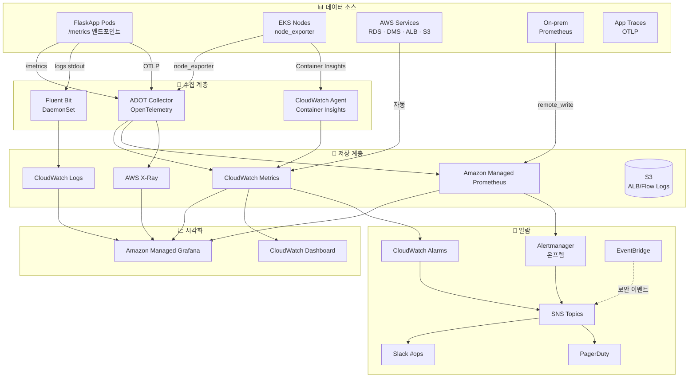

# 07-1. 관측성 상세 구현 설계 — 쉽게 풀어쓴 버전

> 이전 문서 `aws-dr-architecture.md`의 **7장 관측성**을 더 깊이 다룹니다.
> "장애가 났을 때 무엇이 잘못됐는지 어떻게 알 수 있는가", "메트릭/로그/트레이스는 어떻게 수집하고 알람은 어떻게 보내는가" 를 비유와 예시로 설명합니다.

## 📌 한 줄 요약

> **앱과 인프라에서 메트릭(숫자), 로그(글), 트레이스(흐름) 3가지를 모두 수집해서, AMP + AMG(Grafana)로 한 화면에 보여주고, 문제 발생 시 우선순위(P1/P2/P3)에 따라 PagerDuty/Slack으로 자동 알림을 보냅니다. 평시엔 DMS lag와 Route 53 헬스체크가 가장 중요한 지표입니다.**

## 목차

- [0. 이 문서 읽기 전에 알아둘 용어](#0-이-문서-읽기-전에-알아둘-용어)
- [1. 관측성 전체 그림](#1-관측성-전체-그림)
- [2. 3-Pillar 도구 매트릭스](#2-3-pillar-도구-매트릭스)
- [3. 메트릭 수집 (CloudWatch / Prometheus)](#3-메트릭-수집-cloudwatch--prometheus)
- [4. 로그 수집 (Fluent Bit / CloudWatch Logs)](#4-로그-수집-fluent-bit--cloudwatch-logs)
- [5. 분산 트레이싱 (X-Ray / OpenTelemetry)](#5-분산-트레이싱-x-ray--opentelemetry)
- [6. CloudWatch Alarm 풀세트](#6-cloudwatch-alarm-풀세트)
- [7. SNS / 알람 라우팅](#7-sns--알람-라우팅)
- [8. 대시보드 (Grafana / CloudWatch)](#8-대시보드-grafana--cloudwatch)
- [9. SLO / SLI 정의](#9-slo--sli-정의)
- [10. 비용 최적화 & 보존 정책](#10-비용-최적화--보존-정책)
- [11. Terraform 모듈 구조](#11-terraform-모듈-구조)
- [12. 검증 체크리스트](#12-검증-체크리스트)

---

## 0. 이 문서 읽기 전에 알아둘 용어

### 0.1 관측성 3-Pillar

| 용어 | 한 줄 설명 |
|---|---|
| **Metrics (메트릭)** | "지금 CPU 80%, 응답시간 200ms" — **숫자**로 표현되는 시계열 데이터 |
| **Logs (로그)** | "ERROR: DB connection refused" — **문자열**로 기록된 사건 |
| **Traces (트레이스)** | "이 요청은 ALB → App → DB → S3 순서로 흘렀음" — 요청의 **흐름** |
| **3-Pillar** | 메트릭/로그/트레이스 3가지가 관측성의 기둥. 다 있어야 디버깅 가능 |

### 0.2 메트릭 도구

| 용어 | 한 줄 설명 |
|---|---|
| **CloudWatch** | AWS의 기본 모니터링 서비스 (메트릭/로그/알람 통합) |
| **Prometheus** | 오픈소스 메트릭 수집/저장 도구. K8s 표준 |
| **AMP** (Amazon Managed Prometheus) | AWS가 관리해주는 Prometheus |
| **AMG** (Amazon Managed Grafana) | AWS가 관리해주는 Grafana 대시보드 |
| **PromQL** | Prometheus 전용 쿼리 언어 |
| **Container Insights** | EKS 컨테이너 메트릭 자동 수집 도구 |

### 0.3 로그/트레이스 도구

| 용어 | 한 줄 설명 |
|---|---|
| **Fluent Bit** | 경량 로그 수집기. 컨테이너 로그 → CloudWatch로 전송 |
| **DaemonSet** | 모든 K8s 노드에 1개씩 자동 배포되는 Pod |
| **OpenTelemetry (OTel)** | 메트릭/트레이스 수집 오픈 표준 |
| **ADOT** (AWS Distro for OpenTelemetry) | AWS가 패키징한 OTel 배포판 |
| **OTLP** | OpenTelemetry Protocol. ADOT가 쓰는 통신 표준 |
| **X-Ray** | AWS의 분산 트레이싱 서비스 |

### 0.4 알람/SLO

| 용어 | 한 줄 설명 |
|---|---|
| **Alarm** | "임계치 넘으면 알람 발사" 규칙 |
| **SNS** | AWS의 메시지 발송 서비스 (이메일/SMS/Lambda/HTTP) |
| **PagerDuty** | 24/7 on-call 호출 서비스 |
| **Alertmanager** | Prometheus의 알람 라우터 (온프렘에서 사용) |
| **SLO** (Service Level Objective) | "월 가용성 99.5%" 같은 서비스 목표 |
| **SLI** (Service Level Indicator) | SLO 측정용 지표 (실제 가용성 %) |
| **Error Budget** | SLO에서 허용된 장애 시간 (99.5% → 월 3.6시간) |
| **Runbook** | "이 알람 받으면 이렇게 해" 대응 절차서 |

---

## 1. 관측성 전체 그림

### 1.1 토폴로지



### 1.2 6가지 핵심 원칙

**1️⃣ 3-Pillar 모두 수집** ⭐
- 비유: 환자 진료 시 체온(메트릭) + 진료기록(로그) + X-ray(트레이스) 모두 필요
- 메트릭만 있으면 "느려졌다"만 보임, 트레이스 있어야 "어디서" 알 수 있음

**2️⃣ 온프렘과 통합 가시화**
- AMP + AMG로 양쪽 환경을 **하나의 대시보드**에서
- 온프렘 Prometheus는 `remote_write`로 AMP에 데이터 전송

**3️⃣ 수집은 표준 도구**
- OpenTelemetry (OTLP), Prometheus 메트릭, Fluent Bit
- Vendor lock-in 회피

**4️⃣ 알람은 우선순위별 라우팅**
- **P1** → PagerDuty (24/7 호출)
- **P2~3** → Slack

**5️⃣ 저장은 AWS 매니지드**
- 운영 부담 최소화, 비용은 보존 정책으로 통제

**6️⃣ DR 환경 특수성** ⭐
- 평시엔 EKS가 없어서 클러스터 메트릭은 0
- **DMS lag와 Route 53 헬스체크가 평시 핵심 지표**

---

## 2. 3-Pillar 도구 매트릭스

### 2.1 Pillar별 도구 선택

| Pillar | 수집 | 저장 | 시각화 | 알람 |
|---|---|---|---|---|
| **Metrics** | ADOT, CW Agent, node_exporter | CloudWatch + AMP | Grafana + CW Dashboard | CW Alarm, Alertmanager |
| **Logs** | Fluent Bit DaemonSet | CloudWatch Logs (+ S3) | CW Logs Insights + Grafana | Metric Filter → Alarm |
| **Traces** | ADOT (OTLP) | AWS X-Ray | X-Ray Console + Grafana plugin | (제한적) |

### 2.2 왜 이 조합인가?

**ADOT** (AWS Distro for OpenTelemetry) 선택 이유:
- ✅ **Vendor lock-in 회피** — OTLP 표준 프로토콜
- ✅ **한 Agent로 Metrics + Traces** 동시 수집
- ✅ AWS 서비스(CloudWatch, X-Ray, AMP) 네이티브 통합

**AMP** (Amazon Managed Prometheus) 선택 이유:
- ✅ 온프렘 Prometheus와 **동일 PromQL** 사용 → 학습 비용 0
- ✅ 온프렘 → AMP `remote_write`로 **통합 저장**
- ✅ 자동 확장, 백업 불필요

**Fluent Bit** 선택 이유:
- ✅ Fluentd보다 **5배 경량** (Go 기반)
- ✅ CloudWatch Logs / S3 / OpenSearch 모두 출력 가능
- ✅ EKS 공식 권장

---

## 3. 메트릭 수집 (CloudWatch / Prometheus)

### 3.1 메트릭 출처별 수집 방식

| 출처 | 메트릭 종류 | 수집 방식 | 저장소 |
|---|---|---|---|
| AWS 매니지드 (RDS, DMS, ALB, S3) | CPU, Latency, Errors | **AWS 자동** | CloudWatch Metrics |
| EKS Control Plane | API 호출, etcd 지연 | EKS 자동 | CloudWatch Logs |
| EKS Node OS | CPU, Memory, Disk, Network | Container Insights | CloudWatch Metrics |
| EKS Pod | CPU, Memory, Network | Container Insights | CloudWatch Metrics |
| FlaskApp `/metrics` | 비즈니스 메트릭, HTTP 지연 | ADOT scrape | AMP + CloudWatch |
| 온프렘 Prometheus | 기존 워크로드 | `remote_write` to AMP | AMP |

### 3.2 Container Insights 활성화

EKS 노드/Pod 메트릭을 자동 수집해주는 Add-on:

```hcl
# modules/observability/container_insights.tf
resource "aws_eks_addon" "container_insights" {
  count                       = var.dr_active ? 1 : 0
  cluster_name                = var.cluster_name
  addon_name                  = "amazon-cloudwatch-observability"
  addon_version               = "v2.1.0-eksbuild.1"
  resolve_conflicts_on_create = "OVERWRITE"
  service_account_role_arn    = aws_iam_role.cw_agent_irsa.arn
}
```

활성화 시 자동 수집되는 메트릭:
- `pod_cpu_utilization`, `pod_memory_utilization`
- `node_cpu_utilization`, `node_memory_utilization`
- `cluster_failed_node_count`
- `namespace_number_of_running_pods`

### 3.3 ADOT Collector 배포 (Helm)

ADOT는 **메트릭 + 트레이스를 한 번에** 수집하는 Agent:

```yaml
# adot-collector-values.yaml
mode: deployment
serviceAccount:
  create: false
  name: adot-collector   # IRSA 바인딩 완료

config:
  receivers:
    # Prometheus scrape — Pod annotation 자동 발견
    prometheus:
      config:
        scrape_configs:
          - job_name: flaskapp
            kubernetes_sd_configs:
              - role: pod
            relabel_configs:
              - source_labels: [__meta_kubernetes_pod_annotation_prometheus_io_scrape]
                action: keep
                regex: true
              - source_labels: [__meta_kubernetes_pod_annotation_prometheus_io_path]
                target_label: __metrics_path__
                regex: (.+)

    # OTLP 수신 (앱이 직접 전송)
    otlp:
      protocols:
        grpc:
          endpoint: 0.0.0.0:4317
        http:
          endpoint: 0.0.0.0:4318

  processors:
    batch:
      timeout: 10s
    resource:
      attributes:
        - key: cluster
          value: eks-flaskapp-kosa-project-jh
          action: insert
        - key: environment
          value: dr
          action: insert

  exporters:
    # 메트릭 → AMP
    prometheusremotewrite:
      endpoint: ${AMP_REMOTE_WRITE_URL}
      auth:
        authenticator: sigv4auth

    # 메트릭 → CloudWatch (대시보드용 일부)
    awsemf:
      namespace: FlaskApp/DR
      log_group_name: /aws/eks/flaskapp/metrics

    # 트레이스 → X-Ray
    awsxray:
      region: ap-northeast-2

  extensions:
    sigv4auth:
      region: ap-northeast-2

  service:
    extensions: [sigv4auth]
    pipelines:
      metrics:
        receivers: [prometheus, otlp]
        processors: [batch, resource]
        exporters: [prometheusremotewrite, awsemf]
      traces:
        receivers: [otlp]
        processors: [batch, resource]
        exporters: [awsxray]
```

ADOT의 구조 (파이프라인 개념):
- **receivers** (입구): Prometheus scrape, OTLP 수신
- **processors** (가공): batch로 묶기, 라벨 추가
- **exporters** (출구): AMP, CloudWatch, X-Ray로 보내기

### 3.4 FlaskApp `/metrics` 엔드포인트

앱 코드에서 메트릭 노출:

```python
# app/observability.py
from prometheus_client import Counter, Histogram, Gauge, make_wsgi_app
from werkzeug.middleware.dispatcher import DispatcherMiddleware

# 메트릭 정의
http_requests_total = Counter(
    'http_requests_total',
    'Total HTTP requests',
    ['method', 'endpoint', 'status']
)
http_request_duration_seconds = Histogram(
    'http_request_duration_seconds',
    'HTTP request latency',
    ['method', 'endpoint'],
    buckets=(0.005, 0.01, 0.025, 0.05, 0.1, 0.25, 0.5, 1.0, 2.5, 5.0, 10.0)
)
db_connection_pool_size = Gauge(
    'db_connection_pool_size',
    'Current DB connection pool size'
)
photos_uploaded_total = Counter(
    'photos_uploaded_total',
    'Total photos uploaded to S3',
    ['result']   # success / failure
)

# WSGI에 /metrics 마운트
app.wsgi_app = DispatcherMiddleware(app.wsgi_app, {
    '/metrics': make_wsgi_app()
})

# 미들웨어로 자동 수집
@app.before_request
def before():
    request._start_time = time.time()

@app.after_request
def after(response):
    duration = time.time() - request._start_time
    http_requests_total.labels(
        method=request.method,
        endpoint=request.endpoint or 'unknown',
        status=response.status_code
    ).inc()
    http_request_duration_seconds.labels(
        method=request.method,
        endpoint=request.endpoint or 'unknown'
    ).observe(duration)
    return response
```

세 가지 메트릭 타입:
- **Counter**: 계속 증가 (요청 수, 업로드 수)
- **Histogram**: 분포 측정 (응답시간)
- **Gauge**: 현재 값 (DB 연결 풀 크기)

### 3.5 Pod에 scrape annotation

Pod에 이 annotation이 있으면 ADOT가 자동 발견:

```yaml
apiVersion: apps/v1
kind: Deployment
metadata:
  name: flaskapp
spec:
  template:
    metadata:
      annotations:
        prometheus.io/scrape: "true"
        prometheus.io/port: "8000"
        prometheus.io/path: "/metrics"
```

### 3.6 AMP Workspace 생성

```hcl
resource "aws_prometheus_workspace" "main" {
  alias = "amp-flaskapp-kosa-project-jh"

  logging_configuration {
    log_group_arn = "${aws_cloudwatch_log_group.amp.arn}:*"
  }

  tags = { Name = "amp-flaskapp-kosa-project-jh" }
}

# remote_write endpoint를 변수로 ADOT에 주입
output "amp_remote_write_url" {
  value = "${aws_prometheus_workspace.main.prometheus_endpoint}api/v1/remote_write"
}
```

### 3.7 온프렘 Prometheus → AMP 통합

온프렘 `prometheus.yml`에 다음 추가:

```yaml
remote_write:
  - url: https://aps-workspaces.ap-northeast-2.amazonaws.com/workspaces/<WORKSPACE_ID>/api/v1/remote_write
    sigv4:
      region: ap-northeast-2
      access_key: <ACCESS_KEY_ID>      # 전용 IAM User
      secret_key: <SECRET_ACCESS_KEY>  # 또는 Roles Anywhere
    queue_config:
      max_samples_per_send: 1000
      max_shards: 200
      capacity: 2500
```

전용 IAM User 권한:

```json
{
  "Version": "2012-10-17",
  "Statement": [{
    "Effect": "Allow",
    "Action": ["aps:RemoteWrite", "aps:GetSeries", "aps:GetLabels", "aps:GetMetricMetadata"],
    "Resource": "arn:aws:aps:ap-northeast-2:<ACCOUNT_ID>:workspace/<WORKSPACE_ID>"
  }]
}
```

> 💡 **온프렘 ↔ AWS 통합의 묘미**:
> 운영자는 양쪽 메트릭을 **하나의 Grafana 대시보드**에서 동시에 볼 수 있습니다.

---

## 4. 로그 수집 (Fluent Bit / CloudWatch Logs)

### 4.1 로그 출처별 라우팅

| 출처 | 수집 | 저장소 | 보존 |
|---|---|---|---|
| Pod stdout/stderr | Fluent Bit DaemonSet | CloudWatch Logs | 30일 |
| EKS Control Plane | EKS 자동 | CloudWatch Logs | 30일 |
| ALB Access Log | ALB → S3 | S3 | 90일 |
| VPC Flow Log | Flow Log → CW + S3 | CW 30일 + S3 1년 | — |
| CloudTrail | CloudTrail → S3 + CW | S3 7년 | — |
| RDS 로그 | RDS → CW (error/slow/audit) | CloudWatch Logs | 30일 |
| DMS 로그 | DMS Task → CW | CloudWatch Logs | 30일 |
| WAF 로그 | WAF → S3 | S3 | 90일 |

### 4.2 Fluent Bit ConfigMap

```yaml
apiVersion: v1
kind: ConfigMap
metadata:
  name: fluent-bit-config
  namespace: kube-system
data:
  fluent-bit.conf: |
    [SERVICE]
        Flush                     5
        Log_Level                 info
        Daemon                    off
        Parsers_File              parsers.conf
        HTTP_Server               On
        HTTP_Listen               0.0.0.0
        HTTP_Port                 2020
        storage.path              /var/fluent-bit/state/flb-storage/
        storage.sync              normal
        storage.backlog.mem_limit 5M

    [INPUT]
        Name                tail
        Tag                 application.*
        Path                /var/log/containers/*.log
        Parser              docker
        DB                  /var/fluent-bit/state/flb_container.db
        Mem_Buf_Limit       50MB
        Skip_Long_Lines     On
        Refresh_Interval    10

    [FILTER]
        Name                kubernetes
        Match               application.*
        Kube_URL            https://kubernetes.default.svc:443
        Merge_Log           On
        Keep_Log            Off
        K8S-Logging.Parser  On
        K8S-Logging.Exclude On

    # 시스템 로그 제외 (kube-system, monitoring 등)
    [FILTER]
        Name      grep
        Match     application.*
        Exclude   $kubernetes['namespace_name'] (kube-system|amazon-cloudwatch|external-secrets)

    # 민감 필드 마스킹
    [FILTER]
        Name        modify
        Match       application.*
        Remove_wildcard kubernetes.labels.secret*

    [OUTPUT]
        Name                  cloudwatch_logs
        Match                 application.*
        region                ap-northeast-2
        log_group_name        /aws/eks/eks-flaskapp-kosa-project-jh/application
        log_stream_prefix     ${HOSTNAME}-
        auto_create_group     true
        retry_limit           5
        log_retention_days    30
        log_format            json

  parsers.conf: |
    [PARSER]
        Name        docker
        Format      json
        Time_Key    time
        Time_Format %Y-%m-%dT%H:%M:%S.%LZ
```

설정 파이프라인:
1. **INPUT**: `/var/log/containers/*.log` 파일 읽기
2. **FILTER kubernetes**: 어느 namespace/pod 로그인지 메타데이터 붙이기
3. **FILTER grep**: 시스템 namespace 로그 제외
4. **FILTER modify**: 민감 필드 마스킹
5. **OUTPUT**: CloudWatch Logs로 전송

### 4.3 DaemonSet 배포 — 모든 노드에 1개씩

```yaml
apiVersion: apps/v1
kind: DaemonSet
metadata:
  name: fluent-bit
  namespace: kube-system
spec:
  selector:
    matchLabels: { app: fluent-bit }
  template:
    metadata:
      labels: { app: fluent-bit }
    spec:
      serviceAccountName: fluent-bit-sa   # IRSA: CW Logs PutLogEvents
      tolerations:
        - operator: Exists   # 모든 노드에 배포 (taint 무시)
      containers:
        - name: fluent-bit
          image: public.ecr.aws/aws-observability/aws-for-fluent-bit:stable
          resources:
            requests: { cpu: 50m, memory: 100Mi }
            limits:   { cpu: 500m, memory: 500Mi }
          volumeMounts:
            - name: varlog
              mountPath: /var/log
              readOnly: true
            - name: varlibdockercontainers
              mountPath: /var/lib/docker/containers
              readOnly: true
            - name: fluent-bit-config
              mountPath: /fluent-bit/etc/
            - name: state
              mountPath: /var/fluent-bit/state
      volumes:
        - name: varlog
          hostPath: { path: /var/log }
        - name: varlibdockercontainers
          hostPath: { path: /var/lib/docker/containers }
        - name: fluent-bit-config
          configMap: { name: fluent-bit-config }
        - name: state
          hostPath: { path: /var/fluent-bit/state, type: DirectoryOrCreate }
```

> 💡 **DaemonSet의 묘미**:
> 노드가 추가/제거될 때마다 Fluent Bit이 **자동으로 배포/제거**됩니다. 운영자 개입 불필요.

### 4.4 IRSA 권한 (`fluent-bit-sa`)

```json
{
  "Version": "2012-10-17",
  "Statement": [{
    "Effect": "Allow",
    "Action": [
      "logs:CreateLogGroup",
      "logs:CreateLogStream",
      "logs:PutLogEvents",
      "logs:DescribeLogGroups",
      "logs:DescribeLogStreams",
      "logs:PutRetentionPolicy"
    ],
    "Resource": "arn:aws:logs:ap-northeast-2:<ACCOUNT_ID>:log-group:/aws/eks/*"
  }]
}
```

### 4.5 구조화 로그 (JSON) — 강력한 검색의 비결

FlaskApp 로그를 JSON으로 출력하면 CloudWatch Logs Insights에서 필드 단위 검색 가능:

```python
import logging, json
from pythonjsonlogger import jsonlogger

logger = logging.getLogger()
handler = logging.StreamHandler()
formatter = jsonlogger.JsonFormatter(
    '%(asctime)s %(levelname)s %(name)s %(message)s',
    rename_fields={"asctime": "timestamp", "levelname": "level"}
)
handler.setFormatter(formatter)
logger.addHandler(handler)
logger.setLevel(logging.INFO)

# 사용
logger.info("user_login", extra={
    "user_id": user.id,
    "ip": request.remote_addr,
    "trace_id": trace_id
})
# 결과: {"timestamp": "2026-05-11T...", "level": "INFO", "message": "user_login", "user_id": 42, ...}
```

> 💡 **일반 텍스트 로그 vs JSON 로그**:
> - 일반: `"User 42 logged in from 1.2.3.4"` → 문자열 검색만 가능
> - JSON: 각 필드(`user_id`, `ip`)로 정확한 검색 가능, 집계도 가능

### 4.6 CloudWatch Logs Insights 쿼리 예시

```
# 1. 최근 1시간 ERROR 로그를 Pod별로 집계
fields @timestamp, kubernetes.pod_name, message
| filter level = "ERROR"
| stats count() by kubernetes.pod_name
| sort count desc
| limit 20

# 2. 특정 trace_id로 분산 로그 추적
fields @timestamp, message, level
| filter trace_id = "abc-123-def-456"
| sort @timestamp asc

# 3. 응답시간 p95 (5분 단위)
fields @timestamp, response_time
| filter ispresent(response_time)
| stats pct(response_time, 95) by bin(5m)

# 4. 5xx 에러율 추이 (1분 단위)
fields @timestamp
| filter status_code >= 500
| stats count() by bin(1m)
```

---

## 5. 분산 트레이싱 (X-Ray / OpenTelemetry)

### 5.1 트레이싱이 왜 필요한가?

**상황**: Failover 후 "느려졌다"는 신고.

| 도구 | 보이는 것 | 한계 |
|---|---|---|
| **Metrics** | 응답시간 평균 200ms → 800ms | 어디가 느린지 모름 |
| **Logs** | 에러는 없음 | 정상 처리 중인데도 느림 |
| **Traces** ⭐ | User → ALB(5ms) → App(20ms) → **RDS query(750ms)** → S3(10ms) | **즉시 원인 특정** |

비유: CT 촬영처럼 요청의 흐름을 단면별로 분해해서 보여줌.

### 5.2 OTLP 통합

FlaskApp에 OpenTelemetry 자동 계측:

```python
# requirements.txt
opentelemetry-distro
opentelemetry-exporter-otlp
opentelemetry-instrumentation-flask
opentelemetry-instrumentation-sqlalchemy
opentelemetry-instrumentation-boto3sqs
opentelemetry-instrumentation-requests
```

```python
# app/tracing.py
from opentelemetry import trace
from opentelemetry.sdk.trace import TracerProvider
from opentelemetry.sdk.trace.export import BatchSpanProcessor
from opentelemetry.exporter.otlp.proto.grpc.trace_exporter import OTLPSpanExporter
from opentelemetry.sdk.resources import Resource

resource = Resource.create({
    "service.name": "flaskapp",
    "service.version": os.getenv("APP_VERSION", "unknown"),
    "deployment.environment": "dr"
})

provider = TracerProvider(resource=resource)
exporter = OTLPSpanExporter(
    endpoint="http://adot-collector.observability.svc:4317",
    insecure=True
)
provider.add_span_processor(BatchSpanProcessor(exporter))
trace.set_tracer_provider(provider)

# Auto-instrument — Flask, SQLAlchemy 자동 추적
from opentelemetry.instrumentation.flask import FlaskInstrumentor
from opentelemetry.instrumentation.sqlalchemy import SQLAlchemyInstrumentor

FlaskInstrumentor().instrument_app(app)
SQLAlchemyInstrumentor().instrument(engine=db.engine)
```

또는 코드 안 건드리고 환경변수만으로:

```yaml
env:
  - name: OTEL_SERVICE_NAME
    value: flaskapp
  - name: OTEL_EXPORTER_OTLP_ENDPOINT
    value: http://adot-collector.observability.svc:4317
  - name: OTEL_TRACES_SAMPLER
    value: parentbased_traceidratio
  - name: OTEL_TRACES_SAMPLER_ARG
    value: "0.1"   # 10% 샘플링
command: ["opentelemetry-instrument", "python", "app.py"]
```

### 5.3 샘플링 전략

모든 요청을 추적하면 비용 폭발. **샘플링**으로 통제:

| 환경 | 샘플링 비율 | 이유 |
|---|---|---|
| Dev | 100% | 디버깅 |
| Staging | 50% | 비교적 풍부한 데이터 |
| Production | 5~10% | 비용 통제 |
| **Production 에러** | **100%** | ⭐ 에러는 항상 추적 (tail-based sampling) |

> 💡 **Tail-based sampling의 묘미**:
> "10% 샘플링"이라도 **에러 발생한 트레이스는 100% 보존**. 정상 트래픽은 적게, 문제 트래픽은 다 보고 싶을 때.

### 5.4 비즈니스 컨텍스트 추가

트레이스에 비즈니스 정보를 붙이면 디버깅이 쉬워짐:

```python
from opentelemetry import trace

tracer = trace.get_tracer(__name__)

@app.route("/api/upload", methods=["POST"])
def upload():
    span = trace.get_current_span()
    span.set_attribute("user.id", current_user.id)
    span.set_attribute("file.size", request.content_length)
    span.set_attribute("file.type", request.files['file'].mimetype)

    with tracer.start_as_current_span("upload_to_s3") as upload_span:
        upload_span.set_attribute("s3.bucket", PHOTOS_BUCKET)
        result = s3.upload_fileobj(...)
        upload_span.set_attribute("s3.key", key)

    return {"status": "ok"}
```

이제 "User 42가 50MB 파일 업로드할 때 느려진다" 같은 분석 가능.

### 5.5 X-Ray Service Map

X-Ray Console에서 자동 생성되는 **서비스 관계도**:
- 서비스 간 호출 관계 시각화
- 각 edge에 평균 지연 + 에러율 표시
- 클릭하면 해당 구간 트레이스 목록

```
정상:  User → ALB → flaskapp → RDS / S3
이상:  User → ALB → flaskapp → ❌ RDS (DB 연결 끊김)
```

Failover 직후 Service Map만 봐도 어디가 문제인지 즉시 파악.

---

## 6. CloudWatch Alarm 풀세트

### 6.1 우선순위 분류

| 우선순위 | 정의 | 대응 시간 | 라우팅 |
|---|---|---|---|
| **🚨 P1 (Critical)** | 서비스 영향, 즉시 대응 | < 15분 | PagerDuty (24/7 호출) |
| **⚠️ P2 (High)** | 잠재적 장애, 빠른 대응 | < 1시간 | Slack `#ops-critical` + 이메일 |
| **ℹ️ P3 (Medium)** | 추세 모니터링 | < 24시간 | Slack `#ops` |
| **📝 P4 (Info)** | 정보성 | — | Slack `#ops-info` |

### 6.2 RDS Alarm

```hcl
# === RDS CPU ===
resource "aws_cloudwatch_metric_alarm" "rds_cpu" {
  alarm_name          = "rds-flaskapp-cpu-high"
  comparison_operator = "GreaterThanThreshold"
  evaluation_periods  = 5
  metric_name         = "CPUUtilization"
  namespace           = "AWS/RDS"
  period              = 60
  statistic           = "Average"
  threshold           = 80
  alarm_description   = "RDS CPU 80% 5분 지속"
  treat_missing_data  = "breaching"

  dimensions = { DBInstanceIdentifier = "rds-flaskapp-kosa-project-jh" }

  alarm_actions = [aws_sns_topic.p2_alarms.arn]
  ok_actions    = [aws_sns_topic.p2_alarms.arn]

  tags = { Priority = "P2" }
}

# === RDS 스토리지 부족 ===
resource "aws_cloudwatch_metric_alarm" "rds_storage_low" {
  alarm_name          = "rds-flaskapp-storage-low"
  comparison_operator = "LessThanThreshold"
  evaluation_periods  = 2
  metric_name         = "FreeStorageSpace"
  namespace           = "AWS/RDS"
  period              = 300
  statistic           = "Average"
  threshold           = 20 * 1024 * 1024 * 1024   # 20 GB
  alarm_description   = "RDS 가용 스토리지 20GB 미만"

  dimensions    = { DBInstanceIdentifier = "rds-flaskapp-kosa-project-jh" }
  alarm_actions = [aws_sns_topic.p2_alarms.arn]
  tags          = { Priority = "P2" }
}

# === RDS 연결 수 임계 ===
resource "aws_cloudwatch_metric_alarm" "rds_connections" {
  alarm_name          = "rds-flaskapp-connections-high"
  comparison_operator = "GreaterThanThreshold"
  evaluation_periods  = 3
  metric_name         = "DatabaseConnections"
  namespace           = "AWS/RDS"
  period              = 60
  statistic           = "Average"
  threshold           = 180   # max_connections=200의 90%
  alarm_description   = "RDS 연결 수 임계치 도달"

  dimensions    = { DBInstanceIdentifier = "rds-flaskapp-kosa-project-jh" }
  alarm_actions = [aws_sns_topic.p3_alarms.arn]
  tags          = { Priority = "P3" }
}
```

### 6.3 DMS Alarm — RPO 직결 ⭐ 가장 중요

```hcl
# === DMS CDC 지연 (P1!) ===
resource "aws_cloudwatch_metric_alarm" "dms_cdc_latency_target" {
  alarm_name          = "dms-cdc-latency-target-high"
  comparison_operator = "GreaterThanThreshold"
  evaluation_periods  = 5
  metric_name         = "CDCLatencyTarget"
  namespace           = "AWS/DMS"
  period              = 60
  statistic           = "Average"
  threshold           = 300   # 5분 = RPO SLO
  alarm_description   = "DMS Target 지연 5분 초과 (RPO 위협)"
  treat_missing_data  = "breaching"

  # ⚠️ 두 차원 모두 필수
  # 어느 하나라도 빠지면 CW가 metric을 못 찾고
  # INSUFFICIENT_DATA 상태로 머무름
  dimensions = {
    ReplicationInstanceIdentifier = "dms-flaskapp-kosa-project-jh"
    ReplicationTaskIdentifier     = "dms-task-flaskapp"
  }

  alarm_actions = [aws_sns_topic.p1_alarms.arn]
  tags          = { Priority = "P1" }
}

# === DMS Task 정지 ===
resource "aws_cloudwatch_metric_alarm" "dms_task_state" {
  alarm_name          = "dms-task-not-running"
  comparison_operator = "LessThanThreshold"
  evaluation_periods  = 2
  metric_name         = "CDCChangesMemorySource"
  namespace           = "AWS/DMS"
  period              = 300
  statistic           = "SampleCount"
  threshold           = 1
  alarm_description   = "DMS Task가 멈춤 (5분간 변경 데이터 0건)"
  treat_missing_data  = "breaching"

  dimensions = {
    ReplicationInstanceIdentifier = "dms-flaskapp-kosa-project-jh"
    ReplicationTaskIdentifier     = "dms-task-flaskapp"
  }

  alarm_actions = [aws_sns_topic.p1_alarms.arn]
  tags          = { Priority = "P1" }
}

# === DMS Instance CPU ===
# CPU는 instance 단위라 task dimension 없음
resource "aws_cloudwatch_metric_alarm" "dms_cpu" {
  alarm_name          = "dms-replication-cpu-high"
  comparison_operator = "GreaterThanThreshold"
  evaluation_periods  = 3
  metric_name         = "CPUUtilization"
  namespace           = "AWS/DMS"
  period              = 300
  statistic           = "Average"
  threshold           = 80
  alarm_description   = "DMS CPU 80% — 인스턴스 업그레이드 검토"

  dimensions = {
    ReplicationInstanceIdentifier = "dms-flaskapp-kosa-project-jh"
  }

  alarm_actions = [aws_sns_topic.p2_alarms.arn]
  tags          = { Priority = "P2" }
}
```

> ⚠️ **Dimension 함정**:
> DMS task 메트릭은 instance + task 두 차원이 모두 필요. 한쪽만 적으면 알람이 `INSUFFICIENT_DATA`에 영구 머무름 — 알람이 안 울려요.

### 6.4 Route 53 Health Check — Failover 트리거

```hcl
resource "aws_cloudwatch_metric_alarm" "onprem_unhealthy" {
  alarm_name          = "onprem-vip-health-check-failed"
  comparison_operator = "LessThanThreshold"
  evaluation_periods  = 3
  metric_name         = "HealthCheckStatus"
  namespace           = "AWS/Route53"
  period              = 60
  statistic           = "Minimum"
  threshold           = 1
  alarm_description   = "온프렘 VIP HC 3분 연속 실패 — DR 전환 검토"

  dimensions    = { HealthCheckId = var.onprem_health_check_id }
  alarm_actions = [aws_sns_topic.p1_alarms.arn]
  tags          = { Priority = "P1" }
}
```

### 6.5 ALB Alarm (dr_active=true 시에만)

```hcl
# === ALB 5xx 비율 (수식 메트릭) ===
resource "aws_cloudwatch_metric_alarm" "alb_5xx" {
  count               = var.dr_active ? 1 : 0
  alarm_name          = "alb-flaskapp-5xx-rate"
  comparison_operator = "GreaterThanThreshold"
  evaluation_periods  = 5
  threshold           = 5   # 5분간 5xx 5건 초과

  metric_query {
    id          = "e1"
    expression  = "m1/m2*100"
    label       = "5xx error rate (%)"
    return_data = true
  }

  metric_query {
    id = "m1"
    metric {
      metric_name = "HTTPCode_Target_5XX_Count"
      namespace   = "AWS/ApplicationELB"
      period      = 60
      stat        = "Sum"
      dimensions  = { LoadBalancer = var.alb_dimension }
    }
  }

  metric_query {
    id = "m2"
    metric {
      metric_name = "RequestCount"
      namespace   = "AWS/ApplicationELB"
      period      = 60
      stat        = "Sum"
      dimensions  = { LoadBalancer = var.alb_dimension }
    }
  }

  alarm_actions = [aws_sns_topic.p2_alarms.arn]
  tags          = { Priority = "P2" }
}

# === ALB Target Unhealthy ===
resource "aws_cloudwatch_metric_alarm" "alb_target_unhealthy" {
  count               = var.dr_active ? 1 : 0
  alarm_name          = "alb-target-unhealthy-hosts"
  comparison_operator = "GreaterThanThreshold"
  evaluation_periods  = 2
  metric_name         = "UnHealthyHostCount"
  namespace           = "AWS/ApplicationELB"
  period              = 60
  statistic           = "Maximum"
  threshold           = 0
  alarm_description   = "ALB Target Group에 Unhealthy host 발생"

  dimensions    = { LoadBalancer = var.alb_dimension, TargetGroup = var.tg_dimension }
  alarm_actions = [aws_sns_topic.p1_alarms.arn]
  tags          = { Priority = "P1" }
}
```

> 💡 **수식 메트릭(metric_query)의 묘미**:
> "5xx 절대 수"가 아니라 **"5xx 비율 %"** 로 알람 → 트래픽 많을 땐 절대 수가 많아도 정상 비율일 수 있음.

### 6.6 EKS Node Alarm

```hcl
resource "aws_cloudwatch_metric_alarm" "node_not_ready" {
  count               = var.dr_active ? 1 : 0
  alarm_name          = "eks-node-not-ready"
  comparison_operator = "GreaterThanThreshold"
  evaluation_periods  = 2
  metric_name         = "cluster_failed_node_count"
  namespace           = "ContainerInsights"
  period              = 60
  statistic           = "Maximum"
  threshold           = 0
  alarm_description   = "EKS 노드 NotReady 발생"

  dimensions    = { ClusterName = "eks-flaskapp-kosa-project-jh" }
  alarm_actions = [aws_sns_topic.p2_alarms.arn]
  tags          = { Priority = "P2" }
}
```

### 6.7 비용 Alarm (AWS Budgets)

```hcl
resource "aws_budgets_budget" "monthly" {
  name              = "flaskapp-dr-monthly-budget"
  budget_type       = "COST"
  limit_amount      = "700"
  limit_unit        = "USD"
  time_period_start = "2026-01-01_00:00"
  time_unit         = "MONTHLY"

  # 80% 도달 시 (실제)
  notification {
    comparison_operator        = "GREATER_THAN"
    threshold                  = 80
    threshold_type             = "PERCENTAGE"
    notification_type          = "ACTUAL"
    subscriber_email_addresses = [var.admin_email]
    subscriber_sns_topic_arns  = [aws_sns_topic.p3_alarms.arn]
  }

  # 100% 초과 예상 (예측)
  notification {
    comparison_operator        = "GREATER_THAN"
    threshold                  = 100
    threshold_type             = "PERCENTAGE"
    notification_type          = "FORECASTED"
    subscriber_email_addresses = [var.admin_email]
    subscriber_sns_topic_arns  = [aws_sns_topic.p2_alarms.arn]
  }
}
```

### 6.8 로그 기반 Alarm (Metric Filter)

CloudWatch Logs의 특정 패턴을 메트릭으로 변환:

```hcl
resource "aws_cloudwatch_log_metric_filter" "app_errors" {
  name           = "flaskapp-error-count"
  log_group_name = "/aws/eks/eks-flaskapp-kosa-project-jh/application"
  pattern        = "{ $.level = \"ERROR\" }"

  metric_transformation {
    name      = "FlaskAppErrorCount"
    namespace = "FlaskApp/DR"
    value     = "1"
    unit      = "Count"
  }
}

resource "aws_cloudwatch_metric_alarm" "app_error_spike" {
  alarm_name          = "flaskapp-error-spike"
  comparison_operator = "GreaterThanThreshold"
  evaluation_periods  = 3
  metric_name         = "FlaskAppErrorCount"
  namespace           = "FlaskApp/DR"
  period              = 60
  statistic           = "Sum"
  threshold           = 20   # 1분당 20건 초과
  alarm_actions       = [aws_sns_topic.p2_alarms.arn]
  tags                = { Priority = "P2" }
}
```

JSON 로그(`{ $.level = "ERROR" }`) 덕분에 정확한 패턴 매칭 가능.

---

## 7. SNS / 알람 라우팅

### 7.1 SNS Topic 3단 구조

우선순위별로 Topic을 분리:

```hcl
resource "aws_sns_topic" "p1_alarms" {
  name              = "alarms-p1-critical"
  kms_master_key_id = var.kms_logs_arn
  tags              = { Priority = "P1" }
}

resource "aws_sns_topic" "p2_alarms" {
  name              = "alarms-p2-high"
  kms_master_key_id = var.kms_logs_arn
  tags              = { Priority = "P2" }
}

resource "aws_sns_topic" "p3_alarms" {
  name              = "alarms-p3-medium"
  kms_master_key_id = var.kms_logs_arn
  tags              = { Priority = "P3" }
}
```

### 7.2 구독 패턴

| Topic | 구독자 | 알림 방식 |
|---|---|---|
| `alarms-p1-critical` | PagerDuty | SNS → HTTPS endpoint |
| `alarms-p1-critical` | Slack `#ops-critical` | SNS → Lambda → Slack Webhook |
| `alarms-p2-high` | Slack `#ops-critical` | 동일 |
| `alarms-p2-high` | 이메일 (담당자) | SNS Email Subscription |
| `alarms-p3-medium` | Slack `#ops` | Lambda |

### 7.3 PagerDuty 통합

```hcl
resource "aws_sns_topic_subscription" "pagerduty" {
  topic_arn = aws_sns_topic.p1_alarms.arn
  protocol  = "https"
  endpoint  = "https://events.pagerduty.com/integration/<INTEGRATION_KEY>/enqueue"
}
```

### 7.4 Slack 통합 Lambda

색상별로 보기 좋게 포맷팅:

```python
# slack_notifier.py
import json, os, urllib.request

SLACK_WEBHOOK = os.environ['SLACK_WEBHOOK_URL']
PRIORITY = os.environ.get('PRIORITY', 'P3')

PRIORITY_COLORS = {
    'P1': '#FF0000',   # 빨강
    'P2': '#FF8C00',   # 주황
    'P3': '#FFD700',   # 노랑
    'P4': '#808080',   # 회색
}

def handler(event, context):
    for record in event['Records']:
        msg = json.loads(record['Sns']['Message'])

        slack_msg = {
            "attachments": [{
                "color": PRIORITY_COLORS.get(PRIORITY, '#808080'),
                "title": f"[{PRIORITY}] {msg.get('AlarmName', 'Unknown Alarm')}",
                "text": msg.get('AlarmDescription', ''),
                "fields": [
                    {"title": "State", "value": msg.get('NewStateValue'), "short": True},
                    {"title": "Reason", "value": msg.get('NewStateReason'), "short": False},
                    {"title": "Region", "value": msg.get('Region'), "short": True},
                    {"title": "Time", "value": msg.get('StateChangeTime'), "short": True},
                ],
                "footer": "AWS CloudWatch",
                "ts": int(time.time())
            }]
        }

        req = urllib.request.Request(
            SLACK_WEBHOOK,
            data=json.dumps(slack_msg).encode('utf-8'),
            headers={'Content-Type': 'application/json'}
        )
        urllib.request.urlopen(req)
```

### 7.5 알람에 Runbook URL 첨부 ⭐

알람만 울리고 끝나면 새벽에 호출받은 사람이 헤맵니다. **대응 절차서 URL을 함께 보내기**:

```hcl
resource "aws_cloudwatch_metric_alarm" "dms_cdc_latency_target" {
  # ...
  alarm_description = jsonencode({
    summary  = "DMS Target 지연 5분 초과"
    impact   = "RPO 5분 SLO 위반 — DR 시 데이터 손실 위험"
    runbook  = "https://github.com/kosa-project/flaskapp-infra/blob/main/docs/runbook/dms-cdc-lag.md"
    priority = "P1"
  })
}
```

> 💡 **실전 팁**:
> 새벽 3시에 알람 받은 신입 운영자가 "이게 뭐지?" 할 때, Runbook 링크가 있으면 즉시 대응 가능.

---

## 8. 대시보드 (Grafana / CloudWatch)

### 8.1 AMG (Amazon Managed Grafana) Workspace

```hcl
resource "aws_grafana_workspace" "main" {
  account_access_type      = "CURRENT_ACCOUNT"
  authentication_providers = ["AWS_SSO"]
  permission_type          = "SERVICE_MANAGED"

  data_sources = [
    "CLOUDWATCH",
    "PROMETHEUS",
    "XRAY"
  ]

  name        = "amg-flaskapp-kosa-project-jh"
  description = "FlaskApp DR Observability Dashboard"

  role_arn = aws_iam_role.grafana_workspace.arn
}

resource "aws_grafana_role_association" "admin" {
  workspace_id = aws_grafana_workspace.main.id
  role         = "ADMIN"
  user_ids     = var.grafana_admin_user_ids
}
```

### 8.2 핵심 대시보드 카탈로그

| 대시보드 | 목적 | 주요 패널 |
|---|---|---|
| **DR Readiness** | 평시 30초마다 본다 | DMS lag, RDS Replica Lag, Route 53 HC, S3 4xx |
| **Failover Status** | DR 발동 시 | EKS 노드 수, Pod Ready %, ALB 5xx, DB 연결 수 |
| **App Performance** | 일상 운영 | RPS, 응답시간 p50/p95/p99, 에러율 |
| **Infrastructure** | 인프라 담당자 | EC2/EKS CPU/Memory, RDS 부하, S3 요청량 |
| **Security** | 보안 담당자 | GuardDuty findings, IAM 변경, BreakGlass 사용 |
| **Cost** | 월간 리뷰 | 서비스별 비용, 예산 대비 %, 비정상 증가 |

### 8.3 "DR Readiness" 대시보드 핵심 패널

```json
{
  "title": "DR Readiness — FlaskApp",
  "panels": [
    {
      "title": "DMS CDC Latency (RPO Tracker)",
      "type": "stat",
      "datasource": "CloudWatch",
      "targets": [{
        "metricName": "CDCLatencyTarget",
        "namespace": "AWS/DMS",
        "dimensions": {
          "ReplicationInstanceIdentifier": "dms-flaskapp-kosa-project-jh",
          "ReplicationTaskIdentifier": "dms-task-flaskapp"
        },
        "statistic": "Average"
      }],
      "fieldConfig": {
        "defaults": {
          "unit": "s",
          "thresholds": {
            "steps": [
              {"color": "green",  "value": 0},
              {"color": "yellow", "value": 60},
              {"color": "red",    "value": 300}
            ]
          }
        }
      }
    },
    {
      "title": "Route 53 Health Check — On-prem VIP",
      "type": "stat",
      "datasource": "CloudWatch",
      "targets": [{
        "metricName": "HealthCheckStatus",
        "namespace": "AWS/Route53",
        "dimensions": { "HealthCheckId": "<HC_ID>" },
        "statistic": "Minimum"
      }],
      "fieldConfig": {
        "defaults": {
          "mappings": [
            {"type": "value", "options": {"0": {"text": "DOWN", "color": "red"}, "1": {"text": "UP", "color": "green"}}}
          ]
        }
      }
    },
    {
      "title": "RDS Replica Lag (CDC)",
      "type": "timeseries",
      "datasource": "Prometheus",
      "targets": [{
        "expr": "aws_rds_replica_lag_average{dbinstance_identifier=\"rds-flaskapp-kosa-project-jh\"}"
      }]
    },
    {
      "title": "S3 Bucket Operations (proddata)",
      "type": "timeseries",
      "datasource": "CloudWatch",
      "targets": [
        {
          "metricName": "NumberOfObjects",
          "namespace": "AWS/S3",
          "dimensions": {
            "BucketName": "flaskapp-proddata-kosa-project-jh-lai9z",
            "StorageType": "AllStorageTypes"
          },
          "statistic": "Average"
        }
      ]
    }
  ]
}
```

> 💡 **색상 임계값의 묘미**:
> DMS lag 패널이 **초록(정상) → 노랑(1분 초과) → 빨강(5분 초과)** 으로 자동 변색.
> 한 번 보면 즉시 상태 파악.

### 8.4 Failover 시 자동 대시보드 전환

EventBridge로 `dr_active=true` 변경 감지 후 자동 전환:

```hcl
resource "aws_cloudwatch_event_rule" "dr_activated" {
  name = "dr-environment-activated"
  event_pattern = jsonencode({
    source        = ["custom.flaskapp"]
    "detail-type" = ["DR Mode Changed"]
    detail        = { mode = ["active"] }
  })
}

# Lambda가 Grafana API로 alert silence 해제 + 대시보드 자동 전환
```

### 8.5 CloudWatch Dashboard (Grafana 장애 시 백업)

Grafana 자체가 죽었을 때를 위한 최소 대시보드:

```hcl
resource "aws_cloudwatch_dashboard" "minimal" {
  dashboard_name = "flaskapp-minimal"
  dashboard_body = jsonencode({
    widgets = [
      {
        type = "metric"
        properties = {
          metrics = [
            ["AWS/DMS", "CDCLatencyTarget", "ReplicationTaskIdentifier", "dms-task-flaskapp"]
          ]
          period = 60
          stat   = "Average"
          region = "ap-northeast-2"
          title  = "DMS CDC Latency"
        }
      }
    ]
  })
}
```

> 💡 **이중 대시보드 전략**:
> 평시는 Grafana로 풍성하게, Grafana 죽으면 CloudWatch로 최소한이라도.

---

## 9. SLO / SLI 정의

### 9.1 핵심 SLI 카탈로그

**SLI = Service Level Indicator** = 측정 가능한 서비스 품질 지표.

| SLI | 정의 | 측정 방법 |
|---|---|---|
| **가용성** | `200/300번대 응답 / 전체 응답` | ALB 5xx / Request Count |
| **응답시간** | HTTP p95 응답시간 | ALB TargetResponseTime p95 |
| **RPO 준수** | DMS lag가 5분 이내인 시간 비율 | CDCLatencyTarget < 300 비율 |
| **RTO 준수** | DR 훈련 측정 복구 시간 | 분기 훈련 기록 |
| **데이터 정합성** | DMS Validation 통과율 | ValidationSucceeded / Total |

### 9.2 SLO 목표

**SLO = Service Level Objective** = SLI의 목표값.

| SLO | 목표 | 측정 주기 |
|---|---|---|
| API 가용성 | 99.5% | 월간 |
| API 응답시간 p95 | < 500ms | 일간 |
| RPO 준수 | 99% (5분 SLO) | 주간 |
| RTO 준수 | 30분 이내 | 분기 훈련 |

### 9.3 Error Budget — "허용된 장애 시간"

비유: 월 가용성 99.5% = 월 **3시간 36분의 다운타임 허용**.
이게 "Error Budget"이며, 다 쓰면 신규 기능 배포 동결 + 안정화 작업 우선.

```promql
# Error Budget 잔여 (Grafana 패널)
1 - (
  sum(rate(http_requests_total{status=~"5.."}[30d]))
  /
  sum(rate(http_requests_total[30d]))
) - 0.995
```

> 💡 **Error Budget의 묘미**:
> "장애 0건이 목표"가 아니라 "월 3.6시간까지는 OK". 개발 속도와 안정성의 균형.

### 9.4 Burn Rate Alert — Google SRE 패턴

Error Budget을 너무 빨리 소진하면 알람. **Fast burn**과 **Slow burn** 두 단계:

```promql
# Fast burn (1시간 내 budget 5% 소진 = 정말 빠른 소진)
(
  sum(rate(http_requests_total{status=~"5.."}[1h]))
  /
  sum(rate(http_requests_total[1h]))
) > (0.005 * 14.4)
```

```promql
# Slow burn (6시간 내 budget 10% 소진 = 천천히 새는 중)
(
  sum(rate(http_requests_total{status=~"5.."}[6h]))
  /
  sum(rate(http_requests_total[6h]))
) > (0.005 * 6)
```

비유:
- **Fast burn**: "수도꼭지가 콸콸 새고 있다" → 즉시 대응
- **Slow burn**: "조금씩 새고 있는데 일주일 후엔 다 새 있겠다" → 빠른 대응

---

## 10. 비용 최적화 & 보존 정책

### 10.1 월 비용 추정

| 항목 | 월 비용 (USD) | 비고 |
|---|---|---|
| CloudWatch Metrics (커스텀) | $0.30/메트릭 × 100개 = $30 | EMF로 절감 가능 |
| CloudWatch Logs Ingest | $0.50/GB × 30GB = $15 | Pod 로그가 대부분 |
| CloudWatch Logs Storage | $0.03/GB × 30GB = ~$1 | 보존기간으로 절감 |
| AMP Ingest | $0.90/10M 샘플 | 카디널리티 통제 |
| AMP Storage | $0.03/GB | |
| AMG Workspace | $9/Active editor | Viewer는 $5 |
| X-Ray Traces | $5/1M traces | 샘플링으로 통제 |
| **합계 (평시)** | **약 $60~$100** | |

### 10.2 비용 절감 패턴

| 패턴 | 효과 | 트레이드오프 |
|---|---|---|
| Logs 보존 30 → 14일 | **약 50% 절감** | 과거 디버깅 어려움 |
| Metric 카디널리티 통제 | 큼 | 라벨 줄이면 분석 깊이 ↓ |
| Trace 샘플링 100% → 5% | **95% 절감** | 에러는 100% 유지 |
| EMF 사용 | 커스텀 메트릭 비용 ↓ | 구현 복잡도 ↑ |
| S3 Lifecycle (로그) | 90% 절감 | 즉시 조회 불가 |

### 10.3 ⚠️ 메트릭 카디널리티 통제 — 가장 자주 폭발하는 비용

**카디널리티(Cardinality)** = 라벨 조합의 가짓수.

```python
# ❌ 나쁨 — user_id마다 메트릭 생성
# 10만 명 사용자 → 10만 시계열 → 비용 폭발
http_requests_total.labels(user_id=user.id, ...).inc()

# ✅ 좋음 — 라벨에서 제외, 사용자별 분석은 로그/트레이스로
http_requests_total.labels(method=..., endpoint=..., status=...).inc()
```

| 라벨 | 권장 카디널리티 | 위험 |
|---|---|---|
| method (GET/POST 등) | < 10 | ✅ 안전 |
| status (200/4xx/5xx) | < 10 | ✅ 안전 |
| endpoint | < 100 | ⚠️ 동적 path는 묶을 것 (`/users/:id` → `/users/_`) |
| **user_id, request_id 등** | **금지** | 🚨 카디널리티 폭발 |

### 10.4 보존 정책

| 데이터 | 보존 기간 | 저장소 | 비용 영향 |
|---|---|---|---|
| Application Logs | 30일 | CloudWatch Logs | 중 |
| Audit Logs (CloudTrail) | 7년 | S3 (Glacier 1년 후) | 낮음 |
| VPC Flow Logs | 30일 (CW) + 1년 (S3) | 양쪽 | 중 |
| App Metrics (Prometheus) | 150일 | AMP | 중 |
| App Metrics (CloudWatch) | 15개월 (자동) | CloudWatch | 자동 |
| Traces (X-Ray) | 30일 (자동) | X-Ray | 자동 |
| ALB Access Log | 90일 | S3 | 낮음 |
| DR 훈련 결과 | 영구 | S3 + Git | 낮음 |

---

## 11. Terraform 모듈 구조

### 11.1 디렉토리

```
terraform/modules/observability/
├── README.md
├── versions.tf
├── variables.tf
├── outputs.tf
│
├── amp.tf                    # Prometheus Workspace
├── amg.tf                    # Grafana Workspace
├── container_insights.tf     # EKS Add-on
├── adot.tf                   # ADOT IRSA + Helm release
├── fluent_bit.tf             # Fluent Bit IRSA + Helm release
├── xray.tf                   # X-Ray Sampling Rule
│
├── alarms_infra.tf           # RDS, DMS, ALB, EKS Node Alarm
├── alarms_app.tf             # 로그 기반 + 비즈니스 메트릭 Alarm
├── alarms_security.tf        # Root use, BreakGlass, KMS deletion
├── alarms_cost.tf            # AWS Budgets
│
├── sns.tf                    # P1/P2/P3 Topic + 구독
├── slack_lambda.tf           # SNS → Slack Webhook Lambda
│
├── dashboards/
│   ├── dr-readiness.json
│   ├── failover-status.json
│   ├── app-performance.json
│   ├── infrastructure.json
│   └── security.json
│
└── grafana_dashboards.tf     # 위 JSON을 Grafana에 import
```

### 11.2 모듈 입출력

```hcl
# modules/observability/variables.tf
variable "dr_active" {
  type    = bool
  default = false
}

variable "cluster_name" {
  type = string
}

variable "rds_instance_id" {
  type = string
}

variable "dms_task_id" {
  type = string
}

variable "alb_dimension" {
  type    = string
  default = ""
}

variable "onprem_health_check_id" {
  type = string
}

variable "grafana_admin_user_ids" {
  type = list(string)
}

variable "slack_webhook_secret_arn" {
  type        = string
  description = "Slack Webhook URL이 저장된 Secrets Manager ARN"
}

variable "pagerduty_integration_url" {
  type      = string
  sensitive = true
}

variable "admin_email" {
  type = string
}

# outputs.tf
output "amp_workspace_id"        { value = aws_prometheus_workspace.main.id }
output "amp_remote_write_url"    { value = "${aws_prometheus_workspace.main.prometheus_endpoint}api/v1/remote_write" }
output "amg_workspace_endpoint"  { value = aws_grafana_workspace.main.endpoint }
output "sns_p1_arn"              { value = aws_sns_topic.p1_alarms.arn }
output "sns_p2_arn"              { value = aws_sns_topic.p2_alarms.arn }
output "sns_p3_arn"              { value = aws_sns_topic.p3_alarms.arn }
output "adot_collector_endpoint" { value = "http://adot-collector.observability.svc:4317" }
```

### 11.3 envs/dr/main.tf 호출

```hcl
module "observability" {
  source = "../../modules/observability"

  dr_active                 = var.dr_active
  cluster_name              = try(module.eks.cluster_name, "")
  rds_instance_id           = module.rds.instance_id
  dms_task_id               = module.dms.task_id
  alb_dimension             = try(module.alb_ingress.alb_dimension, "")
  onprem_health_check_id    = module.route53.health_check_id
  grafana_admin_user_ids    = var.grafana_admin_user_ids
  slack_webhook_secret_arn  = module.secrets.slack_webhook_arn
  pagerduty_integration_url = var.pagerduty_integration_url
  admin_email               = var.admin_email
}
```

---

## 12. 검증 체크리스트

### Phase 1: 메트릭 수집

- [ ] AMP Workspace 생성, `Active` 상태
- [ ] ADOT Collector Pod 정상 Running
- [ ] FlaskApp `/metrics` 응답 정상 (`curl http://pod-ip:8000/metrics`)
- [ ] ADOT가 FlaskApp 메트릭 scrape 중
- [ ] AMP에서 PromQL 쿼리 응답 (`up{job="flaskapp"}`)
- [ ] 온프렘 Prometheus → AMP `remote_write` 동작

### Phase 2: 로그 수집

- [ ] Fluent Bit DaemonSet 모든 노드에 1개씩 Running
- [ ] CloudWatch Logs에 `/aws/eks/...../application` 로그 그룹 자동 생성
- [ ] Pod stdout이 Logs에 실시간 표시
- [ ] Logs Insights 쿼리 동작
- [ ] kube-system 등 시스템 네임스페이스 로그 제외 확인
- [ ] JSON 구조화 로그가 필드 단위로 파싱됨

### Phase 3: 트레이싱

- [ ] X-Ray Service Map에 FlaskApp 노출
- [ ] Service Map에서 RDS, S3 호출 관계 표시
- [ ] Trace 클릭 시 span 트리 정상 표시
- [ ] 10% 샘플링이 적용됨
- [ ] **에러 발생 시 100% 트레이싱 동작 확인**

### Phase 4: Alarm

- [ ] 16개 인프라 Alarm 모두 `OK` 상태
- [ ] DMS lag Alarm 테스트 (의도적으로 Task 중지) → **P1 발화**
- [ ] Route 53 HC Alarm 테스트 (온프렘 차단) → P1 발화
- [ ] RDS CPU 부하 테스트 → P2 발화
- [ ] App Error spike 테스트 → P2 발화
- [ ] OK 알람도 정상 전달됨 (`ok_actions`)

### Phase 5: 알람 라우팅

- [ ] P1 SNS → PagerDuty 인시던트 자동 생성
- [ ] P1/P2 SNS → Slack `#ops-critical` 메시지 도착
- [ ] P3 SNS → Slack `#ops` 메시지 도착
- [ ] 알람 메시지에 색상/우선순위/**Runbook URL** 포함
- [ ] 메시지 형식이 Markdown으로 보기 좋게 표시

### Phase 6: 대시보드

- [ ] AMG Workspace 접속 가능 (SSO 로그인)
- [ ] CloudWatch / Prometheus / X-Ray 데이터소스 모두 연결됨
- [ ] DR Readiness 대시보드 패널 6개 모두 데이터 표시
- [ ] 사용자별 권한이 SSO Group으로 매핑됨
- [ ] **Grafana 장애 시 CloudWatch Dashboard로 fallback 가능**

### Phase 7: SLO/SLI

- [ ] 가용성 SLI 계산 식이 정상 동작
- [ ] Error Budget 잔여량이 대시보드에 표시
- [ ] Fast burn rate alert 테스트 (인위적 5xx 발생) → 발화
- [ ] 월간 SLO 보고서 자동 생성 (Lambda + S3)

### Phase 8: 비용 통제

- [ ] AWS Budgets 80%/100% 임계치 알림 설정
- [ ] **메트릭 카디널리티 1만 이하 유지**
- [ ] CloudWatch Logs 보존기간이 30일로 적용됨
- [ ] Trace 샘플링 비율이 의도대로 동작
- [ ] 월간 비용이 예상 범위 내 ($60~$100)

### Phase 9: DR 시나리오

- [ ] `dr_active=true` 시 EKS Alarm이 활성화됨
- [ ] `dr_active=false` 시 EKS Alarm이 비활성화
- [ ] Failover 훈련 시 대시보드가 자동 전환
- [ ] 훈련 결과(RTO/RPO 실측)가 자동 저장됨

---

📎 상위: [07. 관측성](./07-observability.md) | 인덱스: [README](../../README.md)
