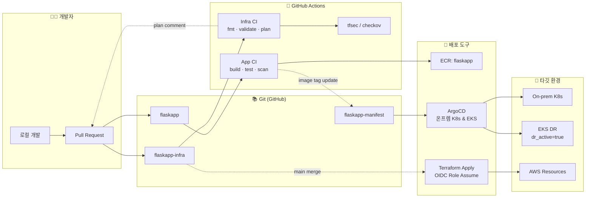
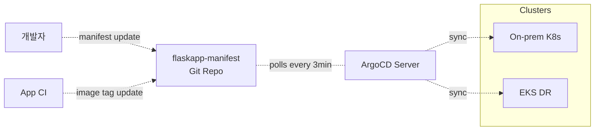
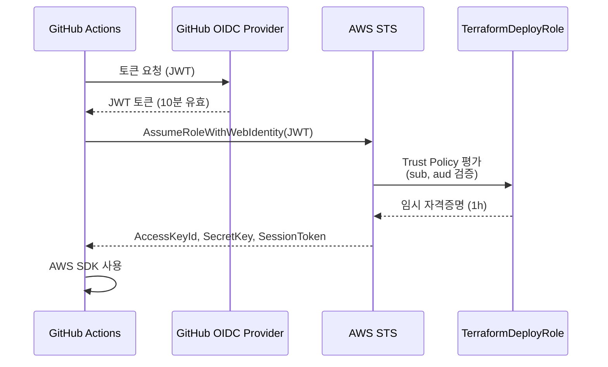

# 08-1. CI/CD & Terraform 상세 구현 설계 — 쉽게 풀어쓴 버전

> 이전 문서 `aws-dr-architecture.md`의 **8장 CI/CD & Terraform**을 더 깊이 다룹니다.
> "코드 push 한 번이 어떻게 배포까지 자동으로 흘러가는지", "Terraform 코드가 어떻게 AWS 인프라를 안전하게 바꾸는지", "Failover 자동화는 어떻게 하는지" 를 비유와 예시로 설명합니다.

## 📌 한 줄 요약

> **App / Infra / Manifest 3개 레포로 영역을 분리하고, GitHub Actions가 PR마다 자동 검증, main 머지 시 ECR 푸시와 Terraform apply를 OIDC로 안전하게 실행합니다. K8s 배포는 kubectl 금지 — ArgoCD가 Git을 진실의 원천으로 자동 동기화하고, 매일 drift를 탐지합니다. Failover는 `dr_active=true` 토글 한 번이지만 결정은 사람이 합니다.**

## 목차

- [0. 이 문서 읽기 전에 알아둘 용어](#0-이-문서-읽기-전에-알아둘-용어)
- [1. CI/CD 전체 파이프라인 그림](#1-cicd-전체-파이프라인-그림)
- [2. 레포 분리 전략](#2-레포-분리-전략)
- [3. Terraform 디렉토리 & State 관리](#3-terraform-디렉토리--state-관리)
- [4. App CI/CD (Build → ECR → Manifest)](#4-app-cicd-build--ecr--manifest)
- [5. Infra CI/CD (Plan → Review → Apply)](#5-infra-cicd-plan--review--apply)
- [6. ArgoCD GitOps](#6-argocd-gitops)
- [7. DR 토글 & Failover 자동화](#7-dr-토글--failover-자동화)
- [8. Drift Detection](#8-drift-detection)
- [9. 시크릿 / 자격증명 관리](#9-시크릿--자격증명-관리)
- [10. 품질 게이트 (Lint / Test / Scan)](#10-품질-게이트-lint--test--scan)
- [11. Terraform 모듈 구조 (메타)](#11-terraform-모듈-구조-메타)
- [12. 검증 체크리스트](#12-검증-체크리스트)

---

## 0. 이 문서 읽기 전에 알아둘 용어

### 0.1 CI/CD 기본

| 용어 | 한 줄 설명 |
|---|---|
| **CI** (Continuous Integration) | 코드 변경 시 자동으로 빌드/테스트 |
| **CD** (Continuous Deployment) | 검증된 코드를 자동으로 배포 |
| **Pipeline** | CI/CD의 일련의 자동화 단계 묶음 |
| **GitHub Actions** | GitHub 내장 CI/CD 도구 |
| **Workflow** | GitHub Actions의 자동화 작업 단위 (YAML로 정의) |
| **PR** (Pull Request) | "내 변경사항 main에 합쳐줘" 요청 |
| **Branch Protection** | main 브랜치를 보호하는 규칙 (직접 push 차단 등) |
| **CODEOWNERS** | "이 파일은 이 사람이 리뷰해야 함" 자동 지정 |

### 0.2 Terraform 관련

| 용어 | 한 줄 설명 |
|---|---|
| **Terraform** | "이런 인프라 만들어줘" 코드로 적으면 AWS에 만들어주는 도구 |
| **plan** | "이렇게 바꿀 거야" 미리보기 (실제 변경 안 함) |
| **apply** | 진짜로 인프라 변경 실행 |
| **State** | "지금까지 만든 게 뭐였지" 기록 파일 |
| **Backend** | State 저장 위치 (S3 + DynamoDB) |
| **Module** | 재사용 가능한 Terraform 코드 묶음 |
| **Drift** | 코드와 실제 인프라가 불일치하는 상태 |
| **tfsec / checkov** | Terraform 코드 보안 검사 도구 |

### 0.3 배포 도구

| 용어 | 한 줄 설명 |
|---|---|
| **OIDC** | OpenID Connect. GitHub → AWS 임시 자격증명 교환 표준 |
| **ECR** | AWS의 Docker 이미지 저장소 |
| **GitOps** | Git을 진실의 원천(source of truth)으로 삼는 운영 방식 |
| **ArgoCD** | GitOps 도구. Git의 매니페스트와 K8s를 자동 동기화 |
| **Kustomize** | K8s 매니페스트를 환경별로 변경(patch)하는 도구 |
| **Helm** | K8s 애플리케이션을 패키지로 관리하는 도구 |
| **Trivy / Snyk** | 컨테이너 이미지 취약점 스캐너 |
| **SLSA / SBOM** | 빌드 출처 증명 / 소프트웨어 부품 명세서 |

---

## 1. CI/CD 전체 파이프라인 그림

### 1.1 토폴로지



### 1.2 6가지 핵심 원칙

**1️⃣ 레포 분리** ⭐
- App / Infra / Manifest 3개 분리
- 한 PR이 여러 영역을 건드리지 못하게
- 비유: 회사 부서 분리 — 개발팀/인프라팀/배포팀

**2️⃣ OIDC Federation 강제**
- 장기 Access Key는 **절대 사용 금지**
- GitHub Actions → AWS는 OIDC로 임시 토큰만

**3️⃣ 모든 변경은 PR 거쳐서**
- `main` 직접 push 차단 (Branch Protection)
- 비유: 회사 결재 시스템 — 사장도 결재 거쳐야 함

**4️⃣ GitOps for K8s**
- `kubectl apply` 금지
- 모든 K8s 변경은 manifest 레포에 commit
- 비유: "변경 사항을 일기장에 적기 전엔 실행하지 않음"

**5️⃣ Plan은 누구나, Apply는 자동**
- PR에서 plan을 자동 코멘트
- main 머지 시 자동 apply (수동 승인 게이트 통과)

**6️⃣ Drift는 매일 탐지**
- Cron으로 plan 실행
- 변경 발견 시 GitHub Issue + Slack 알람

---

## 2. 레포 분리 전략

### 2.1 3-Repo 구조

| 레포 | 내용 | 변경 빈도 | 권한 |
|---|---|---|---|
| **`flaskapp`** | Python 소스, Dockerfile, 단위 테스트 | 매일 | 개발자 Write |
| **`flaskapp-infra`** | Terraform 코드, AWS 인프라 | 주간 | 인프라 담당자 Write |
| **`flaskapp-manifest`** | K8s 매니페스트, Helm Chart, Kustomize | 매일 (이미지 태그) | 개발자 + 자동 봇 |

### 2.2 왜 분리하는가?

| 통합 (1개 레포) | 분리 (3개 레포) |
|---|---|
| 한 PR로 코드+인프라+배포 가능 | **영역별 책임자 명확** |
| 변경 빈도가 다른 코드 혼재 | 인프라는 신중하게, 앱은 빠르게 |
| Workflow가 복잡 | 각 레포 Workflow 단순 |
| 권한 분리 어려움 | **인프라 변경 권한을 좁게 제한** |

### 2.3 레포 간 자동 연결

```
flaskapp (PR merged to main)
  ↓ App CI가 자동으로
  ├─ Docker build → ECR push (태그: git SHA + latest)
  └─ flaskapp-manifest의 이미지 태그 자동 update
       ↓
       ArgoCD가 감지 → EKS/온프렘에 자동 배포
```

> 💡 **사람의 개입 없이 흘러가는 흐름**:
> 개발자가 PR 머지 → 약 5분 후 K8s에 새 버전이 떠 있음. `kubectl` 명령 한 번 안 쳐도 됨.

### 2.4 Branch Protection 정책

모든 레포의 `main` 브랜치에 적용:

| 설정 | 값 | 이유 |
|---|---|---|
| Require PR before merge | ✅ | 직접 push 차단 |
| Require approvals | 1 (App) / **2 (Infra)** | Infra 변경은 2명 승인 |
| Dismiss stale approvals | ✅ | 새 commit 시 재승인 |
| Require status checks | ✅ | CI 통과 필수 |
| Required checks | `ci`, `tfsec`, `terraform-plan` | 레포별 다름 |
| Require linear history | ✅ | rebase merge만 |
| Restrict force pushes | ✅ | 히스토리 보호 |
| Restrict deletions | ✅ | 실수 삭제 방지 |

> ⚠️ **인프라는 2명 승인**:
> 인프라 실수는 영향 범위가 큼. 한 명 더 보는 게 안전.

---

## 3. Terraform 디렉토리 & State 관리

### 3.1 디렉토리 구조

```
flaskapp-infra/
├── README.md
├── .github/
│   └── workflows/
│       ├── plan.yml
│       ├── apply.yml
│       ├── drift-detection.yml
│       └── tfsec.yml
│
├── terraform/
│   ├── modules/                  # 🧩 재사용 가능 모듈
│   │   ├── network/
│   │   ├── security/
│   │   ├── route53/
│   │   ├── s3/
│   │   ├── rds/
│   │   ├── dms/
│   │   ├── ecr/
│   │   ├── eks/
│   │   ├── alb-ingress/
│   │   ├── iam/
│   │   ├── kms/
│   │   ├── secrets/
│   │   └── observability/
│   │
│   ├── bootstrap/                # 🥚 최초 1회 (state 버킷 자체)
│   │   ├── main.tf
│   │   └── README.md
│   │
│   └── envs/                     # 🎯 환경별
│       └── dr/
│           ├── backend.tf
│           ├── providers.tf
│           ├── main.tf
│           ├── variables.tf
│           ├── outputs.tf
│           ├── terraform.tfvars
│           └── dr_active.auto.tfvars  # ⭐ Failover 토글
│
├── helm/                         # 클러스터 부트스트랩 (Terraform이 호출)
│   ├── albc/
│   ├── external-secrets/
│   └── karpenter/
│
└── docs/
    ├── runbook/
    │   ├── failover.md
    │   ├── failback.md
    │   └── terraform-rollback.md
    └── adr/                      # Architecture Decision Records
```

### 3.2 backend.tf — State 저장소 설정

```hcl
# envs/dr/backend.tf
terraform {
  required_version = ">= 1.7.0"

  required_providers {
    aws        = { source = "hashicorp/aws",        version = "~> 5.50" }
    kubernetes = { source = "hashicorp/kubernetes", version = "~> 2.30" }
    helm       = { source = "hashicorp/helm",       version = "~> 2.13" }
    tls        = { source = "hashicorp/tls",        version = "~> 4.0" }
  }

  backend "s3" {
    bucket         = "flaskapp-tfstate-kosa-project-team3-snow-a3asx"
    key            = "envs/dr/terraform.tfstate"
    region         = "ap-northeast-2"
    dynamodb_table = "terraform-state-lock"
    encrypt        = true
    kms_key_id     = "alias/flaskapp-secrets-kosa-project-team3-snow"
  }
}
```

### 3.3 providers.tf — try()의 묘미

```hcl
provider "aws" {
  region = "ap-northeast-2"

  default_tags {
    tags = {
      Project     = "kosa-project-team3-snow"
      Environment = "dr"
      ManagedBy   = "terraform"
      Repo        = "flaskapp-infra"
    }
  }
}

# EKS가 만들어진 후에만 동작 (dr_active=true 시)
provider "kubernetes" {
  host                   = try(module.eks.cluster_endpoint, "")
  cluster_ca_certificate = base64decode(try(module.eks.cluster_ca, ""))
  exec {
    api_version = "client.authentication.k8s.io/v1beta1"
    command     = "aws"
    args        = ["eks", "get-token", "--cluster-name", try(module.eks.cluster_name, "")]
  }
}
```

> 💡 **`try()`의 묘미**:
> `dr_active=false`일 땐 EKS가 없으므로 `module.eks.cluster_endpoint`도 없음. `try()`로 감싸면 에러 안 나고 `""` 반환.

### 3.4 State 분리 vs 단일 State

| 옵션 | 장점 | 단점 |
|---|---|---|
| **단일 State (envs/dr)** | 의존성 자동 해결, 간단 | apply 시간 길어짐, blast radius 큼 |
| **State 분리** (영역별) | apply 빠름, 권한 분리 | 모듈 간 데이터 공유 복잡 |

> 💡 **현재 규모(단일 환경)에선 단일 State 권장**.
> staging/prod로 늘어나면 영역별 분리 검토.

### 3.5 Bootstrap — 닭과 달걀 문제

**문제**: State 버킷 자체는 어디에 저장? State 버킷이 있어야 state 저장 가능한데...

**해결**: 처음엔 **local backend**로 만들고, 그 후 S3 backend로 마이그레이션.

```hcl
# bootstrap/main.tf — local backend로 시작
resource "aws_s3_bucket" "tfstate" {
  bucket = "flaskapp-tfstate-kosa-project-team3-snow-a3asx"
  lifecycle { prevent_destroy = true }
}

resource "aws_s3_bucket_versioning" "tfstate" {
  bucket = aws_s3_bucket.tfstate.id
  versioning_configuration { status = "Enabled" }
}

resource "aws_dynamodb_table" "lock" {
  name         = "terraform-state-lock"
  billing_mode = "PAY_PER_REQUEST"
  hash_key     = "LockID"
  attribute { name = "LockID", type = "S" }
  lifecycle { prevent_destroy = true }
}
```

```bash
# 1. local backend로 apply
cd terraform/bootstrap
terraform init
terraform apply

# 2. 기존 리소스 import (Phase 0)
terraform import aws_s3_bucket.tfstate flaskapp-tfstate-kosa-project-team3-snow-a3asx
terraform import aws_dynamodb_table.lock terraform-state-lock

# 3. envs/dr/에서 작업 시작
```

### 3.6 Stack 단위 책임 분리 ⭐

본 설계는 **두 개의 별도 state** 운영:

| 리소스 | 관리 stack | 비고 |
|---|---|---|
| `aws_s3_bucket.tfstate` | **bootstrap 단독** | envs/dr는 `backend "s3"`로만 사용 |
| `aws_dynamodb_table.lock` | **bootstrap 단독** | envs/dr는 backend lock으로만 |
| `aws_s3_bucket.proddata` | envs/dr (`module.s3`) | 앱 데이터 버킷 |
| `aws_ecr_repository.flaskapp` | envs/dr (`module.ecr`) | 이미지 저장소 |

> ⚠️ **함정**:
> 두 stack 모두 tfstate 버킷을 관리하면 SSE/lifecycle/policy drift가 영구 발생.
> `terraform apply`마다 충돌. **bootstrap 단독 소유** 원칙.

```bash
# bootstrap stack
cd terraform/bootstrap
terraform init
terraform import aws_s3_bucket.tfstate   flaskapp-tfstate-kosa-project-team3-snow-a3asx
terraform import aws_dynamodb_table.lock terraform-state-lock

# envs/dr stack
cd ../envs/dr
terraform init
terraform import 'module.s3.aws_s3_bucket.proddata'   flaskapp-proddata-kosa-project-team3-snow-lai9z
terraform import 'module.ecr.aws_ecr_repository.this' flaskapp
```

---

## 4. App CI/CD (Build → ECR → Manifest)

### 4.1 전체 흐름

```mermaid
flowchart LR
    PR[PR opened] --> CI1[Lint · Test]
    CI1 -. ok .-> CI2[Build Docker Image]
    CI2 --> SCAN[Trivy Scan]
    SCAN -. no critical CVE .-> APPROVE[Reviewer Approval]
    APPROVE --> MERGE[Merge to main]
    MERGE --> BUILD[Build with main SHA]
    BUILD --> PUSH[Push to ECR]
    PUSH --> UPDATE[Update flaskapp-manifest<br/>image tag = SHA]
    UPDATE --> ARGOCD[ArgoCD detects]
    ARGOCD --> DEPLOY[Deploy to K8s]
```



### 4.2 PR Check Workflow (`.github/workflows/ci.yml`)

PR 열면 자동 실행 — lint, test, build, scan:

```yaml
name: ci
on:
  pull_request:
    branches: [main]

permissions:
  contents: read
  pull-requests: write

jobs:
  lint-test:
    runs-on: ubuntu-latest
    steps:
      - uses: actions/checkout@v4
      - uses: actions/setup-python@v5
        with:
          python-version: '3.12'
          cache: pip

      - run: pip install -r requirements.txt -r requirements-dev.txt

      - name: Lint
        run: |
          ruff check .
          ruff format --check .

      - name: Type check
        run: mypy app/

      - name: Unit tests
        run: pytest --cov=app --cov-report=xml

      - uses: codecov/codecov-action@v4
        with:
          file: ./coverage.xml

  docker-build:
    runs-on: ubuntu-latest
    needs: lint-test
    steps:
      - uses: actions/checkout@v4

      - uses: docker/setup-buildx-action@v3

      - name: Build (no push)
        uses: docker/build-push-action@v5
        with:
          context: .
          push: false
          tags: flaskapp:pr-${{ github.event.pull_request.number }}
          cache-from: type=gha
          cache-to: type=gha,mode=max
          load: true

      - name: Trivy vulnerability scan
        uses: aquasecurity/trivy-action@master
        with:
          image-ref: flaskapp:pr-${{ github.event.pull_request.number }}
          severity: CRITICAL,HIGH
          exit-code: '1'
          ignore-unfixed: true
          format: sarif
          output: trivy-results.sarif

      - uses: github/codeql-action/upload-sarif@v3
        if: always()
        with:
          sarif_file: trivy-results.sarif
```

핵심:
- ✅ **lint/test 먼저** → 통과해야 build
- ✅ **PR은 push 안 함** (`push: false`) — 스캔만
- ✅ **CRITICAL CVE 발견 → 자동 실패**

### 4.3 main 머지 Workflow

main 머지 시 ECR push + manifest 자동 갱신:

```yaml
name: build-push
on:
  push:
    branches: [main]

permissions:
  id-token: write   # ⭐ OIDC 필수
  contents: read

env:
  AWS_REGION: ap-northeast-2
  ECR_REPO: flaskapp

jobs:
  build:
    runs-on: ubuntu-latest
    outputs:
      image-tag: ${{ steps.meta.outputs.tag }}
    steps:
      - uses: actions/checkout@v4

      - id: meta
        run: |
          TAG=${GITHUB_SHA::7}
          echo "tag=${TAG}" >> $GITHUB_OUTPUT

      - uses: aws-actions/configure-aws-credentials@v4
        with:
          role-to-assume: arn:aws:iam::${{ secrets.AWS_ACCOUNT_ID }}:role/GitHubActionsECRPushRole
          role-session-name: github-actions-${{ github.run_id }}
          aws-region: ${{ env.AWS_REGION }}

      - uses: aws-actions/amazon-ecr-login@v2
        id: ecr

      - uses: docker/setup-buildx-action@v3

      - uses: docker/build-push-action@v5
        with:
          context: .
          push: true
          tags: |
            ${{ steps.ecr.outputs.registry }}/${{ env.ECR_REPO }}:${{ steps.meta.outputs.tag }}
            ${{ steps.ecr.outputs.registry }}/${{ env.ECR_REPO }}:latest
          cache-from: type=gha
          cache-to: type=gha,mode=max
          provenance: true   # SLSA Provenance 생성
          sbom: true         # SBOM 생성

      - name: Scan pushed image
        uses: aquasecurity/trivy-action@master
        with:
          image-ref: ${{ steps.ecr.outputs.registry }}/${{ env.ECR_REPO }}:${{ steps.meta.outputs.tag }}
          severity: CRITICAL
          exit-code: '1'

  update-manifest:
    runs-on: ubuntu-latest
    needs: build
    steps:
      - uses: actions/checkout@v4
        with:
          repository: kosa-project/flaskapp-manifest
          token: ${{ secrets.MANIFEST_REPO_PAT }}
          path: manifest

      - name: Update image tag
        working-directory: manifest
        run: |
          cd overlays/dr
          sed -i "s|image: .*flaskapp:.*|image: <ACCOUNT>.dkr.ecr.ap-northeast-2.amazonaws.com/flaskapp:${{ needs.build.outputs.image-tag }}|" deployment.yaml

      - name: Commit & push
        working-directory: manifest
        run: |
          git config user.name "github-actions[bot]"
          git config user.email "github-actions[bot]@users.noreply.github.com"
          git add -A
          git commit -m "chore: update flaskapp image to ${{ needs.build.outputs.image-tag }}" || exit 0
          git push
```

### 4.4 이미지 태그 전략

| 태그 | 의미 | 사용처 |
|---|---|---|
| `<SHA-7>` (예: `a1b2c3d`) | 특정 커밋 빌드 | ⭐ **운영 배포 (불변)** |
| `latest` | 최신 main 빌드 | 개발 용도만 (운영 금지) |
| `v1.2.3` | semver 릴리즈 태그 | 명시적 버전 관리 |
| `pr-123` | PR 빌드 | 임시 테스트 (스캔용) |

> ⚠️ **운영 환경에 `latest` 태그 사용 금지**:
> - Pod 재시작 시 어떤 버전이 뜨는지 예측 불가
> - ArgoCD가 변경을 못 감지하기도 함
> - 비유: "최신 한국 드라마 보여줘" → 매번 다른 드라마가 나옴

### 4.5 Manifest Repo 자동 갱신 — PAT vs GitHub App

| 방식 | 장점 | 단점 |
|---|---|---|
| **PAT** (Personal Access Token) | 단순 | 토큰 회전 부담, 사용자 권한에 종속 |
| **GitHub App** ⭐ | 토큰 자동 회전, 세분화된 권한 | 초기 설정 복잡 |

GitHub App 사용 예:

```yaml
- uses: actions/create-github-app-token@v1
  id: app-token
  with:
    app-id: ${{ vars.MANIFEST_BOT_APP_ID }}
    private-key: ${{ secrets.MANIFEST_BOT_PRIVATE_KEY }}
    repositories: flaskapp-manifest

- uses: actions/checkout@v4
  with:
    repository: kosa-project/flaskapp-manifest
    token: ${{ steps.app-token.outputs.token }}
```

> 💡 **GitHub App의 묘미**:
> PAT은 한 사람의 권한에 의존 → 그 사람 퇴사하면 토큰 무효.
> GitHub App은 봇 자체의 권한 → 독립적, 회전 자동.

---

## 5. Infra CI/CD (Plan → Review → Apply)

### 5.1 Plan on PR — 미리보기 자동 첨부

PR 열면 plan 자동 실행, 결과를 **PR 코멘트로 첨부**:

```yaml
# .github/workflows/plan.yml
name: terraform-plan
on:
  pull_request:
    paths:
      - 'terraform/**'
      - '.github/workflows/**'

permissions:
  id-token: write
  contents: read
  pull-requests: write

jobs:
  plan:
    runs-on: ubuntu-latest
    steps:
      - uses: actions/checkout@v4

      - uses: hashicorp/setup-terraform@v3
        with:
          terraform_version: 1.7.5
          terraform_wrapper: false

      - uses: aws-actions/configure-aws-credentials@v4
        with:
          role-to-assume: arn:aws:iam::${{ secrets.AWS_ACCOUNT_ID }}:role/TerraformDeployRole
          role-session-name: tf-plan-${{ github.run_id }}
          aws-region: ap-northeast-2

      - name: terraform fmt
        working-directory: terraform/envs/dr
        run: terraform fmt -check -recursive ../..

      - name: terraform init
        working-directory: terraform/envs/dr
        run: terraform init -no-color

      - name: terraform validate
        working-directory: terraform/envs/dr
        run: terraform validate -no-color

      - name: terraform plan
        id: plan
        working-directory: terraform/envs/dr
        run: |
          terraform plan -no-color -out=tfplan -detailed-exitcode || EXIT=$?
          terraform show -no-color tfplan > plan-output.txt
          echo "exitcode=${EXIT:-0}" >> $GITHUB_OUTPUT
        continue-on-error: true

      - name: Comment plan on PR
        uses: actions/github-script@v7
        with:
          script: |
            const fs = require('fs');
            let plan = fs.readFileSync('terraform/envs/dr/plan-output.txt', 'utf8');
            const maxLen = 60000;
            if (plan.length > maxLen) {
              plan = plan.substring(0, maxLen) + '\n... (truncated)';
            }
            const exitcode = '${{ steps.plan.outputs.exitcode }}';
            const status = exitcode === '0' ? '✅ No changes'
                         : exitcode === '2' ? '📝 Changes detected'
                         : '❌ Error';
            const body = `## Terraform Plan ${status}

            <details><summary>Plan Output</summary>

            \`\`\`hcl
            ${plan}
            \`\`\`

            </details>`;

            github.rest.issues.createComment({
              owner: context.repo.owner,
              repo: context.repo.repo,
              issue_number: context.issue.number,
              body: body
            });
```

> 💡 **PR 코멘트의 묘미**:
> 리뷰어가 "이 PR이 뭘 바꾸지?" 직접 plan 안 돌려도 알 수 있음. **검토 시간 대폭 단축**.

### 5.2 Apply on main merge

```yaml
# .github/workflows/apply.yml
name: terraform-apply
on:
  push:
    branches: [main]
    paths:
      - 'terraform/**'

permissions:
  id-token: write
  contents: read

jobs:
  apply:
    runs-on: ubuntu-latest
    environment: production   # ⭐ 수동 승인 게이트
    steps:
      - uses: actions/checkout@v4

      - uses: hashicorp/setup-terraform@v3
        with:
          terraform_version: 1.7.5
          terraform_wrapper: false

      - uses: aws-actions/configure-aws-credentials@v4
        with:
          role-to-assume: arn:aws:iam::${{ secrets.AWS_ACCOUNT_ID }}:role/TerraformDeployRole
          role-session-name: tf-apply-${{ github.run_id }}
          aws-region: ap-northeast-2

      - name: terraform init
        working-directory: terraform/envs/dr
        run: terraform init -no-color

      - name: terraform apply
        working-directory: terraform/envs/dr
        run: terraform apply -auto-approve -no-color

      - name: Notify Slack on failure
        if: failure()
        uses: slackapi/slack-github-action@v1
        with:
          channel-id: 'ops-critical'
          slack-message: '❌ Terraform apply failed: ${{ github.event.head_commit.message }}'
        env:
          SLACK_BOT_TOKEN: ${{ secrets.SLACK_BOT_TOKEN }}
```

### 5.3 GitHub Environment 수동 승인 게이트

`environment: production`이 핵심. GitHub Repo 설정에서 추가 통제 가능:

| 설정 | 값 | 의미 |
|---|---|---|
| Required reviewers | 인프라 담당자 2명 (1명만 승인) | 사람 눈 추가 |
| Wait timer | 0~5분 | 실수 발견 시간 |
| Deployment branches | `main`만 | 다른 브랜치 차단 |

승인 전까지 workflow는 **대기 상태**.

> 💡 **수동 승인 게이트의 묘미**:
> "main 머지 = 즉시 운영 반영"이 무서울 수 있음. 한 번 더 사람이 확인하는 안전장치.

### 5.4 Plan / Apply 분리 이유

| 시나리오 | Plan만 | Apply 가능 |
|---|---|---|
| PR 코멘트 자동 첨부 | ✅ | ❌ |
| 로컬에서 검증 | ✅ | ❌ (운영자 PC에 자격증명 없음) |
| 운영 적용 | ❌ | ✅ (main 머지 후) |
| 비상 적용 (Failover) | ❌ | ✅ (수동 트리거) |

### 5.5 비상 수동 적용 (Failover 시)

main 머지 없이 즉시 apply 필요 시 — `workflow_dispatch` 사용:

```yaml
on:
  push:
    branches: [main]
    paths: ['terraform/**']
  workflow_dispatch:
    inputs:
      dr_active:
        description: 'Set dr_active to true (Failover mode)'
        type: boolean
        default: false
        required: true
      reason:
        description: 'Reason (logged for audit)'
        type: string
        required: true

jobs:
  apply:
    runs-on: ubuntu-latest
    environment: production
    steps:
      # ...
      - name: terraform apply
        working-directory: terraform/envs/dr
        run: |
          if [[ "${{ inputs.dr_active }}" == "true" ]]; then
            echo "FAILOVER MODE: ${{ inputs.reason }}"
            terraform apply -auto-approve -var="dr_active=true"
          else
            terraform apply -auto-approve
          fi
```

GitHub UI의 Actions → Run workflow에서 `dr_active=true`로 실행 → 승인 → Failover 적용.

---

## 6. ArgoCD GitOps

### 6.1 GitOps란?

**비유**: 회사 사규(Git)와 실제 사무실 운영(K8s)이 항상 일치해야 함. 사규 안 바꾸고 사무실 운영만 바꾸면 → 자동으로 사규대로 되돌림.



핵심: **ArgoCD가 3분마다 Git을 polling → 변경 감지 → K8s에 자동 적용**.

### 6.2 manifest 레포 구조 (Kustomize)

```
flaskapp-manifest/
├── README.md
├── base/                        # 공통 정의
│   ├── kustomization.yaml
│   ├── deployment.yaml
│   ├── service.yaml
│   ├── serviceaccount.yaml
│   ├── ingress.yaml
│   ├── hpa.yaml
│   ├── pdb.yaml
│   └── externalsecret.yaml
│
├── overlays/
│   ├── onprem/                  # On-prem K8s 전용
│   │   ├── kustomization.yaml
│   │   ├── ingress-patch.yaml   # Nginx Ingress
│   │   ├── deployment-patch.yaml # DATABASE_HOST=172.16.43.160
│   │   └── replicas-patch.yaml
│   │
│   └── dr/                      # AWS EKS 전용
│       ├── kustomization.yaml
│       ├── ingress-patch.yaml   # ALB Ingress
│       ├── deployment-patch.yaml # DATABASE_HOST=RDS endpoint
│       └── serviceaccount-patch.yaml  # IRSA annotation
│
└── argocd/                      # ArgoCD Application 정의
    ├── flaskapp-onprem.yaml
    ├── flaskapp-dr.yaml
    └── appproject.yaml
```

> 💡 **Kustomize의 묘미**:
> `base/`엔 공통 매니페스트, `overlays/`엔 환경별 차이만. "공통 + 차이점 = 환경별 매니페스트".

### 6.3 ArgoCD Application 매니페스트

```yaml
# argocd/flaskapp-dr.yaml
apiVersion: argoproj.io/v1alpha1
kind: Application
metadata:
  name: flaskapp-dr
  namespace: argocd
  finalizers:
    - resources-finalizer.argocd.argoproj.io
spec:
  project: flaskapp
  source:
    repoURL: https://github.com/kosa-project/flaskapp-manifest
    targetRevision: main
    path: overlays/dr
  destination:
    server: https://eks-flaskapp.dr.internal
    namespace: flaskapp
  syncPolicy:
    automated:
      prune: true       # Git에서 삭제된 리소스 자동 삭제
      selfHeal: true    # ⭐ Drift 발견 시 자동 복원
      allowEmpty: false
    syncOptions:
      - CreateNamespace=true
      - PrunePropagationPolicy=foreground
      - PruneLast=true
    retry:
      limit: 5
      backoff:
        duration: 5s
        factor: 2
        maxDuration: 3m
  revisionHistoryLimit: 10
```

### 6.4 환경별 차이를 Kustomize patch로

```yaml
# overlays/dr/kustomization.yaml
apiVersion: kustomize.config.k8s.io/v1beta1
kind: Kustomization

resources:
  - ../../base

namespace: flaskapp

# 이미지 태그는 App CI가 자동 갱신
images:
  - name: flaskapp
    newName: <ACCOUNT>.dkr.ecr.ap-northeast-2.amazonaws.com/flaskapp
    newTag: a1b2c3d   # CI가 자동 update

patches:
  - path: ingress-patch.yaml
    target: { kind: Ingress, name: flaskapp }
  - path: deployment-patch.yaml
    target: { kind: Deployment, name: flaskapp }
  - path: serviceaccount-patch.yaml
    target: { kind: ServiceAccount, name: flaskapp-sa }
```

```yaml
# overlays/dr/deployment-patch.yaml
- op: replace
  path: /spec/template/spec/containers/0/env
  value:
    - name: DATABASE_HOST
      valueFrom:
        secretKeyRef: { name: flaskapp-db-secret, key: host }
    - name: DATABASE_PORT
      value: "3306"
    - name: PHOTOS_BUCKET
      value: flaskapp-proddata-kosa-project-team3-snow-lai9z
    - name: AWS_REGION
      value: ap-northeast-2
- op: replace
  path: /spec/replicas
  value: 3
```

### 6.5 ArgoCD Sync 정책 선택

| 정책 | 동작 | 사용 시나리오 |
|---|---|---|
| **Auto + selfHeal=true** ⭐ | Git이 진실의 원천 | **운영 권장 — drift 자동 복원** |
| Auto + selfHeal=false | Git 변경 시만 sync | 수동 변경 허용 (테스트용) |
| Manual | UI에서 sync 클릭 필요 | 신중한 배포 |

> 💡 **DR 환경엔 Auto + selfHeal 권장**:
> Failover 시점에 빠르게 배포돼야 함.

### 6.6 ArgoCD 설치 (Terraform Helm)

```hcl
resource "helm_release" "argocd" {
  count      = var.dr_active ? 1 : 0
  name       = "argocd"
  repository = "https://argoproj.github.io/argo-helm"
  chart      = "argo-cd"
  version    = "6.7.0"
  namespace  = "argocd"
  create_namespace = true

  values = [
    yamlencode({
      server = {
        ingress = {
          enabled    = true
          ingressClassName = "alb"
          annotations = {
            "alb.ingress.kubernetes.io/scheme" = "internal"
            # 운영자 사무실 IP만 허용
            "alb.ingress.kubernetes.io/conditions.argocd-server" = jsonencode([{
              field = "source-ip"
              sourceIpConfig = { values = var.admin_office_ips }
            }])
          }
        }
        config = {
          "oidc.config" = yamlencode({
            name        = "GitHub"
            issuer      = "https://token.actions.githubusercontent.com"
            clientID    = var.argocd_oidc_client_id
          })
        }
      }
    })
  ]
}
```

---

## 7. DR 토글 & Failover 자동화

### 7.1 `dr_active` 변수 패턴

```hcl
# envs/dr/variables.tf
variable "dr_active" {
  type        = bool
  default     = false
  description = "true면 EKS/노드/ALB를 띄움 (Failover 모드)"
}

# envs/dr/dr_active.auto.tfvars  ← Git에 commit
dr_active = false
```

Failover 시점에 이 파일 **한 줄 바꾸고 PR/apply**.

### 7.2 Failover Workflow (수동 트리거)

```yaml
# .github/workflows/failover.yml
name: failover
on:
  workflow_dispatch:
    inputs:
      action:
        description: 'Failover action'
        type: choice
        options:
          - activate   # dr_active=true (장애 시)
          - deactivate # dr_active=false (복구 후)
        required: true
      reason:
        description: 'Incident ID or reason'
        required: true
      confirm:
        description: 'Type "I-UNDERSTAND" to confirm'
        required: true

permissions:
  id-token: write
  contents: write

jobs:
  failover:
    runs-on: ubuntu-latest
    environment: production-failover   # ⭐ 별도 환경 (더 엄격한 승인)
    steps:
      - name: Validate confirmation
        if: inputs.confirm != 'I-UNDERSTAND'
        run: |
          echo "❌ Confirmation phrase did not match"
          exit 1

      - uses: actions/checkout@v4
        with:
          token: ${{ secrets.INFRA_BOT_TOKEN }}

      - name: Update dr_active.auto.tfvars
        run: |
          if [[ "${{ inputs.action }}" == "activate" ]]; then
            echo 'dr_active = true' > terraform/envs/dr/dr_active.auto.tfvars
          else
            echo 'dr_active = false' > terraform/envs/dr/dr_active.auto.tfvars
          fi

      - name: Commit
        run: |
          git config user.name "failover-bot"
          git config user.email "ops@kosa-project.jh"
          git add terraform/envs/dr/dr_active.auto.tfvars
          git commit -m "ops: ${{ inputs.action }} DR — ${{ inputs.reason }}"
          git push

      - uses: hashicorp/setup-terraform@v3

      - uses: aws-actions/configure-aws-credentials@v4
        with:
          role-to-assume: arn:aws:iam::${{ secrets.AWS_ACCOUNT_ID }}:role/TerraformDeployRole
          role-session-name: failover-${{ github.run_id }}
          aws-region: ap-northeast-2

      - name: terraform apply
        working-directory: terraform/envs/dr
        run: |
          terraform init -no-color
          terraform apply -auto-approve -no-color

      - name: Notify
        uses: slackapi/slack-github-action@v1
        with:
          channel-id: 'ops-critical'
          slack-message: |
            🚨 *DR ${{ inputs.action }}* completed
            Reason: ${{ inputs.reason }}
            Run: ${{ github.server_url }}/${{ github.repository }}/actions/runs/${{ github.run_id }}
        env:
          SLACK_BOT_TOKEN: ${{ secrets.SLACK_BOT_TOKEN }}
```

> ⚠️ **확인 문구 `I-UNDERSTAND`의 묘미**:
> 실수로 누르기 어렵게 만든 안전장치. Failover는 회복 불가능한 작업이라 한 단계 더.

### 7.3 Failover 자동화 단계 — 어디까지 자동?

| 단계 | 자동화 가능 | 자동화 권장 |
|---|---|---|
| 1. 장애 감지 | ✅ Route 53 + CloudWatch | ✅ |
| 2. 알람 전달 | ✅ SNS → PagerDuty | ✅ |
| 3. **DR 전환 결정** | ❌ | **❌ 사람 판단** |
| 4. DMS 정지 + RDS 확인 | ✅ AWS CLI | 부분 (사람이 명령) |
| 5. Terraform apply | ✅ workflow_dispatch | ✅ |
| 6. App 배포 | ✅ ArgoCD 자동 sync | ✅ |
| 7. Route 53 전환 | ✅ Health Check 자동 | ✅ |
| 8. **검증** | ❌ | **❌ 사람** |

> ⚠️ **DR 전환 결정은 절대 자동화 금지** ⭐:
> False positive로 인한 의도치 않은 Failover는 **더 큰 장애를 초래**.
> 실제로 일시적 네트워크 장애를 영구 장애로 오판해서 자동 Failover → 양쪽 다 죽는 사고 사례 多.

### 7.4 Step Functions로 단계 자동화 (선택)

부분 자동화. 사람이 시작 버튼만 누르면 4~7번 단계가 자동:

```hcl
resource "aws_sfn_state_machine" "failover" {
  name     = "failover-flaskapp"
  role_arn = aws_iam_role.sfn_failover.arn

  definition = jsonencode({
    StartAt = "StopDMS"
    States = {
      StopDMS = {
        Type     = "Task"
        Resource = "arn:aws:states:::aws-sdk:dms:stopReplicationTask"
        Parameters = {
          ReplicationTaskArn = var.dms_task_arn
          StopReplicationTaskType = "stop-task-cached-changes-not-applied"
        }
        Next = "WaitDMSStop"
      }
      WaitDMSStop = {
        Type    = "Wait"
        Seconds = 120
        Next    = "TriggerTerraform"
      }
      TriggerTerraform = {
        Type     = "Task"
        Resource = "arn:aws:states:::lambda:invoke"
        Parameters = {
          FunctionName = aws_lambda_function.trigger_workflow.arn
          Payload = {
            "workflow" : "failover.yml",
            "inputs" : { "action" : "activate" }
          }
        }
        End = true
      }
    }
  })
}
```

---

## 8. Drift Detection

### 8.1 Drift란?

**Drift** = 코드와 실제 인프라가 불일치하는 상태.

발생 원인:
- 누군가 콘솔에서 수동 변경 (긴급 수정)
- AWS 서비스가 자동 변경 (예: EKS 자동 업그레이드)
- Manual hotfix가 Terraform에 반영 안 됨

방치하면 다음 apply 때 **의도치 않은 변경 발생**.

비유: 사규는 안 바꿨는데 사장이 몰래 직원 책상 위치를 바꿔놨음. 다음 정기 점검 때 다시 사규대로 되돌리려다 사고.

### 8.2 매일 자동 Plan 실행

```yaml
# .github/workflows/drift-detection.yml
name: drift-detection
on:
  schedule:
    - cron: '0 0 * * *'   # 매일 00:00 UTC (KST 09:00)
  workflow_dispatch:

permissions:
  id-token: write
  contents: read
  issues: write

jobs:
  detect:
    runs-on: ubuntu-latest
    steps:
      - uses: actions/checkout@v4

      - uses: hashicorp/setup-terraform@v3
        with:
          terraform_version: 1.7.5
          terraform_wrapper: false

      - uses: aws-actions/configure-aws-credentials@v4
        with:
          role-to-assume: arn:aws:iam::${{ secrets.AWS_ACCOUNT_ID }}:role/TerraformReadOnlyRole
          aws-region: ap-northeast-2

      - name: terraform plan
        id: plan
        working-directory: terraform/envs/dr
        run: |
          terraform init -no-color
          terraform plan -no-color -detailed-exitcode -out=tfplan || EXIT=$?
          terraform show -no-color tfplan > drift.txt
          echo "exitcode=${EXIT:-0}" >> $GITHUB_OUTPUT

      - name: Create issue if drift detected
        if: steps.plan.outputs.exitcode == '2'
        uses: actions/github-script@v7
        with:
          script: |
            const fs = require('fs');
            const drift = fs.readFileSync('terraform/envs/dr/drift.txt', 'utf8');
            const date = new Date().toISOString().split('T')[0];

            await github.rest.issues.create({
              owner: context.repo.owner,
              repo: context.repo.repo,
              title: `🚨 Drift detected on ${date}`,
              body: `Terraform plan detected drift between code and actual infrastructure.

              <details><summary>Plan output</summary>

              \`\`\`hcl
              ${drift.substring(0, 50000)}
              \`\`\`
              </details>

              Action required: review changes and either commit to code or revert in AWS.`,
              labels: ['drift', 'infrastructure']
            });

      - name: Slack notification
        if: steps.plan.outputs.exitcode == '2'
        uses: slackapi/slack-github-action@v1
        with:
          channel-id: 'ops'
          slack-message: '⚠️ Terraform drift detected. Issue created.'
        env:
          SLACK_BOT_TOKEN: ${{ secrets.SLACK_BOT_TOKEN }}
```

### 8.3 ReadOnly Role 분리 ⭐

Drift 탐지엔 plan만 필요. **별도 ReadOnly Role**로 권한 분리:

```hcl
resource "aws_iam_role" "terraform_readonly" {
  name = "TerraformReadOnlyRole"

  assume_role_policy = jsonencode({
    Version = "2012-10-17"
    Statement = [{
      Effect = "Allow"
      Principal = { Federated = aws_iam_openid_connect_provider.github.arn }
      Action = "sts:AssumeRoleWithWebIdentity"
      Condition = {
        StringLike = {
          "token.actions.githubusercontent.com:sub" = "repo:kosa-project/flaskapp-infra:*"
        }
      }
    }]
  })
}

resource "aws_iam_role_policy_attachment" "terraform_readonly" {
  role       = aws_iam_role.terraform_readonly.name
  policy_arn = "arn:aws:iam::aws:policy/ReadOnlyAccess"
}
```

> 💡 **권한 분리 원칙**:
> Drift 탐지에 Apply 권한까지 줄 필요 없음. **최소 권한 원칙**.

### 8.4 ArgoCD의 Drift Detection

K8s 리소스는 ArgoCD가 자체 감지:
- ArgoCD UI에서 `OutOfSync` 표시
- `selfHeal=true` 시 자동 복원
- Slack 알림: ArgoCD Notifications

```yaml
# argocd-notifications-cm
data:
  template.app-out-of-sync: |
    message: |
      🔄 *{{.app.metadata.name}}* is out of sync
      Resources changed outside of Git.
  trigger.on-out-of-sync: |
    - when: app.status.sync.status == 'OutOfSync'
      send: [app-out-of-sync]
  subscriptions: |
    - recipients: [slack:ops]
      triggers: [on-out-of-sync]
```

---

## 9. 시크릿 / 자격증명 관리

### 9.1 GitHub Actions 시크릿 카탈로그

| Secret | 용도 | 회전 |
|---|---|---|
| `AWS_ACCOUNT_ID` | OIDC role ARN 구성 | 영구 |
| **`AWS_ACCESS_KEY_ID`** | **🚨 사용 금지** | — |
| **`AWS_SECRET_ACCESS_KEY`** | **🚨 사용 금지** | — |
| `SLACK_BOT_TOKEN` | Slack 알림 | 90일 |
| `MANIFEST_BOT_APP_ID` | manifest 레포 봇 | 영구 |
| `MANIFEST_BOT_PRIVATE_KEY` | 동일 | 365일 |
| `INFRA_BOT_TOKEN` | Failover 시 commit 권한 | 90일 |

### 9.2 OIDC 자격증명 흐름



이 흐름의 핵심:
- ✅ GitHub Actions가 **장기 키 없이** AWS 접속
- ✅ 각 Job마다 **새 토큰 발급** (10분 → 1시간)
- ✅ Trust Policy가 **레포/브랜치까지 검증**

### 9.3 시크릿 회전 Workflow

```yaml
# .github/workflows/rotate-slack-token.yml
name: rotate-slack-token
on:
  schedule:
    - cron: '0 0 1 */3 *'   # 분기마다 1일

jobs:
  rotate:
    runs-on: ubuntu-latest
    steps:
      - name: Generate new Slack token
        run: |
          NEW_TOKEN=$(curl -X POST https://slack.com/api/tokens.rotate \
            -H "Authorization: Bearer ${{ secrets.SLACK_ADMIN_TOKEN }}" | jq -r .token)

      - name: Update GitHub Secret
        uses: gliech/create-github-secret-action@v1
        with:
          name: SLACK_BOT_TOKEN
          value: ${{ env.NEW_TOKEN }}
          pa_token: ${{ secrets.GH_ADMIN_PAT }}
```

### 9.4 Helm Values의 비밀 처리

⭐ **Helm Chart에 비밀을 직접 박지 마세요**:

```yaml
# ❌ 나쁨
values:
  database:
    password: "supersecret123"

# ✅ 좋음
values:
  database:
    existingSecret: flaskapp-db-secret   # ESO가 동기화한 K8s Secret 참조
```

### 9.5 Terraform 변수의 민감 정보

```hcl
variable "pagerduty_integration_url" {
  type      = string
  sensitive = true   # plan/apply 출력에서 마스킹
}

# .tfvars에 평문 저장 금지 — Secrets Manager에서 동적 조회
data "aws_secretsmanager_secret_version" "pagerduty" {
  secret_id = "flaskapp-pagerduty-integration"
}

locals {
  pagerduty_url = jsondecode(data.aws_secretsmanager_secret_version.pagerduty.secret_string)["url"]
}
```

> ⚠️ **함정**:
> `sensitive = true`로 표시해도 **state 파일엔 평문**으로 저장됨.
> State 버킷 접근 권한 통제가 핵심.

---

## 10. 품질 게이트 (Lint / Test / Scan)

### 10.1 Terraform 코드 보안 검사

```yaml
# .github/workflows/tfsec.yml
name: tfsec
on:
  pull_request:
    paths: ['terraform/**']

jobs:
  tfsec:
    runs-on: ubuntu-latest
    steps:
      - uses: actions/checkout@v4

      - name: tfsec
        uses: aquasecurity/tfsec-pr-commenter-action@v1.3.1
        with:
          github_token: ${{ github.token }}

      - name: checkov
        uses: bridgecrewio/checkov-action@master
        with:
          directory: terraform/
          framework: terraform
          soft_fail: false
          quiet: true

      - name: terraform-docs
        uses: terraform-docs/gh-actions@v1
        with:
          working-dir: terraform/modules
          output-file: README.md
          output-method: inject
          git-push: 'true'
```

### 10.2 tfsec 룰 예시

| 룰 ID | 검사 내용 | 심각도 |
|---|---|---|
| `aws-s3-enable-bucket-encryption` | S3 버킷 암호화 | High |
| `aws-rds-encrypt-instance-storage-data` | RDS 암호화 | High |
| `aws-vpc-no-public-egress-sgr` | SG에 0.0.0.0/0 egress | Medium |
| `aws-iam-no-policy-wildcards` | IAM Policy 와일드카드 | Medium |
| `aws-eks-encrypt-secrets` | EKS Secret 암호화 | High |
| `aws-cloudtrail-enable-log-validation` | CloudTrail 로그 검증 | Medium |

### 10.3 Manifest 검증

```yaml
# .github/workflows/manifest-validate.yml
name: manifest-validate
on:
  pull_request:
    paths: ['**.yaml', '**.yml']

jobs:
  kubeconform:
    runs-on: ubuntu-latest
    steps:
      - uses: actions/checkout@v4
      - run: |
          curl -L https://github.com/yannh/kubeconform/releases/latest/download/kubeconform-linux-amd64.tar.gz | tar xz
          ./kubeconform -strict -summary -kubernetes-version 1.30 base/ overlays/

  kustomize-build:
    runs-on: ubuntu-latest
    steps:
      - uses: actions/checkout@v4
      - run: |
          kustomize build overlays/dr > /tmp/dr.yaml
          kustomize build overlays/onprem > /tmp/onprem.yaml

  polaris:
    runs-on: ubuntu-latest
    steps:
      - uses: actions/checkout@v4
      - name: Polaris
        uses: fairwindsops/polaris/.github/actions/setup-polaris@master
      - run: polaris audit --audit-path overlays/ --severity danger
```

세 도구의 역할:
- **kubeconform**: K8s 스키마 검증 (`replicas` 오타 등 발견)
- **kustomize-build**: overlay가 실제로 빌드되는지 확인
- **polaris**: K8s best practice 점검 (보안, 안정성)

### 10.4 컨테이너 이미지 보안

| 도구 | 검사 시점 | 검사 내용 |
|---|---|---|
| **Trivy** | PR + push | OS/언어 패키지 CVE |
| Snyk (선택) | PR | 의존성 취약점, 라이센스 |
| Dockle | 빌드 | Dockerfile best practice |
| **AWS Inspector v2** | ECR push 후 자동 | 런타임 + 정적 분석 |

### 10.5 품질 게이트 통과 기준

| 검사 | 통과 기준 |
|---|---|
| Lint (ruff) | 0 errors, 0 warnings |
| Type check (mypy) | 0 errors |
| Unit test | coverage > 70% |
| Trivy | CRITICAL = 0, HIGH ≤ 5 (justified) |
| tfsec | High = 0, Medium ≤ 3 (justified) |
| checkov | failed_checks 검토 후 ignore 명시 |

> 💡 **"justified" 의 의미**:
> 발견된 이슈가 있어도 "왜 이건 무시해도 되는지" 코드/PR에 명시하면 OK. 무조건 0건이 목표는 아님.

---

## 11. Terraform 모듈 구조 (메타)

### 11.1 모듈 작성 5가지 원칙

1. **단일 책임** — 한 모듈은 하나의 논리적 자원만
2. **변수 인터페이스 최소화** — 필수 변수는 5개 이하 권장
3. **출력 명시** — 다른 모듈이 필요한 값을 outputs.tf에 모두 export
4. **default 값 보수적으로** — 모든 변수에 default 주면 실수 유발
5. **버전 제약** — `versions.tf`에 provider 버전 명시

### 11.2 표준 모듈 구조

```
modules/<name>/
├── README.md                 # 자동 생성 (terraform-docs)
├── versions.tf               # required_providers
├── variables.tf              # 입력 변수
├── outputs.tf                # 출력
├── main.tf                   # 핵심 리소스
├── <feature>.tf              # 기능별 파일 분할 (선택)
├── iam.tf                    # 모듈 자체 IAM (있다면)
└── locals.tf                 # 내부 계산 값
```

### 11.3 모듈 버전 관리 전략

```hcl
# 1. 같은 레포 내 (현재 권장)
module "network" {
  source = "../../modules/network"
}

# 2. Git tag로 버전 고정 (모듈을 별도 레포로 추출 시)
module "network" {
  source = "git::https://github.com/kosa-project/terraform-modules.git//network?ref=v1.2.0"
}

# 3. Terraform Registry (공개 모듈)
module "vpc" {
  source  = "terraform-aws-modules/vpc/aws"
  version = "~> 5.0"
}
```

> 💡 **언제 별도 레포로 빼나?**
> 여러 프로젝트에서 공유하기 시작하면 별도 레포 + Git tag로 버전 관리.

### 11.4 변수 검증

`validation` 블록으로 입력값 사전 검사:

```hcl
variable "instance_class" {
  type = string

  validation {
    condition = can(regex("^db\\.(t3|t4g|m6i|m7g|r6i|r7g)\\.", var.instance_class))
    error_message = "instance_class must be a valid RDS instance type"
  }
}

variable "backup_retention_period" {
  type    = number
  default = 7

  validation {
    condition     = var.backup_retention_period >= 7 && var.backup_retention_period <= 35
    error_message = "backup_retention_period must be between 7 and 35 days"
  }
}
```

> 💡 **검증의 묘미**:
> "오타로 `db.t3.smaal`을 입력했네" → apply 전에 즉시 에러. AWS API 호출 전에 막힘.

### 11.5 모듈 테스트 (Terraform native test)

```hcl
# modules/network/tests/main.tftest.hcl
run "vpc_creation" {
  command = plan

  variables {
    vpc_cidr = "10.20.0.0/16"
    azs      = ["ap-northeast-2a", "ap-northeast-2c"]
  }

  assert {
    condition     = aws_vpc.main.cidr_block == "10.20.0.0/16"
    error_message = "VPC CIDR doesn't match"
  }

  assert {
    condition     = length(aws_subnet.public) == 2
    error_message = "Expected 2 public subnets"
  }
}
```

---

## 12. 검증 체크리스트

### Phase 1: 레포 설정

- [ ] `flaskapp`, `flaskapp-infra`, `flaskapp-manifest` 3개 레포 분리
- [ ] 각 레포 `main` 브랜치에 Branch Protection 적용
- [ ] CODEOWNERS 파일로 영역별 리뷰어 지정
- [ ] `.gitignore`에 `*.tfstate`, `*.tfvars` (민감) 추가
- [ ] `pre-commit` hook에 terraform fmt, ruff 적용

### Phase 2: OIDC & Role

- [ ] GitHub OIDC Provider 등록
- [ ] `TerraformDeployRole` Trust 조건이 **정확한 레포/브랜치/환경 제한**
- [ ] `TerraformReadOnlyRole`은 Drift 탐지 전용 분리
- [ ] `GitHubActionsECRPushRole`은 ECR 권한만
- [ ] **GitHub Repo Secret에 장기 Access Key 없음** (`AWS_ACCESS_KEY_ID` 등)

### Phase 3: App CI/CD

- [ ] PR 시 lint/test/build/scan 모두 동작
- [ ] Trivy가 CRITICAL CVE 발견 시 fail
- [ ] main 머지 시 ECR로 자동 push
- [ ] git SHA 태그 + latest 태그 둘 다 push
- [ ] manifest 레포의 이미지 태그가 자동 갱신됨

### Phase 4: Infra CI/CD

- [ ] PR 시 plan이 코멘트로 자동 첨부
- [ ] tfsec/checkov 결과가 PR에 표시
- [ ] main 머지 시 apply 전 `production` Environment 승인 대기
- [ ] 승인 시 2명 reviewer 필요
- [ ] apply 실패 시 Slack 알림

### Phase 5: ArgoCD

- [ ] ArgoCD가 manifest 레포를 3분마다 polling
- [ ] On-prem과 EKS 양쪽 Application 모두 Synced
- [ ] selfHeal=true로 drift 자동 복원
- [ ] ArgoCD UI 접근이 SSO + IP allowlist로 제한
- [ ] Notifications가 Slack으로 전달됨

### Phase 6: Failover Workflow

- [ ] `workflow_dispatch`로 failover 실행 가능
- [ ] `confirm` 입력값 검증 동작
- [ ] `production-failover` Environment에 별도 reviewer 지정
- [ ] DR 훈련 시 RTO 30분 이내 달성
- [ ] Slack 알림이 정상 전달

### Phase 7: Drift Detection

- [ ] 매일 00:00 UTC drift 탐지 동작
- [ ] Drift 발견 시 GitHub Issue 자동 생성
- [ ] Slack 알림이 `#ops`로 전달
- [ ] 의도적 drift 테스트 (콘솔에서 수정) → 다음날 알람 수신

### Phase 8: 시크릿 관리

- [ ] GitHub Secret이 90일 이내 회전됨 (시점 확인)
- [ ] Terraform state 파일이 KMS 암호화됨
- [ ] `sensitive = true`로 민감 변수 표시됨
- [ ] State 버킷 접근 권한이 TerraformDeployRole만

### Phase 9: 품질 게이트

- [ ] PR 통과 전 모든 status check 완료
- [ ] tfsec High 0건
- [ ] App 코드 coverage 70% 이상
- [ ] **CRITICAL CVE 0건 유지**
- [ ] kubeconform/polaris로 manifest 검증 통과

### Phase 10: 운영 회고

- [ ] 월간 Drift 발생 건수 추이 추적
- [ ] PR → main 머지까지 평균 시간 측정
- [ ] CI/CD 실패율 추적 (목표 < 5%)
- [ ] Failover 훈련 결과를 Runbook에 반영

---

📎 상위: [08. CI/CD & Terraform](./08-cicd-terraform.md) | 인덱스: [README](../../README.md)
