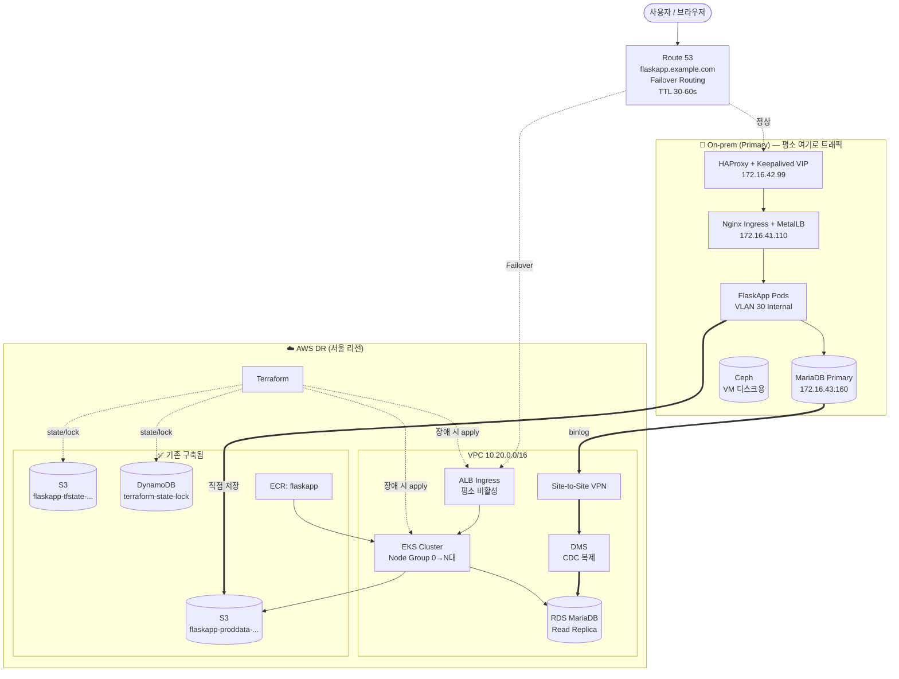
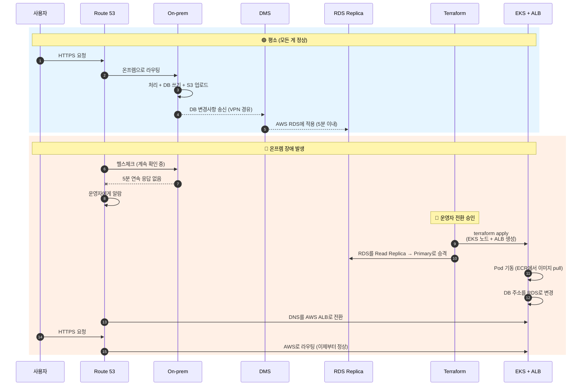

# AWS DR 설계 (Pilot Light) — 쉽게 풀어쓴 버전

> 이 문서는 **온프레미스(우리 회사 서버실)** 가 평소엔 모든 일을 하고,
> **AWS는 비상용 백업**으로 대기하는 구조를 설명합니다.
> Pilot Light는 "보일러 점화용 작은 불씨"라는 뜻 — 최소한의 불씨만 켜두고 필요할 때 확 키우는 방식입니다.

## 📌 한 줄 요약

> **평소엔 데이터만 AWS로 계속 복사해두고, 서버는 안 만들어 둡니다. 진짜 장애가 나면 그때 Terraform 명령어 한 번으로 AWS에 서버를 띄우고 트래픽을 옮깁니다.**

## 목차

- [0. 이 문서 시작하기 전에](#0-이-문서-시작하기-전에)
- [1. 우리가 풀려는 문제](#1-우리가-풀려는-문제)
- [2. 이미 만들어 둔 것들](#2-이미-만들어-둔-것들)
- [3. 전체 그림](#3-전체-그림)
- [4. 네트워크 — AWS 안에 어떻게 길을 내는가](#4-네트워크--aws-안에-어떻게-길을-내는가)
- [5. EKS — 평소엔 0대, 장애 시 N대](#5-eks--평소엔-0대-장애-시-n대)
- [6. 데이터 — 사진과 DB는 어떻게 동기화되는가](#6-데이터--사진과-db는-어떻게-동기화되는가)
- [7. 보안 — 누가 무엇을 할 수 있는가](#7-보안--누가-무엇을-할-수-있는가)
- [8. 모니터링 — 뭔가 잘못됐을 때 어떻게 아는가](#8-모니터링--뭔가-잘못됐을-때-어떻게-아는가)
- [9. CI/CD & Terraform 구조](#9-cicd--terraform-구조)
- [10. 비용은 얼마나?](#10-비용은-얼마나)
- [11. 구축 단계 체크리스트](#11-구축-단계-체크리스트)

---

## 0. 이 문서 시작하기 전에

### 0.1 자주 등장하는 용어

| 용어 | 한 줄 설명 |
|---|---|
| **DR** (Disaster Recovery) | 재해 복구. "메인 시스템이 죽었을 때 어떻게 살릴까" 계획 |
| **온프레미스 (On-prem)** | 우리가 직접 운영하는 서버실/데이터센터 |
| **Pilot Light** | 평소엔 최소만 켜두는 DR 방식 (이 문서의 방식) |
| **RTO** | 장애 발생 후 **복구까지 걸리는 시간** 목표 |
| **RPO** | 장애 시 **잃어도 되는 데이터의 시간 범위** 목표 |
| **EKS** | AWS가 관리해주는 Kubernetes (컨테이너 묶음 운영 시스템) |
| **RDS** | AWS가 관리해주는 데이터베이스 (MariaDB/MySQL 등) |
| **DMS** | DB → DB로 데이터를 실시간 복사해주는 AWS 서비스 |
| **S3** | AWS의 파일 저장소 (사진/문서 등) |
| **VPC** | AWS 안에서 우리만 쓰는 사설 네트워크 |
| **ALB** | 사용자 트래픽을 받아 뒤쪽 서버로 분배하는 로드밸런서 |
| **Route 53** | AWS의 DNS 서비스 (도메인 → IP 안내) |
| **ECR** | AWS의 Docker 이미지 저장소 |
| **Terraform** | "이런 인프라 만들어줘" 코드로 적으면 AWS에 만들어주는 도구 |
| **IRSA** | EKS Pod에게 AWS 권한을 안전하게 주는 방법 |

### 0.2 우리의 목표 (RTO/RPO)

| 항목 | 목표 | 의미 |
|---|---|---|
| **RTO** | 30분 이내 | 장애 발생 후 30분 안에 서비스를 다시 띄운다 |
| **RPO** | 5분 이내 | 장애 직전 5분치 데이터까지만 잃을 수 있다 |
| **장애 감지** | Route 53 헬스체크 | AWS가 자동으로 온프렘이 살아있는지 확인 |
| **전환 방식** | 운영자 승인 후 수동 | 자동으로 넘기지 않고 사람이 한 번 확인 |
| **복구 후 원상복귀** | 역방향 동기화 후 DNS 원복 | 온프렘 살아나면 다시 그쪽으로 |

### 0.3 왜 Pilot Light인가? (다른 방식과 비교)

DR에는 여러 단계가 있습니다. 비유하자면:

- **Backup & Restore**: 사진만 백업해 둠 (가장 싸지만 복구 오래 걸림)
- **Pilot Light** ⭐ **(우리 선택)**: 데이터는 실시간 복사, 서버는 꺼둠
- **Warm Standby**: 데이터 + 서버 일부도 계속 켜둠 (더 빠르지만 비쌈)
- **Hot Standby / Multi-Site**: 양쪽에서 동시 서비스 (가장 빠르지만 가장 비싸고 복잡)

**Pilot Light를 고른 이유:**
- 💰 Warm Standby보다 **70~80% 저렴** (서버를 평소엔 안 켜두니까)
- 🔒 데이터는 계속 복사하므로 **잃을 위험 거의 없음**
- 🧠 양쪽 동시 서비스의 복잡함 (어느 쪽이 진짜냐? 같은 문제) 없음
- ⏱ **단점**: 서버를 새로 만들어야 하니 복구가 20~30분 걸림 (즉시는 아님)

---

## 1. 우리가 풀려는 문제

### 1.1 지금 상황

우리 회사는 **온프레미스에 모든 걸 운영 중**입니다:
- Proxmox (가상화) + Kubernetes (컨테이너 운영)
- MariaDB (데이터베이스, Primary)
- Ceph (가상머신 디스크 저장소)
- HAProxy + Keepalived (트래픽 분배 + 가상 IP)

**문제**: 데이터센터에 정전, 네트워크 끊김, 화재 등이 발생하면 서비스 전체가 멈춥니다.

### 1.2 우리의 해결책

| 평소 (Steady State) | 장애 시 (Failover) |
|---|---|
| 온프렘이 모든 트래픽 처리 | AWS가 받아서 처리 |
| AWS는 데이터만 복사받음 | AWS가 RDS 승격 + EKS 생성 |
| RDS는 Read Replica로 대기 | RDS가 Primary로 승격 |
| EKS는 아예 없음 | Terraform 한 번에 생성 |
| Route 53이 온프렘을 가리킴 | Route 53이 AWS ALB를 가리킴 |

---

## 2. 이미 만들어 둔 것들

새로 시작하는 게 아니라, 이미 AWS에 4개의 리소스가 있습니다:

| 이름 | 종류 | 무엇을 하는가 |
|---|---|---|
| `flaskapp-tfstate-kosa-project-jh-a3asx` | S3 버킷 | Terraform 상태 파일 저장소 ("내가 뭘 만들었는지" 기록) |
| `flaskapp-proddata-kosa-project-jh-lai9z` | S3 버킷 | 앱이 쓰는 사진/파일 저장소 |
| `terraform-state-lock` | DynamoDB | 두 사람이 동시에 Terraform 못 돌리게 잠금 |
| `flaskapp` | ECR | Docker 이미지 저장소 |

### 2.1 명명 규칙

새로 만드는 모든 리소스는 이 패턴을 따릅니다:

```
<용도>-kosa-project-jh-<랜덤 6자리>
```

예시:
- VPC → `vpc-kosa-project-jh`
- EKS → `eks-flaskapp-kosa-project-jh`
- RDS → `rds-flaskapp-kosa-project-jh`

> 💡 `kosa-project-jh`는 프로젝트 식별자, 랜덤 6자리는 S3처럼 전 세계에서 유일해야 하는 리소스용입니다.

### 2.2 기존 리소스를 어떻게 활용할 것인가

- **`flaskapp-tfstate-...`** → 모든 새 리소스의 Terraform 상태도 여기에 저장
- **`flaskapp-proddata-...`** → ⭐ **핵심**: 온프렘 앱도, AWS EKS 앱도 **같은 버킷**을 사용합니다. 별도 복사 불필요.
- **`flaskapp` ECR** → 평소부터 빌드해서 push해두면, 장애 시 AWS EKS가 즉시 pull 가능

> ⚠️ 만약 장애 시점에 ECR에 이미지가 없다면, 그제서야 빌드/push를 시작해야 해서 복구 시간이 늘어납니다. **평소부터 push가 가장 중요한 운영 습관**입니다.

---

## 3. 전체 그림

### 3.1 구성도



### 3.2 시간 순서로 보는 흐름



---

## 4. 네트워크 — AWS 안에 어떻게 길을 내는가

### 4.1 VPC: 우리만의 사설 네트워크

AWS 안에 **VPC**(가상 사설 네트워크)를 하나 만들고, 그 안에 서브넷 6개를 둡니다.

- **리전**: `ap-northeast-2` (서울)
- **AZ**: 2개 (서울 a + 서울 c) — 한쪽 AZ가 죽어도 다른 쪽으로 버틸 수 있게
- **VPC CIDR**: `10.20.0.0/16`

> ⚠️ **왜 `10.20.0.0/16`?**
> 온프렘이 이미 쓰는 IP 대역들과 겹치면 안 됩니다:
> - 온프렘 LAN: `172.16.x.x`
> - Ceph: `10.10.10.0/24`
> - K8s Pod: `10.244.0.0/16`
> - K8s Service: `10.96.0.0/12`
>
> 이들과 안 겹치는 `10.20.0.0/16`을 선택.

### 4.2 서브넷 6개 (AZ당 3종류 × 2 AZ)

서브넷은 "역할에 맞는 동네"라고 생각하면 됩니다:

| 종류 | CIDR | 누가 사는가 | 인터넷 접근? |
|---|---|---|---|
| **Public** ×2 | `10.20.0.0/24`, `10.20.1.0/24` | ALB, NAT Gateway | 직접 가능 |
| **Private App** ×2 | `10.20.10.0/24`, `10.20.11.0/24` | EKS 워커 노드, Pod | NAT 통해서만 |
| **Private Data** ×2 | `10.20.20.0/24`, `10.20.21.0/24` | RDS, DMS | 외부 차단 |

### 4.3 게이트웨이 (네트워크 출입구)

- **Internet Gateway**: Public 서브넷에서 인터넷으로 나가는 문
- **NAT Gateway × 2 (AZ별)**: Private 서브넷에서 인터넷 나갈 때 거치는 문
  - 왜 2개? 한 NAT만 있으면 그 AZ가 죽었을 때 다른 AZ도 인터넷 못 나감
- **VPC Endpoint** (사설 통로):
  - **Gateway형** (무료): S3, DynamoDB → NAT 안 거쳐도 됨
  - **Interface형** (유료): ECR, STS, CloudWatch, Secrets Manager → 사설로 안전하게 접근

### 4.4 온프렘 ↔ AWS 연결

DMS가 온프렘 MariaDB를 읽으려면 **사설 회선**이 필요합니다 (인터넷으로 열면 보안상 위험).

- **1차 권장**: **Site-to-Site VPN** (IPsec)
  - AWS 쪽: VPN Gateway
  - 온프렘 쪽: 기존 pfSense VM의 VPN 기능 사용 (장비 추가 X)
- **나중에 트래픽 커지면**: Direct Connect (전용선)로 업그레이드

### 4.5 Security Group (방화벽 규칙)

각 컴포넌트마다 SG를 분리해서, "누가 누구에게 어떤 포트로 접근 가능한가"를 명시:

| SG | 누가 들어올 수 있나 | 메모 |
|---|---|---|
| `alb-sg` | 인터넷 누구나 (443, 80) | 80은 HTTPS로 리다이렉트용 |
| `eks-node-sg` | `alb-sg`에서만 | SSH는 막고 SSM으로만 접속 |
| `rds-sg` | `eks-node-sg`, `dms-sg`만 (3306) | DB는 절대 외부 직접 접속 X |
| `dms-sg` | (주로 아웃바운드) | 온프렘 DB와 RDS 양쪽으로 |
| `endpoint-sg` | VPC 내부에서만 (443) | VPC Endpoint 전용 |

> 🔒 **원칙**: RDS는 반드시 Private 서브넷에만, 절대 Public Access 금지.

---

## 5. EKS — 평소엔 0대, 장애 시 N대

### 5.1 EKS 클러스터 구성

| 항목 | 설계값 |
|---|---|
| 클러스터명 | `eks-flaskapp-kosa-project-jh` |
| EKS 버전 | 1.30 이상 |
| API Endpoint 접근 | Private + Public(IP 화이트리스트) |
| Control Plane 로그 | 5종(api, audit 등) 모두 켜기 → CloudWatch |
| Add-on | VPC CNI, CoreDNS, kube-proxy, EBS CSI, AWS Load Balancer Controller |

### 5.2 Node Group — Pilot Light의 핵심 트릭

**핵심 아이디어**: 평소엔 **노드 0대**, 장애 시 **N대**로 즉시 확장.

```
평소:     min=0, max=N, desired=0  →  EC2 비용 $0
장애 시:  Terraform 변수만 바꿔서 desired=3 →  3대 부팅 (몇 분)
```

- **Managed Node Group**: AWS가 패치/업데이트 자동 관리
- **인스턴스 타입**: `m6i.large` 또는 `t3.large`, 비용 민감하면 **Spot 70% + On-Demand 30%**
- **얼마나?**: 온프렘 워커 (4vCPU/8GB ×3대) 기준으로 AWS도 `m6i.large` × 3~4대 정도
- **선택지 — Karpenter**: 기본 Cluster Autoscaler보다 노드 생성이 빠름. RTO 단축에 유리

### 5.3 IRSA — Pod에게 AWS 권한을 안전하게 주기

**문제**: Pod가 S3에 사진 업로드하려면 AWS 권한이 필요. 그런데 액세스 키를 Pod 안에 박아두면 위험.

**해결**: **IRSA** (IAM Roles for Service Accounts) — Pod의 ServiceAccount에 IAM Role을 묶어주면, AWS가 알아서 임시 자격증명을 발급해줍니다.

| ServiceAccount | 주는 권한 | 용도 |
|---|---|---|
| `flaskapp-sa` | S3 R/W, KMS Decrypt, Secrets Manager Read | 앱에서 S3 접근 + DB 비번 가져오기 |
| `aws-load-balancer-controller` | ELB/EC2/ACM 일부 | Ingress 만들면 ALB 자동 생성 |
| `external-dns` (선택) | Route53 수정 | 호스트명 자동 등록 |
| `cluster-autoscaler` | EC2 ASG 조정 | 노드 자동 스케일 |

`flaskapp-sa`에 줄 권한 예시:

```json
{
  "Version": "2012-10-17",
  "Statement": [
    {
      "Effect": "Allow",
      "Action": ["s3:GetObject", "s3:PutObject", "s3:DeleteObject"],
      "Resource": "arn:aws:s3:::flaskapp-proddata-kosa-project-jh-lai9z/*"
    },
    {
      "Effect": "Allow",
      "Action": ["s3:ListBucket"],
      "Resource": "arn:aws:s3:::flaskapp-proddata-kosa-project-jh-lai9z"
    }
  ]
}
```

### 5.4 Ingress (사용자 → Pod 가는 길)

- **AWS Load Balancer Controller** (Helm으로 설치) — Ingress 리소스 만들면 ALB 자동 생성
- **HTTPS 인증서**: ACM에서 발급, Ingress annotation으로 연결
- **헬스체크**: Pod의 `/healthz` 엔드포인트

```yaml
annotations:
  alb.ingress.kubernetes.io/scheme: internet-facing
  alb.ingress.kubernetes.io/target-type: ip
  alb.ingress.kubernetes.io/certificate-arn: arn:aws:acm:...
  alb.ingress.kubernetes.io/healthcheck-path: /healthz
  alb.ingress.kubernetes.io/listen-ports: '[{"HTTPS":443}]'
  alb.ingress.kubernetes.io/ssl-redirect: '443'
```

### 5.5 워크로드(앱) 배포

- **이미지 출처**: `flaskapp` ECR
- **Replicas**: 2~4개, HPA로 CPU 70% 기준 2~10개 자동 확장
- **장애 시 환경변수만 바꿔주기**:
  - `DATABASE_HOST` → RDS 주소
  - `PHOTOS_BUCKET` → `flaskapp-proddata-...` (그대로, 같은 버킷)
- **PodDisruptionBudget** `minAvailable=1`: 노드 교체 중에도 최소 1개는 살아있게
- **Liveness/Readiness Probe** 필수
- **Secret은 온프렘과 분리**: AWS는 Secrets Manager + External Secrets Operator로

> ⚠️ **다시 강조**: 평소부터 GitHub Actions가 매 빌드마다 `flaskapp` ECR로 push해야 합니다. 장애 시점에 빌드 시작하면 RTO가 크게 늘어납니다.

---

## 6. 데이터 — 사진과 DB는 어떻게 동기화되는가

### 6.1 RDS — DB의 백업 사본

| 항목 | 설계값 |
|---|---|
| DB Identifier | `rds-flaskapp-kosa-project-jh` |
| 엔진 | **MariaDB** (또는 MySQL) — 온프렘과 동일 버전 |
| 인스턴스 | `db.t3.medium` 또는 `db.m6i.large` |
| 스토리지 | gp3 100GB부터, 자동 확장, **KMS 암호화 필수** |
| Multi-AZ | 권장 (장애 시 Primary가 되니까) |
| 백업 | 자동 7일, 수동 스냅샷 월 1회 |
| 파라미터 | `binlog_format=ROW`, `server_id` 고유, GTID 활성화 |
| 자격증명 | Secrets Manager에서 자동 회전 |
| Public Access | **반드시 OFF** |

### 6.2 DMS — DB를 실시간으로 복사

**DMS (Database Migration Service)** 는 이름은 "마이그레이션"이지만, **실시간 복제(CDC)** 에도 씁니다.

원리:
1. 온프렘 MariaDB가 변경사항을 **binlog**라는 로그에 기록
2. DMS가 binlog를 읽어서 변경분만 추출
3. AWS RDS에 동일하게 적용 (보통 수 초~분 지연)

| 항목 | 설정 |
|---|---|
| Replication Instance | `dms-flaskapp-kosa-project-jh` / `dms.t3.medium`, Multi-AZ 권장 |
| Source | 온프렘 MariaDB (`172.16.43.160:3306`, VPN 너머) |
| Target | AWS RDS MariaDB |
| Migration Type | `full-load-and-cdc` (처음 한 번 전체 복사 + 이후 변경분만) |

> ⚠️ **DDL 주의**: 테이블 구조 변경(ALTER TABLE 등)은 DMS가 잘 못 따라갈 수 있습니다. 스키마 변경은 양쪽에 수동으로 동시 적용하는 절차가 필요합니다.

**필수 알람**:
- `CDCLatencySource`, `CDCLatencyTarget` — 복제 지연 시간. 5분 넘으면 알람.

### 6.3 S3 (proddata) — 사진은 양쪽에서 같은 버킷

이미 만들어진 `flaskapp-proddata-kosa-project-jh-lai9z` 버킷을 **온프렘 앱도, AWS EKS 앱도 똑같이 사용**합니다.

| 점검 항목 | 권장 설정 |
|---|---|
| Public Access | Block (전부 차단) |
| Versioning | ON (실수로 지워도 복구) |
| 기본 암호화 | SSE-KMS |
| 수명주기 | Standard → 30일 후 IA → 90일 후 Glacier |
| 접근 | 온프렘 IAM User + EKS IRSA 양쪽 허용 |

> 📌 평소에도 온프렘 앱이 직접 S3에 쓰므로, 온프렘 → AWS S3 HTTPS outbound가 **항상 가능**해야 합니다.

### 6.4 S3 (tfstate) — Terraform 상태 전용

이건 다른 용도와 절대 섞지 않습니다.

| 항목 | 설정 |
|---|---|
| Versioning | **반드시 ON** (state 손상 시 복구) |
| 암호화 | SSE-KMS |
| Public Access | Block |
| 접근 | `TerraformDeployRole`만 |

### 6.5 장애 시 데이터 전환 — 9단계

| # | 단계 | 어떻게 |
|---|---|---|
| 1 | 온프렘 장애 감지 | CloudWatch + Route53 Health Check |
| 2 | DR 전환 결정 | 👤 운영자 승인 |
| 3 | 온프렘 write 중단 + lag 확인 | DMS 콘솔에서 `CDCLatencyTarget` 0 가까이 |
| 4 | RDS 승격 (Replica → Primary) | `aws rds promote-read-replica` |
| 5 | EKS/ALB/IAM/SG 생성 | `terraform apply -var dr_active=true` |
| 6 | ECR 이미지를 EKS에 배포 | Helm/Kustomize |
| 7 | 환경변수 주입 | External Secrets가 자동 |
| 8 | Route53을 ALB로 전환 | Failover Record 자동 (TTL 30~60s) |
| 9 | HTTP/DB/S3 검증 | `/healthz` + 샘플 트랜잭션 |

---

## 7. 보안 — 누가 무엇을 할 수 있는가

### 7.1 IAM 원칙

- **최소 권한**: 기본은 Deny, 필요한 것만 Allow
- **Role 기반**: 사용자 IAM User 만들지 말고 SSO로 Role Assume
- **MFA 강제**: 콘솔 로그인 + 위험한 액션(KMS 비활성화, RDS 삭제 등)
- **CI/CD는 OIDC**: GitHub Actions에서 OIDC로 임시 자격증명. **장기 액세스 키 금지**

### 7.2 주요 Role

| Role | 누구를 신뢰? | 주요 권한 |
|---|---|---|
| `EKSClusterRole` | EKS 서비스 | EKS 운영 |
| `EKSNodeRole` | EC2 | 워커 노드 운영 + ECR pull |
| `FlaskAppPodRole` (IRSA) | EKS OIDC | S3 R/W, KMS Decrypt, Secrets 읽기 |
| `DMSReplicationRole` | DMS 서비스 | VPC ENI 생성, 로그 쓰기 |
| `TerraformDeployRole` | GitHub OIDC | DR 리소스 생성/수정 + tfstate 접근 |

### 7.3 KMS (암호화 키)

용도별로 키를 **분리**합니다 (한 키 털리면 다 털리니까):
- `alias/flaskapp-rds-kosa-project-jh` → RDS
- `alias/flaskapp-s3-kosa-project-jh` → S3
- `alias/flaskapp-secrets-kosa-project-jh` → Secrets Manager
- `alias/flaskapp-ebs-kosa-project-jh` → EBS

- 자동 키 회전: 연 1회 ON
- 키 정책: Root는 관리만, 실제 암복호화는 해당 Role만

### 7.4 Secrets Manager

DB 비밀번호, API 키 등을 Secrets Manager에 두고, **External Secrets Operator**가 K8s Secret으로 자동 동기화.

- `flaskapp-db-kosa-project-jh` → RDS 자격증명 (30~90일 자동 회전)
- `flaskapp-api-keys-kosa-project-jh` → 외부 API 키
- **ConfigMap에 비번 절대 평문 X**
- **온프렘과 AWS는 별도 값** — 한쪽 털려도 다른 쪽은 안전

### 7.5 추가 보안

- **GuardDuty**: 이상 행위 자동 탐지
- **AWS Config**: 리소스 변경 추적
- **CloudTrail**: 모든 API 호출 기록 (7년 보관)
- **Security Hub**: 보안 표준 준수 점검
- **WAF**: ALB 앞단에 OWASP Top 10 룰셋

---

## 8. 모니터링 — 뭔가 잘못됐을 때 어떻게 아는가

### 8.1 메트릭 (수치 모니터링)

- **Container Insights**: EKS 클러스터 CPU/메모리/네트워크
- **앱 메트릭**: `/metrics` → Prometheus → AMP → 온프렘 Grafana에서도 볼 수 있게
- **RDS Performance Insights**: DB 부하 분석
- **DMS**: `CDCLatencySource`, `CDCLatencyTarget` ← **이게 가장 중요** (RPO 직결)

### 8.2 로그 집계

- **Pod 로그**: Fluent Bit → CloudWatch Logs (30일 보존) 또는 OpenSearch
- **ALB Access Log**: S3
- **VPC Flow Log**: S3 (보안 사고 분석용)
- **CloudTrail**: 전 리전 → S3 + CloudWatch Logs

### 8.3 알람 우선순위

| 우선순위 | 알람 | 트리거 |
|---|---|---|
| **🚨 P1** | Route53 헬스체크 실패 (온프렘) | 5분 연속 fail → PagerDuty + 온프렘 Alertmanager |
| **🚨 P1** | DMS CDC 지연 | 5분 초과 → Slack `#ops-critical` |
| **⚠️ P2** | RDS Replica Lag | 60초 초과 → Slack |
| **⚠️ P2** | RDS CPU/Storage | 80% 5분 → Slack |
| **⚠️ P2** | EKS Node NotReady | 발생 시 |
| **ℹ️ P3** | ALB 5xx 비율 | 5분 평균 1% 초과 → Slack |
| **ℹ️ P3** | 비용 이상 | 월 예산 80%/100% → 알림 |

### 8.4 대시보드

- CloudWatch Dashboard 또는 Grafana (AMG)에서 한눈에:
  - DR 상태 / DMS lag / RDS 부하 / EKS 노드 수 / ALB 트래픽
- **"DR Readiness" 별도 대시보드**: 평소엔 "✅ Replication Healthy"만 보이면 OK

---

## 9. CI/CD & Terraform 구조

### 9.1 Terraform 디렉토리

```
terraform/
├── modules/                # 재사용 가능한 부품들
│   ├── network/            # VPC, Subnet, NAT, IGW, Endpoint
│   ├── security/           # SG, NACL
│   ├── route53/            # Hosted zone, failover, health check
│   ├── s3/                 # 기존 버킷 import
│   ├── rds/                # RDS instance
│   ├── dms/                # DMS
│   ├── ecr/                # 기존 ECR import
│   ├── eks/                # EKS, Node Group, Add-on, IRSA
│   ├── alb-ingress/        # AWS Load Balancer Controller, ACM
│   ├── iam/                # Roles, OIDC
│   └── observability/      # CloudWatch
├── bootstrap/              # tfstate 버킷, lock 테이블 import용
└── envs/
    └── dr/                 # 실제 환경 (DR)
        ├── backend.tf
        ├── providers.tf
        ├── main.tf
        ├── variables.tf
        ├── outputs.tf
        └── terraform.tfvars
```

### 9.2 Backend 설정 (기존 리소스 사용)

```hcl
# envs/dr/backend.tf
terraform {
  backend "s3" {
    bucket         = "flaskapp-tfstate-kosa-project-jh-a3asx"
    key            = "envs/dr/terraform.tfstate"
    region         = "ap-northeast-2"
    dynamodb_table = "terraform-state-lock"
    encrypt        = true
  }
}
```

> 💡 **기존 4개 리소스 import**: 이미 콘솔에서 만들어진 거라 Terraform이 모릅니다. `terraform import`로 알려줘야 합니다.
>
> ```bash
> terraform import module.s3.aws_s3_bucket.proddata flaskapp-proddata-kosa-project-jh-lai9z
> terraform import module.s3.aws_s3_bucket.tfstate  flaskapp-tfstate-kosa-project-jh-a3asx
> terraform import module.ecr.aws_ecr_repository.flaskapp flaskapp
> terraform import module.dynamodb.aws_dynamodb_table.lock terraform-state-lock
> ```

### 9.3 평소 vs 장애 시 리소스 분리

**평소 (`dr_active = false`)** — 항상 켜둠:
- VPC, Subnet, Routing, SG
- Site-to-Site VPN
- 기존 S3 버킷 2개
- RDS MariaDB
- DMS
- Route 53
- ECR
- IAM Role, KMS, Secrets Manager
- CloudWatch Alarm

**장애 시 (`dr_active = true`)** — 그때 추가 생성:
- EKS Cluster
- EKS Node Group
- AWS Load Balancer Controller
- K8s Namespace, Secret, ConfigMap
- FlaskApp Deployment / Service / Ingress
- HPA, Container Insights

### 9.4 Pilot Light 토글 패턴

```hcl
# variables.tf
variable "dr_active" {
  type        = bool
  default     = false
  description = "true면 EKS/노드/ALB를 띄움 (Failover 모드)"
}

# 모듈을 조건부로 생성
module "eks" {
  source = "../../modules/eks"
  count  = var.dr_active ? 1 : 0
  # ...
}

module "alb_ingress" {
  source = "../../modules/alb-ingress"
  count  = var.dr_active ? 1 : 0
  # ...
}
```

평소엔 `dr_active=false`, 장애 시 `true`로 바꾼 후 `terraform apply` 한 번이면 EKS·노드·ALB가 올라옵니다.

### 9.5 CI/CD 파이프라인

| 흐름 | 도구 / 트리거 |
|---|---|
| **App 빌드** | GitHub Actions → Docker build → `flaskapp` ECR push (`<sha>` + `latest` 태그) |
| **Manifest 관리** | Helm 또는 Kustomize, ArgoCD/Flux로 GitOps (온프렘과 동일 매니페스트 공유) |
| **Infra 변경** | PR → `terraform plan` 자동 댓글 → 리뷰 → main 머지 시 apply (수동 승인 게이트) |
| **인증** | GitHub Actions OIDC → AWS Role Assume |

GitHub Actions ECR Push 예시:

```yaml
- uses: aws-actions/configure-aws-credentials@v4
  with:
    role-to-assume: arn:aws:iam::<account>:role/GitHubActionsECRPushRole
    aws-region: ap-northeast-2

- uses: aws-actions/amazon-ecr-login@v2

- name: Build & Push
  run: |
    docker build -t flaskapp:${{ github.sha }} .
    docker tag flaskapp:${{ github.sha }} <account>.dkr.ecr.ap-northeast-2.amazonaws.com/flaskapp:${{ github.sha }}
    docker tag flaskapp:${{ github.sha }} <account>.dkr.ecr.ap-northeast-2.amazonaws.com/flaskapp:latest
    docker push <account>.dkr.ecr.ap-northeast-2.amazonaws.com/flaskapp:${{ github.sha }}
    docker push <account>.dkr.ecr.ap-northeast-2.amazonaws.com/flaskapp:latest
```

### 9.6 DR 훈련 (가장 중요!)

> Pilot Light는 *"한 번도 안 매본 안전벨트"* 가 되기 쉽습니다. **분기당 1회** 훈련 필수.

훈련 시나리오:
1. 일부러 온프렘 HAProxy VIP를 죽임
2. Route53 Health Check 실패 확인
3. 전체 전환 절차 실행
4. **RTO/RPO 측정**해서 목표 달성하는지 확인
5. 문제점은 **Runbook**에 기록
6. 자동화할 수 있는 단계는 Lambda/Step Functions로 이전

**Failback 훈련도 함께** — 양쪽이 동시에 Primary가 되는 "split-brain" 사태 방지.

---

## 10. 비용은 얼마나?

서울 리전, 월간 **개략** 추정 (USD):

| 항목 | 비용 | 메모 |
|---|---|---|
| RDS `db.t3.medium` Multi-AZ + 100GB | $130 ~ $180 | DR Replica 상시 가동 |
| DMS `dms.t3.medium` Multi-AZ | $140 ~ $180 | CDC 상시 |
| NAT Gateway × 2 + 데이터 | $70 ~ $120 | NAT 1개로 줄이면 절반 |
| Site-to-Site VPN | $36 + 데이터 | Direct Connect는 별도 견적 |
| S3 `proddata` 100GB | $3 ~ $10 | |
| S3 `tfstate` | < $1 | |
| DynamoDB lock | < $1 | On-demand |
| ECR `flaskapp` | $1 ~ $5 | |
| **EKS Control Plane** | **$0** (평시) | `dr_active=false`라 미생성 |
| **EC2 Worker Node** | **$0** (평시) | |
| CloudWatch Logs/Metrics | $20 ~ $50 | |
| Route 53 + Health Check | $2 ~ $5 | |
| **합계 (평시)** | **약 $400 ~ $590** | Failover 시 EKS $73 + EC2/ALB 추가 |

> 💡 **EKS Control Plane을 상시 띄울까?**
> - **상시 ON** (월 $73 추가): RTO 약 10분 단축, 첫 생성 시 시행착오 없음
> - **상시 OFF** (현 설계): 비용 절감, 대신 분기 훈련에서 EKS 생성 자체가 잘 되는지 확인 필수

---

## 11. 구축 단계 체크리스트

### Phase 0: 기존 리소스 정리

- [ ] 기존 4개 리소스를 Terraform으로 **import**
- [ ] 4개 리소스의 보안 설정 점검 (Versioning, 암호화, Public Access Block, Bucket Policy)
- [ ] `flaskapp-proddata-...` 버킷의 온프렘 IAM User 정책 확인

### Phase 1: 기반 인프라

- [ ] AWS 계정 분리(prod / dr / shared) 또는 단일 계정 + OU 결정
- [ ] VPC, Subnet, NAT, IGW 구성 (CIDR `10.20.0.0/16`, 온프렘과 충돌 없음 확인)
- [ ] **Site-to-Site VPN** 구성 (pfSense ↔ AWS VPN Gateway)
- [ ] IAM Identity Center, OIDC Provider 설정
- [ ] KMS CMK 4종 생성 (rds / s3 / secrets / ebs)

### Phase 2: 데이터 복제

- [ ] **RDS MariaDB DR Replica** 생성, 네트워크 검증
- [ ] DMS Replication Instance, Source/Target Endpoint, Task 설정
- [ ] Full Load + CDC 시작
- [ ] App의 S3 R/W가 `flaskapp-proddata-...`로 정상 동작 (IRSA 시뮬레이션)

### Phase 2.5: 데이터 정합성 검증

- [ ] DMS Validation 활성화 (행 단위 일치 확인)
- [ ] 샘플링 검증 — 양쪽 동일 쿼리 결과 비교
- [ ] CDC 지연 baseline 측정 → SLO 5분 검증

### Phase 3: EKS & App

- [ ] EKS 클러스터, Node Group(`desired=2`), Add-on 구성
- [ ] AWS Load Balancer Controller, External Secrets, Cluster Autoscaler/Karpenter
- [ ] `flaskapp` ECR에서 Pull 검증
- [ ] Helm Chart로 FlaskApp 배포 — `DATABASE_HOST`=RDS, `PHOTOS_BUCKET`=기존 버킷
- [ ] HTTP/DB/S3 검증 후 `dr_active=false`로 원복 (EKS 제거)

### Phase 4: 관측성 & 알람

- [ ] CloudWatch Dashboard, Alarm, SNS, PagerDuty/Slack 연동
- [ ] 온프렘 Prometheus와 메트릭 통합 (AMP 또는 remote_write)
- [ ] CloudTrail, GuardDuty, Security Hub, AWS Config 활성화

### Phase 5: Route53 & Failover

- [ ] Route53 Hosted Zone, Failover Record (Primary=온프렘 VIP / Secondary=ALB)
- [ ] Health Check 구성 (TTL 30~60초)
- [ ] **첫 DR 훈련 → Runbook 문서화**
- [ ] **Failback 훈련** — split-brain 방지 절차 검증
