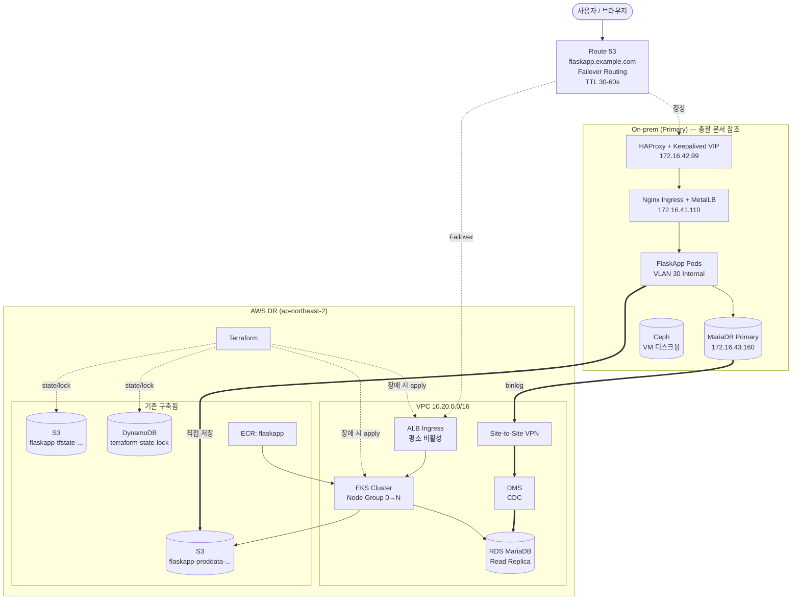
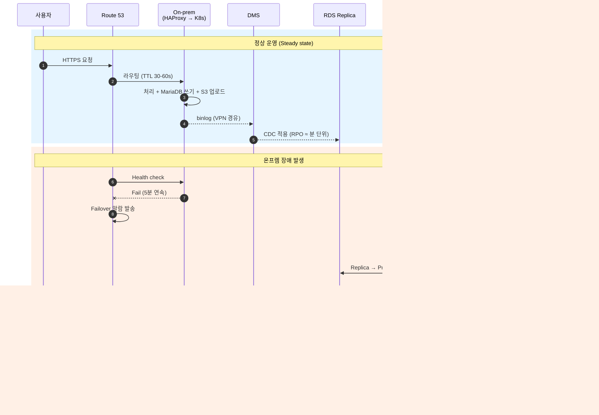

# AWS DR 설계 (Pilot Light)

> 총괄 인프라 설계서(`infrastructure-dr-architecture.md`)의 **AWS DR 환경 파트** 상세 설계 문서.
> On-prem(Proxmox + Kubernetes + MariaDB + Ceph)을 Primary로, AWS를 **Pilot Light** 수준의 DR로 구성한다.

## 목차

- [0. 설계 개요](#0-설계-개요)
- [1. 기존 구축 현황](#1-기존-구축-현황)
- [2. 전체 아키텍처](#2-전체-아키텍처)
- [3. 네트워크 (VPC / Subnet / SG / VPN)](#3-네트워크-vpc--subnet--sg--vpn)
- [4. EKS 상세 (Node Group / IRSA / Ingress)](#4-eks-상세-node-group--irsa--ingress)
- [5. 데이터 (RDS / DMS / S3)](#5-데이터-rds--dms--s3)
- [6. 보안 / IAM (KMS / IAM Role / Secrets)](#6-보안--iam-kms--iam-role--secrets)
- [7. 관측성 (CloudWatch / 로그 / 알람)](#7-관측성-cloudwatch--로그--알람)
- [8. CI/CD & Terraform 구조](#8-cicd--terraform-구조)
- [9. 예상 비용](#9-예상-비용)
- [10. 구축 단계 체크리스트](#10-구축-단계-체크리스트)

---

## 0. 설계 개요

> 📖 **상위 문서**: 본 문서는 총괄 설계서 `infrastructure-dr-architecture.md`의 **AWS DR 환경(섹션 8)** 을 상세화한 것이다. On-prem 네트워크/Proxmox/Kubernetes 설계는 총괄 문서를 참조한다.

평소에는 데이터 복제(RDS Replica, S3)와 Terraform 코드만 상시 유지하고, 온프렘 장애 시 `terraform apply`로 EKS 워커 노드와 ALB를 빠르게 생성하여 트래픽을 AWS로 전환한다.

### 0.1 목표 RTO / RPO

| 항목 | 목표값 |
|---|---|
| **RTO** (복구 시간) | 30분 이내 — Terraform apply + 노드 부팅 + Pod 기동 + DNS 전환 합계 |
| **RPO** (데이터 손실) | 5분 이내 — DMS CDC 지연 + RDS Replica lag 기준 |
| **Failover 트리거** | Route 53 Health Check 실패 → 운영자 승인 후 수동 apply |
| **Failback 방식** | 온프렘 복구 후 역방향 동기화 → DNS 원복 |
| **Route 53 TTL** | **30~60초** (총괄 문서 기준, 빠른 DNS 전파를 위함) |

### 0.2 Pilot Light 선택 이유

- **비용 최적화**: Warm Standby 대비 70~80% 저렴. EC2/EKS 노드를 평소엔 0대로 유지.
- **데이터 무결성**: RDS Replica + S3는 항상 켜두므로 데이터 손실 위험은 최소.
- **운영 단순성**: Hot Standby처럼 양쪽 동시 트래픽 처리에 따른 정합성 이슈 없음.
- **트레이드오프**: RTO가 Warm Standby(5~10분) 대비 길다(20~30분)는 점은 감수.

### 0.3 총괄 설계와의 정합성

| 총괄 문서 명시 사항 | 본 설계 반영 |
|---|---|
| On-prem DB는 **MariaDB/MySQL** Primary | RDS는 **MariaDB 또는 MySQL**, 온프렘 버전과 일치 |
| **AWS DMS CDC 단방향 복제** 권장 | DMS Replication Instance + `full-load-and-cdc` |
| S3는 **AWS 단일 버킷** (온프렘에 별도 구축 X) | 기존 `flaskapp-proddata-...` 버킷 양쪽 공유 |
| 정상 운영 시 `app -> S3` **직접 저장** | 온프렘 IAM User + EKS IRSA 양쪽 R/W 허용 |
| 장애 시 RDS 승격 + EKS 생성 + Route 53 전환 | Terraform `dr_active` 변수로 토글 |
| **컨테이너 이미지를 항상 ECR에 push** | GitHub Actions에서 `flaskapp` ECR로 상시 push |

---

## 1. 기존 구축 현황

본 설계는 이미 구축되어 있는 아래 리소스를 전제로 진행한다. 모든 신규 리소스는 동일한 명명 규칙(`<service>-<purpose>-kosa-project-jh-<suffix>`)을 따른다.

### 1.1 이미 구축된 리소스

| 카테고리 | 리소스 이름 | 용도 | 상태 |
|---|---|---|---|
| **S3** | `flaskapp-tfstate-kosa-project-jh-a3asx` | Terraform State 저장 | ✅ 운영 중 |
| **S3** | `flaskapp-proddata-kosa-project-jh-lai9z` | 온프렘 앱용 단일 Object Storage (사진/정적 파일/백업) | ✅ 운영 중 |
| **DynamoDB** | `terraform-state-lock` | Terraform State Lock 테이블 | ✅ 운영 중 |
| **ECR** | `flaskapp` | FlaskApp Docker 이미지 저장소 | ✅ 운영 중 |

### 1.2 명명 규칙 (신규 리소스 적용)

```
<service-or-purpose>-kosa-project-jh-<6자리 무작위 suffix>
```

- `kosa-project-jh` → 고정 식별자 (프로젝트/담당자)
- `suffix` → S3는 글로벌 유일성 확보용. RDS·EKS 등 리전 단위 리소스는 생략 가능

신규 리소스 명명 예시:

| 카테고리 | 신규 리소스 이름 (제안) | 용도 |
|---|---|---|
| VPC | `vpc-kosa-project-jh` | DR VPC |
| EKS | `eks-flaskapp-kosa-project-jh` | DR 클러스터 |
| RDS | `rds-flaskapp-kosa-project-jh` | DR Replica |
| DMS Instance | `dms-flaskapp-kosa-project-jh` | CDC 복제 |
| Secrets Manager | `flaskapp-db-kosa-project-jh` | DB 자격증명 |
| KMS Alias | `alias/flaskapp-rds-kosa-project-jh` 등 | 암호화 키 |

### 1.3 기존 리소스 활용 방향

- **`flaskapp-tfstate-...`** → 모든 DR 리소스의 Terraform Backend.
- **`flaskapp-proddata-...`** → 총괄 다이어그램의 "단일 Object Storage" 그 자체. 신규 버킷을 만들지 않고 EKS Pod도 동일 버킷을 사용 (IRSA로 R/W 권한 부여).
- **`terraform-state-lock`** → 동시 apply 방지용. 추가 변경 불필요.
- **`flaskapp` (ECR)** → 평소 빌드 시점부터 push해두면 장애 시 EKS가 즉시 Pull 가능. **총괄 문서 운영 체크포인트("App 영역")의 핵심 요건**.

---

## 2. 전체 아키텍처

### 2.1 구성도



### 2.2 정상 운영 vs Failover 흐름



---

## 3. 네트워크 (VPC / Subnet / SG / VPN)

### 3.1 VPC 구성

단일 리전(`ap-northeast-2` 서울)에 단일 VPC, 2개 가용영역(AZ-a, AZ-c)에 걸쳐 서브넷 배치.

> ⚠️ **CIDR 충돌 주의 (총괄 문서 "구축 전 확인 사항" 반영)**:
> 온프렘 LAN(`172.16.30.0/24`, `172.16.41-44.0/24`), Ceph(`10.10.10.0/24`),
> Pod CIDR(`10.244.0.0/16`), Service CIDR(`10.96.0.0/12`)과 **모두 겹치지 않게** AWS VPC는 `10.20.0.0/16` 사용.

| 서브넷 종류 | CIDR | 용도 |
|---|---|---|
| Public (×2 AZ) | `10.20.0.0/24`, `10.20.1.0/24` | ALB, NAT Gateway, Internet Gateway |
| Private App (×2 AZ) | `10.20.10.0/24`, `10.20.11.0/24` | EKS Worker Node, Pod ENI |
| Private Data (×2 AZ) | `10.20.20.0/24`, `10.20.21.0/24` | RDS, DMS Replication Instance, VPC Endpoints |

### 3.2 라우팅 & 게이트웨이

- **Internet Gateway**: Public Subnet의 `0.0.0.0/0` 라우트.
- **NAT Gateway (×2, AZ별)**: Private Subnet의 아웃바운드용. 단일 NAT은 SPOF가 되므로 AZ별 2개 권장.
- **VPC Endpoints**:
  - **Gateway**: S3, DynamoDB → `flaskapp-proddata-...`, `terraform-state-lock` 접근이 NAT을 거치지 않게 됨
  - **Interface**: ECR, STS, CloudWatch Logs, Secrets Manager → `flaskapp` ECR Pull도 사설 경로로

### 3.3 온프렘 ↔ AWS 연결

DMS CDC 트래픽과 운영자 SSH/kubectl 트래픽이 안전하게 흐르도록 사설 회선 필요.
**총괄 문서**에서 "DMS가 On-prem MariaDB에 접근하려면 VPN, NAT, pfSense 방화벽 정책 중 하나가 명확해야 한다"고 명시.

- **1차 권장**: Site-to-Site VPN (IPsec, BGP 동적 라우팅).
  - AWS 측: VPN Gateway in VPC
  - 온프렘 측: pfSense VM의 IPsec 기능 활용 (별도 장비 불필요)
  - VPN 너머 라우팅 대상: `172.16.43.160` (MariaDB) → DMS 방향 단방향
- **규모 확대 시**: Direct Connect로 전환.

### 3.4 Security Group 설계 원칙

계층별로 SG를 분리한다 — `alb-sg`, `eks-node-sg`, `rds-sg`, `dms-sg`, `endpoint-sg`.

| SG | 인바운드 | 비고 |
|---|---|---|
| `alb-sg` | 443 from `0.0.0.0/0`, 80 from `0.0.0.0/0` | HTTP는 HTTPS 리다이렉트용 |
| `eks-node-sg` | NodePort 범위 from `alb-sg` | SSH 닫고 SSM Session Manager로 접속 |
| `rds-sg` | 3306 from `eks-node-sg`, `dms-sg` | 외부 직접 접속 차단 |
| `dms-sg` | (아웃바운드 위주) | 온프렘 MariaDB(`172.16.43.160`) · RDS 방향 |
| `endpoint-sg` | 443 from VPC CIDR | VPC Endpoint 전용 |

> 총괄 문서의 "DB public access 금지" 원칙을 준수 — RDS는 Private Subnet에만 배치.

---

## 4. EKS 상세 (Node Group / IRSA / Ingress)

### 4.1 클러스터 구성

| 항목 | 설계값 |
|---|---|
| 클러스터명 | `eks-flaskapp-kosa-project-jh` |
| EKS 버전 | 1.30 이상 (지원 버전 중 안정 버전) |
| Endpoint Access | Private + Public(IP allowlist) |
| Control Plane 로그 | api / audit / authenticator / controllerManager / scheduler 모두 활성화 → CloudWatch Logs |
| Add-ons | VPC CNI, CoreDNS, kube-proxy, EBS CSI Driver, AWS Load Balancer Controller |

### 4.2 Node Group (Pilot Light 핵심)

> Pilot Light의 핵심은 **"평소엔 노드 0대, 장애 시 N대로 즉시 확장"** 이다.

- **Managed Node Group 사용**: Self-managed 대비 패치/롤링 업데이트 자동.
- **`min=0, max=N, desired=0`**: 평소엔 EC2 비용 0원. Terraform 변수로 `desired`만 변경.
- **인스턴스 타입**: `m6i.large` 또는 `t3.large` 혼합. 비용 민감하면 Spot 70% + On-Demand 30%.
- **온프렘과 비슷한 규모로**: 총괄 문서의 워커 노드 사양(4 vCPU / 8GB / 80GB) ×3대 기준이라면 AWS도 `m6i.large` (2 vCPU/8GB) ×3~4대 정도가 출발점.
- **대안 — Karpenter**: Cluster Autoscaler보다 빠른 노드 프로비저닝. RTO 단축에 유리.

### 4.3 IRSA (IAM Roles for Service Accounts)

Pod별로 최소 권한 IAM Role을 부여한다.

| ServiceAccount | 필요 권한 | 용도 |
|---|---|---|
| `flaskapp-sa` | `flaskapp-proddata-...` 버킷 R/W, KMS Decrypt, Secrets Manager Read | App에서 S3 접근 + DB 자격증명 조회 |
| `aws-load-balancer-controller` | ELB·EC2·ACM 일부 | Ingress→ALB 자동 생성 |
| `external-dns` (선택) | Route53 ChangeResourceRecordSets | Ingress 호스트명 자동 등록 |
| `cluster-autoscaler` | EC2 ASG 조정 | 노드 자동 스케일링 |

#### `flaskapp-sa` 권한 정책 예시

```json
{
  "Version": "2012-10-17",
  "Statement": [
    {
      "Effect": "Allow",
      "Action": ["s3:GetObject", "s3:PutObject", "s3:DeleteObject"],
      "Resource": "arn:aws:s3:::flaskapp-proddata-kosa-project-jh-lai9z/*"
    },
    {
      "Effect": "Allow",
      "Action": ["s3:ListBucket"],
      "Resource": "arn:aws:s3:::flaskapp-proddata-kosa-project-jh-lai9z"
    }
  ]
}
```

### 4.4 Ingress (ALB Ingress Controller)

- **AWS Load Balancer Controller** Helm 배포. Ingress 리소스 → ALB 자동 생성·업데이트.
- **인증서**: ACM에서 `flaskapp.example.com` 인증서 발급, Ingress annotation으로 연결.
- **Health Check**: Pod의 `/healthz` 엔드포인트로 ALB Target Group Health Check.

```yaml
annotations:
  alb.ingress.kubernetes.io/scheme: internet-facing
  alb.ingress.kubernetes.io/target-type: ip
  alb.ingress.kubernetes.io/certificate-arn: arn:aws:acm:...
  alb.ingress.kubernetes.io/healthcheck-path: /healthz
  alb.ingress.kubernetes.io/listen-ports: '[{"HTTPS":443}]'
  alb.ingress.kubernetes.io/ssl-redirect: '443'
```

### 4.5 워크로드 배포

- **이미지 출처**: `flaskapp` ECR (`<account>.dkr.ecr.ap-northeast-2.amazonaws.com/flaskapp:<tag>`).
- **Deployment**: `replicas=2~4` (총괄 문서 온프렘 기준과 동일), HPA로 CPU 70% 기준 2~10개 자동 스케일.
- **Failover 시 환경변수 전환** (총괄 문서 7번 항목 반영):
  - `DATABASE_HOST` → RDS endpoint
  - `PHOTOS_BUCKET` → `flaskapp-proddata-kosa-project-jh-lai9z` (변경 없음, 동일 버킷)
- **PodDisruptionBudget**: `minAvailable=1`로 노드 교체 중에도 가용성 유지.
- **Probe**: Liveness/Readiness 필수.
- **Secret 분리 (총괄 문서 운영 체크포인트 반영)**: 온프렘과 AWS의 Secret 값을 별도 관리. AWS 쪽은 Secrets Manager + External Secrets Operator로 통일.

> ⚠️ **운영상 핵심**: 평소부터 GitHub Actions 빌드가 `flaskapp` ECR로 push되도록 해두자. 장애 시점에 새로 빌드/push하면 RTO가 그만큼 늘어남.

---

## 5. 데이터 (RDS / DMS / S3)

### 5.1 RDS — DR Replica

총괄 문서의 "MariaDB to RDS CDC" 구도에 맞춰 설계.

| 항목 | 설계값 |
|---|---|
| DB Identifier | `rds-flaskapp-kosa-project-jh` |
| 엔진 | **RDS for MariaDB** (또는 MySQL) — **온프렘 버전과 일치** |
| 인스턴스 | `db.t3.medium` 또는 `db.m6i.large` |
| 스토리지 | gp3 100GB 시작, 자동 확장. KMS 암호화 필수 |
| Multi-AZ | 장애 전환 후 Primary가 되므로 권장 |
| 백업 | 자동 백업 7일, 수동 스냅샷 월 1회 |
| 파라미터 | `binlog_format=ROW`, `server_id` 고유, GTID 활성화 권장 |
| 자격증명 | Secrets Manager(`flaskapp-db-kosa-project-jh`)로 자동 회전 |
| Public Access | **반드시 비활성** (총괄 문서 보안 원칙) |

### 5.2 DMS — CDC 복제

총괄 문서의 "DB 복제 선택지" 표에서 **AWS DMS CDC가 가장 권장**되었다.

- **Replication Instance**: `dms-flaskapp-kosa-project-jh` / `dms.t3.medium` 시작. **Multi-AZ 권장**.
- **Source Endpoint**: 온프렘 MariaDB (`172.16.43.160:3306`, VPN 너머 사설 IP).
- **Target Endpoint**: RDS MariaDB.
- **Migration Type**: `full-load-and-cdc`.
- **DDL 주의**: DMS의 DDL 복제는 제약이 있으므로, 스키마 변경은 양쪽에 동시 적용하는 운영 절차 필요.
- **CloudWatch Alarm**: `CDCLatencySource`, `CDCLatencyTarget` 임계치 초과 시 알람 (RPO 직결).

### 5.3 S3 — `flaskapp-proddata-kosa-project-jh-lai9z` (기존, 단일 버킷)

> 총괄 문서: *"S3는 On-prem에 별도 구축하지 않고 AWS S3를 단일 Object Storage로 사용한다."*
> 이미 구축된 `flaskapp-proddata-...` 버킷이 그 단일 저장소.

| 항목 | 설정값 (점검 항목) |
|---|---|
| 버킷명 | `flaskapp-proddata-kosa-project-jh-lai9z` (기존) |
| 퍼블릭 액세스 | Block all public access |
| Versioning | 활성화 (실수 삭제 보호) |
| 기본 암호화 | SSE-KMS (CMK 사용) |
| 수명주기 | Standard → Standard-IA(30일) → Glacier(90일) |
| 접근 정책 | **온프렘 IAM User + EKS IRSA(`flaskapp-sa`) 양쪽 허용** |

> 📌 정상 운영 중에도 온프렘 App이 S3에 직접 쓰므로(총괄 다이어그램), 온프렘 → AWS S3 HTTPS outbound가 항상 가능해야 한다.

### 5.4 S3 — `flaskapp-tfstate-kosa-project-jh-a3asx` (기존)

Terraform State 전용 버킷. 다른 용도와 절대 섞지 않는다.

| 항목 | 설정값 (점검 항목) |
|---|---|
| 버킷명 | `flaskapp-tfstate-kosa-project-jh-a3asx` (기존) |
| Versioning | **반드시 활성화** (state 손상 시 복구) |
| 기본 암호화 | SSE-KMS |
| 퍼블릭 액세스 | Block all public access |
| 접근 정책 | `TerraformDeployRole`만 허용 |

### 5.5 Failover 시 데이터 전환 절차 (총괄 문서 §7 정렬)

총괄 문서 §7 "DR 전환 순서"와 1:1 매칭:

| # | 총괄 문서 단계 | AWS 측 실행 |
|---|---|---|
| 1 | 온프렘 장애 감지 | CloudWatch + Route53 Health Check 알람 |
| 2 | DR 전환 선언 | 운영자 승인 |
| 3 | On-prem write 중단 + lag 확인 | DMS 콘솔에서 `CDCLatencyTarget` 확인 |
| 4 | RDS 승격 | `aws rds promote-read-replica` 또는 콘솔 |
| 5 | Terraform으로 EKS/ALB/IAM/SG 생성 | `terraform apply -var dr_active=true` |
| 6 | ECR 이미지 EKS 배포 | Helm/Kustomize 배포 |
| 7 | `DATABASE_HOST`=RDS, `PHOTOS_BUCKET`=기존 버킷 | External Secrets로 자동 주입 |
| 8 | Route53을 ALB로 전환 | Failover Record 자동 전환 (TTL 30~60s) |
| 9 | HTTP/DB/S3 검증 | `/healthz` + 샘플 트랜잭션 |

---

## 6. 보안 / IAM (KMS / IAM Role / Secrets)

### 6.1 IAM 설계 원칙

- **최소 권한**: 기본은 Deny, 필요한 액션만 Allow.
- **Role-based**: 사용자별 IAM User 대신 SSO/IAM Identity Center로 Role을 Assume.
- **MFA 강제**: 콘솔 로그인 및 민감 액션(KMS Disable, RDS Delete 등)에 MFA 조건.
- **CI/CD**: GitHub Actions에서 OIDC Federation으로 임시 자격증명. **장기 Access Key 금지**.

### 6.2 핵심 Role 목록

| Role | Trust | 주요 권한 |
|---|---|---|
| `EKSClusterRole` | `eks.amazonaws.com` | `AmazonEKSClusterPolicy` |
| `EKSNodeRole` | `ec2.amazonaws.com` | `AmazonEKSWorkerNodePolicy` + ECR(`flaskapp`) Pull + CNI |
| `FlaskAppPodRole` (IRSA) | EKS OIDC Provider | `flaskapp-proddata-...` R/W, KMS Decrypt, Secrets Manager Read |
| `DMSReplicationRole` | `dms.amazonaws.com` | VPC ENI 생성, Logs PutLogEvents |
| `TerraformDeployRole` | GitHub OIDC | DR 리소스 생성/수정 + `flaskapp-tfstate-...` R/W + `terraform-state-lock` R/W |

### 6.3 KMS

- **CMK 분리**: 용도별 분리
  - `alias/flaskapp-rds-kosa-project-jh` → RDS 암호화
  - `alias/flaskapp-s3-kosa-project-jh` → S3 (proddata, tfstate) 암호화
  - `alias/flaskapp-secrets-kosa-project-jh` → Secrets Manager
  - `alias/flaskapp-ebs-kosa-project-jh` → EBS 볼륨
- **Key Rotation**: 자동 키 로테이션(연 1회) 활성화.
- **Key Policy**: Account Root는 관리 권한만, 실제 암복호화는 IRSA Role과 서비스 Role에만.

### 6.4 Secrets Manager

DB 비밀번호, API Key, OAuth Client Secret 등을 Secrets Manager에 저장하고, **External Secrets Operator**로 K8s Secret과 동기화.

- `flaskapp-db-kosa-project-jh` → RDS 자격증명 (자동 회전 30~90일)
- `flaskapp-api-keys-kosa-project-jh` → 외부 API 키 모음
- **ConfigMap에 평문 금지**: DB URL의 비밀번호 부분은 반드시 Secret Reference로.
- **온프렘과 분리** (총괄 문서 운영 체크포인트): 온프렘 K8s Secret과 AWS Secrets Manager는 **별도 값**으로 운영.

### 6.5 추가 보안 통제

- **GuardDuty** — 이상 행위 탐지.
- **AWS Config** — 리소스 구성 변경 추적.
- **CloudTrail** — 모든 API 호출 로깅, S3로 7년 보관.
- **Security Hub** — CIS·AWS Foundational 표준.
- **WAF** — ALB 앞단에 OWASP Top 10 룰셋, IP Rate Limit.

---

## 7. 관측성 (CloudWatch / 로그 / 알람)

총괄 문서의 운영 체크포인트 *"Monitoring: Prometheus/Grafana, Alertmanager, CloudWatch 연동"* 을 반영, 온프렘 Prometheus 스택과 AWS CloudWatch를 **함께** 운영한다.

### 7.1 메트릭

- **Container Insights**: EKS 클러스터 단위 CPU/메모리/네트워크.
- **App 메트릭**: Flask `/metrics` → Prometheus → AMP(Amazon Managed Prometheus) → 온프렘 Grafana에서 함께 조회 가능.
- **RDS**: Performance Insights 활성화.
- **DMS**: `CDCLatencySource`, `CDCLatencyTarget`이 핵심 (RPO 직결).

### 7.2 로그 집계

- **Pod 로그**: Fluent Bit DaemonSet → CloudWatch Logs (보존 30일) 또는 OpenSearch.
- **ALB Access Log**: S3로 저장.
- **VPC Flow Log**: S3로 저장 (보안 사고 분석용).
- **CloudTrail**: 전 리전 이벤트 → S3 + CloudWatch Logs.

### 7.3 알람 (CloudWatch Alarm + SNS)

| 우선순위 | 알람 | 임계치 / 액션 |
|---|---|---|
| **P1** | Route53 Health Check 실패 (온프렘 VIP) | 5분 연속 fail → PagerDuty + 온프렘 Alertmanager |
| **P1** | DMS CDC Latency | 5분 초과 → Slack `#ops-critical` |
| **P2** | RDS Replica Lag | 60초 초과 → Slack |
| **P2** | RDS CPU/Storage | CPU 80% 5분 / Storage 80% → Slack |
| **P2** | EKS Node 상태 | NotReady 노드 발생 |
| **P3** | ALB 5xx 비율 | 5분 평균 1% 초과 → Slack |
| **P3** | 비용 이상 | AWS Budgets로 월 예산 80%/100% 알림 |

### 7.4 대시보드

- CloudWatch Dashboard 또는 Grafana(AMG)로 한 화면에서 — DR 상태 / DMS lag / RDS 부하 / EKS 노드 수 / ALB 트래픽.
- **"DR Readiness" 대시보드**를 별도로 둔다. 평소엔 *"Replication Healthy"* 만 보이면 OK.

---

## 8. CI/CD & Terraform 구조

### 8.1 Terraform 디렉토리 구조 (총괄 문서 §9 정렬)

총괄 문서가 제시한 모듈 구조를 그대로 따른다 — `envs/dr/`, `modules/{network, security, route53, s3, rds, dms, ecr, eks, alb-ingress}`.

```
terraform/
├── modules/
│   ├── network/        # VPC, Subnet, NAT, IGW, Endpoints
│   ├── security/       # SG, NACL
│   ├── route53/        # Hosted zone, failover record, health check
│   ├── s3/             # 기존 버킷 import (proddata, tfstate)
│   ├── rds/            # RDS instance, parameter group, subnet group
│   ├── dms/            # Replication instance, endpoints, task
│   ├── ecr/            # 기존 ECR import
│   ├── eks/            # Cluster, Node Group, Add-ons, IRSA
│   ├── alb-ingress/    # AWS Load Balancer Controller, ACM
│   ├── iam/            # Roles, policies, OIDC providers
│   └── observability/  # CloudWatch, alarms, dashboards
├── bootstrap/          # tfstate 버킷 + DynamoDB lock import용
└── envs/
    └── dr/
        ├── backend.tf      # ↓ 이미 만들어진 리소스 사용
        ├── providers.tf
        ├── main.tf         # 모듈 호출
        ├── variables.tf
        ├── outputs.tf
        └── terraform.tfvars
```

### 8.2 Backend 설정 (기존 리소스 사용)

```hcl
# envs/dr/backend.tf
terraform {
  backend "s3" {
    bucket         = "flaskapp-tfstate-kosa-project-jh-a3asx"
    key            = "envs/dr/terraform.tfstate"
    region         = "ap-northeast-2"
    dynamodb_table = "terraform-state-lock"
    encrypt        = true
  }
}
```

> 💡 **Terraform import**: 기존 4개 리소스는 콘솔/CLI로 만들어졌을 가능성이 높음. state에 없다면 `terraform import`로 가져와야 IaC 일관성이 유지된다.
>
> ```bash
> terraform import module.s3.aws_s3_bucket.proddata flaskapp-proddata-kosa-project-jh-lai9z
> terraform import module.s3.aws_s3_bucket.tfstate  flaskapp-tfstate-kosa-project-jh-a3asx
> terraform import module.ecr.aws_ecr_repository.flaskapp flaskapp
> terraform import module.dynamodb.aws_dynamodb_table.lock terraform-state-lock
> ```

### 8.3 상시 vs 장애 시 리소스 (총괄 문서 §9 정렬)

총괄 문서가 명시한 분류를 그대로 반영:

#### 상시 구성 (`dr_active = false` 기본 상태)
- VPC / subnet / routing / security group
- Site-to-Site VPN
- S3 bucket (기존 `proddata`, `tfstate`)
- RDS MariaDB, subnet group, parameter group
- AWS DMS replication instance/task
- Route 53 hosted zone, health check, failover record
- ECR repository (기존 `flaskapp`)
- Terraform remote state backend
- IAM Role, KMS, Secrets Manager
- CloudWatch Alarm

#### 장애 시 생성 (`dr_active = true` 시 추가 생성)
- EKS cluster
- EKS managed node group
- AWS Load Balancer Controller (Helm)
- Kubernetes namespace, Secret, ConfigMap
- FlaskApp Deployment / Service / Ingress
- HPA, CloudWatch Container Insights

### 8.4 Pilot Light 토글 패턴

```hcl
# variables.tf
variable "dr_active" {
  type        = bool
  default     = false
  description = "true면 EKS/노드/ALB를 띄움 (Failover 모드)"
}

# eks 모듈 조건부 생성
module "eks" {
  source = "../../modules/eks"
  count  = var.dr_active ? 1 : 0
  # ...
}

module "alb_ingress" {
  source = "../../modules/alb-ingress"
  count  = var.dr_active ? 1 : 0
  # ...
}
```

평소엔 `dr_active=false`로 apply 상태를 유지하고, 장애 시 `true`로 변경 후 apply 1회면 EKS·노드·ALB가 올라온다.

### 8.5 CI/CD 파이프라인

- **App 빌드**: GitHub Actions → Docker build → `flaskapp` ECR push (태그: git SHA + latest).
- **Manifest 관리**: Helm Chart 또는 Kustomize. ArgoCD/Flux로 GitOps 배포 (온프렘 ArgoCD와 동일한 매니페스트 활용 가능).
- **Infra 변경**: PR → `terraform plan` 자동 코멘트 → 리뷰 → main 머지 시 apply (수동 승인 게이트 권장).
- **Secrets**: GitHub Actions OIDC → AWS Role Assume.

#### GitHub Actions ECR Push 예시

```yaml
- uses: aws-actions/configure-aws-credentials@v4
  with:
    role-to-assume: arn:aws:iam::<account>:role/GitHubActionsECRPushRole
    aws-region: ap-northeast-2

- uses: aws-actions/amazon-ecr-login@v2

- name: Build & Push
  run: |
    docker build -t flaskapp:${{ github.sha }} .
    docker tag flaskapp:${{ github.sha }} <account>.dkr.ecr.ap-northeast-2.amazonaws.com/flaskapp:${{ github.sha }}
    docker tag flaskapp:${{ github.sha }} <account>.dkr.ecr.ap-northeast-2.amazonaws.com/flaskapp:latest
    docker push <account>.dkr.ecr.ap-northeast-2.amazonaws.com/flaskapp:${{ github.sha }}
    docker push <account>.dkr.ecr.ap-northeast-2.amazonaws.com/flaskapp:latest
```

### 8.6 DR 훈련 (필수)

> Pilot Light는 *"써본 적 없는 안전벨트"* 가 되기 쉽다. **분기당 1회** 훈련 권장.

- 훈련 시나리오: 온프렘 HAProxy VIP를 의도적으로 다운 → Route53 Health Check 실패 → 전 절차 실행 → RTO/RPO 측정.
- 훈련 결과는 Runbook에 반영. 자동화할 수 있는 단계는 Lambda/Step Functions로 이전.
- **Failback 절차도 함께 훈련** — split-brain 방지 (총괄 문서 운영 체크포인트 "DB" 항목).

---

## 9. 예상 비용

월간, 서울 리전 기준 **개략**.

| 항목 | 월 비용 (USD, 추정) | 비고 |
|---|---|---|
| RDS `db.t3.medium` Multi-AZ + 100GB | $130 ~ $180 | DR Replica 상시 가동 |
| DMS `dms.t3.medium` Multi-AZ | $140 ~ $180 | CDC 상시 |
| NAT Gateway × 2 + 데이터 처리 | $70 ~ $120 | NAT 1개로 줄이면 절반 |
| Site-to-Site VPN | $36 + 데이터 | Direct Connect 시 별도 견적 |
| S3 `proddata` 100GB + 요청 | $3 ~ $10 | |
| S3 `tfstate` (작음) | < $1 | |
| DynamoDB `terraform-state-lock` | < $1 | On-demand |
| ECR `flaskapp` 저장소 | $1 ~ $5 | |
| EKS Control Plane | **$0** (평시) | `dr_active=false`면 클러스터 자체 미생성 |
| EC2 Worker Node | **$0** (평시) | |
| CloudWatch Logs/Metrics | $20 ~ $50 | |
| Route 53 Hosted Zone + Health Check | $2 ~ $5 | |
| **합계 (평시)** | **약 $400 ~ $590** | Failover 시 EKS Control Plane $73 + EC2/ALB 추가 |

> 💡 **EKS Control Plane을 상시 띄울지 결정 필요**:
> - **상시 ON ($73/월 추가)** → RTO 단축 (~10분 절감), 클러스터 첫 생성 시 발생할 수 있는 시행착오 회피
> - **상시 OFF (현 설계)** → 비용 절감, 단 분기 훈련에서 EKS 생성 자체가 검증됨을 확인 필요

---

## 10. 구축 단계 체크리스트

### Phase 0: 기존 리소스 정리

- [ ] `flaskapp-proddata-...`, `flaskapp-tfstate-...`, `terraform-state-lock`, `flaskapp` ECR을 Terraform으로 **import**
- [ ] 4개 리소스의 보안 설정 점검 (Versioning, 암호화, Public Access Block, Bucket Policy)
- [ ] `flaskapp-proddata-...` 버킷의 온프렘 IAM User 접근 정책 확인

### 1: 기반 

- [ ] AWS 계정 분리(prod / dr / shared) 또는 단일 계정 + OU 결정
- [ ] VPC, Subnet, NAT, IGW 구성 (CIDR `10.20.0.0/16` — 온프렘과 충돌 없음 확인)
- [ ] **Site-to-Site VPN** 구성 (pfSense ↔ AWS VPN Gateway)
- [ ] IAM Identity Center, OIDC Provider 설정
- [ ] KMS CMK 4종 생성 (rds / s3 / secrets / ebs)

### 2: 데이터 복제

- [ ] **RDS MariaDB DR Replica** 생성, 온프렘 ↔ RDS 네트워크 검증
- [ ] DMS Replication Instance, Source(`172.16.43.160`)/Target Endpoint, Task 설정
- [ ] Full Load + CDC 시작
- [ ] App 코드의 S3 R/W가 `flaskapp-proddata-...`로 정상 동작하는지 IRSA 시뮬레이션

### 2.5: 데이터 정합성 검증

- [ ] DMS Validation 활성화 (행 단위 일치 확인)
- [ ] 샘플링 검증 — 양쪽에서 동일 쿼리로 결과 비교
- [ ] CDC 지연 baseline 측정 → SLO 5분 검증

### 3: EKS & App

- [ ] EKS 클러스터, Node Group(`desired=2`), Add-ons 구성
- [ ] AWS Load Balancer Controller, External Secrets, Cluster Autoscaler/Karpenter
- [ ] `flaskapp` ECR에서 Pull되는지 검증
- [ ] Helm Chart로 FlaskApp 배포 — `DATABASE_HOST`=RDS, `PHOTOS_BUCKET`=기존 버킷
- [ ] HTTP/DB/S3 검증 후 `dr_active=false`로 원복 (EKS 제거)

### 4: 관측성 & 알람

- [ ] CloudWatch Dashboard, Alarm, SNS, PagerDuty/Slack 연동
- [ ] 온프렘 Prometheus와 메트릭 통합 경로 검증 (AMP 또는 remote_write)
- [ ] CloudTrail, GuardDuty, Security Hub, AWS Config 활성화

### 5: Route53 & Failover

- [ ] Route53 Hosted Zone, Failover Record (Primary=온프렘 VIP / Secondary=ALB)
- [ ] Health Check 구성 (TTL 30~60초)
- [ ] **첫 DR 훈련 → Runbook 문서화**
- [ ] **Failback 훈련** — split-brain 방지 절차 검증
