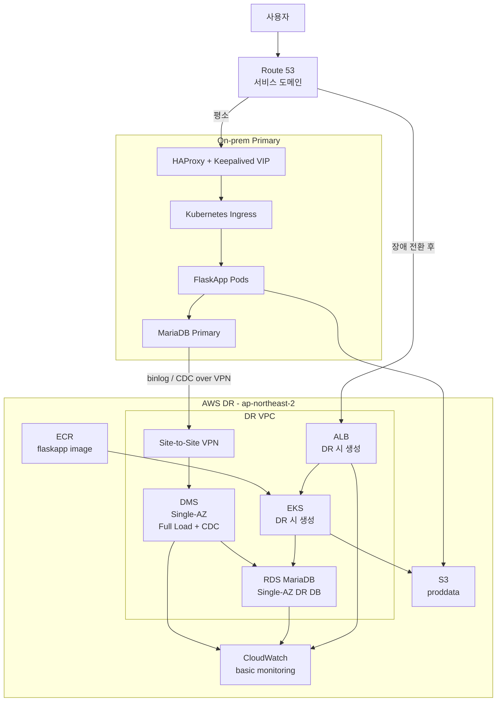
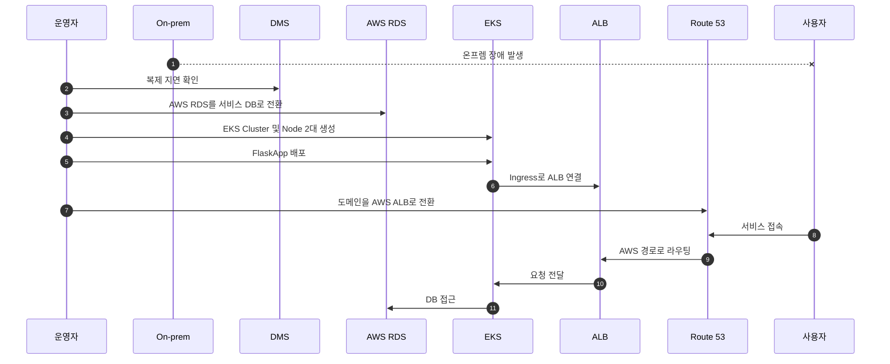

# AWS DR MVP 아키텍처 설계 (리뷰 보강판 v2)

> 기준 문서: `Docs/aws/aws-dr-architecture-v2.md`  
> 이 문서는 전체 운영급 DR 설계를 팀 프로젝트 기간, 예산, 시연 가능성에 맞게 줄인 **MVP 설계도**입니다.
>
> 📝 **리뷰 보강 안내**: 원본 MVP 문서를 그대로 유지한 상태에서, 각 항목 끝에 `### 📝 추가 보강` 섹션을 붙여 4~5일 시연에 실제로 부딪힐 함정과 보강 사항을 정리했습니다. 이전 리뷰에서 이미 반영된 항목(예산 $400, Node 0대, small/medium 사이징, 19단계 Runbook 등)은 보강 대상에서 제외했고, **여전히 비어 있는 4가지 핵심 항목**(RTO/RPO 수치, TTL 사전 설정, DMS Task 정지 명시, 17장 모순)을 중심으로 보강했습니다.

## 1. 한 줄 요약

온프렘 서비스가 장애로 중단되면, 운영자가 DR 전환 절차를 실행하여 AWS의 **EKS + ALB + RDS + S3 + ECR** 경로로 서비스를 복구한다. 데이터베이스는 평소에 **DMS CDC**로 AWS RDS에 복제하고, 장애 시 AWS RDS를 서비스 DB로 사용한다.

## 2. 이번 프로젝트의 현실 범위

이번 설계는 완전 자동 DR이나 운영급 보안 체계 전체를 목표로 하지 않습니다.  
목표는 **4~5일 안에 시연 가능한 DR 핵심 흐름**을 구현하는 것입니다.

| 구분 | 이번 범위 |
|---|---|
| 예산 | 약 $400 내외 |
| 구현 기간 | 4~5일 |
| DR 방식 | Pilot Light |
| 전환 방식 | 장애 감지 후 운영자 승인 기반 전환 |
| 주요 목표 | 온프렘 장애 시 AWS 경로로 앱 접속 성공 |
| 제외 범위 | 완전 자동 failback, 고도화된 IAM/보안, WAF, Security Hub 전체 운영 |

### 📝 추가 보강 — 발표용 RTO / RPO 목표값

심사위원이 가장 먼저 묻는 질문은 "복구까지 얼마나 걸리나요?" 입니다. 숫자가 없으면 설계 전체가 흐릿하게 보입니다. 이번 MVP에는 다음 수치를 기준으로 잡습니다.

| 용어 | 한 줄 뜻 | 이번 MVP 목표 |
|---|---|---|
| **RTO** (Recovery Time Objective) | "장애 발생 후 복구까지 걸리는 시간" 목표 | **30분 이내** (운영자 수동 전환 + EKS 생성 포함) |
| **RPO** (Recovery Point Objective) | "장애 시 잃어도 되는 데이터의 시간 범위" 목표 | **5분 이내** (DMS CDC 지연 기준) |

> 💡 **비유**: RTO는 "정전 후 불 켜기까지 시간", RPO는 "정전 직전 몇 분치 작업이 날아갈 수 있나"입니다.

> ⚠️ **이번 MVP의 특수성**: EKS와 Node가 평소 0대이므로 **EKS Cluster 생성에만 약 15~20분이 추가로 필요**합니다. 운영급 Warm Standby라면 RTO 5~10분도 가능하지만, Pilot Light는 비용 절감 대신 RTO를 양보합니다.
>
> 발표 시 정직한 답변: "이상적으로는 30분, 실제 운영자 숙련도에 따라 30~45분 정도 예상됩니다. 이 수치는 18장 19번에서 실제 측정값으로 기록합니다."

---

## 3. 구현 대상

이번 프로젝트에서 실제로 다룰 AWS 구성요소는 다음과 같습니다.

| 영역 | 구성요소 | 목적 |
|---|---|---|
| 네트워크 | DR VPC, Subnet, SG, NAT, Site-to-Site VPN | 온프렘과 AWS DR 환경 연결 |
| 데이터베이스 | RDS MariaDB Single-AZ, 한 단계 큰 타입 | 장애 시 서비스 DB |
| DB 복제 | DMS Full Load + CDC Single-AZ, 한 단계 큰 타입 | 온프렘 MariaDB 변경분을 AWS RDS로 복제 |
| 컨테이너 | EKS | 평소 삭제, 장애 시 생성 |
| 트래픽 | ALB | 장애 전환/테스트 시 생성 |
| 이미지 | ECR | FlaskApp 컨테이너 이미지 저장 |
| 파일 | S3 proddata | 앱 파일/사진 저장소 |
| DNS | Route 53 | 장애 감지 및 AWS ALB로 도메인 전환 |
| 모니터링 | CloudWatch 기본 알람 | DMS 지연, RDS, ALB 상태 확인 |

## 4. 전체 아키텍처



## 5. 평소 상태

평소에는 온프렘이 실제 서비스를 담당합니다.

| 항목 | 평소 상태 |
|---|---|
| 사용자 트래픽 | Route 53이 온프렘 VIP로 전달 |
| 앱 실행 위치 | 온프렘 Kubernetes |
| Primary DB | 온프렘 MariaDB |
| AWS RDS | 복제 대상 DB로 대기 |
| DMS | 온프렘 DB 변경분을 AWS RDS로 CDC 복제 |
| EKS | 평소 삭제 |
| Node | 평소 0대, 장애 시 2대 생성 |
| ALB | 평소 없음, 장애 전환/테스트 시 생성 |
| ECR | 평소부터 최신 앱 이미지 저장 |
| S3 | 온프렘 앱과 AWS 앱이 같은 버킷 사용 |

### 📝 추가 보강 — 이미 만들어져 있는 기존 리소스

이번 프로젝트는 백지에서 시작하는 게 아닙니다. 콘솔에서 이미 만들어둔 리소스가 4개 있고, MVP는 이걸 그대로 재사용합니다. **Day 1에 "tfstate는 어디 두지?"부터 헤매지 않으려면 표로 먼저 정리해두세요.**

| 기존 리소스 | 용도 | MVP에서의 역할 |
|---|---|---|
| `flaskapp-proddata-...` (S3) | 사진/업로드 파일 저장소 | 온프렘 앱과 AWS 앱이 **같은 버킷** 공유 |
| `flaskapp-tfstate-...` (S3) | Terraform 상태 저장소 | 새로 만들 모든 리소스의 state 저장 |
| `terraform-state-lock` (DynamoDB) | Terraform 동시 작업 잠금 | state 손상 방지 |
| `flaskapp` (ECR) | 컨테이너 이미지 저장소 | 평소부터 최신 이미지 push해두기 |

> 💡 **왜 중요한가요?**  
> 이걸 미리 알아두지 않으면, Day 1에 "S3 버킷 새로 만들까?" 같은 잘못된 결정을 하게 됩니다. 새로 만들면 온프렘 앱이 쓰던 사진들과 연결이 끊겨서, 시연 시 "온프렘 사진이 AWS에서 안 보임" 사고가 납니다.

> ⭐ **가장 중요한 운영 습관**: ECR에 평소부터 `flaskapp` 이미지를 push해두기. 장애 시점에 빌드 시작하면 RTO 30분 목표를 절대 못 맞춥니다.

---

## 6. 장애 전환 흐름

온프렘 장애가 발생하면 Route 53 Health Check와 모니터링으로 장애를 감지합니다.  
다만 EKS와 ALB를 평소에 유지하지 않기 때문에, 이번 MVP는 **장애 감지 후 운영자가 Runbook에 따라 DR 전환을 실행**하는 구조입니다.



장애 후 최종 서비스 경로는 다음과 같습니다.

```text
사용자 -> Route 53 -> AWS ALB -> EKS FlaskApp Pod -> AWS RDS
                                      |
                                      +-> S3 proddata
```

### 📝 추가 보강 — Sequence Diagram에서 빠진 "DMS Task 정지"

위 다이어그램의 1번 `OP->>DMS: 복제 지연 확인`과 2번 `OP->>RDS: AWS RDS를 서비스 DB로 전환` 사이에 **DMS Task 정지가 빠져 있습니다**. 이게 빠지면 split-write(양쪽 동시 쓰기) 사고가 납니다.

**올바른 순서**:

```text
1. 복제 지연 확인 (CDCLatencyTarget이 0 가까이?)
2. ⭐ DMS Task 정지 ← 이 단계가 핵심
3. AWS RDS를 서비스 DB로 사용 (앱이 RDS에 쓰기 시작)
4. EKS, ALB 띄우기
5. Route 53 전환
```

> 💡 **왜 정지가 필요한가요?**  
> DMS Task가 계속 돌고 있는 상태에서 AWS 앱이 RDS에 데이터를 쓰면:
> - AWS 앱이 RDS에 "주문 A 추가" → 저장 성공
> - 그런데 DMS가 온프렘 binlog를 계속 읽어서 RDS에 적용 → 온프렘 데이터로 **덮어쓰기**
> - 결과: AWS에서 입력한 데이터가 사라지거나 꼬임
>
> 양쪽 사장이 같은 장부에 동시에 쓰는 격입니다. 한쪽이 멈춰야 합니다.

이 단계는 18장 태스크 리스트에도 반영해야 합니다 (아래 18장 추가 보강 참고).

---

## 7. 네트워크 설계

DR VPC는 온프렘과 겹치지 않는 CIDR을 사용합니다.

| 항목 | 설계 |
|---|---|
| Region | ap-northeast-2 |
| VPC CIDR | 10.20.0.0/16 |
| Public Subnet | ALB, NAT Gateway |
| Private App Subnet | EKS Node |
| Private Data Subnet | RDS, DMS |
| 온프렘 연결 | Site-to-Site VPN |

예산을 고려해 평소 NAT Gateway는 **1개만 사용**합니다.  
DR 전환 또는 리허설 중에는 필요하면 NAT Gateway를 2개로 늘릴 수 있습니다. 운영급 설계에서는 AZ별 NAT Gateway가 더 안전하지만, 이번 MVP에서는 비용과 구현 속도를 우선합니다.

### Security Group 원칙

| SG | 허용 |
|---|---|
| ALB SG | Internet -> 80/443 |
| EKS SG | ALB SG -> App Port |
| RDS SG | EKS SG, DMS SG -> 3306 |
| DMS SG | On-prem DB, RDS 접근 |
| VPN 관련 | 온프렘 DB 대역과 AWS VPC 대역 간 필요한 포트만 |

### 📝 추가 보강 — VPN이 안 될 때를 위한 백업 플랜

VPN은 이 프로젝트에서 **가장 위험한 단일 지점**입니다. 양쪽에 설정이 모두 맞아야 하고, 한쪽이라도 틀리면 디버깅이 어렵습니다.

**Day 1 검증 체크리스트**:

- [ ] AWS 콘솔에서 VPN Connection 상태 `available`
- [ ] 최소 한 쪽 Tunnel `UP`
- [ ] Data Subnet에 임시 EC2 띄우고 `nc -zv <온프렘 DB IP> 3306` 성공
- [ ] 온프렘에서 AWS VPC CIDR (10.20.0.0/16)로 ping/traceroute 확인

**시연용 백업 플랜 (VPN이 끝까지 안 될 때)**:

> ⚠️ 아래는 **시연 환경에서만** 검토하는 임시 우회책입니다. 운영 환경에서는 절대 사용하지 마세요.

| 대안 | 방법 | 위험 |
|---|---|---|
| **A. 온프렘 DB Public 노출 (임시)** | 온프렘 방화벽에 AWS DMS 공인 IP만 화이트리스트 → DMS Endpoint를 공인 hostname으로 | DB 공인 노출, 시연 후 즉시 차단 필수 |
| **B. SSH 터널** | 점프 호스트 통해 DMS가 온프렘 DB에 접근 | 구성 복잡, 안정성 낮음 |
| **C. CSV 덤프 + 수동 복제** | 시연 직전 mysqldump → RDS 로드 | RPO 시연은 못 함. CDC가 아닌 단순 마이그레이션이 됨 |

**판단 기준**: Day 2 끝까지 DMS CDC 동작이 안 되면 백업 플랜 A로 전환. Day 3 새벽까지 안 되면 백업 플랜 C로 시연 범위 축소.

> 💡 **발표 팁**: 만약 백업 플랜 A로 갔다면 "운영 환경에서는 VPN 또는 Direct Connect가 정답이지만, 시연 환경의 시간 제약으로 임시로 공인 endpoint를 사용했다"고 솔직하게 말하는 게 좋습니다.

---

## 8. 데이터베이스 설계

이번 MVP에서는 RDS와 DMS 모두 **Single-AZ**로 구성합니다. 대신 너무 작은 타입을 피하고 한 단계 큰 타입을 사용하여 DMS CDC와 시연 안정성을 확보합니다.

| 구성요소 | 선택 | 이유 |
|---|---|---|
| RDS | Single-AZ, `db.t4g.small` 또는 `db.t4g.medium` 수준 | Multi-AZ보다 저렴하고, 시연용 DB 성능 확보 |
| DMS | Single-AZ, `dms.t3.small` 또는 `dms.t3.medium` 수준 | CDC 지연을 줄이고 복제 안정성 확보 |

운영 환경으로 고도화할 경우에는 RDS Multi-AZ를 우선 적용하고, 그 다음 DMS Multi-AZ를 검토합니다.

### 8.1 평소 복제

온프렘 MariaDB가 Primary입니다.  
AWS RDS MariaDB는 DMS의 target으로 사용합니다.

| 항목 | 설계 |
|---|---|
| Source DB | On-prem MariaDB |
| Target DB | AWS RDS MariaDB |
| 복제 방식 | DMS full-load-and-cdc |
| 연결 경로 | Site-to-Site VPN |
| 핵심 지표 | DMS CDC latency |

### 8.2 장애 시 DB 전환

장애 시 AWS RDS를 서비스 DB로 사용합니다.  
이번 MVP에서는 DMS target인 **AWS RDS endpoint를 앱의 DB endpoint로 사용하도록 전환**하는 것을 목표로 합니다.

이 문서에서는 이를 "RDS 승격"이라고 부르기보다 **AWS RDS 서비스 DB 전환**으로 표현합니다. DMS CDC 구조에서는 AWS RDS가 native read replica라기보다 복제 대상 DB에 가깝기 때문입니다.

시연 성공 기준:

- 온프렘 DB에 넣은 데이터가 AWS RDS에 복제되어 있음
- 온프렘 장애 후 EKS 앱이 AWS RDS에 연결됨
- 앱 화면에서 기존 데이터 조회 가능
- AWS 전환 후 새 데이터 입력 가능

### 📝 추가 보강 — Promote 명령은 쓸 일 없음

8.2의 "RDS 승격이 아닌 서비스 DB 전환" 표현은 정확합니다. 다만 팀원이 다른 문서를 참고하다가 `aws rds promote-read-replica` 명령을 찾아서 실행하려는 실수가 종종 있습니다. **이 명령은 이번 설계에서 쓸 일이 없습니다.**

| 구분 | 진짜 Read Replica | 이번 설계 (DMS Target RDS) |
|---|---|---|
| 데이터 출처 | AWS RDS가 자체 복제 | DMS가 binlog를 흘려넣음 |
| 평소 상태 | "읽기 전용" 잠금 | **일반 RDS** (이미 쓰기 가능) |
| 전환 명령 | `promote-read-replica` 필요 | **그냥 DMS Task 멈추면 됨** |

**장애 시 정확한 단계** (18장과 연결):

```text
1. DMS Console에서 CDCLatencyTarget이 0초 가까이인지 확인
2. DMS Task를 "Stop" 버튼으로 정지
3. (Promote 명령 불필요. RDS는 이미 쓰기 가능 상태)
4. 앱의 DB endpoint를 RDS endpoint로 변경
5. 앱 시작 → 정상 동작
```

---

## 9. DMS CDC 설계

DMS는 이번 프로젝트에서 가장 중요한 동시에 가장 위험한 파트입니다.

| 항목 | 설계 |
|---|---|
| Replication Instance | Single-AZ, `dms.t3.small` 또는 `dms.t3.medium` 수준 |
| Source Endpoint | 온프렘 MariaDB |
| Target Endpoint | AWS RDS MariaDB |
| Task Type | Full load + CDC |
| 검증 | insert/update/delete 반영 확인 |

주의할 점:

- 온프렘 MariaDB에서 binlog가 활성화되어야 합니다.
- DMS 계정에 replication 관련 권한이 필요합니다.
- VPN, 라우팅, Security Group, DB 방화벽이 모두 맞아야 합니다.
- DDL 변경은 시연 범위에서 제외합니다.

### 📝 추가 보강 — Day 2를 막지 않게 하는 DMS 사전 체크리스트

"binlog 활성화"는 한 줄이지만, 실제로는 **5개 설정이 동시에 맞아야** DMS Task가 첫 분에 죽지 않습니다. Day 1에 미리 확인해두면 Day 2가 부드러워집니다.

#### A. 온프렘 MariaDB 사전 설정

```ini
# /etc/mysql/mariadb.conf.d/50-server.cnf
[mysqld]
log_bin = mysql-bin              # binlog 활성화
binlog_format = ROW              # ⭐ ROW가 아니면 DMS CDC 실패
binlog_row_image = FULL          # 전체 row 정보 기록
server_id = 1                    # 유니크 정수값
expire_logs_days = 7             # binlog 보존
```

설정 변경 후 **MariaDB 재시작 필요**. 운영 중인 DB라면 재시작 타이밍을 미리 협의하세요.

확인 명령:

```sql
SHOW VARIABLES LIKE 'log_bin';          -- ON 이어야 함
SHOW VARIABLES LIKE 'binlog_format';    -- ROW 이어야 함
SHOW MASTER STATUS;                     -- File, Position이 보이면 OK
```

#### B. DMS 전용 DB 계정 만들기

```sql
CREATE USER 'dms_user'@'%' IDENTIFIED BY '강한_비밀번호';
GRANT SELECT, REPLICATION SLAVE, REPLICATION CLIENT ON *.* TO 'dms_user'@'%';
FLUSH PRIVILEGES;
```

> 💡 **각 권한이 왜 필요한가요?**  
> - `SELECT`: Full Load 단계에서 전체 데이터를 한 번 읽기 위해  
> - `REPLICATION SLAVE`: binlog를 읽을 수 있는 권한  
> - `REPLICATION CLIENT`: binlog 위치를 조회할 수 있는 권한  
>
> 셋 중 하나라도 빠지면 DMS Task가 "Insufficient privileges" 에러로 죽습니다.

#### C. RDS Target 사전 준비

- [ ] RDS MariaDB가 **온프렘과 정확히 같은 메이저 버전** (예: 10.11.x)
- [ ] RDS에 같은 이름의 DB(schema) 만들어져 있음
- [ ] RDS의 master user가 충분한 권한 보유

> ⭐ **버전 불일치는 가장 흔한 실수**입니다. 온프렘이 10.11이고 RDS가 10.6이면 binlog 포맷 호환 문제로 데이터 일부가 깨질 수 있습니다.

#### D. 시연 발표에서 보여줄 핵심 지표

| 메트릭 | 정상값 | 의미 |
|---|---|---|
| `CDCLatencyTarget` | 0~수 초 | DMS → AWS RDS 적용까지 시간 |
| Task Status | `Running` | 다른 상태면 즉시 로그 확인 |

> 💡 **발표에서 보여줄 화면**: CloudWatch에서 `CDCLatencyTarget`이 0초 가까이 유지되는 그래프 한 장이 "RPO 5분 이내" 증거가 됩니다.

---

## 10. EKS / ALB / ECR 설계

### 10.1 ECR

FlaskApp 이미지는 평소부터 ECR에 push합니다.  
장애 시점에 이미지를 새로 빌드하면 RTO가 길어지므로, ECR에 최신 이미지가 있어야 합니다.

### 10.2 EKS

EKS는 장애 전환 시 앱을 실행하는 DR 컨테이너 플랫폼입니다.

| 항목 | 설계 |
|---|---|
| Cluster | 평소 삭제, DR 전환 또는 리허설 시 생성 |
| Node | 평소 0대, 장애 시 2대 |
| App | FlaskApp Deployment |
| DB 설정 | AWS RDS endpoint 사용 |
| S3 설정 | 기존 proddata bucket 사용 |
| Secret | 초기 MVP는 K8s Secret 또는 Secrets Manager 중 하나 선택 |

### 10.3 Node 개념

EKS에서 Node는 FlaskApp Pod가 실제로 실행되는 EC2 서버입니다.

```text
EKS Cluster
├── Control Plane  : Kubernetes 관리 영역
└── Worker Node    : Pod가 실제로 실행되는 서버
```

이번 설계에서는 Pilot Light 의미를 살리기 위해 평소에는 EKS와 Node를 유지하지 않습니다. 장애 또는 DR 리허설 시 EKS Cluster와 Node 2대를 생성합니다.

### 10.4 ALB

AWS Load Balancer Controller 또는 직접 ALB 구성으로 외부 요청을 EKS 앱에 연결합니다.

검증 기준:

- ALB DNS로 FlaskApp 접속 가능
- ALB health check 통과
- ALB -> EKS Pod -> RDS 연결 성공

### 📝 추가 보강 — Secret 방식과 S3 권한은 Day 1에 결정

10.2의 "K8s Secret 또는 Secrets Manager 중 하나 선택"이라는 문구가 시연 직전에 결정되면 위험합니다. **시연 일정상 K8s Secret을 권장**합니다.

#### Secret 관리 방식 비교

| 방식 | 난이도 | 설정 시간 | MVP 권장 |
|---|---|---|---|
| **A. K8s Secret만 사용** | 쉬움 | 30분 | ✅ 권장 |
| **B. Secrets Manager + 수동 환경변수 주입** | 중간 | 1~2시간 | 시간 여유 시 |
| **C. Secrets Manager + ESO 자동 동기화** | 어려움 | 반나절 | MVP 범위 초과 |

**방식 A 예시**:

```yaml
apiVersion: v1
kind: Secret
metadata:
  name: flaskapp-db
type: Opaque
stringData:
  DATABASE_HOST: rds-flaskapp-xxx.ap-northeast-2.rds.amazonaws.com
  DATABASE_USER: appuser
  DATABASE_PASSWORD: (비밀번호)
```

> 💡 **base64는 암호화가 아닙니다.** 그래도 시연 범위에서는 K8s Secret으로 충분합니다. 발표 시 "운영급에서는 Secrets Manager + ESO로 자동 회전한다"고 한 줄 덧붙이면 깔끔합니다.

#### EKS 앱이 S3에 접근하는 방법

| 방식 | 동작 | 난이도 |
|---|---|---|
| **A. Node IAM Role에 권한 부여** | EC2 인스턴스 프로필에 S3 권한 → Pod 자동 상속 | ✅ 쉬움 (1~2시간) |
| **B. IRSA** | Pod ServiceAccount에 IAM Role 직접 연결 | 반나절 (운영급 모범) |

**MVP 권장: 방식 A**. Node Group을 만들 때 노드 IAM Role에 `AmazonS3FullAccess` (또는 버킷 한정 정책) attach하면 Pod가 별도 설정 없이 boto3로 S3 접근 가능.

#### EKS 첫 생성 시 가장 흔한 실수

- [ ] **서브넷 태그 누락**: ALB Controller가 서브넷을 못 찾음
  - Public Subnet: `kubernetes.io/role/elb = 1`
  - Private Subnet: `kubernetes.io/role/internal-elb = 1`
- [ ] **노드 Subnet이 Public**: 보안 사고. 노드는 무조건 Private Subnet
- [ ] **EKS 버전과 Add-on 버전 불일치**: VPC CNI 등이 충돌

---

## 11. S3 설계

기존 `proddata` S3 버킷을 온프렘과 AWS가 함께 사용합니다.

| 항목 | 설계 |
|---|---|
| Bucket | 기존 flaskapp-proddata 버킷 |
| 용도 | 사진, 업로드 파일 |
| 평소 | 온프렘 앱이 사용 |
| 장애 시 | AWS EKS 앱이 동일 버킷 사용 |
| 필수 설정 | Public Access Block, Versioning 권장 |

시연 기준:

- 온프렘에서 업로드한 파일을 AWS 앱에서 조회 가능
- AWS 전환 후 새 파일 업로드 가능

### 📝 추가 보강 — 양쪽 권한 모델을 빼먹지 마세요

같은 버킷을 두 환경(온프렘 + AWS)에서 쓰는 건 **데이터 동기화 부담이 없는 대신, 권한 모델이 둘**이 됩니다. 헷갈리면 한쪽에서 403 Forbidden을 만나게 됩니다.

| 접근 주체 | 인증 방법 |
|---|---|
| **온프렘 앱** | IAM User의 액세스 키 (기존에 만들어둔 키) |
| **AWS EKS 앱** | 위 10장에서 결정한 방식 (Node Role 또는 IRSA) |

**버킷 정책에서 빠지면 안 되는 부분**:

- [ ] Block Public Access 4종 모두 ON
- [ ] 버킷 정책에 온프렘 IAM User ARN **그리고** AWS EKS Node Role ARN 모두 명시
- [ ] Versioning ON (실수 삭제 복구용)

**검증 명령** (Day 4 시연 리허설 때):

```bash
# 온프렘 앱에서 업로드한 파일이 있는지 확인
aws s3 ls s3://flaskapp-proddata-...

# EKS Pod 내부에서 같은 명령 실행
kubectl exec -it <pod-name> -- aws s3 ls s3://flaskapp-proddata-...
```

> ⚠️ **흔한 사고**: 온프렘 IAM User만 정책에 적혀 있고 EKS Role이 누락된 경우. AWS 앱에서 사진 업로드 시도하면 403 에러. 시연 당일 발견하면 진행 멈춤.

---

## 12. Route 53 설계

Route 53은 서비스 도메인을 온프렘 또는 AWS ALB로 연결합니다.

이번 MVP에서는 장애 감지와 최종 DNS 전환을 분리합니다.

| 항목 | 방식 |
|---|---|
| 장애 감지 | Route 53 Health Check로 온프렘 endpoint 상태 확인 |
| 전환 실행 | EKS/ALB 생성 후 Route 53 record를 AWS ALB로 전환 |
| 도전 목표 | Failover Record를 구성하되, ALB가 준비된 뒤 전환되도록 Runbook에 반영 |

EKS와 ALB를 평소에 유지하지 않기 때문에 완전 자동 DNS failover만으로는 서비스가 바로 살아나지 않습니다. 따라서 이번 설계에서는 **자동 감지 + 운영자 승인 기반 전환**을 기본으로 합니다.

### 📝 추가 보강 — TTL을 미리 낮춰두지 않으면 시연이 안 보입니다 ⭐

Route 53 record에는 **TTL** (Time To Live, 캐싱 시간) 설정이 있습니다. 기본값은 보통 300초(5분) 또는 그 이상.

> 💡 **TTL이 뭔가요?**  
> "이 도메인 답은 N초 동안 캐싱해도 돼"라고 클라이언트에게 알려주는 시간입니다. TTL이 300초면, 운영자가 record를 AWS ALB로 바꿔도 **세계의 DNS 서버와 사용자 PC가 5분간 옛날 답(온프렘 VIP)을 기억**합니다.

**시연 당일 일어날 수 있는 사고**:

```text
[14:00] 운영자: Route 53 record를 AWS ALB로 변경
[14:00] 발표 시작
[14:01] 청중 PC에서 도메인 접속 → 여전히 온프렘(죽은 상태)으로 감 → 에러
[14:05] 청중 PC에서 다시 접속 → 그제서야 ALB로 감
```

5분 동안 발표는 망가집니다.

**해결**: 시연 전날 또는 시연 당일 아침에 **TTL을 60초로 낮춰둡니다**.

| 시점 | TTL 설정 | 이유 |
|---|---|---|
| 평소 | 300초 (5분) | 정상 운영 중엔 캐싱이 효율적 |
| **시연 D-1 ~ D-day** | **60초 또는 30초** | 빠른 전환을 위해 |
| 시연 후 | 다시 300초로 | 비용/효율 복구 |

**확인 명령**:

```bash
# 클라이언트에서 현재 보고 있는 답과 TTL 확인
dig flaskapp.example.com +noall +answer

# 출력 예:
# flaskapp.example.com. 60 IN A 1.2.3.4
#                       ↑ 이게 TTL. 60이어야 함
```

> ⭐ **이 한 줄을 빼먹어서 발표를 망친 팀이 많습니다.** 체크리스트 최상단에 두세요.

---

## 13. 기본 모니터링 설계

운영급 모니터링 전체가 아니라, DR 시연에 필요한 핵심 지표만 봅니다.

| 대상 | 지표 | 이유 |
|---|---|---|
| DMS | CDC latency | RPO 확인 |
| RDS | CPU, FreeStorage, Connection | DB 상태 확인 |
| ALB | Target Healthy, 5xx | 앱 접근 상태 확인 |
| EKS | Pod Running, Node Ready | 앱 실행 상태 확인 |
| Route 53 | Health Check | 온프렘 장애 감지 |

알림은 CloudWatch Alarm + 이메일/SNS 정도로 최소화합니다.

### 📝 추가 보강 — 발표용 "DR Readiness" 한 화면 대시보드

발표에서 "준비됨"을 한 화면으로 보여줄 수 있는 대시보드 1개면 충분합니다.

**CloudWatch Dashboard에 넣을 위젯 5개**:

| 위젯 | 메트릭 | 정상일 때 |
|---|---|---|
| 1. DMS CDC 지연 | `CDCLatencyTarget` | 0~수 초로 평평한 그래프 |
| 2. RDS CPU | `CPUUtilization` | 평소엔 5~10%로 한산 |
| 3. RDS 연결 수 | `DatabaseConnections` | 평소 1~2 (DMS만) |
| 4. ALB Healthy Hosts | `HealthyHostCount` | 평소 N/A (ALB 없음), DR 시 노드 수만큼 |
| 5. Route 53 Health Check | `HealthCheckStatus` | 1 (Healthy) |

> 💡 **발표 흐름 추천**: "지금 평소 상태입니다 (대시보드 1번 보여줌). 보세요, DMS 지연이 0초 가까이입니다. 이게 RPO 5분 보장의 증거입니다."

**시연 직전 알람 최소 3개만 설정**:

- [ ] DMS CDC 지연 > 300초 (RPO 위반)
- [ ] Route 53 Health Check 실패 (온프렘 장애 감지)
- [ ] RDS Free Storage < 20% (DB 죽기 직전)

이메일 또는 SNS Topic에 본인 이메일 하나만 구독해두면 충분합니다.

---

## 14. 예산 기준 설계

예산은 약 $400이므로, 상시 운영 리소스를 줄이되 DMS CDC와 RDS 성능은 너무 낮게 잡지 않습니다.

| 항목 | 비용 절감 방식 |
|---|---|
| RDS | Single-AZ, `small` 또는 `medium`급 |
| DMS | Single-AZ, `small` 또는 `medium`급 |
| NAT Gateway | 평소 1개, DR/test 시 필요하면 2개 |
| EKS | 평소 삭제, DR/test 시 생성 |
| Node | 평소 0대, 장애 시 2대 |
| ALB | DR/test 시 생성 |
| CloudWatch Logs | 보존 기간 짧게 설정 |
| 고급 보안 | WAF, Security Hub 고도화 제외 |

이번 프로젝트에서는 비용보다 중요한 리소스만 남깁니다.

필수:

- VPC
- VPN
- RDS
- DMS
- ECR
- S3
- EKS
- ALB
- Route 53
- CloudWatch 기본 모니터링

제외 또는 후순위:

- Multi-AZ RDS
- Multi-AZ DMS
- NAT Gateway 2개 상시 운영
- WAF
- Security Hub 전체 표준
- Secrets Manager 자동 회전
- 완전 자동 failover/failback

예상 비용은 사용 시간과 인스턴스 타입에 따라 달라집니다. 이번 설계는 EKS/ALB/Node를 상시 유지하지 않는 것을 전제로 약 $400 범위 안에 맞추는 것을 목표로 합니다.

### 📝 추가 보강 — 비용 분해와 시연 후 즉시 정리

$400 예산이 어떻게 쓰이는지 미리 계산해두면, 어디서 새는지 추적하기 쉽습니다.

#### 한 달 기준 개략 비용 (서울 리전)

| 항목 | 평소 (USD) | 시연/리허설 추가 |
|---|---|---|
| RDS `db.t4g.medium` Single-AZ | ~$50 | — |
| DMS `dms.t3.medium` Single-AZ | ~$50 | — |
| NAT Gateway 1개 + 데이터 | ~$45 | — |
| Site-to-Site VPN | ~$36 | — |
| S3 (기존 버킷) | ~$3 | — |
| ECR | ~$1 | — |
| Route 53 + Health Check | ~$3 | — |
| CloudWatch Logs/Metrics | ~$5 | ~$5 |
| **소계 (상시)** | **~$193** | — |
| EKS Control Plane | $0 | ~$10 (5일 운영) |
| EC2 Worker Node × 2 | $0 | ~$5 (5일 × 2대) |
| ALB | $0 | ~$5 (5일) |
| **시연 추가** | — | **~$25** |

> 💡 **4~5일 프로젝트 실제 비용**: 한 달 풀로 돌리지 않고 4~5일이면 약 $50~$100 정도가 현실. $400 예산 안에 충분히 들어옵니다.
>
> 단, **VPN과 NAT Gateway는 안 써도 시간당 요금**이라는 점을 잊으면 안 됩니다. 시연 끝나고도 켜둔 채 한 달 가면 $80+ 청구.

#### 시연 후 즉시 정리할 항목 (5분 내)

- [ ] EKS Node Group `desired = 0` 또는 Node Group 삭제
- [ ] EKS Cluster 삭제 (지속하면 Control Plane $73/월)
- [ ] ALB 삭제 (Ingress 삭제하면 자동 삭제됨)
- [ ] Route 53 record를 온프렘으로 되돌리기

#### 프로젝트 종료 후 정리할 항목 (1주 내)

- [ ] DMS Task → Stop → Delete
- [ ] DMS Replication Instance 삭제
- [ ] RDS 스냅샷 1개 떠두고 인스턴스 삭제
- [ ] NAT Gateway 삭제 (시간당 부과)
- [ ] VPN Connection 삭제
- [ ] VPC 삭제 (마지막)
- [ ] S3, ECR은 **기존 리소스이므로 삭제 금지**

> ⚠️ **NAT Gateway와 VPN을 잊으면 한 달 뒤 $70+ 청구서가 옵니다.** 가장 흔한 사고 1순위.

---

## 15. 4~5일 구현 일정

| Day | 목표 |
|---|---|
| Day 1 | VPC, Subnet, SG, VPN 연결, 기존 S3/ECR 확인 |
| Day 2 | RDS 생성, DMS endpoint/task 구성, CDC 복제 검증 |
| Day 3 | ECR 이미지 push, EKS 생성, Node 2대 생성, FlaskApp 배포 |
| Day 4 | ALB 연결, Route 53 전환, RDS/S3 연동 테스트 |
| Day 5 | 장애 시나리오 리허설, 기본 모니터링, Runbook 정리 |

가장 먼저 검증해야 하는 것은 **VPN + DMS CDC**입니다.  
이 부분이 막히면 전체 DR 시나리오가 흔들리므로, EKS보다 먼저 붙입니다.

### 📝 추가 보강 — 각 Day의 위험도와 종료 체크리스트

같은 일정이지만 Day마다 실패 확률이 다릅니다.

| Day | 위험도 | 막혔을 때 |
|---|---|---|
| **Day 1 (VPN)** | 🔴 높음 | Day 2 중반까지 안 되면 7장 백업 플랜 A 검토 |
| **Day 2 (DMS CDC)** | 🔴 높음 | Day 2 끝까지 안 되면 백업 플랜 C로 시연 범위 축소 |
| **Day 3 (EKS)** | 🟡 중간 | ALB Controller 오류가 90%. 서브넷 태그 확인 |
| **Day 4 (ALB/R53)** | 🟢 낮음 | EKS만 정상이면 비교적 순탄 |
| **Day 5 (리허설)** | 🟢 낮음 | 시간 남으면 자동 failover 도전 |

#### Day별 "그날 끝나기 전에 반드시 확인할 것"

**Day 1**: VPC/Subnet/IGW/NAT 정상, VPN Tunnel 1개 이상 UP, Data Subnet → 온프렘 DB IP:3306 도달, 기존 리소스 4종 확인, 온프렘 binlog 설정.

**Day 2**: RDS 정상 생성 (온프렘과 같은 버전), DMS Task `Running`, 온프렘 INSERT → RDS에서 보임, `CDCLatencyTarget` 메트릭 보이기 시작.

**Day 3**: `kubectl get nodes` Ready 2대, ECR Pull 성공, FlaskApp Pod Running, Pod 내부에서 RDS 접속 및 S3 접근 성공.

**Day 4**: Ingress → ALB 자동 생성, ALB DNS로 FlaskApp 접속 200 응답, S3 사진 업로드 테스트, **Route 53 TTL을 60초로 사전 변경**.

**Day 5**: 전체 시나리오 한 번 더 실행 (18장 19단계), 막힐 가능성 메모, Runbook 정리, 발표용 대시보드 캡처.

> 💡 **팀 분담 추천**: Day 1~2는 네트워크/DB 담당자가 100% 집중, Day 3~4는 EKS/앱 담당자가 합류. Day 5는 전원이 리허설.

---

## 16. 최종 시연 시나리오

1. 온프렘 앱 정상 접속 확인
2. 온프렘 DB에 테스트 데이터 입력
3. DMS CDC로 AWS RDS에 데이터가 복제된 것 확인
4. 온프렘 HAProxy, 앱, 또는 네트워크를 내려 장애 상황 생성
5. AWS RDS를 서비스 DB로 사용하도록 전환
6. EKS Cluster와 Node 2대 생성
7. EKS에 FlaskApp 배포
8. ALB health check 정상 확인
9. Route 53을 AWS ALB로 전환
10. 같은 도메인으로 AWS 앱 접속
11. 기존 데이터 조회, 신규 데이터 입력, S3 업로드 확인

## 17. 성공 기준

### 필수 성공 기준

- AWS EKS에서 FlaskApp Pod가 정상 실행된다.
- ALB를 통해 FlaskApp에 접속할 수 있다.
- FlaskApp이 AWS RDS에 연결된다.
- 온프렘에서 입력된 데이터가 AWS RDS에 복제되어 있다.
- FlaskApp이 S3 proddata 버킷을 사용할 수 있다.
- Route 53 전환 후 AWS 경로로 서비스 접속이 가능하다.

### 도전 성공 기준

- DMS CDC 지연이 5분 이내로 유지된다.
- Route 53 Health Check 기반 failover record가 동작한다.
- 장애 전환 절차를 Runbook으로 문서화하고 반복 실행할 수 있다.

### 📝 추가 보강 — "Route 53 Health Check failover record"의 한계 명확화

도전 성공 기준 2번 "Route 53 Health Check 기반 failover record가 동작한다"는 12장의 "**자동 감지 + 운영자 승인 기반 전환**"과 부분적으로 충돌하는 표현입니다. 발표 시 심사위원이 "자동이라면서 왜 운영자가 개입하나요?"라고 물을 수 있습니다.

#### 모순처럼 보이는 이유

EKS와 ALB가 평소에 없기 때문에, **Route 53이 자동으로 record를 ALB로 바꿔도 ALB 자체가 존재하지 않습니다**. 즉, 도전 기준 2번이 완전히 동작하려면 ALB가 미리 생성되어 있어야 하는데, 이는 MVP의 Pilot Light 정신과 다릅니다.

#### 도전 기준의 정확한 해석 (발표용 답변)

도전 기준 2번은 다음 둘 중 하나로 해석하는 게 정직합니다.

| 해석 | 의미 |
|---|---|
| **해석 A (감지만 자동)** | Route 53 Health Check가 온프렘 장애를 **자동 감지**하고 알람을 보낸다. Failover Record 활성화는 ALB 생성 후 수동으로 한다. |
| **해석 B (Sorry Page 패턴)** | 평소에 "점검 중" 페이지용 가벼운 ALB를 두고, Health Check 실패 시 자동으로 그 페이지로 전환. 본격 복구(EKS/실제 ALB)는 별도로 운영자가 진행. |

**MVP 권장은 해석 A**. 해석 B는 상시 ALB 비용($16/월)이 추가되고 EKS와 별개의 정적 사이트 구성이 필요해 4~5일 일정에 부담.

> 💡 **발표 멘트 예시**:  
> "Route 53 Health Check로 온프렘 장애를 자동 감지하고 알람을 받지만, 트래픽 전환은 EKS와 ALB 생성이 완료된 후 운영자가 실행합니다. 완전 자동 전환은 EKS/ALB 상시 운영을 전제로 하므로 운영급 Warm Standby 단계에서 적용 가능합니다."

---

## 18. DR 상황 태스크 리스트

| 순서 | 태스크 | 확인 기준 |
|---:|---|---|
| 1 | 온프렘 장애 확인 | VIP, 앱, DB 접근 실패 확인 |
| 2 | DR 전환 선언 | 팀 채널에 전환 시작 공지 |
| 3 | 온프렘 write 중단 확인 | 온프렘 앱/DB가 더 이상 write를 받지 않음 |
| 4 | DMS task 상태 확인 | task running 또는 마지막 복제 시점 확인 |
| 5 | DMS CDC 지연 확인 | `CDCLatencyTarget` 확인 |
| 6 | AWS RDS 데이터 확인 | 최신 테스트 데이터 존재 확인 |
| 7 | AWS RDS를 서비스 DB로 지정 | 앱 DB endpoint가 AWS RDS로 설정됨 |
| 8 | EKS Cluster 생성 | cluster active |
| 9 | Node 2대 생성 | node ready |
| 10 | EKS add-on 확인 | CoreDNS, VPC CNI, kube-proxy 정상 |
| 11 | FlaskApp 배포 | deployment available |
| 12 | Secret/Config 적용 | DB/S3 환경변수 정상 주입 |
| 13 | ALB 생성 확인 | ALB active, target healthy |
| 14 | ALB 직접 접속 테스트 | `/healthz` 200 OK |
| 15 | 앱 기능 테스트 | 조회, 쓰기, S3 업로드 성공 |
| 16 | Route 53 전환 | 도메인이 AWS ALB로 연결 |
| 17 | 도메인 접속 테스트 | 서비스 도메인에서 앱 정상 접속 |
| 18 | 모니터링 확인 | ALB 5xx, RDS CPU, 앱 로그 확인 |
| 19 | DR 전환 완료 공지 | 완료 시간과 RTO 기록 |

DR 전환 후에는 온프렘이 일부 복구되더라도 바로 트래픽을 되돌리지 않습니다. 온프렘과 AWS가 동시에 write를 받으면 데이터가 갈라지는 split-brain 상황이 생길 수 있으므로, failback은 별도 절차로 수행합니다.

### 📝 추가 보강 — 5.5번 자리에 "DMS Task 정지" 단계 명시 ⭐

위 19단계 중 5번 "DMS CDC 지연 확인"과 6번 "AWS RDS 데이터 확인" 사이에 **DMS Task 정지가 명시되어야** 합니다. 현재는 묵시적이라 시연 당일 운영자가 빠뜨릴 수 있습니다.

#### 권장 수정 (한 줄 삽입)

| 순서 | 태스크 | 확인 기준 |
|---:|---|---|
| ... | ... | ... |
| 5 | DMS CDC 지연 확인 | `CDCLatencyTarget` 확인 (0초 가까이) |
| **5.5** | **⭐ DMS Task 정지** | **Task Status `Stopped` 확인. split-write 방지** |
| 6 | AWS RDS 데이터 확인 | 정지 시점의 최신 데이터 존재 확인 |
| 7 | AWS RDS를 서비스 DB로 지정 | 앱 DB endpoint가 AWS RDS로 설정됨 |
| ... | ... | ... |

#### 왜 이 위치인가

- **5번 직후**: DMS lag가 0인 걸 확인했으니, 온프렘의 마지막 데이터까지 RDS에 반영됨
- **6번 직전**: Task를 정지해야 6번에서 본 데이터가 최종 상태로 고정됨
- **7번 직전**: 앱이 RDS에 쓰기 시작하기 전에 정지해야 split-write 방지

#### 운영자 명령 한 줄

```bash
# DMS Task ARN 확인
aws dms describe-replication-tasks --query 'ReplicationTasks[*].[ReplicationTaskIdentifier,ReplicationTaskArn,Status]'

# Task 정지
aws dms stop-replication-task --replication-task-arn <ARN>

# 정지 확인 (Stopped 상태)
aws dms describe-replication-tasks --filters Name=replication-task-arn,Values=<ARN> --query 'ReplicationTasks[0].Status'
```

#### 추가로 권장하는 Failback 메모

19번 "DR 전환 완료 공지" 뒤에 **시연 후 원복** 메모를 추가하면 발표 완성도가 올라갑니다.

> 📌 **DR 전환 완료 후 시연 종료 시점에**:
> - EKS Node Group `desired = 0` 또는 삭제
> - EKS Cluster 삭제
> - ALB 삭제 (Ingress 삭제 시 자동)
> - Route 53 record를 온프렘으로 복귀 (TTL 60초니까 1분 안에 적용)
> - DMS Task 재개는 **온프렘이 완전 복구된 후** 별도 절차
>
> Failback의 핵심 원칙은 **양쪽 동시 write 금지**입니다. 14장 보강의 정리 항목을 함께 참고하세요.

---

## 19. 최종 결론

이 설계는 운영급 DR 전체 구현이 아니라, 팀 프로젝트 기간과 예산 안에서 가능한 **실전형 DR MVP**입니다.

핵심은 다음 하나입니다.

> 온프렘이 죽어도, AWS의 EKS + ALB + RDS + S3 경로로 FlaskApp을 다시 띄울 수 있음을 증명한다.

이번 프로젝트에서는 자동화보다 **복구 흐름이 실제로 동작하는지**가 더 중요합니다.  
완전 자동 failback, 고도화된 보안, 장기 운영 모니터링은 후속 고도화 범위로 남깁니다.

### 📝 추가 보강 — 발표에서 꼭 답해야 할 3가지 질문

심사위원이 거의 항상 묻는 질문이 있습니다. 미리 답변을 준비해두면 발표 자신감이 올라갑니다.

#### Q1. "왜 Pilot Light인가요?"

> **답변 예시**: "DR 방식은 크게 4단계(Backup&Restore → Pilot Light → Warm Standby → Hot Standby)가 있습니다. Pilot Light는 평소엔 데이터만 복제해두고 EKS/ALB는 꺼두는 방식이라, Warm Standby보다 약 70% 저렴하면서 데이터 손실 위험은 동일합니다. 단점은 복구가 즉시가 아니라 20~30분 걸린다는 점인데, 우리 서비스의 RTO 목표 30분 안에 들어오므로 적합합니다."

#### Q2. "왜 DMS를 쓰나요? RDS Read Replica가 있지 않나요?"

> **답변 예시**: "RDS Read Replica는 AWS RDS끼리만 자동 복제 가능합니다. 우리는 온프렘 MariaDB에서 AWS RDS로 복제해야 하기 때문에, 그 경계를 넘을 수 있는 DMS가 필요합니다. DMS는 온프렘 DB의 binlog를 직접 읽어 AWS RDS에 흘려넣는 방식으로 동작합니다."

#### Q3. "자동 전환이 더 좋지 않나요? 왜 수동인가요?"

> **답변 예시**: "두 가지 이유입니다. 첫째, EKS와 ALB를 평소에 유지하지 않는 Pilot Light 구조라 자동 전환이 트래픽을 받을 곳이 없습니다. 둘째, 자동 전환은 split-brain 위험이 있습니다. 일시적 네트워크 장애를 진짜 장애로 오판해서 AWS를 띄우면, 온프렘과 AWS가 동시에 Primary가 되어 데이터가 갈라집니다. 운영급에서도 분기 1회 훈련 후 자동화를 단계적으로 적용하지, 처음부터 완전 자동으로 가지 않습니다."

---

📎 **리뷰 보강 요약 (한눈에 보기)**

| 보강 위치 | 핵심 추가 사항 |
|---|---|
| 2장 | **RTO 30분 / RPO 5분 명시** (EKS 생성 20분 포함 솔직히 표현) |
| 5장 | 기존 리소스 4종 (S3 2개, DynamoDB, ECR) 명시 |
| 6장 | Sequence Diagram의 DMS Task 정지 누락 보강 |
| 7장 | VPN 백업 플랜 3종 (A/B/C) |
| 8장 | "Promote 명령은 쓸 일 없음" 정리 |
| 9장 | binlog 5개 설정 + DMS 계정 권한 체크리스트 |
| 10장 | Secret 방식 + S3 권한 모델 사전 결정 |
| 11장 | 양쪽 권한 모델 + 흔한 403 사고 |
| 12장 | **TTL 60초 사전 설정 ⭐** |
| 13장 | DR Readiness 대시보드 위젯 5개 |
| 14장 | 예상 비용 분해 + 시연 후 즉시 정리 항목 |
| 15장 | Day별 위험도 + 종료 체크리스트 |
| 17장 | **"자동 failover" 모순 해결** (해석 A/B 제시) |
| 18장 | **5.5번 자리에 DMS Task 정지 단계 추가 ⭐** |
| 19장 | 발표 단골 질문 3개 답변 |

**이번 리뷰의 핵심 4가지** (이전엔 비어있던 항목):

1. ⭐ 2장 — RTO 30분 / RPO 5분 수치 명시
2. ⭐ 12장 — Route 53 TTL 60초 사전 설정
3. ⭐ 17장 — "자동 failover"의 한계 명확화
4. ⭐ 18장 — 5.5번 자리에 "DMS Task 정지" 단계 추가

이 4가지만 반영하면 발표 당일 사고 확률이 크게 떨어지고, 심사위원 질문에 정확히 답할 수 있습니다.
