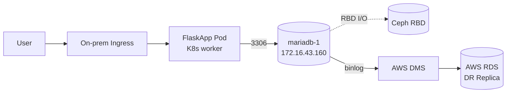

# 데이터베이스 운영 방식 결정

## 0. 목차

- [1. 문서 개요](#1-문서-개요)
- [2. 결정 사항 요약](#2-결정-사항-요약)
- [3. DB 엔진 선택: MariaDB](#3-db-엔진-선택-mariadb)
- [4. 배치 방식: Kubernetes 외부 VM](#4-배치-방식-kubernetes-외부-vm)
- [5. 1대 Primary 운영](#5-1대-primary-운영)
- [6. AWS DMS CDC를 이용한 DR 복제](#6-aws-dms-cdc를-이용한-dr-복제)
- [7. 데이터 보호: Ceph RBD](#7-데이터-보호-ceph-rbd)
- [8. 운영 흐름](#8-운영-흐름)
- [9. 운영 책임 영역](#9-운영-책임-영역)

---

## 1. 문서 개요

FlaskApp의 데이터베이스를 어떤 엔진으로, 어디에 배치해, 어떤 방식으로 운영할지 결정한 근거를 정리한다.

근거 자료: `시스템-아키텍쳐-설계-최종본.md`의 설계 목표, On-prem 물리/네트워크 구조, DB 복제 및 DR 데이터 흐름 항목.

본 문서가 다루는 핵심 결정 사항:

- DB 엔진 선택 (MariaDB)
- 배치 방식 (Kubernetes 외부 VM)
- Kubernetes 내부 데모 DB 운영 여부
- 인스턴스 수 (1대 Primary)
- DR 복제 방식 (AWS DMS CDC)
- 데이터 저장소 (Ceph RBD)

---

## 2. 결정 사항 요약

| 항목                  | 결정                                                          |
| --------------------- | ------------------------------------------------------------- |
| DB 엔진               | MariaDB                                                       |
| 배치 위치             | Kubernetes 외부 별도 VM (`mariadb-1`)                         |
| Proxmox 노드          | `pve-5` (client-11)                                           |
| 인스턴스 수           | 1대 (On-prem Primary)                                         |
| VM 사양               | 4 vCPU / 8-12GB RAM / 100GB OS + 별도 데이터 디스크           |
| 네트워크 위치         | VLAN 30 Internal, IP `172.16.43.160`                          |
| 데이터 저장소         | Ceph RBD (10G Ceph storage fabric `10.10.10.0/24`)            |
| DR 복제 방식          | AWS DMS CDC (binlog 기반)                                     |
| DR 타깃               | AWS RDS MySQL/MariaDB (DR Replica)                            |
| 정상 운영 시 Primary  | On-prem MariaDB                                               |
| 장애 시 Primary       | AWS RDS (수동 승격)                                           |
| K8s 내부 demo DB      | 운영하지 않음 (단일 외부 DB로 통일)                           |

---

## 3. DB 엔진 선택: MariaDB

설계도는 본 시스템의 DB 엔진을 "MariaDB/MySQL"로 병기하여 둘 중 어느 쪽이든 사용 가능하도록 열어두었다. 본 프로젝트에서는 MariaDB를 선택한다.

선택 근거:

- **AWS DR 호환성**: 설계도가 DR 타깃으로 명시한 AWS RDS와 AWS DMS는 MariaDB와 MySQL을 모두 지원한다. 어느 쪽을 선택해도 DMS CDC 기반 DR 구조에 영향이 없다.
- **binlog 기반 CDC 동일 호환**: AWS DMS가 사용하는 binlog 복제는 MariaDB와 MySQL이 동일한 형식으로 처리한다. 즉 "On-prem binlog → DMS → RDS" 흐름은 MariaDB로도 그대로 성립한다.
- **VM 이름 / 명명 일관성**: 설계도의 VM IP 계획 표에서 DB VM 이름이 `mariadb-1`로 명시되어 있다. 팀 내 명명과 호스트명 일관성을 위해 MariaDB를 선택한다.
- **공식 LTS 채널 안정성**: MariaDB는 장기 지원(LTS) 버전을 공식 저장소(`mirror.mariadb.org`)에서 제공한다. 운영 기간 동안 보안 패치 수령이 안정적이며, Ubuntu LTS와의 호환 매트릭스가 명확하다.

설계도가 MariaDB와 MySQL을 모두 허용하므로, 운영 도중 MySQL로 전환할 필요가 생기더라도 사용자/스키마/복제 구조는 거의 그대로 이식 가능하다는 점도 함께 고려된다.

---

## 4. 배치 방식: Kubernetes 외부 VM

설계도의 설계 목표 항목은 "DB는 Kubernetes 내부가 아닌 별도 노드/VM에서 MySQL로 운영한다"고 명시한다. 본 결정은 그 원칙을 그대로 따른다.

### K8s 외부 운영의 의미

- DB는 Kubernetes StatefulSet 같은 클러스터 내 워크로드가 아닌, 독립 VM(`mariadb-1`) 위에서 systemd 서비스로 운영한다.
- 데이터 디스크는 Kubernetes Persistent Volume이 아닌 Proxmox에서 직접 부착한 Ceph RBD 디스크이다.
- FlaskApp Pod이 DB에 접근할 때는 외부 호스트(`172.16.43.160` 또는 `db.onprem.local`)로 TCP 연결한다.

### K8s 외부 운영을 선택하는 설계상 이유

- **상태 데이터와 무상태 워크로드 분리**: FlaskApp 같은 Stateless 컨테이너 워크로드는 K8s 안에서, 영속 데이터를 가진 DB는 외부에서 운영한다. K8s 클러스터 재구축이나 노드 장애가 DB에 영향을 주지 않는다.
- **저장소 계층 단순화**: DB 디스크가 Ceph RBD 1계층만 거치게 된다. K8s 안의 PV로 두면 Ceph RBD + Kubernetes CSI를 거쳐 운영 추적과 트러블슈팅이 한 단계 더 복잡해진다.
- **DR 전환 흐름과의 정합성**: 장애 시 DR 전환 절차는 EKS를 Terraform으로 신규 생성하면서 DB는 RDS로 옮기는 흐름이다. On-prem 측에서도 DB가 K8s 외부에 있으면 K8s 재구축이 DB에 영향을 주지 않아 DR 전환 절차가 단순해진다.

### Kubernetes 내부 데모 DB 운영 여부

**K8s 내부에는 어떠한 DB도 운영하지 않는다.** 데모용이라도 별도의 DB Pod / StatefulSet / Helm chart 같은 워크로드를 두지 않는다.

이유:

- 설계도가 "DB는 Kubernetes 내부가 아닌 별도 노드/VM에서 운영"을 원칙으로 박아두었다. 데모 DB를 추가하면 이 원칙을 깨고, 운영 / 모니터링 / 백업 관점에서 관리 대상이 두 개가 된다.
- 본 프로젝트는 15일 단기 프로젝트로 운영 부담을 최소화해야 한다. 단일 외부 DB로 통일하는 게 명확하다.
- 실제 애플리케이션 검증은 외부 `mariadb-1`을 통해서 한다. 데모 DB가 별도로 필요한 시나리오가 없다.

---

## 5. 1대 Primary 운영

설계도의 VM IP 계획 표는 `mariadb-1` 한 대만 명시한다. 즉 On-prem DB는 단일 인스턴스로 운영한다.

이 결정의 의미:

- On-prem 측 HA(이중화)는 두지 않는다. DB 노드 장애가 곧 On-prem 서비스 중단이며, 그 경우 DR 전환 절차에 따라 AWS로 넘어간다.
- HA 부담은 AWS RDS DR Replica로 흡수한다. 즉 "On-prem 단일 + AWS DR" 조합이 본 설계의 가용성 모델이다.
- 향후 운영 확장 시 추가 노드(`mariadb-2`, `mariadb-3` 등)는 같은 패턴으로 `pve-3`/`pve-4`에 분산 배치하면 된다. 본 문서의 결정은 단일 인스턴스로 시작하는 1단계까지를 다룬다.

---

## 6. AWS DMS CDC를 이용한 DR 복제

설계도의 "DB 복제 선택지" 표는 다음 세 가지를 비교하며 AWS DMS CDC를 권장안으로 명시한다.

| 방식                     | 권장도                      |
| ------------------------ | --------------------------- |
| AWS DMS CDC              | 가장 운영이 쉬움 (권장)     |
| MySQL native replication | 가능하지만 운영 난이도 높음 |
| 주기적 dump + restore    | DR RPO가 커져서 비권장      |

본 프로젝트는 권장안인 **AWS DMS CDC**를 채택한다.

### DMS CDC 복제 구조

설계도의 DB 복제 흐름과 동일:

- 정상 운영 시 On-prem MariaDB가 Primary, AWS RDS가 DR Replica
- On-prem MariaDB가 binlog를 생성하고, AWS DMS가 binlog를 읽어 RDS에 변경분을 적용
- 복제 트래픽은 VPN 또는 Private Routing을 통해 전송 (암호화)

설계도의 참고 노트에 따라 "On-prem MariaDB/MySQL과 RDS 간 완전 동기식 복제는 일반적으로 어렵기 때문에 지연 시간을 최소화한 단방향 비동기 복제"가 본 설계의 RPO 목표이다.

### DMS CDC가 요구하는 MariaDB 측 사전 조건

- `log_bin = ON`
- `binlog_format = ROW`
- `binlog_row_image = FULL`
- 고유한 `server_id`
- DMS가 binlog를 읽을 수 있는 replication 권한을 가진 별도 user

### DMS 전용 DB 유저

On-prem MariaDB에 DMS CDC 복제 전용 유저를 생성했다.

```text
User: dms_user
Purpose: AWS DMS source endpoint / CDC replication
Password: 실제 값은 문서와 Git에 기록하지 않고 Secret 또는 로컬 보안 저장소에서 관리
```

권장 권한 범위:

```sql
GRANT REPLICATION CLIENT, REPLICATION SLAVE ON *.* TO 'dms_user'@'<DMS_SOURCE_IP_OR_CIDR>';
GRANT SELECT ON flaskapp.* TO 'dms_user'@'<DMS_SOURCE_IP_OR_CIDR>';
```

실제 host 조건은 DMS replication instance가 On-prem MariaDB에 접속할 때 보이는 source IP 기준으로 제한한다.

---

## 7. 데이터 보호: Ceph RBD

설계도의 "Ceph 저장소 사용 기준" 표는 DB VM의 데이터 디스크를 Ceph RBD에 두도록 명시한다.

| 구분      | Ceph 방식 | 사용 대상                 |
| --------- | --------- | ------------------------- |
| DB 저장소 | RBD       | `mariadb-1` 데이터 디스크 |

### 운영상 의미

- MariaDB `/var/lib/mysql`(data directory)은 OS 디스크가 아닌 별도 Ceph RBD 디스크에 둔다. OS 디스크 fill이나 OS 재설치가 데이터에 영향을 주지 않는다.
- Ceph RBD I/O는 10G Ceph storage fabric(`10.10.10.0/24`)을 통해 처리된다. VLAN 30의 일반 서비스 트래픽과 분리된다.
- DB VM 자체 장애가 발생해도 RBD 볼륨은 Ceph 클러스터에 남아있어, 동일 RBD 볼륨을 다른 VM에 부착해 데이터 복구 시도가 가능하다.

### 본 영역에서의 Ceph 의존성

본 영역은 Ceph 클러스터 자체를 운영하지 않는다. Ceph 클러스터의 가용성과 헬스는 인프라 담당의 책임이며, 본 영역은 RBD 디스크를 "소비자 입장"에서 사용한다.

다만 모니터링 영역에서는 Ceph 상태(`HEALTH_OK`, RBD pool 사용량, 10G LACP/MTU 상태)를 점검 대상에 포함한다. DB의 가용성이 Ceph에 종속되기 때문이다.

---

## 8. 운영 흐름

### 정상 운영 흐름

설계도의 정상 운영 흐름과 동일.



- DB write는 모두 On-prem MariaDB Primary로 들어온다.
- 변경분은 binlog로 기록되고, AWS DMS가 이를 읽어 AWS RDS Replica에 적용한다.
- AWS RDS는 정상 운영 중에는 읽기/쓰기 대상으로 사용하지 않는다 (DR 대기 상태).

### 장애 시 DR 전환 흐름 (DB 관련 부분)

설계도의 DR 전환 절차 중 DB가 관여하는 단계.

1. On-prem 장애 감지 (네트워크 / 전원 / Kubernetes / DB)
2. 운영자가 DR 전환 결정
3. 가능한 경우 On-prem DB write 중단 + 마지막 DMS replication lag 확인
4. AWS RDS Replica를 쓰기 가능한 Primary로 승격
5. EKS 측 K8s Secret/ConfigMap의 `DATABASE_HOST`를 RDS endpoint로 설정
6. DB 조회/쓰기 검증

---

## 9. 운영 책임 영역

### DB 담당자(본인)의 책임 영역

- `mariadb-1` VM의 OS 및 MariaDB 설치, 설정, 운영
- 데이터 디스크 Ceph RBD 부착 및 마운트 관리
- binlog 활성화 및 DMS 복제용 사전 조건 충족
- DB 사용자 / 권한 관리
- 백업 (DB dump)
- 모니터링 항목 정의 (DMS replication lag 포함)
- DR 전환 시 RDS 승격 절차 수행

### DB 담당자의 책임 영역이 아닌 것

- pfSense 방화벽 정책 자체 적용 (인프라/네트워크 담당). 본인은 요구사항만 제공.
- FlaskApp 코드 안의 DB 사용 방식, ORM 마이그레이션, 테이블 스키마 (FlaskApp 팀).
- AWS DMS task 생성 및 VPN 라우팅 자체 (AWS 인프라 담당). 본인은 binlog 측 조건 충족만 책임.
- Ceph 클러스터 자체 운영 (Ceph 담당). 본인은 RBD를 소비자 입장에서 사용.
- Kubernetes node / 네트워크 구성 (K8s 담당).