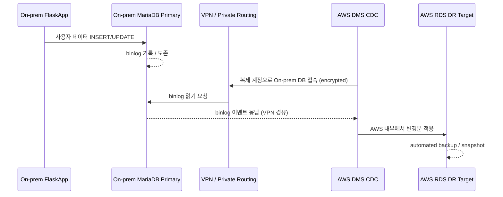
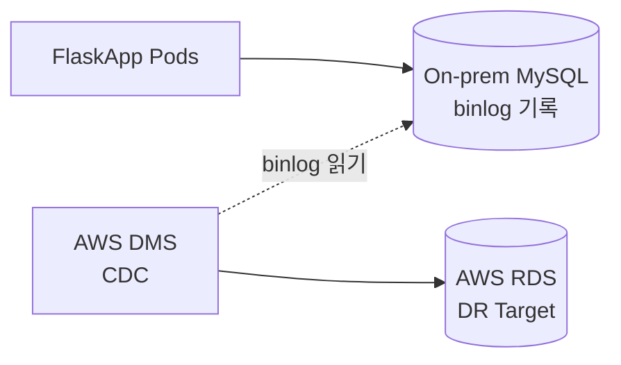
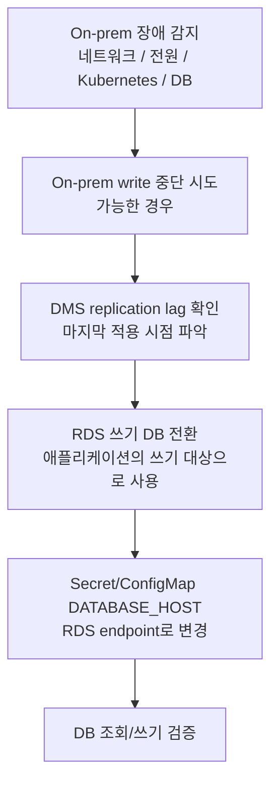
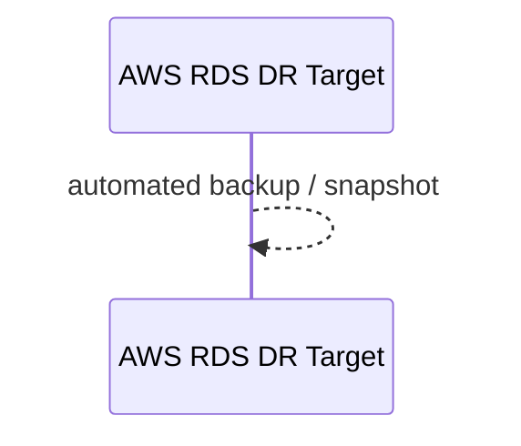
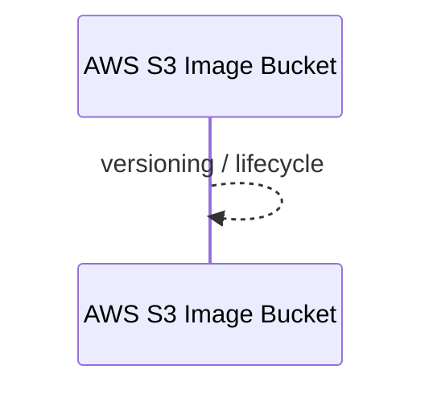
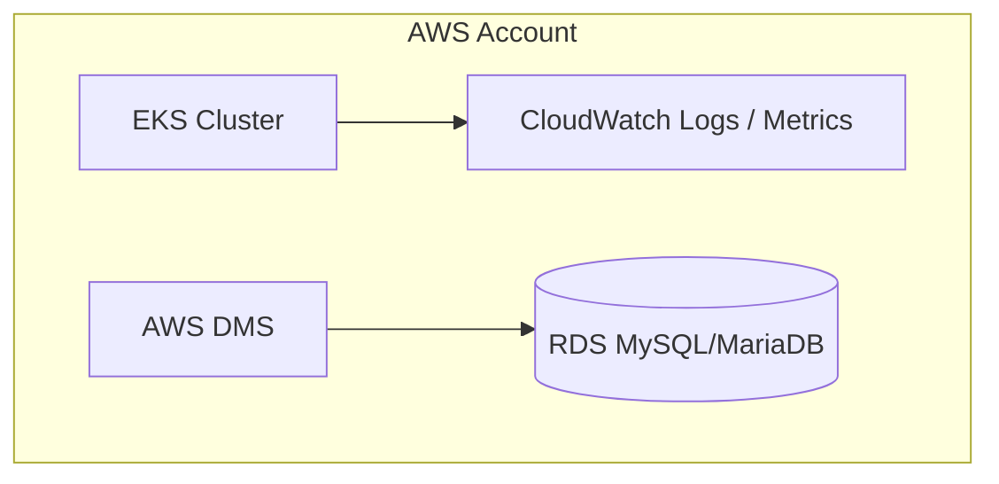
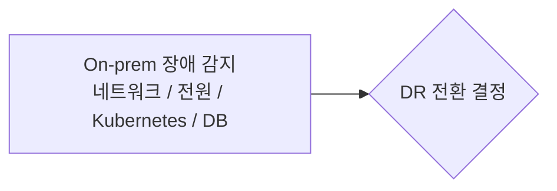
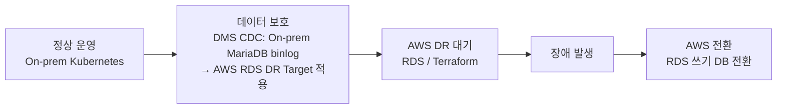

# Database / Backup / Monitoring 구조 설계도

## 0. 목차
- [1. 설계 범위 및 목표](#1-설계-범위-및-목표)
- [2. Database 상세 설계](#2-database-상세-설계)
- [3. 설계 범위 및 목표](#3-backup-상세-설계)
- [4. Monitoring 상세 설계](#4-monitoring-상세-설계)
- [5. 운영 체크포인트 (DB / Backup / Monitoring)](#5-운영-체크포인트-db--backup--monitoring)
- [6. 데이터 보호 요약](#6-데이터-보호-요약)

## 1. 설계 범위 및 목표

본 문서는 FlaskApp On-Premise + AWS DR 인프라 중 데이터베이스, 백업, 모니터링 영역의 상세 설계를 다룬다.

- DB는 Kubernetes 내부가 아닌 별도 노드/VM에서 MySQL로 운영한다.
- Ceph RBD는 DB VM의 블록 저장소와 VM disk 저장소로 사용한다.
- On-prem DB와 AWS RDS는 On-prem Primary → AWS RDS DR Target 단방향 CDC 구조로 설계하고, AWS DMS가 binlog 기반 변경분을 RDS에 지속 적용한다.
- On-prem MySQL/MariaDB와 RDS 간 "완전 동기식" 복제는 일반적으로 어렵기 때문에, 설계상 목표는 지연 시간을 최소화한 AWS DMS CDC 기반 단방향 복제로 잡는다.
- On-prem 장애 발생 시 DMS 지연을 확인한 뒤 AWS RDS를 애플리케이션의 쓰기 DB로 전환하고, EKS의 `DATABASE_HOST`를 RDS endpoint로 설정한다.
- On-prem DB dump, RDS snapshot, Terraform state 백업을 운영 체크포인트로 관리한다.
- Prometheus/Grafana, Alertmanager, CloudWatch를 연동하여 On-prem과 AWS 양쪽을 모니터링한다.

---

## 2. Database 상세 설계

### 2.1 DB 운영 방식

- DB는 Kubernetes 내부가 아닌 별도 노드/VM에서 MySQL로 운영한다.
- 정상 운영 시 On-prem MariaDB/MySQL이 쓰기 DB(Primary)이고, AWS RDS는 DMS CDC로 변경분을 받는 DR Target 역할을 한다.
- 장애 전환 시 DMS 지연을 확인한 뒤 AWS RDS를 애플리케이션의 쓰기 DB로 전환하고, EKS의 `DATABASE_HOST`를 RDS endpoint로 설정한다.

### 2.2 DB VM 사양 및 배치

| VM          | 배치 권장 | IP              | vCPU / RAM / Disk       | 역할                        |
| ----------- | --------- | --------------- | ----------------------- | --------------------------- |
| `mariadb-1` | `pve-5`   | `172.16.43.160` | 4 vCPU / 8-12GB / 100GB | On-prem Primary DB, VLAN 30 |

- DB VM은 Kubernetes 클러스터 외부에 별도로 배치한다.
- `pve-5`(client-11)에 DB VM을 우선 배치한다.

### 2.3 DB 저장소 (Ceph RBD)

| 구분      | Ceph 방식 | 사용 대상                 | 설명                                                                              |
| --------- | --------- | ------------------------- | --------------------------------------------------------------------------------- |
| DB 저장소 | RBD       | `mariadb-1` 데이터 디스크 | DB VM에는 Proxmox RBD disk를 붙이고, MariaDB data directory를 해당 디스크에 둔다. |

- DB VM의 데이터 디스크는 Proxmox에서 Ceph RBD 볼륨으로 할당한다.
- DB 데이터 디스크 I/O는 Ceph RBD를 통해 처리한다.
- Ceph RBD는 10G Ceph storage network(`10.10.10.0/24`)를 사용한다.
- DB 접속 IP는 VLAN 30 내부망(`172.16.43.160`)에 둔다.

### 2.4 DB 네트워크 및 IP 계획

| 구분              | CIDR                            | 물리 경로        | 용도                                      |
| ----------------- | ------------------------------- | ---------------- | ----------------------------------------- |
| DB block          | `172.16.43.160 - 172.16.43.169` | VLAN 30 Internal | MariaDB, backup, DMS/RDS replication path |
| Ceph Storage 접근 | `10.10.10.0/24`                 | 10G NIC `vmbr1`  | DB VM 데이터 디스크 RBD 접근              |

- DB 접근 대상은 VLAN 30 내부망에 격리한다.
- DB 데이터 디스크 I/O는 10G Ceph storage network로 전송된다.

### 2.5 DB DNS / 호스트명

| 이름              | 대상            |
| ----------------- | --------------- |
| `db.onprem.local` | `172.16.43.160` |

### 2.6 DB 방화벽 / 접근 정책

| 출발지                        | 목적지           | 포트 | 목적             |
| ----------------------------- | ---------------- | ---: | ---------------- |
| Worker nodes                  | `mariadb-1`      | 3306 | FlaskApp DB 연결 |
| `mariadb-1` 또는 DMS endpoint | AWS DMS/RDS 경로 | 3306 | CDC replication  |

- AWS DMS가 On-prem MariaDB에 접근하려면 VPN, NAT, pfSense 방화벽 정책 중 하나가 명확해야 한다.

### 2.7 DB 복제 방식 선택

| 방식                     | 설명                                   | 권장도                      |
| ------------------------ | -------------------------------------- | --------------------------- |
| AWS DMS CDC              | DMS가 On-prem MySQL/MariaDB binlog를 읽고 변경분을 AWS RDS에 지속 적용 | 가장 운영이 쉬움            |
| MySQL native replication | RDS를 external replica처럼 구성        | 가능하지만 운영 난이도 높음 |
| 주기적 dump + restore    | 백업 중심 방식                         | DR RPO가 커져서 비권장      |

권장안은 AWS DMS CDC이다.

### 2.8 DB 복제 데이터 흐름



### 2.9 정상 운영 시 DB 흐름



- 정상 상태에서 DB write는 On-prem MariaDB/MySQL 쓰기 DB에 수행한다.
- DB VM의 데이터 디스크는 Ceph RBD에 둔다.
- AWS DMS가 On-prem DB의 binlog를 읽고, AWS 내부에서 변경분을 RDS DR Target에 적용한다.

### 2.10 DR 전환 시 DB 절차



DR 전환 시 DB 관련 절차:

1. 가능한 경우 On-prem DB write를 중단하고 DMS replication lag(마지막 적용 시점)를 확인한다.
2. DMS 지연을 확인한 뒤, AWS RDS를 애플리케이션의 쓰기 DB로 전환한다.
3. Kubernetes Secret/ConfigMap의 `DATABASE_HOST`를 RDS endpoint로 설정한다.
4. 애플리케이션에서 DB 조회/쓰기를 검증한다.

### 2.11 AWS RDS DR 구성

- RDS MySQL/MariaDB (DR Target, DMS CDC 적용 대상)
- RDS subnet group, parameter group
- AWS DMS replication instance/task 또는 MySQL replication 설정
- DB public access 금지, security group 최소 허용

### 2.12 DB 관련 Terraform 모듈

```text
terraform/
  modules/
    rds/
    dms/
```

- RDS MySQL, subnet group, parameter group을 상시 구성한다.
- AWS DMS replication instance/task 또는 MySQL replication 설정을 상시 구성한다.

---

## 3. Backup 상세 설계

### 3.1 Backup 대상

| 영역   | 백업 대상                                       |
| ------ | ----------------------------------------------- |
| Backup | On-prem DB dump, RDS snapshot, Terraform state |

### 3.2 On-prem DB Backup

- On-prem MariaDB/MySQL은 DB dump 방식으로 백업한다.
- DB block IP 범위(`172.16.43.160-172.16.43.169`)는 MariaDB, backup, DMS/RDS replication path로 사용한다.

### 3.3 RDS Snapshot

- AWS RDS는 automated backup / snapshot을 수행한다.



### 3.4 S3 이미지 파일 보호

- AWS S3 bucket에 versioning, lifecycle, access policy를 적용한다.



- S3 bucket, versioning, lifecycle, 이미지 파일 prefix를 상시 구성한다.

### 3.5 Terraform State 백업

- Terraform State 백업은 운영 체크포인트의 Backup 영역에 포함된다.
- Terraform remote state backend로 S3 Backend + DynamoDB Lock을 사용한다.
- Terraform remote state backend는 AWS DR 환경에 상시 구성한다.

---

## 4. Monitoring 상세 설계

### 4.1 Monitoring 구성 요소

| 영역       | 구성 요소                                       |
| ---------- | ----------------------------------------------- |
| Monitoring | Prometheus/Grafana, Alertmanager, CloudWatch 연동 |

- On-prem: Prometheus, Grafana, Alertmanager
- AWS: CloudWatch Logs / Metrics
- 선택 사항: CloudWatch Container Insights

### 4.2 Monitoring VM 사양 및 배치

| VM           | 배치 권장 | IP              | vCPU / RAM / Disk   | 역할                         |
| ------------ | --------- | --------------- | ------------------- | ---------------------------- |
| `monitoring` | `pve-4`   | `172.16.44.101` | 2 vCPU / 4GB / 40GB | Prometheus, Grafana, VLAN 40 |

- Monitoring VM은 VLAN 40 관리자망에 둔다.
- 운영자 전용 관리 구간에 배치한다.

### 4.3 Monitoring 네트워크 및 외부 접근

| 이름         | IP              | 용도                      |
| ------------ | --------------- | ------------------------- |
| `grafana-lb` | `172.16.41.112` | Grafana 외부 접근 필요 시 |

| 이름                   | 대상            |
| ---------------------- | --------------- |
| `grafana.onprem.local` | `172.16.41.112` |

- Grafana 외부 접근이 필요한 경우 VLAN 10 공용망의 MetalLB pool(`172.16.41.110-172.16.41.130`)에서 IP를 할당한다.

### 4.4 Monitoring 방화벽 / 접근 정책

| 출발지 | 목적지              |        포트 | 목적                    |
| ------ | ------------------- | ----------: | ----------------------- |
| Admin  | Bastion / 관리 VLAN | 80, 443, 22 | ArgoCD/Grafana/SSH 접근 |

### 4.5 AWS Monitoring 구성



- EKS는 CloudWatch Logs / Metrics와 연동한다.
- 장애 시 생성할 리소스에 HPA, CloudWatch Container Insights(optional)를 포함한다.

### 4.6 Monitoring 주요 점검 항목

| 영역       | 체크포인트                                                     |
| ---------- | -------------------------------------------------------------- |
| RPO        | DMS replication lag 또는 MySQL replica lag를 지속 모니터링     |
| Ceph       | RBD pool, CephFS volume, CSI 연동 상태, 10G MTU/LACP 상태 점검 |
| Monitoring | Prometheus/Grafana, Alertmanager, CloudWatch 연동              |

### 4.7 장애 감지 흐름



- On-prem 장애는 모니터링 시스템에서 감지한다.
- 감지 대상: 네트워크, 전원, Kubernetes, DB.
- 운영자가 감지 결과를 바탕으로 DR 전환을 선언한다.

---

## 5. 운영 체크포인트 (DB / Backup / Monitoring)

| 영역       | 체크포인트                                                     |
| ---------- | -------------------------------------------------------------- |
| RPO        | DMS replication lag 또는 MySQL replica lag를 지속 모니터링     |
| RTO        | Terraform apply + image pull + DNS TTL 기준으로 산정           |
| DB         | RDS 쓰기 DB 전환 절차와 split-brain 방지 절차 문서화           |
| Ceph       | RBD pool, CephFS volume, CSI 연동 상태, 10G MTU/LACP 상태 점검 |
| Backup     | On-prem DB dump, RDS snapshot, Terraform state 백업            |
| Monitoring | Prometheus/Grafana, Alertmanager, CloudWatch 연동              |
| Security   | VPN 암호화, security group 최소 허용, DB public access 금지    |

---

## 6. 데이터 보호 요약



- 정형 데이터는 Ceph RBD 기반 On-prem MariaDB/MySQL이 쓰기 DB이며, AWS DMS가 On-prem DB의 binlog를 읽어 AWS RDS DR Target에 적용한다.
- 장애 시에는 DMS 지연을 확인한 뒤 RDS를 애플리케이션의 쓰기 DB로 전환한다.