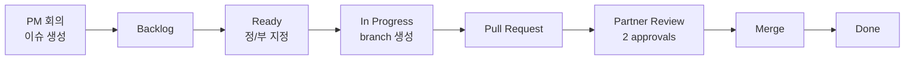

miniiiii
miniiiii6292
온라인

#자료 채널의 시작이에요. 
Snow Kwon — 2026. 5. 4. 오후 4:09
첨부 파일 형식: acrobat
역할분담 4안.pdf
758.51 KB
첨부 파일 형식: acrobat
프로젝트 팀 가이드라인.pdf
353.54 KB
https://paullabworkspace.notion.site/GitHub-38a3fdea2b5f4980965b47e851e129a1
paullabworkspace on Notion
GitHub로 협업하기 | Notion
1. Branch 전략 수립하기
GitHub로 협업하기 | Notion
Snow Kwon — 2026. 5. 4. 오후 6:08
이미지
6w6 — 2026. 5. 6. 오후 12:12
전달됨
| Role (역할)      | IP            | RAM | Disk | 주요 Stack                       | 기능 설명
|------------------|--------------|-----|------|----------------------------------|--------------------------------------------------
| Firewall         | 172.16.1.1   | 2GB | 10GB | ?, Auditd                | L7 웹 방화벽 (HAProxy 전단 HTTP/HTTPS 검사) << 단독 설치
| Control          | 172.16.1.5   | 2GB | 7GB  | Ansible, etcd (CMDB), Auditd     | 전체 인프라 자동화 프로비저닝 및 설정 관리
| NAT Gateway      | 172.16.1.7   | 1GB | 7GB  | iptables, SNAT, Auditd           | 내부망(DB, K8s 워커 등)의 외부 인터넷 접속용 아웃바운드 관문

message.txt
5KB
Snow Kwon — 2026. 5. 6. 오후 7:35
첨부 파일 형식: acrobat
인프라 설계도 (2차).pdf
572.58 KB
첨부 파일 형식: acrobat
wbs.pdf
490.98 KB
Snow Kwon — 어제 오전 10:36
https://drive.google.com/file/d/15UIdlT2VFPMc0Cp1bIzujHApqfs_tlx8/view?usp=sharing
https://app.diagrams.net/#G15UIdlT2VFPMc0Cp1bIzujHApqfs_tlx8%23%7B"pageId"%3A"pmXffZBmllWcqja-FnM0"%7D
정현욱 — 어제 오전 10:45
이미지
이미지
이미지
최재혁 — 어제 오후 12:16
순호닌ㅁ
혹시
인프라 설계도에
pdf에 깨진부분 많아서
보기 어려운데 공유좀해주실수 잇나여
Snow Kwon — 어제 오후 12:20
이미지
miniiiii — 어제 오후 12:35
이미지
이미지
miniiiii — 어제 오후 3:44
이미지
6w6 — 어제 오후 3:46
라우터
Snow Kwon — 오후 6:01
# GitHub Organization / Repository / Project Workflow

## 1. Repository 구성

15 working days, 5명 팀 프로젝트 기준으로 GitHub Organization에는 repository를 3개로 구성한다.

github-organization-workflow.md
11KB

# GitHub Organization / Repository / Project Workflow

## 1. Repository 구성

15 working days, 5명 팀 프로젝트 기준으로 GitHub Organization에는 repository를 3개로 구성한다.

```text
organization/
  flaskapp
  infra
  docs
```

| Repository | 목적 | 주요 내용 |
|---|---|---|
| `flaskapp` | 애플리케이션 코드 | FlaskApp source, Dockerfile, requirements, app test |
| `infra` | 인프라 코드 | Ansible, Kubernetes manifest, Helm chart, ArgoCD, Terraform |
| `docs` | 문서와 의사결정 기록 | architecture, WBS, runbook, 회의록, 발표자료, 조사 내용 |

## 2. Repository별 권장 디렉터리 구조

## `flaskapp`

```text
flaskapp/
  .github/
    ISSUE_TEMPLATE/
      task.yml
      trouble.yml
    pull_request_template.md
  app/
  templates/
  Dockerfile
  requirements.txt
  README.md
```

## `infra`

```text
infra/
  .github/
    ISSUE_TEMPLATE/
      task.yml
      trouble.yml
    pull_request_template.md
  ansible/
    inventory.ini
    playbooks/
  k8s/
    namespaces/
    metallb/
    ingress/
    rbac/
    hpa/
    test/
  helm/
    flaskapp/
    mariadb-demo/
  argocd/
    bootstrap/
    applications/
  monitoring/
    values/
    dashboards/
  terraform/
    aws-dr/
      modules/
      envs/dr/
  scripts/
```

## `docs`

```text
docs/
  .github/
    ISSUE_TEMPLATE/
      docs.yml
    pull_request_template.md
  architecture/
    system-architecture.md
    network-architecture.md
    dr-architecture.md
  planning/
    wbs.md
    role-and-responsibility.md
    github-workflow.md
  runbook/
    onprem-deploy-runbook.md
    dr-failover-runbook.md
    troubleshooting.md
  meetings/
  research/
  presentation/
```

## 3. Repository 분리 기준

| 작업 종류 | Repository |
|---|---|
| FlaskApp 기능 수정 | `flaskapp` |
| Dockerfile 수정 | `flaskapp` |
| Kubernetes manifest 작성 | `infra` |
| Helm chart 작성 | `infra` |
| ArgoCD Application 작성 | `infra` |
| Ansible playbook 작성 | `infra` |
| Terraform AWS DR 작성 | `infra` |
| Prometheus/Grafana values 작성 | `infra` |
| 아키텍처 문서 작성 | `docs` |
| 회의록 작성 | `docs` |
| 장애 전환 절차서 작성 | `docs` |
| 발표자료 정리 | `docs` |
| 기술 조사 기록 | `docs` |

## 4. GitHub Project Kanban 구성

Organization 단위 GitHub Project를 하나 만들고, 세 repository의 이슈를 모두 연결한다.

```text
Backlog
Ready
In Progress
Review
Blocked
Done
```

| 컬럼 | 의미 |
|---|---|
| `Backlog` | 아직 담당자나 일정이 확정되지 않은 작업 |
| `Ready` | 정/부가 지정되어 바로 시작 가능한 작업 |
| `In Progress` | 정(Lead)이 작업 중인 이슈 |
| `Review` | PR 또는 문서 리뷰 중인 이슈 |
| `Blocked` | 외부 의존성, 오류, 권한 문제로 막힌 이슈 |
| `Done` | PR merge 또는 문서 반영까지 완료된 이슈 |

## 5. 정(Lead) / 부(Partner) 리뷰 체계

모든 이슈는 정(Lead) 1명과 부(Partner) 1명을 가진다.

| 역할 | 책임 |
|---|---|
| 정(Lead) | 이슈 실행, 구현, PR 작성, 기술 문서화 |
| 부(Partner) | 리뷰, 검증, 트러블슈팅 지원 |

PR merge 조건:

- 부(Partner)를 반드시 reviewer로 지정한다.
- 부(Partner)를 포함해 최소 2명 이상의 approval을 받아야 한다.
- Secret, password, access key가 포함된 PR은 merge하지 않는다.
- 구현 PR은 테스트 결과 또는 검증 명령어가 있어야 한다.
- 문서 PR은 변경 이유와 영향 범위가 있어야 한다.

## 6. 추천 정/부 매핑

```text
A Lead: On-prem Foundation      / Partner: Kubernetes Platform
B Lead: Kubernetes Platform     / Partner: App & GitOps
C Lead: App & GitOps            / Partner: Data & Observability
D Lead: Data & Observability    / Partner: AWS DR
E Lead: AWS DR                  / Partner: On-prem Foundation
```

| 팀원 | 정(Lead) | 부(Partner) |
|---|---|---|
| A | On-prem / Proxmox / Network / MetalLB | Kubernetes Platform |
| B | Kubernetes Platform / RBAC / Ingress / HPA | App / Helm / ArgoCD |
| C | App / Docker / Helm / ArgoCD | DB / Backup / Monitoring |
| D | DB / MariaDB / Job / CronJob / Monitoring | AWS DR / Terraform |
| E | AWS DR / Terraform / EKS / RDS / Route 53 | On-prem / Proxmox / Network |

## 7. Issue Template 전략

템플릿은 너무 세분화하지 않고 3개만 사용한다.

| Repository | Template | 용도 |
|---|---|---|
| `flaskapp`, `infra` | `task.yml` | 구현, 설정, 배포 작업 |
| `flaskapp`, `infra` | `trouble.yml` | 장애, 오류, 트러블슈팅 |
| `docs` | `docs.yml` | 문서, 회의록, 의사결정, 발표자료 |

## 8. `flaskapp` / `infra` Task 이슈 템플릿

파일 위치:

```text
.github/ISSUE_TEMPLATE/task.yml
```

```yaml
name: Task
description: 구현, 설정, 배포 작업
title: "[Task] "
labels: ["type:task"]
body:
  - type: textarea
    id: summary
    attributes:
      label: 작업 내용
      placeholder: 무엇을 해야 하나요?
    validations:
      required: true

  - type: input
    id: owner
    attributes:
      label: 담당
      placeholder: "정: @username / 부: @username"
    validations:
      required: true

  - type: textarea
    id: done
    attributes:
      label: 완료 기준
      placeholder: |
        - [ ] 
        - [ ] 
    validations:
      required: true

  - type: textarea
    id: test
    attributes:
      label: 검증 방법
      placeholder: 실행할 명령어 또는 확인 방법
    validations:
      required: false
```

## 9. `flaskapp` / `infra` Trouble 이슈 템플릿

파일 위치:

```text
.github/ISSUE_TEMPLATE/trouble.yml
```

```yaml
name: Trouble
description: 오류, 장애, 트러블슈팅
title: "[Trouble] "
labels: ["type:bug", "status:blocked"]
body:
  - type: textarea
    id: problem
    attributes:
      label: 문제 상황
      placeholder: 어떤 문제가 발생했나요?
    validations:
      required: true

  - type: textarea
    id: logs
    attributes:
      label: 로그 / 에러
      render: shell
    validations:
      required: false

  - type: textarea
    id: tried
    attributes:
      label: 확인한 내용 / 다음 액션
      placeholder: |
        - 확인한 내용:
        - 다음 액션:
    validations:
      required: true
```

## 10. `docs` 이슈 템플릿

파일 위치:

```text
.github/ISSUE_TEMPLATE/docs.yml
```

```yaml
name: Docs
description: 문서, 회의록, 의사결정, 발표자료
title: "[Docs] "
labels: ["type:docs"]
body:
  - type: textarea
    id: summary
    attributes:
      label: 문서 작업 내용
      placeholder: 무엇을 작성하거나 수정하나요?
    validations:
      required: true

  - type: input
    id: owner
    attributes:
      label: 담당
      placeholder: "정: @username / 부: @username"
    validations:
      required: true

  - type: textarea
    id: checklist
    attributes:
      label: 포함할 내용
      placeholder: |
        - [ ] 
        - [ ] 
    validations:
      required: false
```

## 11. `flaskapp` / `infra` PR Template

파일 위치:

```text
.github/pull_request_template.md
```

```markdown
## 작업 요약

-

## 관련 이슈

Closes #

## 담당

- 정:
- 부:

## 변경 내용 / 검증 결과

-

## 체크리스트

- [ ] 부(Partner)를 reviewer로 지정했다.
- [ ] 테스트 또는 검증 결과를 적었다.
- [ ] Secret, password, access key를 커밋하지 않았다.
```

## 12. `docs` PR Template

파일 위치:

```text
.github/pull_request_template.md
```

```markdown
## 작업 요약

-

## 관련 이슈

Closes #

## 담당

- 정:
- 부:

## 변경 내용

-

## 체크리스트

- [ ] 문서의 목적이 명확하다.
- [ ] 현재 설계와 충돌하지 않는다.
- [ ] 필요한 링크나 참고 자료를 포함했다.
```

## 13. Label 추천

세 repository에 공통으로 사용한다.

```text
type:task
type:bug
type:docs
type:research
type:decision

area:app
area:docker
area:onprem
area:kubernetes
area:metallb
area:ingress
area:argocd
area:helm
area:db
area:monitoring
area:aws
area:terraform
area:ansible
area:docs

priority:p0
priority:p1
priority:p2

status:blocked
status:needs-review
status:ready
```

## 14. Branch Naming

```text
feature/issue-12-metallb-ip-pool
feature/issue-18-flaskapp-helm-chart
feature/issue-25-argocd-root-app
fix/issue-31-mariadb-secret
docs/issue-40-dr-runbook
```

## 15. Commit Message

```text
feat(k8s): add metallb address pool
feat(argocd): add root app bootstrap
feat(app): add dockerfile for flaskapp
fix(db): update mariadb secret reference
docs(dr): add failover runbook
```

## 16. 작업 흐름



## 17. ArgoCD와 Repository 관계

ArgoCD는 `infra` repository를 바라보도록 구성한다.

```text
infra/
  argocd/
    bootstrap/
      root-app.yaml
    applications/
      flaskapp.yaml
      mariadb-demo.yaml
      monitoring.yaml
      ingress.yaml
```

권장 흐름:

```text
1. Kubernetes cluster 구성
2. MetalLB / Ingress Controller 구성
3. ArgoCD 설치
4. root-app.yaml 적용
5. 이후 FlaskApp, monitoring, db-demo는 ArgoCD Application으로 배포
```

`flaskapp` repository에는 애플리케이션 소스와 Dockerfile을 둔다. FlaskApp Helm chart는 운영 편의상 `infra/helm/flaskapp`에 둔다. 이렇게 하면 ArgoCD가 하나의 `infra` repository만 바라보며 On-prem과 AWS EKS 배포 값을 관리할 수 있다.

## 18. 운영 팁

- PM은 회의 후 `docs` repository에 meeting note 이슈를 먼저 만들고, 결정된 작업을 `flaskapp` 또는 `infra` 이슈로 분리한다.
- 구현 전에 조사나 설계 합의가 필요한 작업은 `docs` 이슈로 먼저 기록한다.
- 구현 작업은 반드시 `flaskapp` 또는 `infra` 이슈와 PR로 연결한다.
- 발표에 들어갈 중요한 결정은 `docs`의 Decision Record로 남긴다.
- Project board에서는 세 repository의 이슈를 모두 같은 board에서 추적한다.
github-organization-workflow.md
11KB