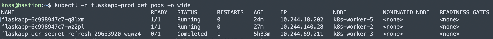
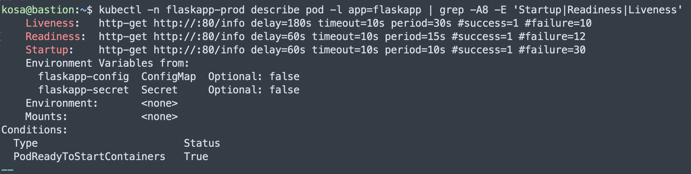

# FlaskApp Probe 설정 및 검증 기록

작성일: 2026-05-20

## 목적

FlaskApp Deployment에 readiness/liveness/startup probe 설정을 하고, ArgoCD 배포 후 신규 Pod가 정상 Running 상태가 되는지 확인한다.


## Infra 변경 내용

변경 파일:

```text
helm/flaskapp/templates/deployment.yaml
helm/flaskapp/values.yaml
```

주요 변경:

- `readinessProbe` 추가
- `livenessProbe` 추가
- `startupProbe` 추가
- probe 대기 시간과 실패 허용 횟수를 늘려 앱 기동 시간을 더 넉넉하게 허용

렌더링 기준 probe 설정:

```yaml
startupProbe:
  initialDelaySeconds: 60
  timeoutSeconds: 10
  periodSeconds: 10
  failureThreshold: 30

readinessProbe:
  initialDelaySeconds: 60
  timeoutSeconds: 10
  periodSeconds: 15
  failureThreshold: 12

livenessProbe:
  initialDelaySeconds: 180
  timeoutSeconds: 10
  periodSeconds: 30
  failureThreshold: 10
```

## 로컬 검증

PR 전 Helm chart 렌더링과 lint를 확인했다.

```bash
helm template flaskapp ./helm/flaskapp -n flaskapp-prod
helm lint ./helm/flaskapp
```

결과:

```text
1 chart(s) linted, 0 chart(s) failed
```

## 배포 후 검증

PR merge 후 ArgoCD가 변경사항을 반영했는지 확인했다.

```bash
kubectl -n argocd get app flaskapp
```

FlaskApp Deployment 상태를 확인했다.

```bash
kubectl -n flaskapp-prod rollout status deployment/flaskapp
kubectl -n flaskapp-prod get pods -o wide
```

확인된 정상 상태:

```text
flaskapp-6c998947c7-q8lxm   1/1   Running   0
flaskapp-6c998947c7-wz2pl   1/1   Running   0
```



실제 Pod에 probe 설정이 반영되었는지 확인했다.

```bash
kubectl -n flaskapp-prod describe pod -l app=flaskapp | grep -A8 -E 'Startup|Readiness|Liveness'
```

확인 결과:

```text
Liveness:   http-get http://:80/info delay=180s timeout=10s period=30s #failure=10
Readiness:  http-get http://:80/info delay=60s timeout=10s period=15s #failure=12
Startup:    http-get http://:80/info delay=60s timeout=10s period=10s #failure=30
```


## 결과

신규 FlaskApp Pod 2개가 모두 정상 상태가 되었다.

```text
READY: 1/1
STATUS: Running
Restart Count: 0
```

따라서 probe 설정 변경은 정상 반영되었고, FlaskApp Deployment는 정상 동작하는 것으로 확인했다.
