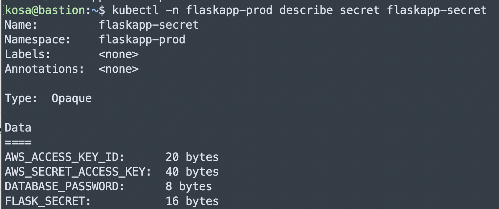
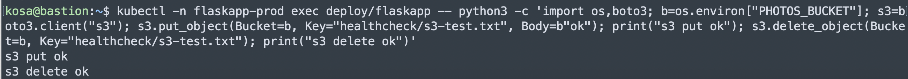
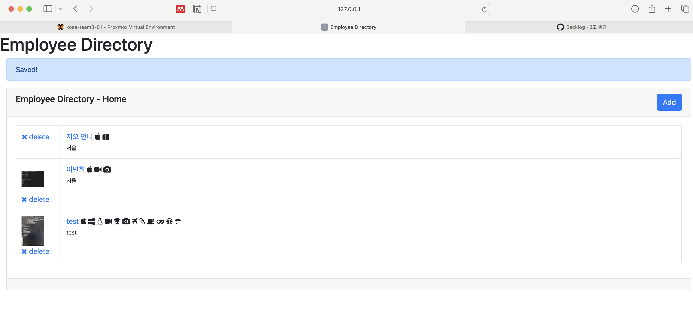

# FlaskApp S3 연결 및 사진 업로드 검증 기록

작성일: 2026-05-20

## 목적

On-prem Kubernetes에 배포된 `flaskapp` Pod가 AWS S3 bucket에 직원 사진을 업로드하고, presigned URL로 다시 조회할 수 있는지 검증한다.

이 문서는 DB 연결 절차를 다루지 않는다. DB 연결과 앱 테스트는 `flaskapp-db-connect-runbook.md`를 참고한다.

## 현재 구조

FlaskApp은 직원 사진 파일을 Kubernetes 내부 볼륨에 저장하지 않고 AWS S3에 저장한다.

```text
Browser
  ↓
FlaskApp Pod
  ↓ boto3
AWS S3 bucket
```

관련 설정은 다음처럼 나뉜다.

| 구분 | 위치 | 값 |
| --- | --- | --- |
| S3 bucket 이름 | `infra/helm/flaskapp/values.yaml` | `PHOTOS_BUCKET` |
| AWS region | `infra/helm/flaskapp/values.yaml` | `AWS_DEFAULT_REGION` |
| AWS credential | On-prem K8s Secret | `AWS_ACCESS_KEY_ID`, `AWS_SECRET_ACCESS_KEY` |

`PHOTOS_BUCKET`과 `AWS_DEFAULT_REGION`은 민감 정보가 아니므로 Helm values로 GitOps 관리한다.

```yaml
config:
  AWS_DEFAULT_REGION: "ap-northeast-2"
  PHOTOS_BUCKET: "flaskapp-proddata-kosa-project-team3-snow-lai9z"
```

AWS access key와 secret key는 민감 정보이므로 Git에 저장하지 않는다.

## 왜 kubectl 직접 작업이 필요한가

ArgoCD는 `infra` repo의 Helm chart를 기준으로 Deployment, Service, Ingress, ConfigMap을 배포한다.

하지만 현재 프로젝트에서는 Secret manifest를 Git에 올리지 않는다. 따라서 S3 접근용 AWS credential은 On-prem Kubernetes cluster에 직접 Secret으로 넣는다.

사용한 Secret:

```text
namespace: flaskapp-prod
secret: flaskapp-secret
```

이 Secret은 이미 DB 연결용으로 사용 중이었다.

기존 키:

```text
DATABASE_PASSWORD
FLASK_SECRET
```

S3 연결을 위해 추가한 키:

```text
AWS_ACCESS_KEY_ID
AWS_SECRET_ACCESS_KEY
```

## Secret 상태 확인

```bash
kubectl -n flaskapp-prod get secret flaskapp-secret
kubectl -n flaskapp-prod describe secret flaskapp-secret
```

S3 credential 추가 전에는 `DATA`가 2개였다.

```text
DATABASE_PASSWORD
FLASK_SECRET
```

S3 credential 추가 후에는 `DATA`가 4개가 된다.

```text
AWS_ACCESS_KEY_ID
AWS_SECRET_ACCESS_KEY
DATABASE_PASSWORD
FLASK_SECRET
```



주의: `describe secret`은 값 자체를 출력하지 않고 byte 수만 보여준다. 실제 값을 출력하는 명령은 화면 공유, 문서, issue, PR comment에 남기지 않는다.

## S3 credential 추가

기존 `flaskapp-secret`에 AWS credential을 추가한다.

```bash
kubectl -n flaskapp-prod patch secret flaskapp-secret \
  --type='merge' \
  -p '{"stringData":{"AWS_ACCESS_KEY_ID":"<ACCESS_KEY_ID>","AWS_SECRET_ACCESS_KEY":"<SECRET_ACCESS_KEY>"}}'
```


## 필요한 IAM 권한 참고

FlaskApp은 S3에 사진을 업로드하고, 조회용 presigned URL을 생성한다.

이번 작업에서 IAM policy를 새로 생성하거나 수정하지는 않았다. 기존에 발급된 AWS credential을 `flaskapp-secret`에 추가한 뒤, Pod 내부에서 S3 `put_object`와 `delete_object`가 성공하는지 검증했다.


## Pod 재생성

Kubernetes Secret을 환경변수로 주입받는 Pod는 Secret 변경을 자동으로 다시 읽지 않는다.

Secret patch 이후 새 Pod가 뜨도록 기존 Pod를 삭제한다.

```bash
kubectl -n flaskapp-prod delete pod -l app=flaskapp
kubectl -n flaskapp-prod get pods -w
```

정상 예시:

```text
flaskapp-58c98c8c9-2slgg   1/1   Running
flaskapp-58c98c8c9-6tx4h   1/1   Running
```

## Pod 환경변수 확인

값을 직접 출력하지 않고 키가 들어왔는지만 확인한다.

```bash
kubectl -n flaskapp-prod exec deploy/flaskapp -- sh -c 'test -n "$AWS_ACCESS_KEY_ID" && test -n "$AWS_SECRET_ACCESS_KEY" && echo "aws env ok"'
```

정상 출력:

```text
aws env ok
```

## S3 put/delete 검증

Pod 안에서 boto3로 테스트 object를 업로드했다가 삭제한다.

```bash
kubectl -n flaskapp-prod exec deploy/flaskapp -- python3 -c 'import os,boto3; b=os.environ["PHOTOS_BUCKET"]; s3=boto3.client("s3"); s3.put_object(Bucket=b, Key="healthcheck/s3-test.txt", Body=b"ok"); print("s3 put ok"); s3.delete_object(Bucket=b, Key="healthcheck/s3-test.txt"); print("s3 delete ok")'
```

확인된 성공 결과:

```text
s3 put ok
s3 delete ok
```


위 결과는 다음을 의미한다.

- Pod가 `PHOTOS_BUCKET` 환경변수를 정상적으로 읽는다.
- boto3가 AWS credential을 정상적으로 찾는다.
- 대상 S3 bucket에 `PutObject`와 `DeleteObject` 권한이 있다.

## 로컬 브라우저에서 사진 업로드 테스트

로컬 브라우저에서 On-prem FlaskApp을 확인하려면 Bastion을 통해 port-forward한다.

Bastion에서:

```bash
kubectl -n flaskapp-prod port-forward svc/flaskapp-service 8080:80
```

로컬 Mac 새 터미널에서:

```bash
ssh -L 18080:127.0.0.1:8080 kosa@172.16.44.100
```

브라우저에서 접속:

```text
http://127.0.0.1:18080
```

검증 순서:

1. `Add` 버튼 클릭
2. 직원 정보 입력
3. 사진 파일 선택
4. 저장
5. 목록 또는 상세 화면에서 사진이 표시되는지 확인

사진이 표시되면 DB insert, S3 upload, presigned URL 조회까지 성공한 것이다.


## 이번 작업에서 코드 변경 여부

이번 S3 연결 검증은 Git repo 파일을 수정하지 않았다.

변경된 것은 On-prem Kubernetes cluster 상태다.

```text
flaskapp-secret에 AWS_ACCESS_KEY_ID / AWS_SECRET_ACCESS_KEY 추가
flaskapp Pod 재생성
Pod 내부 boto3 S3 put/delete 검증 성공
```

따라서 이 작업은 `infra` Helm chart 변경 없이 운영 Secret 설정과 런타임 검증으로 완료했다.

## 주의사항

- AWS access key와 secret key는 Git, 문서, issue, PR comment에 기록하지 않는다.
- Secret 값을 확인하는 명령은 화면 공유 중 실행하지 않는다.
- On-prem Kubernetes는 EKS node role이나 IRSA를 사용하지 않으므로 현재는 Secret 기반 AWS credential이 필요하다.
- AWS EKS DR 환경에서는 장기적으로 Secret 방식 대신 IRSA를 사용하는 것이 좋다.
