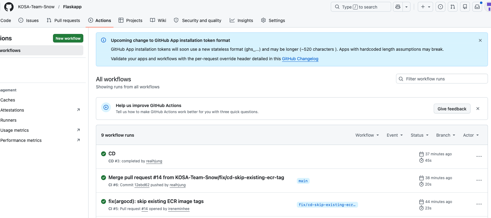

# GitHub Actions CI/CD 파이프라인 가이드

> 담당: 팀원 C (@ireneminhee)
> 관련 이슈: Flaskapp #11, infra #83

---

## 개요

Flaskapp 코드가 main 브랜치에 merge되면 GitHub Actions가 자동으로 Docker 이미지를 빌드하여 ECR에 push하고, infra 레포의 `values.yaml`을 업데이트한다. ArgoCD가 이 변경을 감지해 클러스터에 롤링 업데이트를 수행한다.

```
Flaskapp main push
  → CI: Python 검증 + Docker 빌드 테스트
  → CD: ECR push + infra values.yaml image.tag 자동 업데이트
  → ArgoCD 감지 → 클러스터 롤링 업데이트
```

---

## 워크플로우 파일 구성

| 파일 | 레포 | 트리거 | 역할 |
|------|------|--------|------|
| `.github/workflows/ci.yml` | Flaskapp | PR + main push | Python 의존성 검증, Dockerfile 빌드 테스트 |
| `.github/workflows/cd.yml` | Flaskapp | CI 성공 후 (main만) | ECR push, values.yaml 업데이트, Helm lint |
| `.github/workflows/ci.yml` | infra | PR + main push | Terraform fmt/validate, Helm lint, Ansible syntax-check |

---

## Flaskapp CI (`ci.yml`)

PR 생성 또는 main push 시 실행. 코드 오류를 merge 전에 차단한다.

```
python 잡: requirements.txt 설치 → pip check → Python 컴파일
docker 잡: docker build --platform linux/amd64 (빌드 성공 여부만 확인, push 없음)
```

---

## Flaskapp CD (`cd.yml`)

CI가 성공한 경우에만 실행 (`workflow_run` 트리거).

### 실행 흐름

1. Flaskapp 레포 checkout (CI가 통과한 커밋 SHA 기준)
2. AWS 자격증명 설정 (`AWS_ACCESS_KEY_ID`, `AWS_SECRET_ACCESS_KEY`)
3. ECR 로그인
4. ECR에 동일 SHA 태그가 이미 존재하면 build/push 건너뜀
5. Docker 빌드 (`--platform linux/amd64`) + ECR push (SHA 태그)
6. infra 레포 checkout
7. `yq`로 `helm/flaskapp/values.yaml` `image.tag` 업데이트
8. Helm lint 검증
9. infra 레포에 `feat(helm): update flaskapp image tag to {SHA}` 커밋 + push



### 이미지 태그 전략

| 태그 | 예시 | 용도 |
|------|------|------|
| git SHA | `12ebd62` | ArgoCD 배포 추적 (변경 감지) |

> ECR 태그 불변성(immutable tag) 정책이 적용되어 있어 `latest` 태그는 push하지 않는다.

---

## infra CI (`ci.yml`)

infra 레포에 PR 생성 또는 main push 시 실행.

```
terraform 잡: terraform fmt -check + terraform validate (backend=false)
  - aws/terraform/bootstrap
  - aws/terraform/envs/dr
  - onprem/terraform/proxmox-vms

helm 잡: helm dependency update + helm lint + helm template
  - helm/flaskapp
  - helm/flaskapp (values-dr.yaml)
  - helm/monitoring

ansible 잡: ansible-playbook --syntax-check playbooks/*.yml
```

---

## GitHub Secrets 설정

Flaskapp 레포 → Settings → Secrets and variables → Actions

| Secret | 용도 |
|--------|------|
| `AWS_ACCESS_KEY_ID` | ECR push용 IAM 자격증명 |
| `AWS_SECRET_ACCESS_KEY` | ECR push용 IAM 자격증명 |
| `INFRA_REPO_TOKEN` | infra 레포 write 권한 GitHub Classic PAT (`repo` scope) |

> Fine-grained PAT는 조직 관리자 승인이 필요하므로 Classic PAT를 사용한다.

---

## ArgoCD 배포 확인

infra 레포에 image.tag 커밋이 push되면 약 3분 내에 ArgoCD가 자동 sync를 수행한다.

```bash
# bastion에서
kubectl get pods -n flaskapp-prod

# 배포된 이미지 태그 확인
kubectl describe pod -n flaskapp-prod <pod-name> | grep Image:
```

---

## 문제 해결

| 증상 | 원인 | 해결 |
|------|------|------|
| CD: `tag invalid: already exists` | ECR immutable tag 정책 + 동일 SHA 재push | 정상 동작 — CD가 자동으로 build/push 건너뜀 |
| CD: infra push `403 Forbidden` | `INFRA_REPO_TOKEN`이 Fine-grained PAT (조직 승인 필요) | Classic PAT(`repo` scope)으로 교체 |
| CD: infra push `rejected (fetch first)` | infra main에 다른 커밋이 먼저 push됨 | CD 재실행 또는 충돌 해결 후 재실행 |
| CI: `Node.js 20 deprecated` 경고 | actions 버전이 Node.js 20 기반 | 2026-06-02 이전에 action 버전 업그레이드 필요 |
