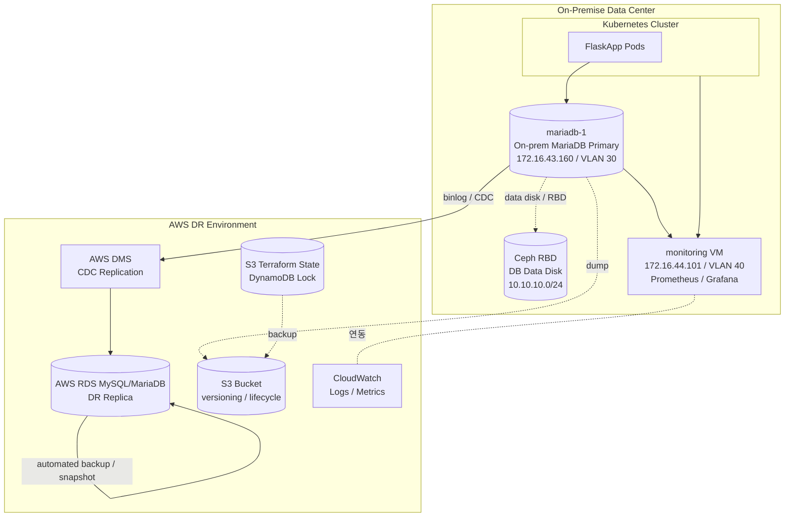
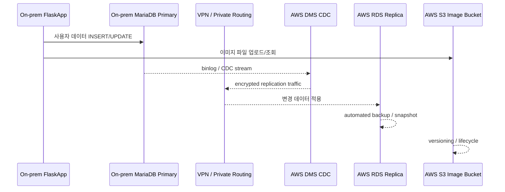
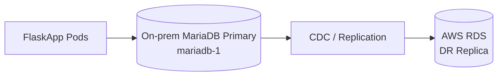
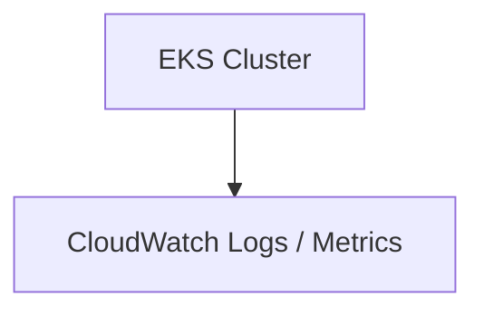
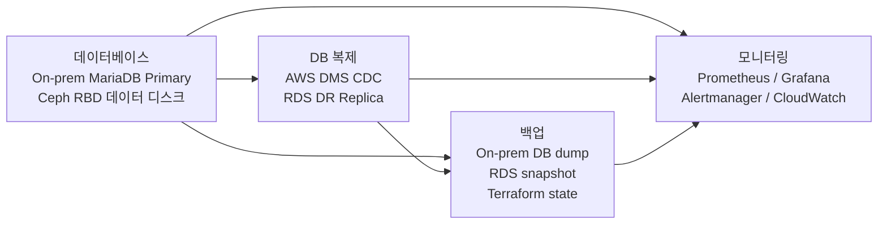

# Database, Backup, Monitoring Subsystem Design

> 이 문서는 `시스템-아키텍쳐-설계.md`의 데이터베이스, 백업, 모니터링 영역을 재구성한 하위 설계서이다. 상위 설계서에서 정의된 VM 배치, VLAN 구조, IP 계획, Ceph 사용 기준을 그대로 따른다.

## 0. 목차
- [1. 설계 목표](#1-설계-목표)
- [2. 전체 아키텍쳐](#2-전체-아키텍처)
- [3. 데이터베이스 구성](#3-데이터베이스-구성)
- [4. DB 복제 및 DR 데이트 흐름 목표](#4-DB-복제-및-DR-데이트-흐름-목표)
- [5. 백업 설계](#5-백업-설계)
- [6. 모니터링 설계](#6-모니터링-설계)
- [7. 운영 체크포인트 (DB / 백업 / 모니터링 한정)](#7-운영-체크포인트-(DB-/-백업-/-모니터링-한정))
- [8. 최종 구성 요약](#8-최종-구성-요약)

## 1. 설계 목표

- DB는 Kubernetes 내부가 아닌 별도 노드/VM에서 MySQL/MariaDB로 운영한다.
- DB VM의 데이터 디스크는 Ceph RBD를 사용한다.
- On-prem DB와 AWS RDS는 Primary-Replica 구조로 설계하고, 실시간에 가까운 비동기 CDC 복제로 동기화한다.
- On-prem MySQL/MariaDB와 RDS 간 완전 동기식 복제는 어렵기 때문에, 설계상 목표는 지연 시간을 최소화한 AWS DMS CDC 기반 단방향 복제로 잡는다.
- 백업은 On-prem DB dump, RDS snapshot, Terraform state 백업으로 구성한다.
- AWS S3 bucket은 versioning과 lifecycle 정책을 적용한다.
- 모니터링은 On-prem Prometheus / Grafana / Alertmanager와 AWS CloudWatch를 연동한다.
- 모니터링 VM은 VLAN 40 관리자망에 둔다.

## 2. 전체 아키텍처

## 3. 데이터베이스 구성

### 3.1 DB VM 사양

상위 설계서 VM 계획에 정의된 `mariadb-1`을 그대로 사용한다.

| 항목                | 값                                   |
| ------------------- | ------------------------------------ |
| VM 이름             | `mariadb-1`                          |
| 배치 노드           | `pve-5` (`client-11`)                |
| IP                  | `172.16.43.160`                      |
| VLAN                | VLAN 30 Internal                     |
| vCPU / RAM / Disk   | 4 vCPU / 8-12GB / 100GB              |
| 역할                | On-prem Primary DB                   |
| 데이터 디스크 저장소| Ceph RBD                             |
| DNS 이름            | `db.onprem.local` → `172.16.43.160`  |

`pve-1`은 pfSense 중심 노드이므로 DB는 `pve-5`에 우선 배치한다.

### 3.2 네트워크 배치

| 구분            | 값                                                                |
| --------------- | ----------------------------------------------------------------- |
| VLAN 30 Internal| `172.16.43.0/24`                                                  |
| DB block        | `172.16.43.160-172.16.43.169`                                     |
| Gateway         | pfSense VLAN 30 Gateway `172.16.43.1`                             |
| 용도            | MariaDB, backup, DMS/RDS replication path                         |

DB 접근 대상을 내부망에 격리하기 위해 VLAN 30 안에 둔다.

### 3.3 Ceph 저장소 사용

| 구분         | Ceph 방식 | 사용 대상                 | 설명                                                                              |
| ------------ | --------- | ------------------------- | --------------------------------------------------------------------------------- |
| DB 저장소    | RBD       | `mariadb-1` 데이터 디스크 | DB VM에는 Proxmox RBD disk를 붙이고, MariaDB data directory를 해당 디스크에 둔다. |

Ceph RBD는 10G Ceph storage network(`10.10.10.0/24`)를 사용한다. DB 접속 IP는 VLAN 30 내부망에 두고, DB 데이터 디스크 I/O는 Ceph RBD를 통해 처리한다.

### 3.4 DB 방화벽 / 보안 그룹

| 출발지                          | 목적지              | 포트  | 목적             |
| ------------------------------- | ------------------- | ----- | ---------------- |
| Worker nodes                    | `mariadb-1`         | 3306  | FlaskApp DB 연결 |
| `mariadb-1` 또는 DMS endpoint   | AWS DMS/RDS 경로    | 3306  | CDC replication  |

DB public access는 금지한다.

## 4. DB 복제 및 DR 데이터 흐름

### 4.1 DB 복제 선택지

| 방식                     | 설명                                   | 권장도                      |
| ------------------------ | -------------------------------------- | --------------------------- |
| AWS DMS CDC              | On-prem MySQL binlog를 RDS로 지속 복제 | 가장 운영이 쉬움            |
| MySQL native replication | RDS를 external replica처럼 구성        | 가능하지만 운영 난이도 높음 |
| 주기적 dump + restore    | 백업 중심 방식                         | DR RPO가 커져서 비권장      |

권장안은 AWS DMS CDC이다. 정상 운영 시 On-prem MariaDB/MySQL이 Primary이고 AWS RDS는 DR Replica 역할을 한다. 장애 전환 시 RDS를 쓰기 가능한 Primary DB로 승격하고, EKS의 `DATABASE_HOST`를 RDS endpoint로 설정한다.

### 4.2 정상 운영 시 데이터 흐름

정상 상태에서는 DB write를 On-prem MariaDB/MySQL Primary에 수행하고, DB VM의 데이터 디스크는 Ceph RBD에 둔다. 변경분은 AWS DMS CDC로 RDS Replica에 반영한다.

### 4.3 DR 전환 시 DB 동작

장애 발생 시 DR 전환 절차 중 DB 관련 단계는 다음과 같다.

1. 가능한 경우 On-prem DB write를 중단하고 마지막 복제 지연 시간을 확인한다.
2. AWS RDS를 Primary로 승격한다.
3. Kubernetes Secret/ConfigMap의 `DATABASE_HOST`를 RDS endpoint로 설정한다.

## 5. 백업 설계

### 5.1 백업 대상

| 대상              | 위치           | 비고                            |
| ----------------- | -------------- | ------------------------------- |
| On-prem DB dump   | On-prem → AWS  | MariaDB Primary 백업            |
| RDS snapshot      | AWS            | RDS automated backup / snapshot |
| Terraform state   | AWS S3         | S3 Backend + DynamoDB Lock      |

### 5.2 AWS S3 관련 정책

| 항목                          | 정책                                 |
| ----------------------------- | ------------------------------------ |
| S3 bucket                     | versioning, lifecycle 적용           |
| 이미지 파일 bucket            | versioning, lifecycle, access policy |
| Terraform state backend       | S3 Backend + DynamoDB Lock           |

### 5.3 RDS 백업

AWS RDS는 automated backup / snapshot 기능으로 DR Replica의 백업을 자체 수행한다. 시퀀스 다이어그램(4장)에서 `RDS-->>RDS: automated backup / snapshot`으로 표현된 부분이다.

### 5.4 상시 구성 자원 중 백업 관련 항목

상위 설계서 Terraform 모듈 분리 권장에 따라 백업과 관련된 자원은 상시 구성으로 분류된다.

| 분류      | 자원                                                 |
| --------- | ---------------------------------------------------- |
| 상시 구성 | S3 bucket, versioning, lifecycle, 이미지 파일 prefix |
| 상시 구성 | RDS MySQL, subnet group, parameter group             |
| 상시 구성 | Terraform remote state backend                       |

## 6. 모니터링 설계

### 6.1 모니터링 VM 사양

상위 설계서 VM 계획에 정의된 `monitoring` VM을 그대로 사용한다.

| 항목                | 값                                |
| ------------------- | --------------------------------- |
| VM 이름             | `monitoring`                      |
| 배치 노드           | `pve-4`                           |
| IP                  | `172.16.44.101`                   |
| VLAN                | VLAN 40 Admin                     |
| vCPU / RAM / Disk   | 2 vCPU / 4GB / 40GB               |
| 역할                | Prometheus, Grafana               |

### 6.2 모니터링 네트워크 / 접근

| 구분                | 값                                        |
| ------------------- | ----------------------------------------- |
| VLAN 40 Admin       | `172.16.44.0/24`                          |
| 용도                | Bastion, monitoring, ArgoCD 관리 접근     |
| Gateway             | pfSense VLAN 40 Gateway `172.16.44.1`     |
| Grafana LB IP       | `grafana-lb` / `172.16.41.112`            |
| Grafana DNS         | `grafana.onprem.local` → `172.16.41.112`  |

Grafana 외부 접근이 필요한 경우 MetalLB의 `172.16.41.112` IP를 사용한다.

### 6.3 모니터링 접근 방화벽

| 출발지 | 목적지              | 포트          | 목적                    |
| ------ | ------------------- | ------------- | ----------------------- |
| Admin  | Bastion / 관리 VLAN | 80, 443, 22   | ArgoCD/Grafana/SSH 접근 |

### 6.4 모니터링 스택 구성

| 구성요소     | 위치              | 용도                       |
| ------------ | ----------------- | -------------------------- |
| Prometheus   | `monitoring` VM   | On-prem 메트릭 수집/저장   |
| Grafana      | `monitoring` VM   | 시각화 / 대시보드          |
| Alertmanager | On-prem           | 알람 처리                  |
| CloudWatch   | AWS               | AWS 리소스 Logs / Metrics  |

On-prem Prometheus/Grafana/Alertmanager와 AWS CloudWatch를 연동해 On-prem과 AWS 양쪽 자원을 함께 관측한다.

### 6.5 AWS CloudWatch 관련 항목

상위 설계서 AWS DR 구성 요소에서 CloudWatch는 다음과 같이 위치한다.

장애 시 생성할 리소스 중 CloudWatch Container Insights는 선택 사항(optional)으로 둔다.

## 7. 운영 체크포인트 (DB / 백업 / 모니터링 한정)

상위 설계서 10장 운영 체크포인트에서 본 설계 범위에 해당하는 항목을 발췌한다.

| 영역       | 체크포인트                                                     |
| ---------- | -------------------------------------------------------------- |
| RPO        | DMS replication lag 또는 MySQL replica lag를 지속 모니터링     |
| RTO        | Terraform apply + image pull + DNS TTL 기준으로 산정           |
| DB         | RDS 승격 절차와 split-brain 방지 절차 문서화                   |
| Ceph       | RBD pool, CephFS volume, CSI 연동 상태, 10G MTU/LACP 상태 점검 |
| S3         | 이미지 파일 bucket, versioning, lifecycle, access policy 적용  |
| Backup     | On-prem DB dump, RDS snapshot, Terraform state 백업            |
| Monitoring | Prometheus/Grafana, Alertmanager, CloudWatch 연동              |
| Security   | DB public access 금지                                          |

## 8. 최종 구성 요약

정형 데이터는 Ceph RBD 기반 On-prem MariaDB/MySQL Primary에서 AWS RDS Replica로 CDC 복제한다. 백업은 On-prem DB dump, RDS snapshot, Terraform state 백업으로 구성하고, AWS S3 bucket에는 versioning과 lifecycle 정책을 적용한다. 모니터링은 On-prem Prometheus/Grafana/Alertmanager와 AWS CloudWatch를 연동해 양쪽 환경을 함께 관측한다.