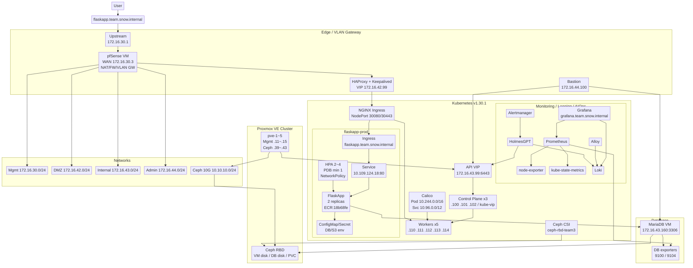

# On-premise System Architecture Mermaid

```mermaid
%%{init: {"flowchart": {"curve": "linear", "nodeSpacing": 16, "rankSpacing": 24, "padding": 4}}}%%
flowchart TB
    user["User"] --> dns["flaskapp.team.snow.internal"]

    subgraph EDGE["Edge / VLAN Gateway"]
        direction TB
        router["Upstream<br/>172.16.30.1"]
        pfs["pfSense VM<br/>WAN 172.16.30.3<br/>NAT/FW/VLAN GW"]
        lb["HAProxy + Keepalived<br/>VIP 172.16.42.99"]
        bastion["Bastion<br/>172.16.44.100"]
    end

    subgraph NET["Networks"]
        direction LR
        mgmt["Mgmt 172.16.30.0/24"]
        dmz["DMZ 172.16.42.0/24"]
        internal["Internal 172.16.43.0/24"]
        admin["Admin 172.16.44.0/24"]
        cephnet["Ceph 10G 10.10.10.0/24"]
    end

    subgraph PVE["Proxmox VE Cluster"]
        direction LR
        pve["pve-1~5<br/>Mgmt .11~.15<br/>Ceph .39~.43"]
        ceph["Ceph RBD<br/>VM disk / DB disk / PVC"]
    end

    subgraph K8S["Kubernetes v1.30.1"]
        direction TB
        api["API VIP<br/>172.16.43.99:6443"]
        cp["Control Plane x3<br/>.100 .101 .102 / kube-vip"]
        wk["Workers x5<br/>.110 .111 .112 .113 .114"]
        calico["Calico<br/>Pod 10.244.0.0/16<br/>Svc 10.96.0.0/12"]
        nginx["NGINX Ingress<br/>NodePort 30080/30443"]

        subgraph APP["flaskapp-prod"]
            direction TB
            ing["Ingress<br/>flaskapp.team.snow.internal"]
            svc["Service<br/>10.109.124.18:80"]
            app["FlaskApp<br/>2 replicas<br/>ECR:18b68fe"]
            ops["HPA 2~4<br/>PDB min 1<br/>NetworkPolicy"]
            cfg["ConfigMap/Secret<br/>DB/S3 env"]
        end

        subgraph OBS["Monitoring / Logging / AIOps"]
            direction LR
            prom["Prometheus"]
            am["Alertmanager"]
            gf["Grafana<br/>grafana.team.snow.internal"]
            ne["node-exporter"]
            ksm["kube-state-metrics"]
            loki["Loki"]
            alloy["Alloy"]
            holmes["HolmesGPT"]
        end

        csi["Ceph CSI<br/>ceph-rbd-team3"]
    end

    subgraph DB["Database"]
        direction LR
        db["MariaDB VM<br/>172.16.43.160:3306"]
        dbe["DB exporters<br/>9100 / 9104"]
    end

    dns --> router --> pfs --> lb --> nginx --> ing --> svc --> app --> db
    pfs --> mgmt
    pfs --> dmz
    pfs --> internal
    pfs --> admin
    bastion --> api
    bastion --> db

    pve --> cephnet --> ceph
    pve --> api
    api --> cp --> wk
    calico --> wk
    nginx --> wk

    app --> cfg
    ops --> app

    prom --> ne
    prom --> ksm
    prom --> dbe
    gf --> prom
    gf --> loki
    am --> holmes
    alloy --> loki
    holmes --> loki
    holmes --> api

    db --> dbe
    db --> ceph
    csi --> ceph
```
